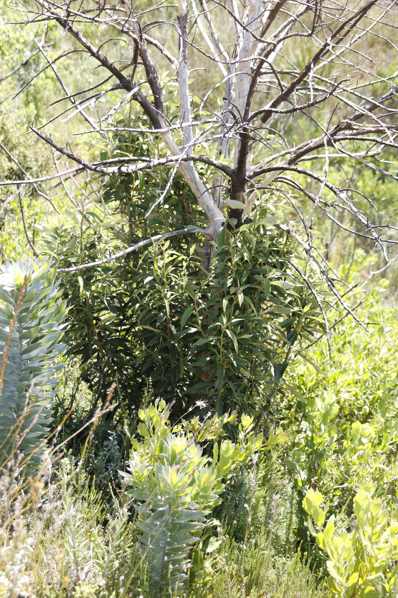

### BIO4000W GIS Deliverable

**View the HTML here**: https://htmlview.glitch.me/?https://raw.githubusercontent.com/jess-devine/BIO4000W_GIS/refs/heads/main/README.html 
<br>
# Is Southern Afrotemperate Forest Expanding in the Cape Peninsula?
<br>
Investigating whether pioneer forest species indicate forest expansion, using GIS and species occurrence data to assess forest dynamics.
<br>
Species that are Southern Afrotemperate Forest pioneers: *Virgilia oroboides* (Cape Keurboom), *Virgilia divaricata* (Garden Route Keurboom), *Rapanea melanophloeos* (Cape Beech), and *Kiggelaria africana* (Wild Peach).
<br>
Observation data from iNaturalist and City of Cape Town vegetation layers will be used.

```{r setup, echo=FALSE}
knitr::opts_chunk$set(echo = TRUE)
library(sf)
library(tidyverse)
library(rinat)
library(rosm)
library(ggspatial)
library(leaflet) 
library(htmltools)
library(mapview) 
library(leafpop) 
library(wesanderson)
library(gridExtra)
library(grid)
library(patchwork)
library(cowplot)
library(viridis)
library(RColorBrewer)
```

```{r sp.plots}
species_list <- c("Virgilia oroboides",  # I originally looked at Virgilia divaricata but there were very few observations. 
                  "Rapanea melanophloeos", 
                  "Kiggelaria africana") # credit to Stuart Heath for the suggestion 
species_plots <- list()
species_data <- list()

# Get vegetation remnants data 
vegr <- st_read("data/cape_peninsula/cape_peninsula/veg/Vegetation_Indigenous_Remnants.shp")
st_write(vegr, "data/cape_peninsula/cape_peninsula/veg/Vegetation_Indigenous_duplicate.shp", append = FALSE)

# Crop vegetation remnants data
ext <- c(-66642.18, -3809853.29, -44412.18, -3750723.29)
names(ext) <- c("xmin", "ymin", "xmax", "ymax") 
vegr <- st_crop(vegr, ext)

for (species_name in species_list) {
  # Retrieve iNaturalist data
  inat_data <- get_inat_obs(taxon_name = species_name,
                            bounds = c(-35, 18, -33.5, 18.5),
                            maxresults = 1000)
  
  # Filter iNaturalist data
  inat_data <- inat_data %>% 
    filter(positional_accuracy < 46 & 
           latitude < 0 &
           !is.na(latitude) &
           captive_cultivated == "false" &
           quality_grade == "research")

  inat_data <- st_as_sf(inat_data, coords = c("longitude", "latitude"), crs = 4326)  # Convert iNaturalist data to spatial object
  inat_data <- st_transform(inat_data, st_crs(vegr)) # Charge projection to match vegetation remnants data 
  inat_data <- st_intersection(inat_data, vegr)  # Remove points in urban areas

  # Ensure National_ is a character (fix color mapping issue)
  inat_data$National_ <- as.character(inat_data$National_)
  
  # Store in the list
  species_data[[species_name]] <- inat_data
  
  # buffer points not in Southern Afrotemprate Forest
  nsaf <- inat_data %>% 
  filter(National_ != "Southern Afrotemperate Forest") %>%
  st_buffer(dist = 250) 
  
  #Intersect new polygons with veg remnants and filter for those that overlap Southern Afrotemperate Forest only
  nsaf <- st_intersection(nsaf, vegr) %>% filter(National_.1 == "Southern Afrotemperate Forest")

  # Get count of non-buffered points per vegetation type
  no_buffer_summary <- inat_data %>%
    st_drop_geometry() %>%
    group_by(National_) %>%
    summarise(count_no_buffer = n())

  # Get count of buffered points per vegetation type
  buffer_change_summary <- nsaf %>%
    st_drop_geometry() %>%
    group_by(National_) %>%
    summarise(count_buffer_change = n())  # Renamed to avoid confusion

  # Compute total buffered points
  total_buffered <- sum(buffer_change_summary$count_buffer_change, na.rm = TRUE)

  # Merge summaries
  combined_summary <- full_join(no_buffer_summary, buffer_change_summary, by = "National_")
  combined_summary <- combined_summary %>%
    mutate(count_no_buffer = replace_na(count_no_buffer, 0),
           count_buffer_change = replace_na(count_buffer_change, 0))

  # Add count_buffer
  combined_summary <- combined_summary %>%
    mutate(count_buffer = ifelse(National_ == "Southern Afrotemperate Forest",
                                 count_no_buffer + total_buffered,  # SAF gets the initial count plus total buffer count 
                                 pmax(0,count_no_buffer - count_buffer_change)))  # Others get adjusted values
  
  # Rename columns for clarity
combined_summary <- combined_summary %>%
  rename(
    "Vegetation Type" = National_,
    "Initial Count" = count_no_buffer,
    "Buffered Change" = count_buffer_change,
    "Final Count" = count_buffer
  )

  # Create the Plot
  species_plot <- ggplot() +
    annotation_map_tile(type = "osm", progress = "none") +
    geom_sf(data = inat_data, aes(color = National_), shape = 16) + 
    labs(title = paste("Observations of", species_name)) +
    theme_minimal()

  # Create the Table
  table_plot <- tableGrob(combined_summary)

  # Print separately
  print(species_plot) 
  grid.newpage()
  grid.draw(table_plot)  
}
```

All of the tree species, except *Rapanea melanophloeos*, had more observations more than 250m from Southern Afrotemperate Forest than within this vegetation type. However, the extent of Southern Afrotemperate Forest is small on the Cape Peninsula.  <br>  
The majority of species seem to be expanding into Peninsula Sandstone Fynbos more than other vegetation types. However, *Kiggelaria africana* seems to be expanding more into Peninsula Granite Fynbos.


```{r combo}
# Combine all species data into a single dataframe
combined_data <- bind_rows(species_data, .id = "Species")

# Define a color palette for vegetation type
veg_colors <- viridis::viridis(length(unique(combined_data$National_)))

# Define unique shapes for each species
species_shapes <- c("Virgilia oroboides" = 15,  
                    "Virgilia divaricata" = 16, 
                    "Rapanea melanophloeos" = 17, 
                    "Kiggelaria africana" = 18) 

# Generate the final plot
ggplot() +
  annotation_map_tile(type = "osm", progress = "none") +
  geom_sf(data = combined_data, 
          aes(color = National_, shape = Species), 
          size = 1.5) + 
  scale_color_manual(values = veg_colors) +  # Assign vegetation colors
  scale_shape_manual(values = species_shapes) +  # Assign species shapes
  labs(title = "All Four Species Observations", 
       color = "National Vegetation Type", 
       shape = "Species") +
  theme_minimal() +
  theme(legend.position = "right")

```
<br>
It's hard to see what's going on here so let's try a interactive map.

```{r interactive}
# Ensure data is in WGS84 (longitude-latitude)
combined_data <- combined_data %>% st_transform(4326)
vegr <- st_transform(vegr, 4326)

# Define a color palette for speceis
species_palette <- colorFactor(brewer.pal(min(9, length(unique(combined_data$Species))), "PuOr"), combined_data$Species)

# Define a color palette for vegetation type
veg_palette <- colorFactor(viridis(length(unique(vegr$National_))), vegr$National_)


# Create iNaturalist links for popups
combined_data <- combined_data %>%
  mutate(iNat_link = paste0("<a href='https://www.inaturalist.org/observations/", id, 
                            "' target='_blank'>View on iNaturalist</a>"))

# Leaflet Map
leaflet(combined_data) %>%
  addTiles() %>%
  addPolygons(
    data = vegr,
    fillColor = ~veg_palette(National_),  # Use colorFactor function
    color = ~veg_palette(National_), 
    weight = 1,
    fillOpacity = 0.5,
    popup = ~paste("<b>Vegetation Type:</b>", National_)
  ) %>%
  addCircleMarkers(
    data = combined_data,
    lng = ~st_coordinates(geometry)[,1], 
    lat = ~st_coordinates(geometry)[,2], 
    radius = 5, 
    color = ~species_palette(Species),  # Use colorFactor function
    fillOpacity = 0.9,
    popup = ~paste("<b>Species:</b>", Species, "<br>",
                   "<b>Vegetation Type:</b>", National_, "<br>",
                   iNat_link)
  ) %>%
  addLegend("bottomright", 
            pal = species_palette, 
            values = combined_data$Species, 
            title = "Species") %>%
  addLegend("topright", 
            pal = veg_palette, 
            values = vegr$National_, 
            title = "Vegetation Type")

```
From these maps, it appears that Southern Afrotemperate Forest may be expanding in the northern half of the Cape Peninsula. Historical pine plantations that are now nature reserves in this region may be hotspots for forest expansion, likely because fire was excluded for long periods while the plantations were in operation. Additionally, Silvermine Dam may be facilitating Southern Afrotemperate Forest expansion.
<br>
However, some of the observations are in parks, botanical gardens, and plantations. This likely accounts for the majority of points in Cape Flats Sand Fynbos. Additionally, it is likely natural for Southern Afrotemperate Forest to exist around small streams and rivers, but the vegetation map scale is too coarse to capture these accurately.


```{r photo}

```
<br>
A resprouting Kiggelaria africana surrounded by Leucadendron argenteum (Tony Rebelo)
