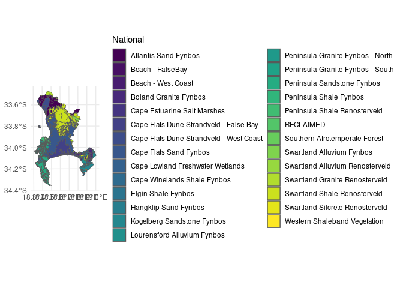
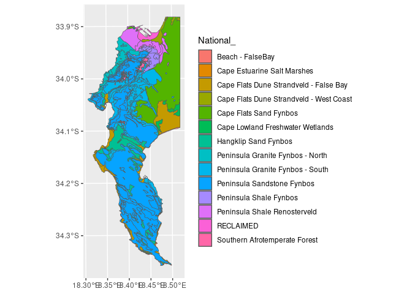
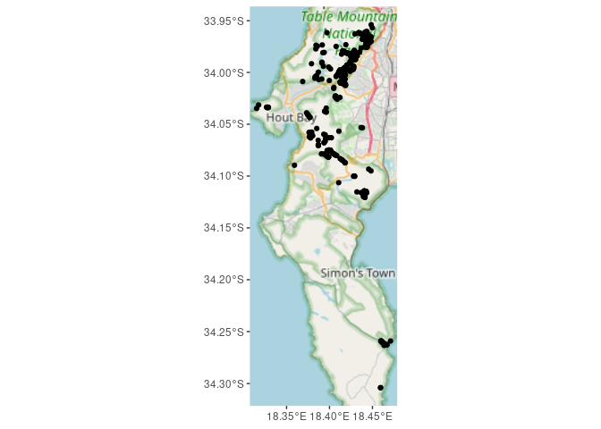

# README

Jess Devine 2025-02-27

BIO4000W GIS Deliverable

Species that are Southern Afrotempraet Forest pioneers: Virgilia oroboides (Cape Keurboom), Virgilia divaricata (Garden Route Keurboom), Rapanea melanophloeos (Cape Beech), and Kiggelaria africana (Wild Peach).

``` r
# Define species name (change this variable for different species)
species_name <- "Kiggelaria africana"  

# Define bounding box (change if needed)
bounds <- c(-35, 18, -33.5, 18.5)
```

``` r
veg <- st_read("data/cape_peninsula/cape_peninsula/veg/Vegetation_Indigenous.shp")
```

```         
## Reading layer `Vegetation_Indigenous' from data source 
##   `/home/jess/GIT/BIO4000W_GIS/data/cape_peninsula/cape_peninsula/veg/Vegetation_Indigenous.shp' 
##   using driver `ESRI Shapefile'
## Simple feature collection with 1325 features and 5 fields
## Geometry type: POLYGON
## Dimension:     XY
## Bounding box:  xmin: -63972.95 ymin: -3803535 xmax: 430.8125 ymax: -3705149
## Projected CRS: WGS_1984_Transverse_Mercator
```

``` r
ggplot() + 
  geom_sf(data = veg, aes(fill = National_)) +
  scale_fill_viridis_d() +
  theme_minimal()
```

<!-- -->

```         
## Warning: attribute variables are assumed to be spatially constant throughout
## all geometries
```

<!-- -->

``` r
# Retrieve iNaturalist data for the specified species
inat_data <- get_inat_obs(taxon_name = species_name,
                          bounds = bounds,
                          maxresults = 1000)

dim(inat_data)
```

```         
## [1] 1000   37
```

``` r
# Filter observations for accuracy, geographic location, and research quality
inat_data <- inat_data %>% 
  filter(positional_accuracy < 46 & 
         latitude < 0 &
         !is.na(latitude) &
         captive_cultivated == "false" &
         quality_grade == "research")

dim(inat_data)
```

```         
## [1] 569  37
```

``` r
# Convert to spatial object
inat_data <- st_as_sf(inat_data, coords = c("longitude", "latitude"), crs = 4326)
ggplot() + 
  annotation_map_tile(type = "osm", progress = "none") + 
  geom_sf(data = inat_data)
```

<!-- -->

``` r
vegr <- st_read("data/cape_peninsula/cape_peninsula/veg/Vegetation_Indigenous_Remnants.shp")
```

```         
## Reading layer `Vegetation_Indigenous_Remnants' from data source 
##   `/home/jess/GIT/BIO4000W_GIS/data/cape_peninsula/cape_peninsula/veg/Vegetation_Indigenous_Remnants.shp' 
##   using driver `ESRI Shapefile'
## Simple feature collection with 3428 features and 7 fields
## Geometry type: POLYGON
## Dimension:     XY
## Bounding box:  xmin: -63951.23 ymin: -3803532 xmax: 420.7595 ymax: -3705506
## Projected CRS: WGS_1984_Transverse_Mercator
```

``` r
inat_data <- st_transform(inat_data, st_crs(vegr))

inat_data <- st_intersection(inat_data, vegr)
```

```         
## Warning: attribute variables are assumed to be spatially constant throughout
## all geometries
```

``` r
dim(inat_data)
```

```         
## [1] 406  43
```

``` r
ggplot() + 
  annotation_map_tile(type = "osm", progress = "none") + 
  geom_sf(data = inat_data)
```

<!-- -->

``` r
nsaf <- inat_data %>% 
  filter(National_ != "Southern Afrotemperate Forest") %>%
  st_buffer(dist = 250)

length(unique(nsaf$id))
```

```         
## [1] 389
```

``` r
nsaf <- st_intersection(nsaf, vegr) %>% 
  filter(National_.1 == "Southern Afrotemperate Forest")
```

```         
## Warning: attribute variables are assumed to be spatially constant throughout
## all geometries
```

``` r
length(unique(nsaf$id))
```

```         
## [1] 46
```

227 vo records originally outside saf, 23 vo records near saf (204 remain outside) 389 ka records originally outside saf, 46 ka records near saf

``` r
inat_data <- st_transform(inat_data, 4326)

pal <- colorFactor(viridis::viridis(length(unique(inat_data$National_))), 
                   domain = inat_data$National_)

leaflet(inat_data) %>%
  addTiles() %>%  
  addCircleMarkers(
    radius = 4, 
    color = ~pal(National_),  
    popup = ~paste0("<b>National Vegetation:</b> ", National_, "<br>",
                    "<b>Observation Link:</b> <a href='", url, "' target='_blank'>iNat</a>"),
    group = "Observations"
  ) %>%
  addLegend(
    "bottomright",
    pal = pal,
    values = inat_data$National_,
    title = "National Vegetation Type",
    opacity = 1
  )
```

```         
## `google-chrome`, `chromium-browser` and `chrome` were not found. Try setting the `CHROMOTE_CHROME` environment variable to the executable of a Chromium-based browser, such as Google Chrome, Chromium or Brave or adding one of these executables to your PATH.

## PhantomJS not found. You can install it with webshot::install_phantomjs(). If it is installed, please make sure the phantomjs executable can be found via the PATH variable.
```

::: {#htmlwidget-a37931341248a1d90525 .leaflet .html-widget .html-fill-item style="width:672px;height:480px;"}
:::

```{=html}
<script type="application/json" data-for="htmlwidget-a37931341248a1d90525">{"x":{"options":{"crs":{"crsClass":"L.CRS.EPSG3857","code":null,"proj4def":null,"projectedBounds":null,"options":{}}},"calls":[{"method":"addTiles","args":["https://{s}.tile.openstreetmap.org/{z}/{x}/{y}.png",null,null,{"minZoom":0,"maxZoom":18,"tileSize":256,"subdomains":"abc","errorTileUrl":"","tms":false,"noWrap":false,"zoomOffset":0,"zoomReverse":false,"opacity":1,"zIndex":1,"detectRetina":false,"attribution":"&copy; <a href=\"https://openstreetmap.org/copyright/\">OpenStreetMap<\/a>,  <a href=\"https://opendatacommons.org/licenses/odbl/\">ODbL<\/a>"}]},{"method":"addCircleMarkers","args":[[-34.0633711227,-34.06302294000001,-34.0629560499,-34.03887941670001,-33.98663974999999,-33.9958545206,-34.06019083329998,-34.0757201199,-33.95995319,-33.9733416667,-33.9738020833,-34.0350333333,-34.0429028333,-34.00368474,-33.9816551389,-33.98190756439999,-33.981803662,-33.97653977000001,-33.97725988,-33.9618120278,-33.96189736280001,-33.95879759,-33.96043055560001,-33.95875833329999,-34.05267500000001,-34.06201581,-34.0619461109,-34.0622572282,-34.0620209975,-34.05843699009999,-34.0634730399,-34.0619437901,-34.06231537999999,-34.06282965010001,-34.0519920833,-34.0522191389,-34.05199476999999,-33.987225,-34.06650982,-34.05293358959999,-34.05740595999999,-34.05741572000001,-34.06000777,-34.02095787,-34.02124453,-34.0359630434,-33.962967385,-34.03480928,-33.9774466667,-33.97603333329999,-33.96767166670001,-34.0482530807,-34.02299813,-34.0227948889,-34.0230661667,-34.02350143000001,-34.0227813274,-34.02329849,-34.02226885000001,-34.03814113890001,-34.0386503056,-34.0389456111,-34.0392754722,-33.94758900010001,-33.94858656,-34.00242197,-34.00818133999999,-34.00923426009999,-34.00897226,-34.0091933333,-34.00837166669999,-34.008867013,-34.00981509969999,-33.9881671485,-33.95623333329999,-33.95425905999999,-33.9571898201,-33.95862405,-33.94981014099999,-33.95624268009999,-33.95127096,-33.94974994999999,-33.95768842,-33.95708733,-33.95459932010001,-33.94912,-33.95721333329999,-33.9562716667,-33.99848528279999,-34.0064060642,-34.00231422,-33.99873666669999,-33.99751267000001,-33.9949540418,-34.0063061851,-34.0076412901,-34.00455675999999,-34.00754168999998,-33.9989911749,-33.99854103799999,-33.99306333,-34.00612806,-33.9985211401,-34.0052358604,-33.9672555556,-33.96342833330001,-33.9584351487,-33.98434392,-33.98538615999999,-33.98402833330001,-34.00561465039999,-34.00060277829999,-34.0057857195,-34.0039472167,-34.00092189,-34.0055962466,-34.00237254,-34.00506547999999,-33.9983395301,-33.99985187999999,-33.9981416667,-33.9981069557,-33.99812566570001,-33.9985772126,-33.9983970567,-34.00886,-34.00315572979999,-34.00465198000001,-34.00664273,-33.97633416999999,-33.97622668999999,-33.97927956,-33.98207033990001,-33.98426333329999,-33.98065080560001,-33.9806175,-33.9769865699,-33.94982576989999,-33.95054463889999,-33.95056017,-33.95048000000001,-33.94477423999999,-33.95050324999999,-33.975505,-33.9755133333,-33.97344789969999,-33.9755541645,-33.97390439,-34.06317039,-34.05176805000001,-34.0428265997,-34.03860722999999,-34.03842226999999,-34.03792315,-34.0790861111,-34.0644078299,-34.06100884009999,-34.06576687009999,-34.06289638890001,-34.0624540448,-34.0613346501,-34.06432472990001,-34.06086571979999,-33.99260558,-33.99237788999999,-34.04010928999999,-33.94619317,-33.9681616667,-33.97137186260001,-33.9699393778,-33.97113673390001,-33.9686845243,-33.9687922246,-33.9689816667,-33.93836339999999,-33.9386675041,-33.93860007399999,-33.9422083333,-33.93873150280001,-33.95061385139999,-33.9509,-33.94321299999999,-33.9433111111,-33.9425416667,-33.9612209549,-33.9592417236,-33.9634383333,-33.9634470368,-33.9630314463,-33.96351133940001,-33.9487083333,-33.9501133333,-33.95324328900001,-33.9478439147,-33.948075,-33.95556760000001,-33.9552363975,-34.03389766,-34.02342176,-34.04329113999999,-34.0432313056,-33.95239666669999,-33.95658086529999,-33.9587641999,-33.9530361111,-33.95113026,-33.95457383999999,-33.95553272000001,-33.9515416667,-33.9528547,-33.95368866,-33.95226753999999,-33.95234000000001,-33.9546602381,-33.96959999999999,-33.9696366667,-33.96962000000001,-33.96989444439999,-33.97064591120001,-33.96974936140001,-33.970096475,-33.94616065610001,-33.927827063,-33.92982988800001,-33.9223448138,-33.92209661450001,-34.0258132899,-34.0094608743,-34.0094608743,-34.00567481000001,-34.00542174,-34.00696511000001,-34.00684524,-34.00913616,-34.00966978,-34.0104533333,-34.01048944999999,-34.0104416667,-34.0099811036,-34.01044979,-34.0088997795,-34.0101443379,-34.00942234999999,-34.00916297,-34.01037166,-34.01048025999999,-34.00991122999999,-34.0104069201,-34.00963431,-34.01148333329999,-33.9990283333,-33.99411789999999,-33.9986189599,-33.9976843997,-33.99768099999999,-33.99970333329999,-33.9997216667,-33.99753055559999,-33.9942771569,-33.99731144769999,-33.99287015,-33.99200699999999,-33.99882126000001,-33.99712554569999,-33.9940805556,-33.99279444439999,-33.99832792109999,-33.99829151620001,-33.99518837919999,-33.98755497699999,-34.00267856,-33.99526612,-33.9954358056,-33.99690463889999,-33.99473343,-33.99432149,-34.07045733999999,-34.05910721,-34.05732207999999,-34.05474829969999,-34.05712526,-34.05755658,-34.05659442999999,-34.05660546,-34.056559056,-34.05603666669999,-34.0565759319,-34.05790779,-34.04807211449999,-34.0479889372,-34.0479639592,-34.0258354904,-34.01625224389999,-34.01578186999999,-34.0083754399,-34.0087230099,-34.00875554999999,-34.00745444,-34.04348372220001,-34.05017659999999,-34.04105872220001,-34.04124505559999,-34.0439971667,-34.04765152000001,-34.02413336999999,-34.02402278,-34.02309269009999,-34.02401964,-34.02446751,-34.02316383330001,-34.0241599722,-34.02310682,-34.02601086000001,-34.02309783,-34.02402993,-34.01201355320001,-34.0114138833,-34.0110089301,-34.01252999999999,-34.0126540701,-34.0106703,-34.01107778329999,-34.01111666669999,-34.0110322461,-34.0109245401,-33.98391536,-33.981175,-33.98445666669999,-33.984225,-33.9861776812,-33.98584189,-33.98591701270001,-33.98584878999999,-33.98560388370001,-33.98692405,-33.98006394000001,-33.98301369410001,-33.9819016899,-33.9769083333,-33.98549550000001,-34.2622545222,-34.2621818511,-34.261275161,-34.26105578000001,-34.25879833330001,-34.09100294299999,-34.10713070780001,-34.11623644989999,-34.0755225672,-34.07405042,-34.0742028333,-34.07454716669999,-34.0742266667,-34.07428166669999,-34.073811159,-34.0752209863,-34.0745416667,-34.07405,-34.07541666669999,-34.0751322552,-34.07424166669999,-34.0779528333,-34.08409166669999,-34.07400387,-34.0742611667,-34.07433455809999,-34.0740814217,-34.0783152649,-34.07393394099999,-34.0752359852,-34.0752359852,-34.0745805,-34.07373032790001,-34.0745805,-34.0737583,-34.0742027778,-34.0752984351,-34.06296514,-34.0606815699,-34.06125236999999,-34.06079737,-34.06073418699999,-34.05571602999999,-34.05555171,-34.05445031989999,-34.05338329,-34.0557210321,-34.05445552999999,-34.04974845,-34.05438452000001,-34.0539388333,-34.0538847947,-34.053853,-34.05384188639999,-34.0538752279,-34.0554415841,-34.05400499999999,-34.0549008333,-33.95842663119998,-33.9569027591,-33.9583900755,-34.0482676892,-34.24411004000001,-34.32086382309999,-34.21550202649999,-34.22883351040001],[18.400992405,18.40153915,18.40165685,18.3977671667,18.42120368,18.4183390986,18.3950661111,18.39949,18.41182772,18.3994666667,18.3999475,18.3311166667,18.3299416667,18.3769295801,18.4219138056,18.4231958276,18.4225288802,18.40149581,18.40120696,18.4342224167,18.4349543073,18.44451268,18.4505861111,18.4500027778,18.405677,18.4057907,18.405003258,18.4048123583,18.406016808,18.40436077,18.40207262,18.4060099,18.40480604,18.40455549,18.4018018611,18.4017402778,18.40179803,18.4213,18.40228073,18.4012441523,18.40333301,18.40187864,18.40089869,18.40497812,18.40528412,18.3988990635,18.437768615,18.3972418,18.4411116667,18.44312,18.440605,18.4468933058,18.4074142399,18.4069837778,18.4077213611,18.40660495,18.4072931204,18.40670093,18.40570268,18.4003265278,18.3997494444,18.3992811389,18.3992763333,18.434825,18.43014973,18.38500318,18.40553789,18.4061789,18.40596409,18.4061966667,18.4044583333,18.4061319103,18.4033687,18.4050460949,18.4272116667,18.42878699,18.4263144699,18.41827654,18.4289274655,18.4272226,18.42920132,18.43376127,18.4302010001,18.42626554,18.4287046462,18.4297716667,18.42668,18.4272166667,18.41332964,18.4057734814,18.41158732,18.412845,18.4120876004,18.4177162742,18.4058686026,18.4054894,18.40699852,18.4055402099,18.4130789062,18.4130880245,18.41994167,18.40596146,18.41321924,18.4070086036,18.4479333333,18.447255,18.4795331955,18.42458626,18.42414984,18.42443,18.4124199899,18.4178783333,18.4106760565,18.4148916667,18.4229515901,18.4153062198,18.41956282,18.41545577,18.4256393462,18.42525974,18.42485,18.4246372273,18.4244892929,18.4257889693,18.4256002962,18.40684666670001,18.3957116772,18.3976926601,18.39637024,18.4290609499,18.42944613,18.4289920999,18.42523743,18.4302916667,18.4282498056,18.42829444,18.43408917,18.45238735,18.4505519722,18.45629708,18.4604234722,18.45657393,18.45612128,18.4440133333,18.444,18.4448103,18.4431778919,18.44467073,18.39901129,18.39618035,18.3966849,18.39582094,18.395829,18.39460912,18.3938194167,18.4131354599,18.41023207,18.414786458,18.4122730556,18.4115666012,18.4129120399,18.41384405,18.4132477082,18.43038435,18.43040452,18.37543431,18.45361085,18.4412983333,18.4471853619,18.445969522,18.4470781591,18.3866645023,18.3869597916,18.3867283333,18.39367459,18.3945009951,18.3944935624,18.391195,18.3933250197,18.394658491,18.3961361117,18.394158,18.3962166667,18.3983283333,18.3873175469,18.3914711885,18.384625,18.384633709,18.3843067685,18.3846455533,18.421405,18.4181633333,18.4140546142,18.4210379698,18.4233,18.42461399,18.4244758224,18.3296513,18.39482937,18.3770776699,18.377099,18.4596783333,18.4574287279,18.4507837,18.45709722220001,18.45861327,18.45385719,18.45548485,18.4497527778,18.4574079,18.45394471,18.45391123,18.456665,18.4476297122,18.4467833333,18.44697,18.4470033333,18.4474694444,18.447935065,18.4489839608,18.448521673,18.4184065716,18.3999437839,18.3975935353,18.4040598178,18.4026138625,18.4085163599,18.4063330953,18.4063330953,18.4168196,18.41812644,18.4173981,18.41740468,18.41664523,18.41538996,18.4128283333,18.41368629,18.414725,18.4126410214,18.4137805901,18.4124932351,18.4173599956,18.41593279,18.41403096,18.41291463,18.41365985,18.41717174,18.4135838699,18.41545918,18.4051766667,18.4260466667,18.42404008,18.41720005,18.4228471997,18.422795,18.421075,18.421125,18.4239972222,18.4231601469,18.4236751311,18.42856996,18.422381,18.42169108,18.4205334261,18.4215638889,18.4225666667,18.4238014463,18.4234303798,18.4236015379,18.4301423107,18.42436616,18.42739256,18.4273945556,18.4258519167,18.42591168,18.42547289,18.40895249,18.4105039201,18.40587876,18.4111116,18.41146217,18.41154289,18.41098686,18.41096447,18.4108561836,18.4081583333,18.4107764342,18.41262879,18.4478166838,18.447868824,18.4477234818,18.3835605183,18.404557351,18.40477922,18.37569914,18.35923423,18.3602833333,18.39235744,18.3970928056,18.4044865997,18.4002694444,18.3999043056,18.3973231667,18.40150814,18.41031593,18.4102235601,18.40797792,18.4121345599,18.41266035,18.4083783333,18.4121874167,18.40829417,18.41305249,18.4104781199,18.40780733,18.4188873728,18.4185883333,18.4162607499,18.41897249000001,18.41987482,18.41764566,18.4181,18.4164366667,18.41820376,18.41625634,18.43226985,18.4347616667,18.42585,18.426,18.4308768504,18.43041997,18.4306349395,18.43052568,18.4302921289,18.4251023204,18.43504252,18.4360068946,18.43542251,18.4407666667,18.42561864,18.4665206541,18.4665652458,18.4674618274,18.46297419,18.459535,18.4210752458,18.4105767755,18.43750396,18.4008224588,18.3975345735,18.39753,18.399075,18.3976083333,18.3979516667,18.3969515851,18.4004722629,18.3987033333,18.3972383333,18.40125,18.4005647005,18.39752,18.407205,18.4138466667,18.3971598399,18.3975416667,18.3979129326,18.3972167967,18.4041259346,18.3968408903,18.4005457779,18.4005457779,18.3990783333,18.3970639252,18.399145,18.39709035,18.3979944444,18.4004360531,18.41453768,18.42266272,18.42330418,18.41458202,18.4160887993,18.42272535,18.422832,18.4204855334,18.42614306,18.4226997697,18.42105376,18.4226459199,18.42440193,18.4368216667,18.4368294883,18.436618,18.4368836706,18.4367426035,18.4333308555,18.4367316667,18.4355761667,18.4822745871,18.480269407,18.4824972803,18.4361196279,18.4739494801,18.4530148408,18.4619236831,18.4695540344],4,null,"Observations",{"interactive":true,"className":"","stroke":true,"color":["#1FA187","#1FA187","#1FA187","#1FA187","#1FA187","#1FA187","#1FA187","#1FA187","#1FA187","#1FA187","#1FA187","#1FA187","#1FA187","#1FA187","#1FA187","#1FA187","#1FA187","#1FA187","#1FA187","#4AC16D","#4AC16D","#4AC16D","#4AC16D","#4AC16D","#277F8E","#277F8E","#277F8E","#277F8E","#277F8E","#277F8E","#277F8E","#277F8E","#277F8E","#277F8E","#277F8E","#277F8E","#277F8E","#277F8E","#277F8E","#277F8E","#277F8E","#277F8E","#277F8E","#277F8E","#277F8E","#FDE725","#FDE725","#FDE725","#FDE725","#FDE725","#FDE725","#277F8E","#1FA187","#1FA187","#1FA187","#1FA187","#1FA187","#1FA187","#1FA187","#277F8E","#277F8E","#277F8E","#277F8E","#1FA187","#1FA187","#1FA187","#1FA187","#1FA187","#1FA187","#1FA187","#1FA187","#1FA187","#1FA187","#1FA187","#1FA187","#1FA187","#1FA187","#1FA187","#1FA187","#1FA187","#1FA187","#1FA187","#1FA187","#1FA187","#1FA187","#1FA187","#1FA187","#1FA187","#1FA187","#1FA187","#1FA187","#1FA187","#1FA187","#1FA187","#1FA187","#1FA187","#1FA187","#1FA187","#1FA187","#1FA187","#1FA187","#1FA187","#1FA187","#1FA187","#4AC16D","#4AC16D","#9FDA3A","#277F8E","#277F8E","#277F8E","#277F8E","#277F8E","#277F8E","#277F8E","#277F8E","#277F8E","#277F8E","#277F8E","#277F8E","#277F8E","#277F8E","#277F8E","#277F8E","#277F8E","#277F8E","#277F8E","#277F8E","#277F8E","#277F8E","#FDE725","#FDE725","#FDE725","#FDE725","#FDE725","#FDE725","#FDE725","#FDE725","#4AC16D","#4AC16D","#4AC16D","#4AC16D","#4AC16D","#4AC16D","#277F8E","#277F8E","#FDE725","#FDE725","#FDE725","#1FA187","#1FA187","#1FA187","#1FA187","#1FA187","#1FA187","#1FA187","#277F8E","#277F8E","#277F8E","#277F8E","#277F8E","#277F8E","#277F8E","#277F8E","#4AC16D","#4AC16D","#1FA187","#4AC16D","#4AC16D","#4AC16D","#4AC16D","#4AC16D","#365C8D","#365C8D","#365C8D","#365C8D","#365C8D","#365C8D","#365C8D","#365C8D","#365C8D","#365C8D","#365C8D","#365C8D","#365C8D","#365C8D","#365C8D","#365C8D","#365C8D","#365C8D","#365C8D","#365C8D","#365C8D","#365C8D","#365C8D","#365C8D","#365C8D","#365C8D","#1FA187","#1FA187","#1FA187","#1FA187","#4AC16D","#4AC16D","#4AC16D","#4AC16D","#4AC16D","#4AC16D","#4AC16D","#4AC16D","#4AC16D","#4AC16D","#4AC16D","#4AC16D","#4AC16D","#4AC16D","#4AC16D","#4AC16D","#4AC16D","#4AC16D","#4AC16D","#4AC16D","#9FDA3A","#9FDA3A","#9FDA3A","#9FDA3A","#9FDA3A","#277F8E","#277F8E","#277F8E","#277F8E","#277F8E","#277F8E","#277F8E","#277F8E","#277F8E","#277F8E","#277F8E","#277F8E","#277F8E","#277F8E","#277F8E","#277F8E","#277F8E","#277F8E","#277F8E","#277F8E","#277F8E","#277F8E","#277F8E","#277F8E","#277F8E","#277F8E","#277F8E","#277F8E","#277F8E","#277F8E","#277F8E","#277F8E","#277F8E","#277F8E","#277F8E","#277F8E","#277F8E","#277F8E","#277F8E","#277F8E","#277F8E","#277F8E","#277F8E","#277F8E","#277F8E","#277F8E","#277F8E","#277F8E","#277F8E","#277F8E","#277F8E","#277F8E","#277F8E","#277F8E","#277F8E","#277F8E","#277F8E","#277F8E","#277F8E","#277F8E","#277F8E","#277F8E","#277F8E","#277F8E","#277F8E","#277F8E","#277F8E","#277F8E","#277F8E","#277F8E","#277F8E","#277F8E","#277F8E","#277F8E","#277F8E","#277F8E","#277F8E","#277F8E","#277F8E","#277F8E","#277F8E","#277F8E","#277F8E","#277F8E","#277F8E","#277F8E","#277F8E","#277F8E","#277F8E","#277F8E","#277F8E","#277F8E","#277F8E","#277F8E","#277F8E","#277F8E","#277F8E","#277F8E","#277F8E","#277F8E","#277F8E","#277F8E","#277F8E","#277F8E","#277F8E","#277F8E","#277F8E","#277F8E","#277F8E","#277F8E","#277F8E","#277F8E","#277F8E","#277F8E","#440154","#440154","#1FA187","#1FA187","#1FA187","#1FA187","#1FA187","#1FA187","#1FA187","#1FA187","#1FA187","#1FA187","#1FA187","#1FA187","#1FA187","#1FA187","#1FA187","#1FA187","#1FA187","#1FA187","#1FA187","#1FA187","#1FA187","#1FA187","#1FA187","#1FA187","#1FA187","#1FA187","#1FA187","#1FA187","#1FA187","#1FA187","#1FA187","#1FA187","#1FA187","#1FA187","#1FA187","#46337E","#46337E","#46337E","#46337E","#46337E","#46337E","#46337E","#46337E","#46337E","#46337E","#46337E","#46337E","#46337E","#46337E","#46337E","#46337E","#46337E","#46337E","#46337E","#46337E","#46337E","#46337E","#46337E","#46337E","#46337E","#1FA187","#1FA187","#277F8E","#277F8E"],"weight":5,"opacity":0.5,"fill":true,"fillColor":["#1FA187","#1FA187","#1FA187","#1FA187","#1FA187","#1FA187","#1FA187","#1FA187","#1FA187","#1FA187","#1FA187","#1FA187","#1FA187","#1FA187","#1FA187","#1FA187","#1FA187","#1FA187","#1FA187","#4AC16D","#4AC16D","#4AC16D","#4AC16D","#4AC16D","#277F8E","#277F8E","#277F8E","#277F8E","#277F8E","#277F8E","#277F8E","#277F8E","#277F8E","#277F8E","#277F8E","#277F8E","#277F8E","#277F8E","#277F8E","#277F8E","#277F8E","#277F8E","#277F8E","#277F8E","#277F8E","#FDE725","#FDE725","#FDE725","#FDE725","#FDE725","#FDE725","#277F8E","#1FA187","#1FA187","#1FA187","#1FA187","#1FA187","#1FA187","#1FA187","#277F8E","#277F8E","#277F8E","#277F8E","#1FA187","#1FA187","#1FA187","#1FA187","#1FA187","#1FA187","#1FA187","#1FA187","#1FA187","#1FA187","#1FA187","#1FA187","#1FA187","#1FA187","#1FA187","#1FA187","#1FA187","#1FA187","#1FA187","#1FA187","#1FA187","#1FA187","#1FA187","#1FA187","#1FA187","#1FA187","#1FA187","#1FA187","#1FA187","#1FA187","#1FA187","#1FA187","#1FA187","#1FA187","#1FA187","#1FA187","#1FA187","#1FA187","#1FA187","#1FA187","#1FA187","#4AC16D","#4AC16D","#9FDA3A","#277F8E","#277F8E","#277F8E","#277F8E","#277F8E","#277F8E","#277F8E","#277F8E","#277F8E","#277F8E","#277F8E","#277F8E","#277F8E","#277F8E","#277F8E","#277F8E","#277F8E","#277F8E","#277F8E","#277F8E","#277F8E","#277F8E","#FDE725","#FDE725","#FDE725","#FDE725","#FDE725","#FDE725","#FDE725","#FDE725","#4AC16D","#4AC16D","#4AC16D","#4AC16D","#4AC16D","#4AC16D","#277F8E","#277F8E","#FDE725","#FDE725","#FDE725","#1FA187","#1FA187","#1FA187","#1FA187","#1FA187","#1FA187","#1FA187","#277F8E","#277F8E","#277F8E","#277F8E","#277F8E","#277F8E","#277F8E","#277F8E","#4AC16D","#4AC16D","#1FA187","#4AC16D","#4AC16D","#4AC16D","#4AC16D","#4AC16D","#365C8D","#365C8D","#365C8D","#365C8D","#365C8D","#365C8D","#365C8D","#365C8D","#365C8D","#365C8D","#365C8D","#365C8D","#365C8D","#365C8D","#365C8D","#365C8D","#365C8D","#365C8D","#365C8D","#365C8D","#365C8D","#365C8D","#365C8D","#365C8D","#365C8D","#365C8D","#1FA187","#1FA187","#1FA187","#1FA187","#4AC16D","#4AC16D","#4AC16D","#4AC16D","#4AC16D","#4AC16D","#4AC16D","#4AC16D","#4AC16D","#4AC16D","#4AC16D","#4AC16D","#4AC16D","#4AC16D","#4AC16D","#4AC16D","#4AC16D","#4AC16D","#4AC16D","#4AC16D","#9FDA3A","#9FDA3A","#9FDA3A","#9FDA3A","#9FDA3A","#277F8E","#277F8E","#277F8E","#277F8E","#277F8E","#277F8E","#277F8E","#277F8E","#277F8E","#277F8E","#277F8E","#277F8E","#277F8E","#277F8E","#277F8E","#277F8E","#277F8E","#277F8E","#277F8E","#277F8E","#277F8E","#277F8E","#277F8E","#277F8E","#277F8E","#277F8E","#277F8E","#277F8E","#277F8E","#277F8E","#277F8E","#277F8E","#277F8E","#277F8E","#277F8E","#277F8E","#277F8E","#277F8E","#277F8E","#277F8E","#277F8E","#277F8E","#277F8E","#277F8E","#277F8E","#277F8E","#277F8E","#277F8E","#277F8E","#277F8E","#277F8E","#277F8E","#277F8E","#277F8E","#277F8E","#277F8E","#277F8E","#277F8E","#277F8E","#277F8E","#277F8E","#277F8E","#277F8E","#277F8E","#277F8E","#277F8E","#277F8E","#277F8E","#277F8E","#277F8E","#277F8E","#277F8E","#277F8E","#277F8E","#277F8E","#277F8E","#277F8E","#277F8E","#277F8E","#277F8E","#277F8E","#277F8E","#277F8E","#277F8E","#277F8E","#277F8E","#277F8E","#277F8E","#277F8E","#277F8E","#277F8E","#277F8E","#277F8E","#277F8E","#277F8E","#277F8E","#277F8E","#277F8E","#277F8E","#277F8E","#277F8E","#277F8E","#277F8E","#277F8E","#277F8E","#277F8E","#277F8E","#277F8E","#277F8E","#277F8E","#277F8E","#277F8E","#277F8E","#277F8E","#440154","#440154","#1FA187","#1FA187","#1FA187","#1FA187","#1FA187","#1FA187","#1FA187","#1FA187","#1FA187","#1FA187","#1FA187","#1FA187","#1FA187","#1FA187","#1FA187","#1FA187","#1FA187","#1FA187","#1FA187","#1FA187","#1FA187","#1FA187","#1FA187","#1FA187","#1FA187","#1FA187","#1FA187","#1FA187","#1FA187","#1FA187","#1FA187","#1FA187","#1FA187","#1FA187","#1FA187","#46337E","#46337E","#46337E","#46337E","#46337E","#46337E","#46337E","#46337E","#46337E","#46337E","#46337E","#46337E","#46337E","#46337E","#46337E","#46337E","#46337E","#46337E","#46337E","#46337E","#46337E","#46337E","#46337E","#46337E","#46337E","#1FA187","#1FA187","#277F8E","#277F8E"],"fillOpacity":0.2},null,null,["<b>National Vegetation:<\/b> Peninsula Sandstone Fynbos<br><b>Observation Link:<\/b> <a href='https://www.inaturalist.org/observations/114356350' target='_blank'>iNat<\/a>","<b>National Vegetation:<\/b> Peninsula Sandstone Fynbos<br><b>Observation Link:<\/b> <a href='https://www.inaturalist.org/observations/101331058' target='_blank'>iNat<\/a>","<b>National Vegetation:<\/b> Peninsula Sandstone Fynbos<br><b>Observation Link:<\/b> <a href='https://www.inaturalist.org/observations/101331050' target='_blank'>iNat<\/a>","<b>National Vegetation:<\/b> Peninsula Sandstone Fynbos<br><b>Observation Link:<\/b> <a href='https://www.inaturalist.org/observations/158326076' target='_blank'>iNat<\/a>","<b>National Vegetation:<\/b> Peninsula Sandstone Fynbos<br><b>Observation Link:<\/b> <a href='https://www.inaturalist.org/observations/149269325' target='_blank'>iNat<\/a>","<b>National Vegetation:<\/b> Peninsula Sandstone Fynbos<br><b>Observation Link:<\/b> <a href='https://www.inaturalist.org/observations/114616845' target='_blank'>iNat<\/a>","<b>National Vegetation:<\/b> Peninsula Sandstone Fynbos<br><b>Observation Link:<\/b> <a href='https://www.inaturalist.org/observations/67508704' target='_blank'>iNat<\/a>","<b>National Vegetation:<\/b> Peninsula Sandstone Fynbos<br><b>Observation Link:<\/b> <a href='https://www.inaturalist.org/observations/80529465' target='_blank'>iNat<\/a>","<b>National Vegetation:<\/b> Peninsula Sandstone Fynbos<br><b>Observation Link:<\/b> <a href='https://www.inaturalist.org/observations/115061164' target='_blank'>iNat<\/a>","<b>National Vegetation:<\/b> Peninsula Sandstone Fynbos<br><b>Observation Link:<\/b> <a href='https://www.inaturalist.org/observations/104646946' target='_blank'>iNat<\/a>","<b>National Vegetation:<\/b> Peninsula Sandstone Fynbos<br><b>Observation Link:<\/b> <a href='https://www.inaturalist.org/observations/104600481' target='_blank'>iNat<\/a>","<b>National Vegetation:<\/b> Peninsula Sandstone Fynbos<br><b>Observation Link:<\/b> <a href='https://www.inaturalist.org/observations/254901562' target='_blank'>iNat<\/a>","<b>National Vegetation:<\/b> Peninsula Sandstone Fynbos<br><b>Observation Link:<\/b> <a href='https://www.inaturalist.org/observations/206477667' target='_blank'>iNat<\/a>","<b>National Vegetation:<\/b> Peninsula Sandstone Fynbos<br><b>Observation Link:<\/b> <a href='https://www.inaturalist.org/observations/71858258' target='_blank'>iNat<\/a>","<b>National Vegetation:<\/b> Peninsula Sandstone Fynbos<br><b>Observation Link:<\/b> <a href='https://www.inaturalist.org/observations/149166698' target='_blank'>iNat<\/a>","<b>National Vegetation:<\/b> Peninsula Sandstone Fynbos<br><b>Observation Link:<\/b> <a href='https://www.inaturalist.org/observations/135423974' target='_blank'>iNat<\/a>","<b>National Vegetation:<\/b> Peninsula Sandstone Fynbos<br><b>Observation Link:<\/b> <a href='https://www.inaturalist.org/observations/135423964' target='_blank'>iNat<\/a>","<b>National Vegetation:<\/b> Peninsula Sandstone Fynbos<br><b>Observation Link:<\/b> <a href='https://www.inaturalist.org/observations/104867834' target='_blank'>iNat<\/a>","<b>National Vegetation:<\/b> Peninsula Sandstone Fynbos<br><b>Observation Link:<\/b> <a href='https://www.inaturalist.org/observations/67970380' target='_blank'>iNat<\/a>","<b>National Vegetation:<\/b> Peninsula Shale Fynbos<br><b>Observation Link:<\/b> <a href='https://www.inaturalist.org/observations/168263845' target='_blank'>iNat<\/a>","<b>National Vegetation:<\/b> Peninsula Shale Fynbos<br><b>Observation Link:<\/b> <a href='https://www.inaturalist.org/observations/148333010' target='_blank'>iNat<\/a>","<b>National Vegetation:<\/b> Peninsula Shale Fynbos<br><b>Observation Link:<\/b> <a href='https://www.inaturalist.org/observations/258496056' target='_blank'>iNat<\/a>","<b>National Vegetation:<\/b> Peninsula Shale Fynbos<br><b>Observation Link:<\/b> <a href='https://www.inaturalist.org/observations/158577790' target='_blank'>iNat<\/a>","<b>National Vegetation:<\/b> Peninsula Shale Fynbos<br><b>Observation Link:<\/b> <a href='https://www.inaturalist.org/observations/158017293' target='_blank'>iNat<\/a>","<b>National Vegetation:<\/b> Peninsula Granite Fynbos - South<br><b>Observation Link:<\/b> <a href='https://www.inaturalist.org/observations/117485310' target='_blank'>iNat<\/a>","<b>National Vegetation:<\/b> Peninsula Granite Fynbos - South<br><b>Observation Link:<\/b> <a href='https://www.inaturalist.org/observations/262419629' target='_blank'>iNat<\/a>","<b>National Vegetation:<\/b> Peninsula Granite Fynbos - South<br><b>Observation Link:<\/b> <a href='https://www.inaturalist.org/observations/212549904' target='_blank'>iNat<\/a>","<b>National Vegetation:<\/b> Peninsula Granite Fynbos - South<br><b>Observation Link:<\/b> <a href='https://www.inaturalist.org/observations/113787260' target='_blank'>iNat<\/a>","<b>National Vegetation:<\/b> Peninsula Granite Fynbos - South<br><b>Observation Link:<\/b> <a href='https://www.inaturalist.org/observations/110479102' target='_blank'>iNat<\/a>","<b>National Vegetation:<\/b> Peninsula Granite Fynbos - South<br><b>Observation Link:<\/b> <a href='https://www.inaturalist.org/observations/102404445' target='_blank'>iNat<\/a>","<b>National Vegetation:<\/b> Peninsula Granite Fynbos - South<br><b>Observation Link:<\/b> <a href='https://www.inaturalist.org/observations/101285432' target='_blank'>iNat<\/a>","<b>National Vegetation:<\/b> Peninsula Granite Fynbos - South<br><b>Observation Link:<\/b> <a href='https://www.inaturalist.org/observations/101185011' target='_blank'>iNat<\/a>","<b>National Vegetation:<\/b> Peninsula Granite Fynbos - South<br><b>Observation Link:<\/b> <a href='https://www.inaturalist.org/observations/101140098' target='_blank'>iNat<\/a>","<b>National Vegetation:<\/b> Peninsula Granite Fynbos - South<br><b>Observation Link:<\/b> <a href='https://www.inaturalist.org/observations/101140049' target='_blank'>iNat<\/a>","<b>National Vegetation:<\/b> Peninsula Granite Fynbos - South<br><b>Observation Link:<\/b> <a href='https://www.inaturalist.org/observations/158039156' target='_blank'>iNat<\/a>","<b>National Vegetation:<\/b> Peninsula Granite Fynbos - South<br><b>Observation Link:<\/b> <a href='https://www.inaturalist.org/observations/158039148' target='_blank'>iNat<\/a>","<b>National Vegetation:<\/b> Peninsula Granite Fynbos - South<br><b>Observation Link:<\/b> <a href='https://www.inaturalist.org/observations/71794016' target='_blank'>iNat<\/a>","<b>National Vegetation:<\/b> Peninsula Granite Fynbos - South<br><b>Observation Link:<\/b> <a href='https://www.inaturalist.org/observations/174317900' target='_blank'>iNat<\/a>","<b>National Vegetation:<\/b> Peninsula Granite Fynbos - South<br><b>Observation Link:<\/b> <a href='https://www.inaturalist.org/observations/101130957' target='_blank'>iNat<\/a>","<b>National Vegetation:<\/b> Peninsula Granite Fynbos - South<br><b>Observation Link:<\/b> <a href='https://www.inaturalist.org/observations/152388610' target='_blank'>iNat<\/a>","<b>National Vegetation:<\/b> Peninsula Granite Fynbos - South<br><b>Observation Link:<\/b> <a href='https://www.inaturalist.org/observations/102523557' target='_blank'>iNat<\/a>","<b>National Vegetation:<\/b> Peninsula Granite Fynbos - South<br><b>Observation Link:<\/b> <a href='https://www.inaturalist.org/observations/102523544' target='_blank'>iNat<\/a>","<b>National Vegetation:<\/b> Peninsula Granite Fynbos - South<br><b>Observation Link:<\/b> <a href='https://www.inaturalist.org/observations/102520849' target='_blank'>iNat<\/a>","<b>National Vegetation:<\/b> Peninsula Granite Fynbos - South<br><b>Observation Link:<\/b> <a href='https://www.inaturalist.org/observations/67418389' target='_blank'>iNat<\/a>","<b>National Vegetation:<\/b> Peninsula Granite Fynbos - South<br><b>Observation Link:<\/b> <a href='https://www.inaturalist.org/observations/67413752' target='_blank'>iNat<\/a>","<b>National Vegetation:<\/b> Southern Afrotemperate Forest<br><b>Observation Link:<\/b> <a href='https://www.inaturalist.org/observations/101831944' target='_blank'>iNat<\/a>","<b>National Vegetation:<\/b> Southern Afrotemperate Forest<br><b>Observation Link:<\/b> <a href='https://www.inaturalist.org/observations/115867973' target='_blank'>iNat<\/a>","<b>National Vegetation:<\/b> Southern Afrotemperate Forest<br><b>Observation Link:<\/b> <a href='https://www.inaturalist.org/observations/102619068' target='_blank'>iNat<\/a>","<b>National Vegetation:<\/b> Southern Afrotemperate Forest<br><b>Observation Link:<\/b> <a href='https://www.inaturalist.org/observations/254630563' target='_blank'>iNat<\/a>","<b>National Vegetation:<\/b> Southern Afrotemperate Forest<br><b>Observation Link:<\/b> <a href='https://www.inaturalist.org/observations/73313102' target='_blank'>iNat<\/a>","<b>National Vegetation:<\/b> Southern Afrotemperate Forest<br><b>Observation Link:<\/b> <a href='https://www.inaturalist.org/observations/115531078' target='_blank'>iNat<\/a>","<b>National Vegetation:<\/b> Peninsula Granite Fynbos - South<br><b>Observation Link:<\/b> <a href='https://www.inaturalist.org/observations/158075011' target='_blank'>iNat<\/a>","<b>National Vegetation:<\/b> Peninsula Sandstone Fynbos<br><b>Observation Link:<\/b> <a href='https://www.inaturalist.org/observations/220768720' target='_blank'>iNat<\/a>","<b>National Vegetation:<\/b> Peninsula Sandstone Fynbos<br><b>Observation Link:<\/b> <a href='https://www.inaturalist.org/observations/168358478' target='_blank'>iNat<\/a>","<b>National Vegetation:<\/b> Peninsula Sandstone Fynbos<br><b>Observation Link:<\/b> <a href='https://www.inaturalist.org/observations/152666623' target='_blank'>iNat<\/a>","<b>National Vegetation:<\/b> Peninsula Sandstone Fynbos<br><b>Observation Link:<\/b> <a href='https://www.inaturalist.org/observations/138278279' target='_blank'>iNat<\/a>","<b>National Vegetation:<\/b> Peninsula Sandstone Fynbos<br><b>Observation Link:<\/b> <a href='https://www.inaturalist.org/observations/82701399' target='_blank'>iNat<\/a>","<b>National Vegetation:<\/b> Peninsula Sandstone Fynbos<br><b>Observation Link:<\/b> <a href='https://www.inaturalist.org/observations/70049129' target='_blank'>iNat<\/a>","<b>National Vegetation:<\/b> Peninsula Sandstone Fynbos<br><b>Observation Link:<\/b> <a href='https://www.inaturalist.org/observations/88743315' target='_blank'>iNat<\/a>","<b>National Vegetation:<\/b> Peninsula Granite Fynbos - South<br><b>Observation Link:<\/b> <a href='https://www.inaturalist.org/observations/158290732' target='_blank'>iNat<\/a>","<b>National Vegetation:<\/b> Peninsula Granite Fynbos - South<br><b>Observation Link:<\/b> <a href='https://www.inaturalist.org/observations/158290639' target='_blank'>iNat<\/a>","<b>National Vegetation:<\/b> Peninsula Granite Fynbos - South<br><b>Observation Link:<\/b> <a href='https://www.inaturalist.org/observations/158290483' target='_blank'>iNat<\/a>","<b>National Vegetation:<\/b> Peninsula Granite Fynbos - South<br><b>Observation Link:<\/b> <a href='https://www.inaturalist.org/observations/158290435' target='_blank'>iNat<\/a>","<b>National Vegetation:<\/b> Peninsula Sandstone Fynbos<br><b>Observation Link:<\/b> <a href='https://www.inaturalist.org/observations/154282397' target='_blank'>iNat<\/a>","<b>National Vegetation:<\/b> Peninsula Sandstone Fynbos<br><b>Observation Link:<\/b> <a href='https://www.inaturalist.org/observations/137454553' target='_blank'>iNat<\/a>","<b>National Vegetation:<\/b> Peninsula Sandstone Fynbos<br><b>Observation Link:<\/b> <a href='https://www.inaturalist.org/observations/99445465' target='_blank'>iNat<\/a>","<b>National Vegetation:<\/b> Peninsula Sandstone Fynbos<br><b>Observation Link:<\/b> <a href='https://www.inaturalist.org/observations/188694166' target='_blank'>iNat<\/a>","<b>National Vegetation:<\/b> Peninsula Sandstone Fynbos<br><b>Observation Link:<\/b> <a href='https://www.inaturalist.org/observations/151290101' target='_blank'>iNat<\/a>","<b>National Vegetation:<\/b> Peninsula Sandstone Fynbos<br><b>Observation Link:<\/b> <a href='https://www.inaturalist.org/observations/104457859' target='_blank'>iNat<\/a>","<b>National Vegetation:<\/b> Peninsula Sandstone Fynbos<br><b>Observation Link:<\/b> <a href='https://www.inaturalist.org/observations/76607318' target='_blank'>iNat<\/a>","<b>National Vegetation:<\/b> Peninsula Sandstone Fynbos<br><b>Observation Link:<\/b> <a href='https://www.inaturalist.org/observations/76444943' target='_blank'>iNat<\/a>","<b>National Vegetation:<\/b> Peninsula Sandstone Fynbos<br><b>Observation Link:<\/b> <a href='https://www.inaturalist.org/observations/73000314' target='_blank'>iNat<\/a>","<b>National Vegetation:<\/b> Peninsula Sandstone Fynbos<br><b>Observation Link:<\/b> <a href='https://www.inaturalist.org/observations/201678935' target='_blank'>iNat<\/a>","<b>National Vegetation:<\/b> Peninsula Sandstone Fynbos<br><b>Observation Link:<\/b> <a href='https://www.inaturalist.org/observations/113197681' target='_blank'>iNat<\/a>","<b>National Vegetation:<\/b> Peninsula Sandstone Fynbos<br><b>Observation Link:<\/b> <a href='https://www.inaturalist.org/observations/258570065' target='_blank'>iNat<\/a>","<b>National Vegetation:<\/b> Peninsula Sandstone Fynbos<br><b>Observation Link:<\/b> <a href='https://www.inaturalist.org/observations/218176146' target='_blank'>iNat<\/a>","<b>National Vegetation:<\/b> Peninsula Sandstone Fynbos<br><b>Observation Link:<\/b> <a href='https://www.inaturalist.org/observations/217563431' target='_blank'>iNat<\/a>","<b>National Vegetation:<\/b> Peninsula Sandstone Fynbos<br><b>Observation Link:<\/b> <a href='https://www.inaturalist.org/observations/217545970' target='_blank'>iNat<\/a>","<b>National Vegetation:<\/b> Peninsula Sandstone Fynbos<br><b>Observation Link:<\/b> <a href='https://www.inaturalist.org/observations/213678617' target='_blank'>iNat<\/a>","<b>National Vegetation:<\/b> Peninsula Sandstone Fynbos<br><b>Observation Link:<\/b> <a href='https://www.inaturalist.org/observations/190217909' target='_blank'>iNat<\/a>","<b>National Vegetation:<\/b> Peninsula Sandstone Fynbos<br><b>Observation Link:<\/b> <a href='https://www.inaturalist.org/observations/190215853' target='_blank'>iNat<\/a>","<b>National Vegetation:<\/b> Peninsula Sandstone Fynbos<br><b>Observation Link:<\/b> <a href='https://www.inaturalist.org/observations/190115463' target='_blank'>iNat<\/a>","<b>National Vegetation:<\/b> Peninsula Sandstone Fynbos<br><b>Observation Link:<\/b> <a href='https://www.inaturalist.org/observations/190065854' target='_blank'>iNat<\/a>","<b>National Vegetation:<\/b> Peninsula Sandstone Fynbos<br><b>Observation Link:<\/b> <a href='https://www.inaturalist.org/observations/137307034' target='_blank'>iNat<\/a>","<b>National Vegetation:<\/b> Peninsula Sandstone Fynbos<br><b>Observation Link:<\/b> <a href='https://www.inaturalist.org/observations/114827668' target='_blank'>iNat<\/a>","<b>National Vegetation:<\/b> Peninsula Sandstone Fynbos<br><b>Observation Link:<\/b> <a href='https://www.inaturalist.org/observations/113535477' target='_blank'>iNat<\/a>","<b>National Vegetation:<\/b> Peninsula Sandstone Fynbos<br><b>Observation Link:<\/b> <a href='https://www.inaturalist.org/observations/113102432' target='_blank'>iNat<\/a>","<b>National Vegetation:<\/b> Peninsula Sandstone Fynbos<br><b>Observation Link:<\/b> <a href='https://www.inaturalist.org/observations/67954228' target='_blank'>iNat<\/a>","<b>National Vegetation:<\/b> Peninsula Sandstone Fynbos<br><b>Observation Link:<\/b> <a href='https://www.inaturalist.org/observations/157600663' target='_blank'>iNat<\/a>","<b>National Vegetation:<\/b> Peninsula Sandstone Fynbos<br><b>Observation Link:<\/b> <a href='https://www.inaturalist.org/observations/152702830' target='_blank'>iNat<\/a>","<b>National Vegetation:<\/b> Peninsula Sandstone Fynbos<br><b>Observation Link:<\/b> <a href='https://www.inaturalist.org/observations/151290164' target='_blank'>iNat<\/a>","<b>National Vegetation:<\/b> Peninsula Sandstone Fynbos<br><b>Observation Link:<\/b> <a href='https://www.inaturalist.org/observations/126926673' target='_blank'>iNat<\/a>","<b>National Vegetation:<\/b> Peninsula Sandstone Fynbos<br><b>Observation Link:<\/b> <a href='https://www.inaturalist.org/observations/116839438' target='_blank'>iNat<\/a>","<b>National Vegetation:<\/b> Peninsula Sandstone Fynbos<br><b>Observation Link:<\/b> <a href='https://www.inaturalist.org/observations/114610269' target='_blank'>iNat<\/a>","<b>National Vegetation:<\/b> Peninsula Sandstone Fynbos<br><b>Observation Link:<\/b> <a href='https://www.inaturalist.org/observations/111324540' target='_blank'>iNat<\/a>","<b>National Vegetation:<\/b> Peninsula Sandstone Fynbos<br><b>Observation Link:<\/b> <a href='https://www.inaturalist.org/observations/107723166' target='_blank'>iNat<\/a>","<b>National Vegetation:<\/b> Peninsula Sandstone Fynbos<br><b>Observation Link:<\/b> <a href='https://www.inaturalist.org/observations/107723154' target='_blank'>iNat<\/a>","<b>National Vegetation:<\/b> Peninsula Sandstone Fynbos<br><b>Observation Link:<\/b> <a href='https://www.inaturalist.org/observations/97273014' target='_blank'>iNat<\/a>","<b>National Vegetation:<\/b> Peninsula Sandstone Fynbos<br><b>Observation Link:<\/b> <a href='https://www.inaturalist.org/observations/77054132' target='_blank'>iNat<\/a>","<b>National Vegetation:<\/b> Peninsula Sandstone Fynbos<br><b>Observation Link:<\/b> <a href='https://www.inaturalist.org/observations/76588638' target='_blank'>iNat<\/a>","<b>National Vegetation:<\/b> Peninsula Sandstone Fynbos<br><b>Observation Link:<\/b> <a href='https://www.inaturalist.org/observations/69764767' target='_blank'>iNat<\/a>","<b>National Vegetation:<\/b> Peninsula Sandstone Fynbos<br><b>Observation Link:<\/b> <a href='https://www.inaturalist.org/observations/66776123' target='_blank'>iNat<\/a>","<b>National Vegetation:<\/b> Peninsula Sandstone Fynbos<br><b>Observation Link:<\/b> <a href='https://www.inaturalist.org/observations/66693521' target='_blank'>iNat<\/a>","<b>National Vegetation:<\/b> Peninsula Sandstone Fynbos<br><b>Observation Link:<\/b> <a href='https://www.inaturalist.org/observations/76598628' target='_blank'>iNat<\/a>","<b>National Vegetation:<\/b> Peninsula Shale Fynbos<br><b>Observation Link:<\/b> <a href='https://www.inaturalist.org/observations/158577819' target='_blank'>iNat<\/a>","<b>National Vegetation:<\/b> Peninsula Shale Fynbos<br><b>Observation Link:<\/b> <a href='https://www.inaturalist.org/observations/72693479' target='_blank'>iNat<\/a>","<b>National Vegetation:<\/b> Peninsula Shale Renosterveld<br><b>Observation Link:<\/b> <a href='https://www.inaturalist.org/observations/164782554' target='_blank'>iNat<\/a>","<b>National Vegetation:<\/b> Peninsula Granite Fynbos - South<br><b>Observation Link:<\/b> <a href='https://www.inaturalist.org/observations/197909693' target='_blank'>iNat<\/a>","<b>National Vegetation:<\/b> Peninsula Granite Fynbos - South<br><b>Observation Link:<\/b> <a href='https://www.inaturalist.org/observations/193647222' target='_blank'>iNat<\/a>","<b>National Vegetation:<\/b> Peninsula Granite Fynbos - South<br><b>Observation Link:<\/b> <a href='https://www.inaturalist.org/observations/94266723' target='_blank'>iNat<\/a>","<b>National Vegetation:<\/b> Peninsula Granite Fynbos - South<br><b>Observation Link:<\/b> <a href='https://www.inaturalist.org/observations/209619870' target='_blank'>iNat<\/a>","<b>National Vegetation:<\/b> Peninsula Granite Fynbos - South<br><b>Observation Link:<\/b> <a href='https://www.inaturalist.org/observations/68000551' target='_blank'>iNat<\/a>","<b>National Vegetation:<\/b> Peninsula Granite Fynbos - South<br><b>Observation Link:<\/b> <a href='https://www.inaturalist.org/observations/157032371' target='_blank'>iNat<\/a>","<b>National Vegetation:<\/b> Peninsula Granite Fynbos - South<br><b>Observation Link:<\/b> <a href='https://www.inaturalist.org/observations/197873945' target='_blank'>iNat<\/a>","<b>National Vegetation:<\/b> Peninsula Granite Fynbos - South<br><b>Observation Link:<\/b> <a href='https://www.inaturalist.org/observations/199371162' target='_blank'>iNat<\/a>","<b>National Vegetation:<\/b> Peninsula Granite Fynbos - South<br><b>Observation Link:<\/b> <a href='https://www.inaturalist.org/observations/104665865' target='_blank'>iNat<\/a>","<b>National Vegetation:<\/b> Peninsula Granite Fynbos - South<br><b>Observation Link:<\/b> <a href='https://www.inaturalist.org/observations/99021825' target='_blank'>iNat<\/a>","<b>National Vegetation:<\/b> Peninsula Granite Fynbos - South<br><b>Observation Link:<\/b> <a href='https://www.inaturalist.org/observations/99011930' target='_blank'>iNat<\/a>","<b>National Vegetation:<\/b> Peninsula Granite Fynbos - South<br><b>Observation Link:<\/b> <a href='https://www.inaturalist.org/observations/149466500' target='_blank'>iNat<\/a>","<b>National Vegetation:<\/b> Peninsula Granite Fynbos - South<br><b>Observation Link:<\/b> <a href='https://www.inaturalist.org/observations/99067714' target='_blank'>iNat<\/a>","<b>National Vegetation:<\/b> Peninsula Granite Fynbos - South<br><b>Observation Link:<\/b> <a href='https://www.inaturalist.org/observations/76503271' target='_blank'>iNat<\/a>","<b>National Vegetation:<\/b> Peninsula Granite Fynbos - South<br><b>Observation Link:<\/b> <a href='https://www.inaturalist.org/observations/76454601' target='_blank'>iNat<\/a>","<b>National Vegetation:<\/b> Peninsula Granite Fynbos - South<br><b>Observation Link:<\/b> <a href='https://www.inaturalist.org/observations/76454501' target='_blank'>iNat<\/a>","<b>National Vegetation:<\/b> Peninsula Granite Fynbos - South<br><b>Observation Link:<\/b> <a href='https://www.inaturalist.org/observations/76454203' target='_blank'>iNat<\/a>","<b>National Vegetation:<\/b> Peninsula Granite Fynbos - South<br><b>Observation Link:<\/b> <a href='https://www.inaturalist.org/observations/72894930' target='_blank'>iNat<\/a>","<b>National Vegetation:<\/b> Peninsula Granite Fynbos - South<br><b>Observation Link:<\/b> <a href='https://www.inaturalist.org/observations/209607689' target='_blank'>iNat<\/a>","<b>National Vegetation:<\/b> Peninsula Granite Fynbos - South<br><b>Observation Link:<\/b> <a href='https://www.inaturalist.org/observations/230256650' target='_blank'>iNat<\/a>","<b>National Vegetation:<\/b> Peninsula Granite Fynbos - South<br><b>Observation Link:<\/b> <a href='https://www.inaturalist.org/observations/99490939' target='_blank'>iNat<\/a>","<b>National Vegetation:<\/b> Peninsula Granite Fynbos - South<br><b>Observation Link:<\/b> <a href='https://www.inaturalist.org/observations/99385042' target='_blank'>iNat<\/a>","<b>National Vegetation:<\/b> Southern Afrotemperate Forest<br><b>Observation Link:<\/b> <a href='https://www.inaturalist.org/observations/254934924' target='_blank'>iNat<\/a>","<b>National Vegetation:<\/b> Southern Afrotemperate Forest<br><b>Observation Link:<\/b> <a href='https://www.inaturalist.org/observations/254934906' target='_blank'>iNat<\/a>","<b>National Vegetation:<\/b> Southern Afrotemperate Forest<br><b>Observation Link:<\/b> <a href='https://www.inaturalist.org/observations/199304881' target='_blank'>iNat<\/a>","<b>National Vegetation:<\/b> Southern Afrotemperate Forest<br><b>Observation Link:<\/b> <a href='https://www.inaturalist.org/observations/199221720' target='_blank'>iNat<\/a>","<b>National Vegetation:<\/b> Southern Afrotemperate Forest<br><b>Observation Link:<\/b> <a href='https://www.inaturalist.org/observations/105608143' target='_blank'>iNat<\/a>","<b>National Vegetation:<\/b> Southern Afrotemperate Forest<br><b>Observation Link:<\/b> <a href='https://www.inaturalist.org/observations/75942093' target='_blank'>iNat<\/a>","<b>National Vegetation:<\/b> Southern Afrotemperate Forest<br><b>Observation Link:<\/b> <a href='https://www.inaturalist.org/observations/75942075' target='_blank'>iNat<\/a>","<b>National Vegetation:<\/b> Southern Afrotemperate Forest<br><b>Observation Link:<\/b> <a href='https://www.inaturalist.org/observations/75933898' target='_blank'>iNat<\/a>","<b>National Vegetation:<\/b> Peninsula Shale Fynbos<br><b>Observation Link:<\/b> <a href='https://www.inaturalist.org/observations/258501571' target='_blank'>iNat<\/a>","<b>National Vegetation:<\/b> Peninsula Shale Fynbos<br><b>Observation Link:<\/b> <a href='https://www.inaturalist.org/observations/167241799' target='_blank'>iNat<\/a>","<b>National Vegetation:<\/b> Peninsula Shale Fynbos<br><b>Observation Link:<\/b> <a href='https://www.inaturalist.org/observations/157820684' target='_blank'>iNat<\/a>","<b>National Vegetation:<\/b> Peninsula Shale Fynbos<br><b>Observation Link:<\/b> <a href='https://www.inaturalist.org/observations/157819792' target='_blank'>iNat<\/a>","<b>National Vegetation:<\/b> Peninsula Shale Fynbos<br><b>Observation Link:<\/b> <a href='https://www.inaturalist.org/observations/140419326' target='_blank'>iNat<\/a>","<b>National Vegetation:<\/b> Peninsula Shale Fynbos<br><b>Observation Link:<\/b> <a href='https://www.inaturalist.org/observations/114360651' target='_blank'>iNat<\/a>","<b>National Vegetation:<\/b> Peninsula Granite Fynbos - South<br><b>Observation Link:<\/b> <a href='https://www.inaturalist.org/observations/73315057' target='_blank'>iNat<\/a>","<b>National Vegetation:<\/b> Peninsula Granite Fynbos - South<br><b>Observation Link:<\/b> <a href='https://www.inaturalist.org/observations/73314676' target='_blank'>iNat<\/a>","<b>National Vegetation:<\/b> Southern Afrotemperate Forest<br><b>Observation Link:<\/b> <a href='https://www.inaturalist.org/observations/194127513' target='_blank'>iNat<\/a>","<b>National Vegetation:<\/b> Southern Afrotemperate Forest<br><b>Observation Link:<\/b> <a href='https://www.inaturalist.org/observations/153904414' target='_blank'>iNat<\/a>","<b>National Vegetation:<\/b> Southern Afrotemperate Forest<br><b>Observation Link:<\/b> <a href='https://www.inaturalist.org/observations/127012989' target='_blank'>iNat<\/a>","<b>National Vegetation:<\/b> Peninsula Sandstone Fynbos<br><b>Observation Link:<\/b> <a href='https://www.inaturalist.org/observations/192097498' target='_blank'>iNat<\/a>","<b>National Vegetation:<\/b> Peninsula Sandstone Fynbos<br><b>Observation Link:<\/b> <a href='https://www.inaturalist.org/observations/174162971' target='_blank'>iNat<\/a>","<b>National Vegetation:<\/b> Peninsula Sandstone Fynbos<br><b>Observation Link:<\/b> <a href='https://www.inaturalist.org/observations/171278797' target='_blank'>iNat<\/a>","<b>National Vegetation:<\/b> Peninsula Sandstone Fynbos<br><b>Observation Link:<\/b> <a href='https://www.inaturalist.org/observations/158739925' target='_blank'>iNat<\/a>","<b>National Vegetation:<\/b> Peninsula Sandstone Fynbos<br><b>Observation Link:<\/b> <a href='https://www.inaturalist.org/observations/158739902' target='_blank'>iNat<\/a>","<b>National Vegetation:<\/b> Peninsula Sandstone Fynbos<br><b>Observation Link:<\/b> <a href='https://www.inaturalist.org/observations/104936269' target='_blank'>iNat<\/a>","<b>National Vegetation:<\/b> Peninsula Sandstone Fynbos<br><b>Observation Link:<\/b> <a href='https://www.inaturalist.org/observations/99522113' target='_blank'>iNat<\/a>","<b>National Vegetation:<\/b> Peninsula Granite Fynbos - South<br><b>Observation Link:<\/b> <a href='https://www.inaturalist.org/observations/262387492' target='_blank'>iNat<\/a>","<b>National Vegetation:<\/b> Peninsula Granite Fynbos - South<br><b>Observation Link:<\/b> <a href='https://www.inaturalist.org/observations/211087783' target='_blank'>iNat<\/a>","<b>National Vegetation:<\/b> Peninsula Granite Fynbos - South<br><b>Observation Link:<\/b> <a href='https://www.inaturalist.org/observations/198390248' target='_blank'>iNat<\/a>","<b>National Vegetation:<\/b> Peninsula Granite Fynbos - South<br><b>Observation Link:<\/b> <a href='https://www.inaturalist.org/observations/176251470' target='_blank'>iNat<\/a>","<b>National Vegetation:<\/b> Peninsula Granite Fynbos - South<br><b>Observation Link:<\/b> <a href='https://www.inaturalist.org/observations/148279588' target='_blank'>iNat<\/a>","<b>National Vegetation:<\/b> Peninsula Granite Fynbos - South<br><b>Observation Link:<\/b> <a href='https://www.inaturalist.org/observations/101280707' target='_blank'>iNat<\/a>","<b>National Vegetation:<\/b> Peninsula Granite Fynbos - South<br><b>Observation Link:<\/b> <a href='https://www.inaturalist.org/observations/100877308' target='_blank'>iNat<\/a>","<b>National Vegetation:<\/b> Peninsula Granite Fynbos - South<br><b>Observation Link:<\/b> <a href='https://www.inaturalist.org/observations/76987504' target='_blank'>iNat<\/a>","<b>National Vegetation:<\/b> Peninsula Shale Fynbos<br><b>Observation Link:<\/b> <a href='https://www.inaturalist.org/observations/113349987' target='_blank'>iNat<\/a>","<b>National Vegetation:<\/b> Peninsula Shale Fynbos<br><b>Observation Link:<\/b> <a href='https://www.inaturalist.org/observations/113349733' target='_blank'>iNat<\/a>","<b>National Vegetation:<\/b> Peninsula Sandstone Fynbos<br><b>Observation Link:<\/b> <a href='https://www.inaturalist.org/observations/110313606' target='_blank'>iNat<\/a>","<b>National Vegetation:<\/b> Peninsula Shale Fynbos<br><b>Observation Link:<\/b> <a href='https://www.inaturalist.org/observations/140297897' target='_blank'>iNat<\/a>","<b>National Vegetation:<\/b> Peninsula Shale Fynbos<br><b>Observation Link:<\/b> <a href='https://www.inaturalist.org/observations/115531492' target='_blank'>iNat<\/a>","<b>National Vegetation:<\/b> Peninsula Shale Fynbos<br><b>Observation Link:<\/b> <a href='https://www.inaturalist.org/observations/114221532' target='_blank'>iNat<\/a>","<b>National Vegetation:<\/b> Peninsula Shale Fynbos<br><b>Observation Link:<\/b> <a href='https://www.inaturalist.org/observations/114119686' target='_blank'>iNat<\/a>","<b>National Vegetation:<\/b> Peninsula Shale Fynbos<br><b>Observation Link:<\/b> <a href='https://www.inaturalist.org/observations/113752014' target='_blank'>iNat<\/a>","<b>National Vegetation:<\/b> Peninsula Granite Fynbos - North<br><b>Observation Link:<\/b> <a href='https://www.inaturalist.org/observations/76111282' target='_blank'>iNat<\/a>","<b>National Vegetation:<\/b> Peninsula Granite Fynbos - North<br><b>Observation Link:<\/b> <a href='https://www.inaturalist.org/observations/76063781' target='_blank'>iNat<\/a>","<b>National Vegetation:<\/b> Peninsula Granite Fynbos - North<br><b>Observation Link:<\/b> <a href='https://www.inaturalist.org/observations/69042733' target='_blank'>iNat<\/a>","<b>National Vegetation:<\/b> Peninsula Granite Fynbos - North<br><b>Observation Link:<\/b> <a href='https://www.inaturalist.org/observations/192666133' target='_blank'>iNat<\/a>","<b>National Vegetation:<\/b> Peninsula Granite Fynbos - North<br><b>Observation Link:<\/b> <a href='https://www.inaturalist.org/observations/150129613' target='_blank'>iNat<\/a>","<b>National Vegetation:<\/b> Peninsula Granite Fynbos - North<br><b>Observation Link:<\/b> <a href='https://www.inaturalist.org/observations/149907563' target='_blank'>iNat<\/a>","<b>National Vegetation:<\/b> Peninsula Granite Fynbos - North<br><b>Observation Link:<\/b> <a href='https://www.inaturalist.org/observations/109933196' target='_blank'>iNat<\/a>","<b>National Vegetation:<\/b> Peninsula Granite Fynbos - North<br><b>Observation Link:<\/b> <a href='https://www.inaturalist.org/observations/70669686' target='_blank'>iNat<\/a>","<b>National Vegetation:<\/b> Peninsula Granite Fynbos - North<br><b>Observation Link:<\/b> <a href='https://www.inaturalist.org/observations/256886088' target='_blank'>iNat<\/a>","<b>National Vegetation:<\/b> Peninsula Granite Fynbos - North<br><b>Observation Link:<\/b> <a href='https://www.inaturalist.org/observations/150291488' target='_blank'>iNat<\/a>","<b>National Vegetation:<\/b> Peninsula Granite Fynbos - North<br><b>Observation Link:<\/b> <a href='https://www.inaturalist.org/observations/102764406' target='_blank'>iNat<\/a>","<b>National Vegetation:<\/b> Peninsula Granite Fynbos - North<br><b>Observation Link:<\/b> <a href='https://www.inaturalist.org/observations/257899670' target='_blank'>iNat<\/a>","<b>National Vegetation:<\/b> Peninsula Granite Fynbos - North<br><b>Observation Link:<\/b> <a href='https://www.inaturalist.org/observations/253980332' target='_blank'>iNat<\/a>","<b>National Vegetation:<\/b> Peninsula Granite Fynbos - North<br><b>Observation Link:<\/b> <a href='https://www.inaturalist.org/observations/216199447' target='_blank'>iNat<\/a>","<b>National Vegetation:<\/b> Peninsula Granite Fynbos - North<br><b>Observation Link:<\/b> <a href='https://www.inaturalist.org/observations/215768372' target='_blank'>iNat<\/a>","<b>National Vegetation:<\/b> Peninsula Granite Fynbos - North<br><b>Observation Link:<\/b> <a href='https://www.inaturalist.org/observations/76344422' target='_blank'>iNat<\/a>","<b>National Vegetation:<\/b> Peninsula Granite Fynbos - North<br><b>Observation Link:<\/b> <a href='https://www.inaturalist.org/observations/76079170' target='_blank'>iNat<\/a>","<b>National Vegetation:<\/b> Peninsula Granite Fynbos - North<br><b>Observation Link:<\/b> <a href='https://www.inaturalist.org/observations/76059130' target='_blank'>iNat<\/a>","<b>National Vegetation:<\/b> Peninsula Granite Fynbos - North<br><b>Observation Link:<\/b> <a href='https://www.inaturalist.org/observations/72424708' target='_blank'>iNat<\/a>","<b>National Vegetation:<\/b> Peninsula Granite Fynbos - North<br><b>Observation Link:<\/b> <a href='https://www.inaturalist.org/observations/108425582' target='_blank'>iNat<\/a>","<b>National Vegetation:<\/b> Peninsula Granite Fynbos - North<br><b>Observation Link:<\/b> <a href='https://www.inaturalist.org/observations/108425289' target='_blank'>iNat<\/a>","<b>National Vegetation:<\/b> Peninsula Granite Fynbos - North<br><b>Observation Link:<\/b> <a href='https://www.inaturalist.org/observations/99729769' target='_blank'>iNat<\/a>","<b>National Vegetation:<\/b> Peninsula Granite Fynbos - North<br><b>Observation Link:<\/b> <a href='https://www.inaturalist.org/observations/98177500' target='_blank'>iNat<\/a>","<b>National Vegetation:<\/b> Peninsula Granite Fynbos - North<br><b>Observation Link:<\/b> <a href='https://www.inaturalist.org/observations/76697451' target='_blank'>iNat<\/a>","<b>National Vegetation:<\/b> Peninsula Granite Fynbos - North<br><b>Observation Link:<\/b> <a href='https://www.inaturalist.org/observations/190061719' target='_blank'>iNat<\/a>","<b>National Vegetation:<\/b> Peninsula Granite Fynbos - North<br><b>Observation Link:<\/b> <a href='https://www.inaturalist.org/observations/99729922' target='_blank'>iNat<\/a>","<b>National Vegetation:<\/b> Peninsula Sandstone Fynbos<br><b>Observation Link:<\/b> <a href='https://www.inaturalist.org/observations/144220910' target='_blank'>iNat<\/a>","<b>National Vegetation:<\/b> Peninsula Sandstone Fynbos<br><b>Observation Link:<\/b> <a href='https://www.inaturalist.org/observations/199832894' target='_blank'>iNat<\/a>","<b>National Vegetation:<\/b> Peninsula Sandstone Fynbos<br><b>Observation Link:<\/b> <a href='https://www.inaturalist.org/observations/147459859' target='_blank'>iNat<\/a>","<b>National Vegetation:<\/b> Peninsula Sandstone Fynbos<br><b>Observation Link:<\/b> <a href='https://www.inaturalist.org/observations/147459773' target='_blank'>iNat<\/a>","<b>National Vegetation:<\/b> Peninsula Shale Fynbos<br><b>Observation Link:<\/b> <a href='https://www.inaturalist.org/observations/260406424' target='_blank'>iNat<\/a>","<b>National Vegetation:<\/b> Peninsula Shale Fynbos<br><b>Observation Link:<\/b> <a href='https://www.inaturalist.org/observations/238389903' target='_blank'>iNat<\/a>","<b>National Vegetation:<\/b> Peninsula Shale Fynbos<br><b>Observation Link:<\/b> <a href='https://www.inaturalist.org/observations/195254181' target='_blank'>iNat<\/a>","<b>National Vegetation:<\/b> Peninsula Shale Fynbos<br><b>Observation Link:<\/b> <a href='https://www.inaturalist.org/observations/158017195' target='_blank'>iNat<\/a>","<b>National Vegetation:<\/b> Peninsula Shale Fynbos<br><b>Observation Link:<\/b> <a href='https://www.inaturalist.org/observations/157529265' target='_blank'>iNat<\/a>","<b>National Vegetation:<\/b> Peninsula Shale Fynbos<br><b>Observation Link:<\/b> <a href='https://www.inaturalist.org/observations/140287317' target='_blank'>iNat<\/a>","<b>National Vegetation:<\/b> Peninsula Shale Fynbos<br><b>Observation Link:<\/b> <a href='https://www.inaturalist.org/observations/140278159' target='_blank'>iNat<\/a>","<b>National Vegetation:<\/b> Peninsula Shale Fynbos<br><b>Observation Link:<\/b> <a href='https://www.inaturalist.org/observations/130499278' target='_blank'>iNat<\/a>","<b>National Vegetation:<\/b> Peninsula Shale Fynbos<br><b>Observation Link:<\/b> <a href='https://www.inaturalist.org/observations/114793004' target='_blank'>iNat<\/a>","<b>National Vegetation:<\/b> Peninsula Shale Fynbos<br><b>Observation Link:<\/b> <a href='https://www.inaturalist.org/observations/114792784' target='_blank'>iNat<\/a>","<b>National Vegetation:<\/b> Peninsula Shale Fynbos<br><b>Observation Link:<\/b> <a href='https://www.inaturalist.org/observations/114792673' target='_blank'>iNat<\/a>","<b>National Vegetation:<\/b> Peninsula Shale Fynbos<br><b>Observation Link:<\/b> <a href='https://www.inaturalist.org/observations/114720089' target='_blank'>iNat<\/a>","<b>National Vegetation:<\/b> Peninsula Shale Fynbos<br><b>Observation Link:<\/b> <a href='https://www.inaturalist.org/observations/110669234' target='_blank'>iNat<\/a>","<b>National Vegetation:<\/b> Peninsula Shale Fynbos<br><b>Observation Link:<\/b> <a href='https://www.inaturalist.org/observations/192173080' target='_blank'>iNat<\/a>","<b>National Vegetation:<\/b> Peninsula Shale Fynbos<br><b>Observation Link:<\/b> <a href='https://www.inaturalist.org/observations/192172570' target='_blank'>iNat<\/a>","<b>National Vegetation:<\/b> Peninsula Shale Fynbos<br><b>Observation Link:<\/b> <a href='https://www.inaturalist.org/observations/192172548' target='_blank'>iNat<\/a>","<b>National Vegetation:<\/b> Peninsula Shale Fynbos<br><b>Observation Link:<\/b> <a href='https://www.inaturalist.org/observations/158577727' target='_blank'>iNat<\/a>","<b>National Vegetation:<\/b> Peninsula Shale Fynbos<br><b>Observation Link:<\/b> <a href='https://www.inaturalist.org/observations/114578492' target='_blank'>iNat<\/a>","<b>National Vegetation:<\/b> Peninsula Shale Fynbos<br><b>Observation Link:<\/b> <a href='https://www.inaturalist.org/observations/114137377' target='_blank'>iNat<\/a>","<b>National Vegetation:<\/b> Peninsula Shale Fynbos<br><b>Observation Link:<\/b> <a href='https://www.inaturalist.org/observations/113404869' target='_blank'>iNat<\/a>","<b>National Vegetation:<\/b> Peninsula Shale Renosterveld<br><b>Observation Link:<\/b> <a href='https://www.inaturalist.org/observations/104906585' target='_blank'>iNat<\/a>","<b>National Vegetation:<\/b> Peninsula Shale Renosterveld<br><b>Observation Link:<\/b> <a href='https://www.inaturalist.org/observations/229895204' target='_blank'>iNat<\/a>","<b>National Vegetation:<\/b> Peninsula Shale Renosterveld<br><b>Observation Link:<\/b> <a href='https://www.inaturalist.org/observations/200282677' target='_blank'>iNat<\/a>","<b>National Vegetation:<\/b> Peninsula Shale Renosterveld<br><b>Observation Link:<\/b> <a href='https://www.inaturalist.org/observations/176285046' target='_blank'>iNat<\/a>","<b>National Vegetation:<\/b> Peninsula Shale Renosterveld<br><b>Observation Link:<\/b> <a href='https://www.inaturalist.org/observations/150494137' target='_blank'>iNat<\/a>","<b>National Vegetation:<\/b> Peninsula Granite Fynbos - South<br><b>Observation Link:<\/b> <a href='https://www.inaturalist.org/observations/255390978' target='_blank'>iNat<\/a>","<b>National Vegetation:<\/b> Peninsula Granite Fynbos - South<br><b>Observation Link:<\/b> <a href='https://www.inaturalist.org/observations/215989588' target='_blank'>iNat<\/a>","<b>National Vegetation:<\/b> Peninsula Granite Fynbos - South<br><b>Observation Link:<\/b> <a href='https://www.inaturalist.org/observations/215989582' target='_blank'>iNat<\/a>","<b>National Vegetation:<\/b> Peninsula Granite Fynbos - South<br><b>Observation Link:<\/b> <a href='https://www.inaturalist.org/observations/113517780' target='_blank'>iNat<\/a>","<b>National Vegetation:<\/b> Peninsula Granite Fynbos - South<br><b>Observation Link:<\/b> <a href='https://www.inaturalist.org/observations/99018090' target='_blank'>iNat<\/a>","<b>National Vegetation:<\/b> Peninsula Granite Fynbos - South<br><b>Observation Link:<\/b> <a href='https://www.inaturalist.org/observations/99005193' target='_blank'>iNat<\/a>","<b>National Vegetation:<\/b> Peninsula Granite Fynbos - South<br><b>Observation Link:<\/b> <a href='https://www.inaturalist.org/observations/76951800' target='_blank'>iNat<\/a>","<b>National Vegetation:<\/b> Peninsula Granite Fynbos - South<br><b>Observation Link:<\/b> <a href='https://www.inaturalist.org/observations/248807064' target='_blank'>iNat<\/a>","<b>National Vegetation:<\/b> Peninsula Granite Fynbos - South<br><b>Observation Link:<\/b> <a href='https://www.inaturalist.org/observations/248806982' target='_blank'>iNat<\/a>","<b>National Vegetation:<\/b> Peninsula Granite Fynbos - South<br><b>Observation Link:<\/b> <a href='https://www.inaturalist.org/observations/210721288' target='_blank'>iNat<\/a>","<b>National Vegetation:<\/b> Peninsula Granite Fynbos - South<br><b>Observation Link:<\/b> <a href='https://www.inaturalist.org/observations/205925188' target='_blank'>iNat<\/a>","<b>National Vegetation:<\/b> Peninsula Granite Fynbos - South<br><b>Observation Link:<\/b> <a href='https://www.inaturalist.org/observations/149970082' target='_blank'>iNat<\/a>","<b>National Vegetation:<\/b> Peninsula Granite Fynbos - South<br><b>Observation Link:<\/b> <a href='https://www.inaturalist.org/observations/148630882' target='_blank'>iNat<\/a>","<b>National Vegetation:<\/b> Peninsula Granite Fynbos - South<br><b>Observation Link:<\/b> <a href='https://www.inaturalist.org/observations/137204110' target='_blank'>iNat<\/a>","<b>National Vegetation:<\/b> Peninsula Granite Fynbos - South<br><b>Observation Link:<\/b> <a href='https://www.inaturalist.org/observations/115066683' target='_blank'>iNat<\/a>","<b>National Vegetation:<\/b> Peninsula Granite Fynbos - South<br><b>Observation Link:<\/b> <a href='https://www.inaturalist.org/observations/115065104' target='_blank'>iNat<\/a>","<b>National Vegetation:<\/b> Peninsula Granite Fynbos - South<br><b>Observation Link:<\/b> <a href='https://www.inaturalist.org/observations/103384981' target='_blank'>iNat<\/a>","<b>National Vegetation:<\/b> Peninsula Granite Fynbos - South<br><b>Observation Link:<\/b> <a href='https://www.inaturalist.org/observations/103384892' target='_blank'>iNat<\/a>","<b>National Vegetation:<\/b> Peninsula Granite Fynbos - South<br><b>Observation Link:<\/b> <a href='https://www.inaturalist.org/observations/103384810' target='_blank'>iNat<\/a>","<b>National Vegetation:<\/b> Peninsula Granite Fynbos - South<br><b>Observation Link:<\/b> <a href='https://www.inaturalist.org/observations/103384806' target='_blank'>iNat<\/a>","<b>National Vegetation:<\/b> Peninsula Granite Fynbos - South<br><b>Observation Link:<\/b> <a href='https://www.inaturalist.org/observations/101843644' target='_blank'>iNat<\/a>","<b>National Vegetation:<\/b> Peninsula Granite Fynbos - South<br><b>Observation Link:<\/b> <a href='https://www.inaturalist.org/observations/101287738' target='_blank'>iNat<\/a>","<b>National Vegetation:<\/b> Peninsula Granite Fynbos - South<br><b>Observation Link:<\/b> <a href='https://www.inaturalist.org/observations/77416893' target='_blank'>iNat<\/a>","<b>National Vegetation:<\/b> Peninsula Granite Fynbos - South<br><b>Observation Link:<\/b> <a href='https://www.inaturalist.org/observations/209586239' target='_blank'>iNat<\/a>","<b>National Vegetation:<\/b> Peninsula Granite Fynbos - South<br><b>Observation Link:<\/b> <a href='https://www.inaturalist.org/observations/107705256' target='_blank'>iNat<\/a>","<b>National Vegetation:<\/b> Peninsula Granite Fynbos - South<br><b>Observation Link:<\/b> <a href='https://www.inaturalist.org/observations/197915661' target='_blank'>iNat<\/a>","<b>National Vegetation:<\/b> Peninsula Granite Fynbos - South<br><b>Observation Link:<\/b> <a href='https://www.inaturalist.org/observations/151293947' target='_blank'>iNat<\/a>","<b>National Vegetation:<\/b> Peninsula Granite Fynbos - South<br><b>Observation Link:<\/b> <a href='https://www.inaturalist.org/observations/140972637' target='_blank'>iNat<\/a>","<b>National Vegetation:<\/b> Peninsula Granite Fynbos - South<br><b>Observation Link:<\/b> <a href='https://www.inaturalist.org/observations/140761716' target='_blank'>iNat<\/a>","<b>National Vegetation:<\/b> Peninsula Granite Fynbos - South<br><b>Observation Link:<\/b> <a href='https://www.inaturalist.org/observations/126947354' target='_blank'>iNat<\/a>","<b>National Vegetation:<\/b> Peninsula Granite Fynbos - South<br><b>Observation Link:<\/b> <a href='https://www.inaturalist.org/observations/126929250' target='_blank'>iNat<\/a>","<b>National Vegetation:<\/b> Peninsula Granite Fynbos - South<br><b>Observation Link:<\/b> <a href='https://www.inaturalist.org/observations/113907969' target='_blank'>iNat<\/a>","<b>National Vegetation:<\/b> Peninsula Granite Fynbos - South<br><b>Observation Link:<\/b> <a href='https://www.inaturalist.org/observations/113894024' target='_blank'>iNat<\/a>","<b>National Vegetation:<\/b> Peninsula Granite Fynbos - South<br><b>Observation Link:<\/b> <a href='https://www.inaturalist.org/observations/113840585' target='_blank'>iNat<\/a>","<b>National Vegetation:<\/b> Peninsula Granite Fynbos - South<br><b>Observation Link:<\/b> <a href='https://www.inaturalist.org/observations/113350592' target='_blank'>iNat<\/a>","<b>National Vegetation:<\/b> Peninsula Granite Fynbos - South<br><b>Observation Link:<\/b> <a href='https://www.inaturalist.org/observations/105377890' target='_blank'>iNat<\/a>","<b>National Vegetation:<\/b> Peninsula Granite Fynbos - South<br><b>Observation Link:<\/b> <a href='https://www.inaturalist.org/observations/99066804' target='_blank'>iNat<\/a>","<b>National Vegetation:<\/b> Peninsula Granite Fynbos - South<br><b>Observation Link:<\/b> <a href='https://www.inaturalist.org/observations/94420569' target='_blank'>iNat<\/a>","<b>National Vegetation:<\/b> Peninsula Granite Fynbos - South<br><b>Observation Link:<\/b> <a href='https://www.inaturalist.org/observations/78093165' target='_blank'>iNat<\/a>","<b>National Vegetation:<\/b> Peninsula Granite Fynbos - South<br><b>Observation Link:<\/b> <a href='https://www.inaturalist.org/observations/78093012' target='_blank'>iNat<\/a>","<b>National Vegetation:<\/b> Peninsula Granite Fynbos - South<br><b>Observation Link:<\/b> <a href='https://www.inaturalist.org/observations/76498002' target='_blank'>iNat<\/a>","<b>National Vegetation:<\/b> Peninsula Granite Fynbos - South<br><b>Observation Link:<\/b> <a href='https://www.inaturalist.org/observations/76455086' target='_blank'>iNat<\/a>","<b>National Vegetation:<\/b> Peninsula Granite Fynbos - South<br><b>Observation Link:<\/b> <a href='https://www.inaturalist.org/observations/75936057' target='_blank'>iNat<\/a>","<b>National Vegetation:<\/b> Peninsula Granite Fynbos - South<br><b>Observation Link:<\/b> <a href='https://www.inaturalist.org/observations/147008126' target='_blank'>iNat<\/a>","<b>National Vegetation:<\/b> Peninsula Granite Fynbos - South<br><b>Observation Link:<\/b> <a href='https://www.inaturalist.org/observations/99116863' target='_blank'>iNat<\/a>","<b>National Vegetation:<\/b> Peninsula Granite Fynbos - South<br><b>Observation Link:<\/b> <a href='https://www.inaturalist.org/observations/199383503' target='_blank'>iNat<\/a>","<b>National Vegetation:<\/b> Peninsula Granite Fynbos - South<br><b>Observation Link:<\/b> <a href='https://www.inaturalist.org/observations/170720212' target='_blank'>iNat<\/a>","<b>National Vegetation:<\/b> Peninsula Granite Fynbos - South<br><b>Observation Link:<\/b> <a href='https://www.inaturalist.org/observations/170711782' target='_blank'>iNat<\/a>","<b>National Vegetation:<\/b> Peninsula Granite Fynbos - South<br><b>Observation Link:<\/b> <a href='https://www.inaturalist.org/observations/113687800' target='_blank'>iNat<\/a>","<b>National Vegetation:<\/b> Peninsula Granite Fynbos - South<br><b>Observation Link:<\/b> <a href='https://www.inaturalist.org/observations/113687414' target='_blank'>iNat<\/a>","<b>National Vegetation:<\/b> Peninsula Granite Fynbos - South<br><b>Observation Link:<\/b> <a href='https://www.inaturalist.org/observations/101217214' target='_blank'>iNat<\/a>","<b>National Vegetation:<\/b> Peninsula Granite Fynbos - South<br><b>Observation Link:<\/b> <a href='https://www.inaturalist.org/observations/230969024' target='_blank'>iNat<\/a>","<b>National Vegetation:<\/b> Peninsula Granite Fynbos - South<br><b>Observation Link:<\/b> <a href='https://www.inaturalist.org/observations/200752318' target='_blank'>iNat<\/a>","<b>National Vegetation:<\/b> Peninsula Granite Fynbos - South<br><b>Observation Link:<\/b> <a href='https://www.inaturalist.org/observations/171265402' target='_blank'>iNat<\/a>","<b>National Vegetation:<\/b> Peninsula Granite Fynbos - South<br><b>Observation Link:<\/b> <a href='https://www.inaturalist.org/observations/126803946' target='_blank'>iNat<\/a>","<b>National Vegetation:<\/b> Peninsula Granite Fynbos - South<br><b>Observation Link:<\/b> <a href='https://www.inaturalist.org/observations/126328640' target='_blank'>iNat<\/a>","<b>National Vegetation:<\/b> Peninsula Granite Fynbos - South<br><b>Observation Link:<\/b> <a href='https://www.inaturalist.org/observations/121648925' target='_blank'>iNat<\/a>","<b>National Vegetation:<\/b> Peninsula Granite Fynbos - South<br><b>Observation Link:<\/b> <a href='https://www.inaturalist.org/observations/121648924' target='_blank'>iNat<\/a>","<b>National Vegetation:<\/b> Peninsula Granite Fynbos - South<br><b>Observation Link:<\/b> <a href='https://www.inaturalist.org/observations/109394619' target='_blank'>iNat<\/a>","<b>National Vegetation:<\/b> Peninsula Granite Fynbos - South<br><b>Observation Link:<\/b> <a href='https://www.inaturalist.org/observations/108127430' target='_blank'>iNat<\/a>","<b>National Vegetation:<\/b> Peninsula Granite Fynbos - South<br><b>Observation Link:<\/b> <a href='https://www.inaturalist.org/observations/108099537' target='_blank'>iNat<\/a>","<b>National Vegetation:<\/b> Peninsula Granite Fynbos - South<br><b>Observation Link:<\/b> <a href='https://www.inaturalist.org/observations/77333618' target='_blank'>iNat<\/a>","<b>National Vegetation:<\/b> Peninsula Granite Fynbos - South<br><b>Observation Link:<\/b> <a href='https://www.inaturalist.org/observations/114595868' target='_blank'>iNat<\/a>","<b>National Vegetation:<\/b> Peninsula Granite Fynbos - South<br><b>Observation Link:<\/b> <a href='https://www.inaturalist.org/observations/113470399' target='_blank'>iNat<\/a>","<b>National Vegetation:<\/b> Peninsula Granite Fynbos - South<br><b>Observation Link:<\/b> <a href='https://www.inaturalist.org/observations/76475209' target='_blank'>iNat<\/a>","<b>National Vegetation:<\/b> Peninsula Granite Fynbos - South<br><b>Observation Link:<\/b> <a href='https://www.inaturalist.org/observations/76152116' target='_blank'>iNat<\/a>","<b>National Vegetation:<\/b> Peninsula Granite Fynbos - South<br><b>Observation Link:<\/b> <a href='https://www.inaturalist.org/observations/116403044' target='_blank'>iNat<\/a>","<b>National Vegetation:<\/b> Peninsula Granite Fynbos - South<br><b>Observation Link:<\/b> <a href='https://www.inaturalist.org/observations/104882281' target='_blank'>iNat<\/a>","<b>National Vegetation:<\/b> Peninsula Granite Fynbos - South<br><b>Observation Link:<\/b> <a href='https://www.inaturalist.org/observations/71858222' target='_blank'>iNat<\/a>","<b>National Vegetation:<\/b> Peninsula Granite Fynbos - South<br><b>Observation Link:<\/b> <a href='https://www.inaturalist.org/observations/71858169' target='_blank'>iNat<\/a>","<b>National Vegetation:<\/b> Peninsula Granite Fynbos - South<br><b>Observation Link:<\/b> <a href='https://www.inaturalist.org/observations/70501893' target='_blank'>iNat<\/a>","<b>National Vegetation:<\/b> Peninsula Granite Fynbos - South<br><b>Observation Link:<\/b> <a href='https://www.inaturalist.org/observations/99385145' target='_blank'>iNat<\/a>","<b>National Vegetation:<\/b> Peninsula Granite Fynbos - South<br><b>Observation Link:<\/b> <a href='https://www.inaturalist.org/observations/171278757' target='_blank'>iNat<\/a>","<b>National Vegetation:<\/b> Peninsula Granite Fynbos - South<br><b>Observation Link:<\/b> <a href='https://www.inaturalist.org/observations/171265529' target='_blank'>iNat<\/a>","<b>National Vegetation:<\/b> Peninsula Granite Fynbos - South<br><b>Observation Link:<\/b> <a href='https://www.inaturalist.org/observations/158130252' target='_blank'>iNat<\/a>","<b>National Vegetation:<\/b> Peninsula Granite Fynbos - South<br><b>Observation Link:<\/b> <a href='https://www.inaturalist.org/observations/158130126' target='_blank'>iNat<\/a>","<b>National Vegetation:<\/b> Peninsula Granite Fynbos - South<br><b>Observation Link:<\/b> <a href='https://www.inaturalist.org/observations/158066144' target='_blank'>iNat<\/a>","<b>National Vegetation:<\/b> Peninsula Granite Fynbos - South<br><b>Observation Link:<\/b> <a href='https://www.inaturalist.org/observations/158039223' target='_blank'>iNat<\/a>","<b>National Vegetation:<\/b> Peninsula Granite Fynbos - South<br><b>Observation Link:<\/b> <a href='https://www.inaturalist.org/observations/215697877' target='_blank'>iNat<\/a>","<b>National Vegetation:<\/b> Peninsula Granite Fynbos - South<br><b>Observation Link:<\/b> <a href='https://www.inaturalist.org/observations/215697875' target='_blank'>iNat<\/a>","<b>National Vegetation:<\/b> Peninsula Granite Fynbos - South<br><b>Observation Link:<\/b> <a href='https://www.inaturalist.org/observations/215697774' target='_blank'>iNat<\/a>","<b>National Vegetation:<\/b> Peninsula Granite Fynbos - South<br><b>Observation Link:<\/b> <a href='https://www.inaturalist.org/observations/215581218' target='_blank'>iNat<\/a>","<b>National Vegetation:<\/b> Peninsula Granite Fynbos - South<br><b>Observation Link:<\/b> <a href='https://www.inaturalist.org/observations/197247464' target='_blank'>iNat<\/a>","<b>National Vegetation:<\/b> Peninsula Granite Fynbos - South<br><b>Observation Link:<\/b> <a href='https://www.inaturalist.org/observations/171198411' target='_blank'>iNat<\/a>","<b>National Vegetation:<\/b> Peninsula Granite Fynbos - South<br><b>Observation Link:<\/b> <a href='https://www.inaturalist.org/observations/168358503' target='_blank'>iNat<\/a>","<b>National Vegetation:<\/b> Peninsula Granite Fynbos - South<br><b>Observation Link:<\/b> <a href='https://www.inaturalist.org/observations/168358367' target='_blank'>iNat<\/a>","<b>National Vegetation:<\/b> Peninsula Granite Fynbos - South<br><b>Observation Link:<\/b> <a href='https://www.inaturalist.org/observations/138278209' target='_blank'>iNat<\/a>","<b>National Vegetation:<\/b> Peninsula Granite Fynbos - South<br><b>Observation Link:<\/b> <a href='https://www.inaturalist.org/observations/88743345' target='_blank'>iNat<\/a>","<b>National Vegetation:<\/b> Peninsula Granite Fynbos - South<br><b>Observation Link:<\/b> <a href='https://www.inaturalist.org/observations/70049142' target='_blank'>iNat<\/a>","<b>National Vegetation:<\/b> Peninsula Granite Fynbos - South<br><b>Observation Link:<\/b> <a href='https://www.inaturalist.org/observations/261623640' target='_blank'>iNat<\/a>","<b>National Vegetation:<\/b> Peninsula Granite Fynbos - South<br><b>Observation Link:<\/b> <a href='https://www.inaturalist.org/observations/210814958' target='_blank'>iNat<\/a>","<b>National Vegetation:<\/b> Peninsula Granite Fynbos - South<br><b>Observation Link:<\/b> <a href='https://www.inaturalist.org/observations/205918712' target='_blank'>iNat<\/a>","<b>National Vegetation:<\/b> Peninsula Granite Fynbos - South<br><b>Observation Link:<\/b> <a href='https://www.inaturalist.org/observations/205918545' target='_blank'>iNat<\/a>","<b>National Vegetation:<\/b> Peninsula Granite Fynbos - South<br><b>Observation Link:<\/b> <a href='https://www.inaturalist.org/observations/196772027' target='_blank'>iNat<\/a>","<b>National Vegetation:<\/b> Peninsula Granite Fynbos - South<br><b>Observation Link:<\/b> <a href='https://www.inaturalist.org/observations/183734686' target='_blank'>iNat<\/a>","<b>National Vegetation:<\/b> Peninsula Granite Fynbos - South<br><b>Observation Link:<\/b> <a href='https://www.inaturalist.org/observations/149970383' target='_blank'>iNat<\/a>","<b>National Vegetation:<\/b> Peninsula Granite Fynbos - South<br><b>Observation Link:<\/b> <a href='https://www.inaturalist.org/observations/149970119' target='_blank'>iNat<\/a>","<b>National Vegetation:<\/b> Peninsula Granite Fynbos - South<br><b>Observation Link:<\/b> <a href='https://www.inaturalist.org/observations/148378904' target='_blank'>iNat<\/a>","<b>National Vegetation:<\/b> Peninsula Granite Fynbos - South<br><b>Observation Link:<\/b> <a href='https://www.inaturalist.org/observations/103382148' target='_blank'>iNat<\/a>","<b>National Vegetation:<\/b> Peninsula Granite Fynbos - South<br><b>Observation Link:<\/b> <a href='https://www.inaturalist.org/observations/199310473' target='_blank'>iNat<\/a>","<b>National Vegetation:<\/b> Peninsula Granite Fynbos - South<br><b>Observation Link:<\/b> <a href='https://www.inaturalist.org/observations/156697082' target='_blank'>iNat<\/a>","<b>National Vegetation:<\/b> Peninsula Granite Fynbos - South<br><b>Observation Link:<\/b> <a href='https://www.inaturalist.org/observations/119844893' target='_blank'>iNat<\/a>","<b>National Vegetation:<\/b> Peninsula Granite Fynbos - South<br><b>Observation Link:<\/b> <a href='https://www.inaturalist.org/observations/119839474' target='_blank'>iNat<\/a>","<b>National Vegetation:<\/b> Peninsula Granite Fynbos - South<br><b>Observation Link:<\/b> <a href='https://www.inaturalist.org/observations/114118866' target='_blank'>iNat<\/a>","<b>National Vegetation:<\/b> Peninsula Granite Fynbos - South<br><b>Observation Link:<\/b> <a href='https://www.inaturalist.org/observations/113348164' target='_blank'>iNat<\/a>","<b>National Vegetation:<\/b> Peninsula Granite Fynbos - South<br><b>Observation Link:<\/b> <a href='https://www.inaturalist.org/observations/113348103' target='_blank'>iNat<\/a>","<b>National Vegetation:<\/b> Peninsula Granite Fynbos - South<br><b>Observation Link:<\/b> <a href='https://www.inaturalist.org/observations/113339394' target='_blank'>iNat<\/a>","<b>National Vegetation:<\/b> Peninsula Granite Fynbos - South<br><b>Observation Link:<\/b> <a href='https://www.inaturalist.org/observations/105656869' target='_blank'>iNat<\/a>","<b>National Vegetation:<\/b> Peninsula Granite Fynbos - South<br><b>Observation Link:<\/b> <a href='https://www.inaturalist.org/observations/76147715' target='_blank'>iNat<\/a>","<b>National Vegetation:<\/b> Peninsula Granite Fynbos - South<br><b>Observation Link:<\/b> <a href='https://www.inaturalist.org/observations/75923389' target='_blank'>iNat<\/a>","<b>National Vegetation:<\/b> Peninsula Granite Fynbos - South<br><b>Observation Link:<\/b> <a href='https://www.inaturalist.org/observations/75914174' target='_blank'>iNat<\/a>","<b>National Vegetation:<\/b> Peninsula Granite Fynbos - South<br><b>Observation Link:<\/b> <a href='https://www.inaturalist.org/observations/75914115' target='_blank'>iNat<\/a>","<b>National Vegetation:<\/b> Peninsula Granite Fynbos - South<br><b>Observation Link:<\/b> <a href='https://www.inaturalist.org/observations/69369607' target='_blank'>iNat<\/a>","<b>National Vegetation:<\/b> Peninsula Granite Fynbos - South<br><b>Observation Link:<\/b> <a href='https://www.inaturalist.org/observations/67452496' target='_blank'>iNat<\/a>","<b>National Vegetation:<\/b> Cape Flats Dune Strandveld - False Bay<br><b>Observation Link:<\/b> <a href='https://www.inaturalist.org/observations/76565719' target='_blank'>iNat<\/a>","<b>National Vegetation:<\/b> Cape Flats Dune Strandveld - False Bay<br><b>Observation Link:<\/b> <a href='https://www.inaturalist.org/observations/76563179' target='_blank'>iNat<\/a>","<b>National Vegetation:<\/b> Peninsula Sandstone Fynbos<br><b>Observation Link:<\/b> <a href='https://www.inaturalist.org/observations/88918942' target='_blank'>iNat<\/a>","<b>National Vegetation:<\/b> Peninsula Sandstone Fynbos<br><b>Observation Link:<\/b> <a href='https://www.inaturalist.org/observations/243774996' target='_blank'>iNat<\/a>","<b>National Vegetation:<\/b> Peninsula Sandstone Fynbos<br><b>Observation Link:<\/b> <a href='https://www.inaturalist.org/observations/151919466' target='_blank'>iNat<\/a>","<b>National Vegetation:<\/b> Peninsula Sandstone Fynbos<br><b>Observation Link:<\/b> <a href='https://www.inaturalist.org/observations/250314816' target='_blank'>iNat<\/a>","<b>National Vegetation:<\/b> Peninsula Sandstone Fynbos<br><b>Observation Link:<\/b> <a href='https://www.inaturalist.org/observations/158098383' target='_blank'>iNat<\/a>","<b>National Vegetation:<\/b> Peninsula Sandstone Fynbos<br><b>Observation Link:<\/b> <a href='https://www.inaturalist.org/observations/88432686' target='_blank'>iNat<\/a>","<b>National Vegetation:<\/b> Peninsula Sandstone Fynbos<br><b>Observation Link:<\/b> <a href='https://www.inaturalist.org/observations/237434741' target='_blank'>iNat<\/a>","<b>National Vegetation:<\/b> Peninsula Sandstone Fynbos<br><b>Observation Link:<\/b> <a href='https://www.inaturalist.org/observations/211728697' target='_blank'>iNat<\/a>","<b>National Vegetation:<\/b> Peninsula Sandstone Fynbos<br><b>Observation Link:<\/b> <a href='https://www.inaturalist.org/observations/210986286' target='_blank'>iNat<\/a>","<b>National Vegetation:<\/b> Peninsula Sandstone Fynbos<br><b>Observation Link:<\/b> <a href='https://www.inaturalist.org/observations/210979378' target='_blank'>iNat<\/a>","<b>National Vegetation:<\/b> Peninsula Sandstone Fynbos<br><b>Observation Link:<\/b> <a href='https://www.inaturalist.org/observations/210091979' target='_blank'>iNat<\/a>","<b>National Vegetation:<\/b> Peninsula Sandstone Fynbos<br><b>Observation Link:<\/b> <a href='https://www.inaturalist.org/observations/210091860' target='_blank'>iNat<\/a>","<b>National Vegetation:<\/b> Peninsula Sandstone Fynbos<br><b>Observation Link:<\/b> <a href='https://www.inaturalist.org/observations/191960107' target='_blank'>iNat<\/a>","<b>National Vegetation:<\/b> Peninsula Sandstone Fynbos<br><b>Observation Link:<\/b> <a href='https://www.inaturalist.org/observations/191939719' target='_blank'>iNat<\/a>","<b>National Vegetation:<\/b> Peninsula Sandstone Fynbos<br><b>Observation Link:<\/b> <a href='https://www.inaturalist.org/observations/158703764' target='_blank'>iNat<\/a>","<b>National Vegetation:<\/b> Peninsula Sandstone Fynbos<br><b>Observation Link:<\/b> <a href='https://www.inaturalist.org/observations/158677321' target='_blank'>iNat<\/a>","<b>National Vegetation:<\/b> Peninsula Sandstone Fynbos<br><b>Observation Link:<\/b> <a href='https://www.inaturalist.org/observations/158071440' target='_blank'>iNat<\/a>","<b>National Vegetation:<\/b> Peninsula Sandstone Fynbos<br><b>Observation Link:<\/b> <a href='https://www.inaturalist.org/observations/157468193' target='_blank'>iNat<\/a>","<b>National Vegetation:<\/b> Peninsula Sandstone Fynbos<br><b>Observation Link:<\/b> <a href='https://www.inaturalist.org/observations/154749198' target='_blank'>iNat<\/a>","<b>National Vegetation:<\/b> Peninsula Sandstone Fynbos<br><b>Observation Link:<\/b> <a href='https://www.inaturalist.org/observations/152295845' target='_blank'>iNat<\/a>","<b>National Vegetation:<\/b> Peninsula Sandstone Fynbos<br><b>Observation Link:<\/b> <a href='https://www.inaturalist.org/observations/144738457' target='_blank'>iNat<\/a>","<b>National Vegetation:<\/b> Peninsula Sandstone Fynbos<br><b>Observation Link:<\/b> <a href='https://www.inaturalist.org/observations/144154659' target='_blank'>iNat<\/a>","<b>National Vegetation:<\/b> Peninsula Sandstone Fynbos<br><b>Observation Link:<\/b> <a href='https://www.inaturalist.org/observations/115581718' target='_blank'>iNat<\/a>","<b>National Vegetation:<\/b> Peninsula Sandstone Fynbos<br><b>Observation Link:<\/b> <a href='https://www.inaturalist.org/observations/110570311' target='_blank'>iNat<\/a>","<b>National Vegetation:<\/b> Peninsula Sandstone Fynbos<br><b>Observation Link:<\/b> <a href='https://www.inaturalist.org/observations/79792351' target='_blank'>iNat<\/a>","<b>National Vegetation:<\/b> Peninsula Sandstone Fynbos<br><b>Observation Link:<\/b> <a href='https://www.inaturalist.org/observations/77585460' target='_blank'>iNat<\/a>","<b>National Vegetation:<\/b> Peninsula Sandstone Fynbos<br><b>Observation Link:<\/b> <a href='https://www.inaturalist.org/observations/77267600' target='_blank'>iNat<\/a>","<b>National Vegetation:<\/b> Peninsula Sandstone Fynbos<br><b>Observation Link:<\/b> <a href='https://www.inaturalist.org/observations/77221671' target='_blank'>iNat<\/a>","<b>National Vegetation:<\/b> Peninsula Sandstone Fynbos<br><b>Observation Link:<\/b> <a href='https://www.inaturalist.org/observations/77221660' target='_blank'>iNat<\/a>","<b>National Vegetation:<\/b> Peninsula Sandstone Fynbos<br><b>Observation Link:<\/b> <a href='https://www.inaturalist.org/observations/76655036' target='_blank'>iNat<\/a>","<b>National Vegetation:<\/b> Peninsula Sandstone Fynbos<br><b>Observation Link:<\/b> <a href='https://www.inaturalist.org/observations/76654503' target='_blank'>iNat<\/a>","<b>National Vegetation:<\/b> Peninsula Sandstone Fynbos<br><b>Observation Link:<\/b> <a href='https://www.inaturalist.org/observations/76654089' target='_blank'>iNat<\/a>","<b>National Vegetation:<\/b> Peninsula Sandstone Fynbos<br><b>Observation Link:<\/b> <a href='https://www.inaturalist.org/observations/76571405' target='_blank'>iNat<\/a>","<b>National Vegetation:<\/b> Peninsula Sandstone Fynbos<br><b>Observation Link:<\/b> <a href='https://www.inaturalist.org/observations/76149768' target='_blank'>iNat<\/a>","<b>National Vegetation:<\/b> Peninsula Sandstone Fynbos<br><b>Observation Link:<\/b> <a href='https://www.inaturalist.org/observations/75818885' target='_blank'>iNat<\/a>","<b>National Vegetation:<\/b> Cape Flats Sand Fynbos<br><b>Observation Link:<\/b> <a href='https://www.inaturalist.org/observations/246499472' target='_blank'>iNat<\/a>","<b>National Vegetation:<\/b> Cape Flats Sand Fynbos<br><b>Observation Link:<\/b> <a href='https://www.inaturalist.org/observations/233331564' target='_blank'>iNat<\/a>","<b>National Vegetation:<\/b> Cape Flats Sand Fynbos<br><b>Observation Link:<\/b> <a href='https://www.inaturalist.org/observations/233327122' target='_blank'>iNat<\/a>","<b>National Vegetation:<\/b> Cape Flats Sand Fynbos<br><b>Observation Link:<\/b> <a href='https://www.inaturalist.org/observations/211046979' target='_blank'>iNat<\/a>","<b>National Vegetation:<\/b> Cape Flats Sand Fynbos<br><b>Observation Link:<\/b> <a href='https://www.inaturalist.org/observations/192630826' target='_blank'>iNat<\/a>","<b>National Vegetation:<\/b> Cape Flats Sand Fynbos<br><b>Observation Link:<\/b> <a href='https://www.inaturalist.org/observations/140876126' target='_blank'>iNat<\/a>","<b>National Vegetation:<\/b> Cape Flats Sand Fynbos<br><b>Observation Link:<\/b> <a href='https://www.inaturalist.org/observations/140871097' target='_blank'>iNat<\/a>","<b>National Vegetation:<\/b> Cape Flats Sand Fynbos<br><b>Observation Link:<\/b> <a href='https://www.inaturalist.org/observations/129336578' target='_blank'>iNat<\/a>","<b>National Vegetation:<\/b> Cape Flats Sand Fynbos<br><b>Observation Link:<\/b> <a href='https://www.inaturalist.org/observations/121652249' target='_blank'>iNat<\/a>","<b>National Vegetation:<\/b> Cape Flats Sand Fynbos<br><b>Observation Link:<\/b> <a href='https://www.inaturalist.org/observations/109118247' target='_blank'>iNat<\/a>","<b>National Vegetation:<\/b> Cape Flats Sand Fynbos<br><b>Observation Link:<\/b> <a href='https://www.inaturalist.org/observations/105205547' target='_blank'>iNat<\/a>","<b>National Vegetation:<\/b> Cape Flats Sand Fynbos<br><b>Observation Link:<\/b> <a href='https://www.inaturalist.org/observations/105055248' target='_blank'>iNat<\/a>","<b>National Vegetation:<\/b> Cape Flats Sand Fynbos<br><b>Observation Link:<\/b> <a href='https://www.inaturalist.org/observations/97279485' target='_blank'>iNat<\/a>","<b>National Vegetation:<\/b> Cape Flats Sand Fynbos<br><b>Observation Link:<\/b> <a href='https://www.inaturalist.org/observations/211495672' target='_blank'>iNat<\/a>","<b>National Vegetation:<\/b> Cape Flats Sand Fynbos<br><b>Observation Link:<\/b> <a href='https://www.inaturalist.org/observations/210996053' target='_blank'>iNat<\/a>","<b>National Vegetation:<\/b> Cape Flats Sand Fynbos<br><b>Observation Link:<\/b> <a href='https://www.inaturalist.org/observations/191980672' target='_blank'>iNat<\/a>","<b>National Vegetation:<\/b> Cape Flats Sand Fynbos<br><b>Observation Link:<\/b> <a href='https://www.inaturalist.org/observations/158650456' target='_blank'>iNat<\/a>","<b>National Vegetation:<\/b> Cape Flats Sand Fynbos<br><b>Observation Link:<\/b> <a href='https://www.inaturalist.org/observations/140282605' target='_blank'>iNat<\/a>","<b>National Vegetation:<\/b> Cape Flats Sand Fynbos<br><b>Observation Link:<\/b> <a href='https://www.inaturalist.org/observations/115027528' target='_blank'>iNat<\/a>","<b>National Vegetation:<\/b> Cape Flats Sand Fynbos<br><b>Observation Link:<\/b> <a href='https://www.inaturalist.org/observations/114094758' target='_blank'>iNat<\/a>","<b>National Vegetation:<\/b> Cape Flats Sand Fynbos<br><b>Observation Link:<\/b> <a href='https://www.inaturalist.org/observations/103373487' target='_blank'>iNat<\/a>","<b>National Vegetation:<\/b> Cape Flats Sand Fynbos<br><b>Observation Link:<\/b> <a href='https://www.inaturalist.org/observations/163737088' target='_blank'>iNat<\/a>","<b>National Vegetation:<\/b> Cape Flats Sand Fynbos<br><b>Observation Link:<\/b> <a href='https://www.inaturalist.org/observations/158029082' target='_blank'>iNat<\/a>","<b>National Vegetation:<\/b> Cape Flats Sand Fynbos<br><b>Observation Link:<\/b> <a href='https://www.inaturalist.org/observations/115336559' target='_blank'>iNat<\/a>","<b>National Vegetation:<\/b> Cape Flats Sand Fynbos<br><b>Observation Link:<\/b> <a href='https://www.inaturalist.org/observations/72453282' target='_blank'>iNat<\/a>","<b>National Vegetation:<\/b> Peninsula Sandstone Fynbos<br><b>Observation Link:<\/b> <a href='https://www.inaturalist.org/observations/113575187' target='_blank'>iNat<\/a>","<b>National Vegetation:<\/b> Peninsula Sandstone Fynbos<br><b>Observation Link:<\/b> <a href='https://www.inaturalist.org/observations/82669782' target='_blank'>iNat<\/a>","<b>National Vegetation:<\/b> Peninsula Granite Fynbos - South<br><b>Observation Link:<\/b> <a href='https://www.inaturalist.org/observations/215202191' target='_blank'>iNat<\/a>","<b>National Vegetation:<\/b> Peninsula Granite Fynbos - South<br><b>Observation Link:<\/b> <a href='https://www.inaturalist.org/observations/77249723' target='_blank'>iNat<\/a>"],null,null,{"interactive":false,"permanent":false,"direction":"auto","opacity":1,"offset":[0,0],"textsize":"10px","textOnly":false,"className":"","sticky":true},null]},{"method":"addLegend","args":[{"colors":["#440154","#46337E","#365C8D","#277F8E","#1FA187","#4AC16D","#9FDA3A","#FDE725"],"labels":["Cape Flats Dune Strandveld - False Bay","Cape Flats Sand Fynbos","Peninsula Granite Fynbos - North","Peninsula Granite Fynbos - South","Peninsula Sandstone Fynbos","Peninsula Shale Fynbos","Peninsula Shale Renosterveld","Southern Afrotemperate Forest"],"na_color":null,"na_label":"NA","opacity":1,"position":"bottomright","type":"factor","title":"National Vegetation Type","extra":null,"layerId":null,"className":"info legend","group":null}]}],"limits":{"lat":[-34.32086382309999,-33.92209661450001],"lng":[18.3296513,18.4824972803]}},"evals":[],"jsHooks":[]}</script>
```

``` r
# Convert sf objects to regular data frames before summarizing
no_buffer_summary <- inat_data %>%
  st_drop_geometry() %>%
  group_by(National_) %>%
  summarise(count_no_buffer = n())

buffer_summary <- nsaf %>%
  st_drop_geometry() %>%
  group_by(National_) %>%
  summarise(count_buffer = n())

# Perform full join
combined_summary <- full_join(no_buffer_summary, buffer_summary, by = "National_")

# Print table
print(combined_summary)
```

```         
## # A tibble: 8 × 3
##   National_                              count_no_buffer count_buffer
##   <chr>                                            <int>        <int>
## 1 Cape Flats Dune Strandveld - False Bay               2           NA
## 2 Cape Flats Sand Fynbos                              25           NA
## 3 Peninsula Granite Fynbos - North                    26           NA
## 4 Peninsula Granite Fynbos - South                   174           74
## 5 Peninsula Sandstone Fynbos                         116           42
## 6 Peninsula Shale Fynbos                              40           16
## 7 Peninsula Shale Renosterveld                         6           NA
## 8 Southern Afrotemperate Forest                       17           NA
```

The no buffer count column the vegetation type that the observation is in before buffering. The buffer count is the number of that vegetation type that is within 250m of Southern Afrotemprate Forest.

There are points in parks and botanical gardens.
