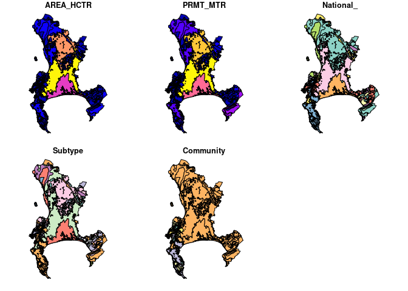
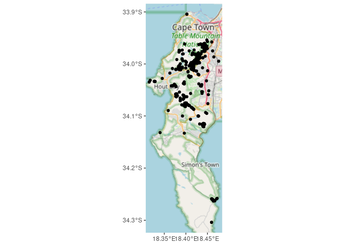
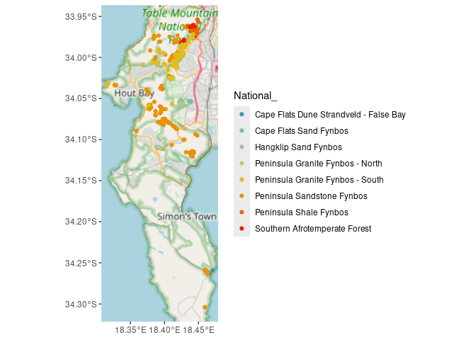

# README

Jess Devine 2025-02-27

## BIO4000W GIS Deliverable

``` r
veg <- st_read("data/cape_peninsula/cape_peninsula/veg/Vegetation_Indigenous.shp")
```

```         
## Reading layer `Vegetation_Indigenous' from data source 
##   `/home/jess/GIT/BIO4000W_GIS/data/cape_peninsula/cape_peninsula/veg/Vegetation_Indigenous.shp' 
##   using driver `ESRI Shapefile'
## Simple feature collection with 1325 features and 5 fields
## Geometry type: POLYGON
## Dimension:     XY
## Bounding box:  xmin: -63972.95 ymin: -3803535 xmax: 430.8125 ymax: -3705149
## Projected CRS: WGS_1984_Transverse_Mercator
```

``` r
#st_write(veg, "data/cape_peninsula/veg/Vegetation_Indigenous_duplicate.shp", append = FALSE)
names(veg)
```

```         
## [1] "AREA_HCTR" "PRMT_MTR"  "National_" "Subtype"   "Community" "geometry"
```

``` r
ggplot() + 
  geom_sf(data = veg, aes(fill = National_)) +
  scale_fill_viridis_d() +  # Uses a nice color scale
  theme_minimal()
```

<!-- -->

```         
## Warning: attribute variables are assumed to be spatially constant throughout
## all geometries
```

<!-- -->

``` r
# read in inat observations for Rapanea melanophloeos
rm <- get_inat_obs(taxon_name = "Rapanea melanophloeos",
                   bounds = c(-35, 18, -33.5, 18.5),
                   maxresults = 1000)
dim(rm)
```

```         
## [1] 597  37
```

``` r
# take only observations with geographic precision, southern hemisphere, has coordinates, isn't captive and is of research quality 
rm <- rm %>% filter(positional_accuracy<46 & 
                latitude<0 &
                !is.na(latitude) &
                captive_cultivated == "false" &
                quality_grade == "research")
dim(rm)
```

```         
## [1] 411  37
```

``` r
# make rm a spartial object
rm <- st_as_sf(rm, coords = c("longitude", "latitude"), crs = 4326)
```

``` r
ggplot() + 
  annotation_map_tile(type = "osm", progress = "none") + 
  geom_sf(data=rm)
```

<!-- -->

``` r
leaflet() %>%
  # Add default OpenStreetMap map tiles
  addTiles(group = "Default") %>%  
  # Add our points
  addCircleMarkers(data = rm,
                   group = "Virgilia divaricata",
                   radius = 3, 
                   color = "green") 
```

```         
## `google-chrome`, `chromium-browser` and `chrome` were not found. Try setting the `CHROMOTE_CHROME` environment variable to the executable of a Chromium-based browser, such as Google Chrome, Chromium or Brave or adding one of these executables to your PATH.

## PhantomJS not found. You can install it with webshot::install_phantomjs(). If it is installed, please make sure the phantomjs executable can be found via the PATH variable.
```

::: {#htmlwidget-786aaeadf70e8143ad82 .leaflet .html-widget .html-fill-item style="width:672px;height:480px;"}
:::

```{=html}
<script type="application/json" data-for="htmlwidget-786aaeadf70e8143ad82">{"x":{"options":{"crs":{"crsClass":"L.CRS.EPSG3857","code":null,"proj4def":null,"projectedBounds":null,"options":{}}},"calls":[{"method":"addTiles","args":["https://{s}.tile.openstreetmap.org/{z}/{x}/{y}.png",null,"Default",{"minZoom":0,"maxZoom":18,"tileSize":256,"subdomains":"abc","errorTileUrl":"","tms":false,"noWrap":false,"zoomOffset":0,"zoomReverse":false,"opacity":1,"zIndex":1,"detectRetina":false,"attribution":"&copy; <a href=\"https://openstreetmap.org/copyright/\">OpenStreetMap<\/a>,  <a href=\"https://opendatacommons.org/licenses/odbl/\">ODbL<\/a>"}]},{"method":"addCircleMarkers","args":[[-33.98131158,-33.98172023,-33.96125309,-33.96230945,-33.97520054,-33.9754149,-33.96809567,-33.96745153,-33.98149134,-34.00939571,-34.01263936,-33.9877329022,-33.9878552361,-34.26159118,-34.2610417,-34.26058453,-34.26024791,-34.26001253,-34.2598469993,-34.26051686,-34.26067293,-34.26314328,-34.26284164,-34.26259427,-34.0748055556,-33.9865186997,-34.043402276,-34.1206195,-33.9042728288,-34.02325357,-34.0776949,-33.98664221,-34.0532437212,-34.0758565441,-34.0759050334,-34.0102583333,-33.97337,-34.0677527778,-33.969505,-33.9693116667,-34.2601916667,-34.260125,-34.2611116667,-34.2625223851,-34.11616313,-33.9907138889,-33.9893142438,-33.9813283333,-33.99627914,-33.99546725,-33.9942411301,-33.97955712,-33.97908175,-33.97877202,-33.9810420099,-33.98208165,-34.08437175,-33.9844516634,-34.02352532,-34.0432466667,-34.0756025001,-34.0759916667,-33.969355,-33.9695033333,-33.996975,-34.06301913,-34.0751483847,-33.9656966667,-33.9657133333,-34.0101286301,-34.017615,-33.99919671,-33.97321619,-33.9986015499,-33.99841975,-33.96785867,-33.9679561,-34.075764427,-33.97405,-34.01066125,-34.01014639,-34.00949967,-34.11614747,-34.11433166,-34.11471237,-34.0578722222,-34.05970573,-34.00549681,-34.0278399493,-33.9940653333,-33.9940811944,-33.9958402222,-33.9973313611,-33.9965970833,-33.9808957047,-34.0091568056,-34.0006115278,-34.0038739444,-33.9625568889,-33.9616796389,-33.9617894722,-34.0757091389,-34.07579439,-34.0102246781,-34.03822614,-34.03817644,-34.0703830775,-33.98823,-33.9852064915,-33.9849196372,-34.0068857447,-34.0408816667,-34.08735,-33.9985265304,-34.0121364416,-33.9865321159,-34.09335,-34.0044567778,-34.00118057,-33.99832242,-34.0105027833,-33.9823234201,-33.97921285,-33.97994898,-33.98092329,-33.9811308299,-34.1000157,-33.9896240234,-34.010206491,-34.0111178672,-34.0092697414,-34.0580719251,-34.0622150134,-34.0795290331,-34.03905243,-34.0432125556,-34.00333272,-34.01318626,-34.0602610761,-34.03388133,-33.9633855496,-34.03350126,-34.03358464,-34.05408988,-33.98510159,-33.9850375499,-33.9699283333,-34.0232564137,-33.998945416,-34.02484382,-34.0815563699,-34.08132875,-34.07858016,-34.07016686,-34.07016686,-34.06997585,-34.0338152338,-34.0095567,-34.0090194599,-34.0116340101,-34.01118214,-33.9814849722,-33.9700333333,-33.9700283333,-33.96333,-34.261065,-34.0210144222,-34.08154612,-34.11979664,-34.12053249,-33.9987319708,-34.02278878,-33.9681620941,-34.05673279,-33.9860066667,-33.9877083333,-34.0895709722,-33.9974777117,-33.9616083333,-34.0119050408,-34.1319341166,-34.2631387109,-34.259825,-33.9896382,-33.9972086755,-33.9042351557,-33.995575492,-33.9883166667,-33.9670499349,-33.9941486281,-33.9687916667,-33.997575,-33.9673536749,-34.00553372,-34.0068574,-33.9903916667,-33.99322895,-33.99305043,-33.9859634452,-33.9577533333,-34.04082111,-34.04230961,-34.0408559,-33.9915724006,-34.00162354,-34.0000944445,-33.9793283333,-33.9841633333,-34.0381040827,-34.03767902,-34.03744155,-34.01443489,-33.97343369,-34.02410315,-34.02272015,-34.0655376111,-34.08042168,-34.01038743,-34.00256331,-34.01958928,-34.0783566,-34.03446745,-33.99664829,-33.99555661,-33.9955436899,-33.99746669,-33.9967403699,-34.01162623,-34.00995588,-34.0111927622,-34.06302357,-33.99481606,-33.9940319001,-33.99009043,-33.9997097801,-34.00281318,-34.00430855,-34.00563375,-34.00699022,-33.9874499732,-34.006388,-34.00621431,-34.00762986,-34.00786179,-34.00235484,-34.00563693,-34.00641021,-34.0590025485,-34.04248709,-34.04245153,-33.99941413,-34.00353311,-34.0703418666,-34.0787321127,-34.0816,-33.9840283333,-34.08017772,-34.10638399,-34.1203633333,-34.07521685,-34.1162364499,-34.303999,-34.30397339,-34.0136399099,-33.9875567667,-34.01064362,-34.00921562,-34.0755222222,-34.0751805556,-34.0751805556,-34.0753256963,-34.00684577,-34.2590297222,-34.075245,-34.039786,-33.9703916667,-34.25808439,-34.0420337627,-34.041611692,-33.9856647942,-33.97643125,-33.98029141,-34.0112935116,-33.975495,-33.9757783333,-34.00875497,-34.06326525,-34.05790228,-33.9791291704,-33.99157074,-33.9966464301,-34.0015387,-33.9974419444,-34.0639094444,-34.0679066667,-33.98745395,-33.98727802,-33.98515151,-34.11994184,-34.12036321,-34.00742822,-33.99717833,-34.00266753,-33.9985263,-34.009732,-33.99980373,-33.9930934444,-33.99335397,-33.99553897,-33.9968530499,-33.99743406,-34.08315442,-34.0813102301,-34.0795999,-33.9538540443,-33.9568880168,-34.2590966286,-33.9680274473,-33.988178568,-33.9880893845,-33.98815333,-34.0094835001,-33.9948798297,-33.9746515595,-33.977243,-34.2590085088,-34.04241715,-34.08156402,-34.00923681,-34.1143189,-34.1166102198,-34.00645817,-34.00448268,-33.99782129,-34.09505416,-34.02583179,-34.0382936395,-34.0110754967,-33.9749336111,-33.9947978864,-34.0108086169,-34.0103394818,-34.0324473,-34.0533819358,-33.9805633333,-34.0517063113,-33.9825866667,-33.9616194444,-33.9635212701,-34.0004089722,-34.08541798,-34.07843375,-33.99795791,-34.07628763,-34.079734,-34.0757582778,-34.1000292675,-33.9631898083,-33.96192778,-33.96134133,-33.96025417,-34.0869955671,-33.9678076096,-33.98068355,-34.00923744,-34.0424968333,-33.9628181389,-34.02323481,-33.9748611389,-34.2588888889,-34.0663705951,-34.25920902,-34.0843367714,-33.97140969,-34.0566315594,-34.0334548889,-34.033638,-34.0340537778,-34.0347633333,-34.0313606111,-33.9970966667,-33.9848467196,-33.97188793,-33.9791741409,-34.0098211667,-34.1002855,-34.02073942,-33.9929959,-33.9807413901,-33.9895876078,-34.07899179,-33.97376444,-34.0816438889,-34.05761746,-34.0577674799,-34.05804854,-34.10014512,-34.1001,-33.9609010901,-34.07045734,-34.1329831,-34.01543393,-34.0137628601,-34.00328971,-33.9839,-33.9868,-33.99615044,-34.04242868,-34.115346,-34.06111,-34.116],[18.42097895,18.42229158,18.44222683,18.44209469,18.44121603,18.44114394,18.44104002,18.44155556,18.42134069,18.4145080901,18.41853458,18.4278443735,18.4278730396,18.46371816,18.46295568,18.46220545,18.4619144199,18.46156209,18.4614249771,18.4618811,18.46223565,18.4638889,18.46649167,18.46679739,18.3993166667,18.4301971737,18.3771854919,18.4411966667,18.4024201459,18.40671568,18.4034974594,18.4293649618,18.4367334028,18.4001964983,18.4002042096,18.4174833333,18.4442316667,18.393625,18.4465116667,18.445995,18.46153,18.46152,18.4627383333,18.4669010726,18.44310209,18.3910611111,18.4242376191,18.4200466667,18.42954125,18.42793886,18.4276988099,18.4294192199,18.42894729,18.4287263699,18.42650415,18.4248185101,18.41441648,18.426133437,18.40651976,18.37695,18.3999580105,18.40067,18.44605,18.44653,18.4307861111,18.39946296,18.4010791348,18.4484783333,18.4485166667,18.41666844,18.3629366667,18.41121946,18.41904152,18.41289567,18.4133359901,18.43797049,18.43903099,18.3999549318,18.4438033333,18.41764204,18.41649102,18.41706775,18.44318469,18.44051619,18.44276265,18.3771277778,18.39333003,18.38294584,18.3453333378,18.4280095556,18.4281123333,18.4269165278,18.4271592778,18.4280056944,18.3922974401,18.4123961389,18.4105311111,18.4076163889,18.4357122778,18.4339070278,18.4338899167,18.400345,18.3999244199,18.4170319558,18.39625097,18.39634119,18.3870244213,18.4331,18.4447909366,18.4298138361,18.3875389457,18.374995,18.4180666667,18.4267642815,18.4185681046,18.4646913922,18.44563,18.41345225,18.4156133699,18.41776188,18.4137383333,18.41403212,18.41578426,18.41763453,18.41957408,18.41991511,18.3920985,18.4301738739,18.4127490124,18.4183054324,18.4147380106,18.3762456696,18.3764384893,18.4063509107,18.37334046,18.3770578333,18.41019805,18.45026711,18.3950320211,18.32871459,18.4445786618,18.32665591,18.32764138,18.3851349,18.42683551,18.4301037738,18.4483866667,18.4068513103,18.4239171166,18.40764313,18.39851116,18.39773582,18.39058665,18.3870416,18.3870416,18.38693915,18.3288991079,18.41697346,18.4126735499,18.41739198,18.41825535,18.4209669528,18.4476516667,18.4476383333,18.4448,18.4630459722,18.4300000314,18.39900798,18.43952605,18.44120938,18.4270355199,18.40726363,18.4461002916,18.41090188,18.427745,18.4270583333,18.3592089722,18.4120521503,18.4342116667,18.4188020461,18.340249043,18.4636262177,18.4613566667,18.43019467,18.4189816092,18.4021908626,18.4179239758,18.4291166667,18.4423565703,18.427868939,18.44769,18.42405,18.4434109338,18.4154457799,18.41731384,18.427655,18.42675578,18.42730468,18.4306849321,18.4599083333,18.3749673,18.36637455,18.37485497,18.4225340188,18.40983398,18.4108883333,18.4289333333,18.4306033333,18.3956184104,18.3945441199,18.39429039,18.40515025,18.39158292,18.4121133899,18.40679623,18.3868563889,18.3962634999,18.41376201,18.4090286499,18.4280252101,18.40481674,18.39616626,18.42804264,18.41769137,18.41760506,18.4164156399,18.41651471,18.41706333,18.41721843,18.3880938157,18.40220965,18.39908165,18.39288346,18.39123085,18.38705512,18.38503564,18.3831645,18.3830165801,18.38742871,18.4298948407,18.3910150801,18.39181055,18.39236445,18.3998040499,18.41864721,18.41508563,18.41689317,18.4520568419,18.43556461,18.43390298,18.41094571,18.40810035,18.386974968,18.393381089,18.3989533333,18.4244583333,18.4084386,18.4106900501,18.4413433333,18.40096108,18.43750396,18.4594644301,18.45944556,18.42475288,18.4303017667,18.41757642,18.41289017,18.4001472222,18.4010111111,18.4009888889,18.397286547,18.41729809,18.4600313889,18.400955,18.43686,18.4496633333,18.47232241,18.3697371651,18.368909955,18.4254891425,18.43706567,18.43519832,18.3873315262,18.4440083333,18.4433216667,18.3688171,18.37797808,18.37770151,18.41560745,18.3790224399,18.40121619,18.40025284,18.4167738889,18.3953163889,18.3936452778,18.4301976799,18.42760524,18.43009904,18.43973414,18.4412836999,18.43858127,18.42121167,18.4088835899,18.41320765,18.412527,18.41102672,18.4200649444,18.42000413,18.4175114,18.4153921701,18.4157796,18.4123579501,18.39765762,18.4066732499,18.4485392944,18.4498421121,18.4600500789,18.4476190655,18.4394915309,18.4390173666,18.43898333,18.41507352,18.4281072812,18.3859431558,18.3840887222,18.4710310135,18.43577715,18.3986989,18.41344568,18.44042464,18.43856014,18.41826866,18.4140862301,18.4204602,18.44836134,18.40902155,18.4300101089,18.3847296238,18.4619064167,18.4758951535,18.3767836634,18.3765324578,18.4476643,18.4382341765,18.4299866667,18.4529624227,18.42829,18.3970888889,18.43824601,18.4106970278,18.41598707,18.4047616,18.43166448,18.45093631,18.407105,18.4003231581,18.4289949427,18.4377741792,18.43422164,18.44177302,18.4433501401,18.4182764262,18.4447446373,18.3938044599,18.41596174,18.4357217222,18.4295253611,18.4068153,18.4076614167,18.4597222222,18.3950626667,18.4602411599,18.4144212131,18.4463736177,18.4374045137,18.3281535833,18.3276958333,18.3273658611,18.3151378611,18.3174705278,18.4308866667,18.4296892304,18.44234058,18.4155874327,18.380209891,18.42947185,18.4296997,18.42030033,18.41862454,18.4302265942,18.39398635,18.3842824,18.3988569444,18.3793354399,18.37760613,18.37639073,18.4282683301,18.4282,18.44181776,18.38698075,18.3963932,18.40486556,18.42393172,18.41011746,18.4325,18.4292,18.42793465,18.43570316,18.431902,18.38046,18.4369],3,null,"Virgilia divaricata",{"interactive":true,"className":"","stroke":true,"color":"green","weight":5,"opacity":0.5,"fill":true,"fillColor":"green","fillOpacity":0.2},null,null,null,null,null,{"interactive":false,"permanent":false,"direction":"auto","opacity":1,"offset":[0,0],"textsize":"10px","textOnly":false,"className":"","sticky":true},null]}],"limits":{"lat":[-34.303999,-33.9042351557],"lng":[18.3151378611,18.4758951535]}},"evals":[],"jsHooks":[]}</script>
```

``` r
mapview(rm, 
        popup = 
          popupTable(rm,
            zcol = c("user_login", "captive_cultivated", "url")))
```

::: {#htmlwidget-e838ad427aaa85047c6c .leaflet .html-widget .html-fill-item style="width:672px;height:480px;"}
:::

```{=html}
<script type="application/json" data-for="htmlwidget-e838ad427aaa85047c6c">{"x":{"options":{"minZoom":1,"maxZoom":52,"crs":{"crsClass":"L.CRS.EPSG3857","code":null,"proj4def":null,"projectedBounds":null,"options":{}},"preferCanvas":false,"bounceAtZoomLimits":false,"maxBounds":[[[-90,-370]],[[90,370]]]},"calls":[{"method":"addProviderTiles","args":["CartoDB.Positron","CartoDB.Positron","CartoDB.Positron",{"errorTileUrl":"","noWrap":false,"detectRetina":false,"pane":"tilePane"}]},{"method":"addProviderTiles","args":["CartoDB.DarkMatter","CartoDB.DarkMatter","CartoDB.DarkMatter",{"errorTileUrl":"","noWrap":false,"detectRetina":false,"pane":"tilePane"}]},{"method":"addProviderTiles","args":["OpenStreetMap","OpenStreetMap","OpenStreetMap",{"errorTileUrl":"","noWrap":false,"detectRetina":false,"pane":"tilePane"}]},{"method":"addProviderTiles","args":["Esri.WorldImagery","Esri.WorldImagery","Esri.WorldImagery",{"errorTileUrl":"","noWrap":false,"detectRetina":false,"pane":"tilePane"}]},{"method":"addProviderTiles","args":["OpenTopoMap","OpenTopoMap","OpenTopoMap",{"errorTileUrl":"","noWrap":false,"detectRetina":false,"pane":"tilePane"}]},{"method":"createMapPane","args":["point",440]},{"method":"addCircleMarkers","args":[[-33.98131158,-33.98172023,-33.96125309,-33.96230945,-33.97520054,-33.9754149,-33.96809567,-33.96745153,-33.98149134,-34.00939571,-34.01263936,-33.9877329022,-33.9878552361,-34.26159118,-34.2610417,-34.26058453,-34.26024791,-34.26001253,-34.2598469993,-34.26051686,-34.26067293,-34.26314328,-34.26284164,-34.26259427,-34.0748055556,-33.9865186997,-34.043402276,-34.1206195,-33.9042728288,-34.02325357,-34.0776949,-33.98664221,-34.0532437212,-34.0758565441,-34.0759050334,-34.0102583333,-33.97337,-34.0677527778,-33.969505,-33.9693116667,-34.2601916667,-34.260125,-34.2611116667,-34.2625223851,-34.11616313,-33.9907138889,-33.9893142438,-33.9813283333,-33.99627914,-33.99546725,-33.9942411301,-33.97955712,-33.97908175,-33.97877202,-33.9810420099,-33.98208165,-34.08437175,-33.9844516634,-34.02352532,-34.0432466667,-34.0756025001,-34.0759916667,-33.969355,-33.9695033333,-33.996975,-34.06301913,-34.0751483847,-33.9656966667,-33.9657133333,-34.0101286301,-34.017615,-33.99919671,-33.97321619,-33.9986015499,-33.99841975,-33.96785867,-33.9679561,-34.075764427,-33.97405,-34.01066125,-34.01014639,-34.00949967,-34.11614747,-34.11433166,-34.11471237,-34.0578722222,-34.05970573,-34.00549681,-34.0278399493,-33.9940653333,-33.9940811944,-33.9958402222,-33.9973313611,-33.9965970833,-33.9808957047,-34.0091568056,-34.0006115278,-34.0038739444,-33.9625568889,-33.9616796389,-33.9617894722,-34.0757091389,-34.07579439,-34.0102246781,-34.03822614,-34.03817644,-34.0703830775,-33.98823,-33.9852064915,-33.9849196372,-34.0068857447,-34.0408816667,-34.08735,-33.9985265304,-34.0121364416,-33.9865321159,-34.09335,-34.0044567778,-34.00118057,-33.99832242,-34.0105027833,-33.9823234201,-33.97921285,-33.97994898,-33.98092329,-33.9811308299,-34.1000157,-33.9896240234,-34.010206491,-34.0111178672,-34.0092697414,-34.0580719251,-34.0622150134,-34.0795290331,-34.03905243,-34.0432125556,-34.00333272,-34.01318626,-34.0602610761,-34.03388133,-33.9633855496,-34.03350126,-34.03358464,-34.05408988,-33.98510159,-33.9850375499,-33.9699283333,-34.0232564137,-33.998945416,-34.02484382,-34.0815563699,-34.08132875,-34.07858016,-34.07016686,-34.07016686,-34.06997585,-34.0338152338,-34.0095567,-34.0090194599,-34.0116340101,-34.01118214,-33.9814849722,-33.9700333333,-33.9700283333,-33.96333,-34.261065,-34.0210144222,-34.08154612,-34.11979664,-34.12053249,-33.9987319708,-34.02278878,-33.9681620941,-34.05673279,-33.9860066667,-33.9877083333,-34.0895709722,-33.9974777117,-33.9616083333,-34.0119050408,-34.1319341166,-34.2631387109,-34.259825,-33.9896382,-33.9972086755,-33.9042351557,-33.995575492,-33.9883166667,-33.9670499349,-33.9941486281,-33.9687916667,-33.997575,-33.9673536749,-34.00553372,-34.0068574,-33.9903916667,-33.99322895,-33.99305043,-33.9859634452,-33.9577533333,-34.04082111,-34.04230961,-34.0408559,-33.9915724006,-34.00162354,-34.0000944445,-33.9793283333,-33.9841633333,-34.0381040827,-34.03767902,-34.03744155,-34.01443489,-33.97343369,-34.02410315,-34.02272015,-34.0655376111,-34.08042168,-34.01038743,-34.00256331,-34.01958928,-34.0783566,-34.03446745,-33.99664829,-33.99555661,-33.9955436899,-33.99746669,-33.9967403699,-34.01162623,-34.00995588,-34.0111927622,-34.06302357,-33.99481606,-33.9940319001,-33.99009043,-33.9997097801,-34.00281318,-34.00430855,-34.00563375,-34.00699022,-33.9874499732,-34.006388,-34.00621431,-34.00762986,-34.00786179,-34.00235484,-34.00563693,-34.00641021,-34.0590025485,-34.04248709,-34.04245153,-33.99941413,-34.00353311,-34.0703418666,-34.0787321127,-34.0816,-33.9840283333,-34.08017772,-34.10638399,-34.1203633333,-34.07521685,-34.1162364499,-34.303999,-34.30397339,-34.0136399099,-33.9875567667,-34.01064362,-34.00921562,-34.0755222222,-34.0751805556,-34.0751805556,-34.0753256963,-34.00684577,-34.2590297222,-34.075245,-34.039786,-33.9703916667,-34.25808439,-34.0420337627,-34.041611692,-33.9856647942,-33.97643125,-33.98029141,-34.0112935116,-33.975495,-33.9757783333,-34.00875497,-34.06326525,-34.05790228,-33.9791291704,-33.99157074,-33.9966464301,-34.0015387,-33.9974419444,-34.0639094444,-34.0679066667,-33.98745395,-33.98727802,-33.98515151,-34.11994184,-34.12036321,-34.00742822,-33.99717833,-34.00266753,-33.9985263,-34.009732,-33.99980373,-33.9930934444,-33.99335397,-33.99553897,-33.9968530499,-33.99743406,-34.08315442,-34.0813102301,-34.0795999,-33.9538540443,-33.9568880168,-34.2590966286,-33.9680274473,-33.988178568,-33.9880893845,-33.98815333,-34.0094835001,-33.9948798297,-33.9746515595,-33.977243,-34.2590085088,-34.04241715,-34.08156402,-34.00923681,-34.1143189,-34.1166102198,-34.00645817,-34.00448268,-33.99782129,-34.09505416,-34.02583179,-34.0382936395,-34.0110754967,-33.9749336111,-33.9947978864,-34.0108086169,-34.0103394818,-34.0324473,-34.0533819358,-33.9805633333,-34.0517063113,-33.9825866667,-33.9616194444,-33.9635212701,-34.0004089722,-34.08541798,-34.07843375,-33.99795791,-34.07628763,-34.079734,-34.0757582778,-34.1000292675,-33.9631898083,-33.96192778,-33.96134133,-33.96025417,-34.0869955671,-33.9678076096,-33.98068355,-34.00923744,-34.0424968333,-33.9628181389,-34.02323481,-33.9748611389,-34.2588888889,-34.0663705951,-34.25920902,-34.0843367714,-33.97140969,-34.0566315594,-34.0334548889,-34.033638,-34.0340537778,-34.0347633333,-34.0313606111,-33.9970966667,-33.9848467196,-33.97188793,-33.9791741409,-34.0098211667,-34.1002855,-34.02073942,-33.9929959,-33.9807413901,-33.9895876078,-34.07899179,-33.97376444,-34.0816438889,-34.05761746,-34.0577674799,-34.05804854,-34.10014512,-34.1001,-33.9609010901,-34.07045734,-34.1329831,-34.01543393,-34.0137628601,-34.00328971,-33.9839,-33.9868,-33.99615044,-34.04242868,-34.115346,-34.06111,-34.116],[18.42097895,18.42229158,18.44222683,18.44209469,18.44121603,18.44114394,18.44104002,18.44155556,18.42134069,18.4145080901,18.41853458,18.4278443735,18.4278730396,18.46371816,18.46295568,18.46220545,18.4619144199,18.46156209,18.4614249771,18.4618811,18.46223565,18.4638889,18.46649167,18.46679739,18.3993166667,18.4301971737,18.3771854919,18.4411966667,18.4024201459,18.40671568,18.4034974594,18.4293649618,18.4367334028,18.4001964983,18.4002042096,18.4174833333,18.4442316667,18.393625,18.4465116667,18.445995,18.46153,18.46152,18.4627383333,18.4669010726,18.44310209,18.3910611111,18.4242376191,18.4200466667,18.42954125,18.42793886,18.4276988099,18.4294192199,18.42894729,18.4287263699,18.42650415,18.4248185101,18.41441648,18.426133437,18.40651976,18.37695,18.3999580105,18.40067,18.44605,18.44653,18.4307861111,18.39946296,18.4010791348,18.4484783333,18.4485166667,18.41666844,18.3629366667,18.41121946,18.41904152,18.41289567,18.4133359901,18.43797049,18.43903099,18.3999549318,18.4438033333,18.41764204,18.41649102,18.41706775,18.44318469,18.44051619,18.44276265,18.3771277778,18.39333003,18.38294584,18.3453333378,18.4280095556,18.4281123333,18.4269165278,18.4271592778,18.4280056944,18.3922974401,18.4123961389,18.4105311111,18.4076163889,18.4357122778,18.4339070278,18.4338899167,18.400345,18.3999244199,18.4170319558,18.39625097,18.39634119,18.3870244213,18.4331,18.4447909366,18.4298138361,18.3875389457,18.374995,18.4180666667,18.4267642815,18.4185681046,18.4646913922,18.44563,18.41345225,18.4156133699,18.41776188,18.4137383333,18.41403212,18.41578426,18.41763453,18.41957408,18.41991511,18.3920985,18.4301738739,18.4127490124,18.4183054324,18.4147380106,18.3762456696,18.3764384893,18.4063509107,18.37334046,18.3770578333,18.41019805,18.45026711,18.3950320211,18.32871459,18.4445786618,18.32665591,18.32764138,18.3851349,18.42683551,18.4301037738,18.4483866667,18.4068513103,18.4239171166,18.40764313,18.39851116,18.39773582,18.39058665,18.3870416,18.3870416,18.38693915,18.3288991079,18.41697346,18.4126735499,18.41739198,18.41825535,18.4209669528,18.4476516667,18.4476383333,18.4448,18.4630459722,18.4300000314,18.39900798,18.43952605,18.44120938,18.4270355199,18.40726363,18.4461002916,18.41090188,18.427745,18.4270583333,18.3592089722,18.4120521503,18.4342116667,18.4188020461,18.340249043,18.4636262177,18.4613566667,18.43019467,18.4189816092,18.4021908626,18.4179239758,18.4291166667,18.4423565703,18.427868939,18.44769,18.42405,18.4434109338,18.4154457799,18.41731384,18.427655,18.42675578,18.42730468,18.4306849321,18.4599083333,18.3749673,18.36637455,18.37485497,18.4225340188,18.40983398,18.4108883333,18.4289333333,18.4306033333,18.3956184104,18.3945441199,18.39429039,18.40515025,18.39158292,18.4121133899,18.40679623,18.3868563889,18.3962634999,18.41376201,18.4090286499,18.4280252101,18.40481674,18.39616626,18.42804264,18.41769137,18.41760506,18.4164156399,18.41651471,18.41706333,18.41721843,18.3880938157,18.40220965,18.39908165,18.39288346,18.39123085,18.38705512,18.38503564,18.3831645,18.3830165801,18.38742871,18.4298948407,18.3910150801,18.39181055,18.39236445,18.3998040499,18.41864721,18.41508563,18.41689317,18.4520568419,18.43556461,18.43390298,18.41094571,18.40810035,18.386974968,18.393381089,18.3989533333,18.4244583333,18.4084386,18.4106900501,18.4413433333,18.40096108,18.43750396,18.4594644301,18.45944556,18.42475288,18.4303017667,18.41757642,18.41289017,18.4001472222,18.4010111111,18.4009888889,18.397286547,18.41729809,18.4600313889,18.400955,18.43686,18.4496633333,18.47232241,18.3697371651,18.368909955,18.4254891425,18.43706567,18.43519832,18.3873315262,18.4440083333,18.4433216667,18.3688171,18.37797808,18.37770151,18.41560745,18.3790224399,18.40121619,18.40025284,18.4167738889,18.3953163889,18.3936452778,18.4301976799,18.42760524,18.43009904,18.43973414,18.4412836999,18.43858127,18.42121167,18.4088835899,18.41320765,18.412527,18.41102672,18.4200649444,18.42000413,18.4175114,18.4153921701,18.4157796,18.4123579501,18.39765762,18.4066732499,18.4485392944,18.4498421121,18.4600500789,18.4476190655,18.4394915309,18.4390173666,18.43898333,18.41507352,18.4281072812,18.3859431558,18.3840887222,18.4710310135,18.43577715,18.3986989,18.41344568,18.44042464,18.43856014,18.41826866,18.4140862301,18.4204602,18.44836134,18.40902155,18.4300101089,18.3847296238,18.4619064167,18.4758951535,18.3767836634,18.3765324578,18.4476643,18.4382341765,18.4299866667,18.4529624227,18.42829,18.3970888889,18.43824601,18.4106970278,18.41598707,18.4047616,18.43166448,18.45093631,18.407105,18.4003231581,18.4289949427,18.4377741792,18.43422164,18.44177302,18.4433501401,18.4182764262,18.4447446373,18.3938044599,18.41596174,18.4357217222,18.4295253611,18.4068153,18.4076614167,18.4597222222,18.3950626667,18.4602411599,18.4144212131,18.4463736177,18.4374045137,18.3281535833,18.3276958333,18.3273658611,18.3151378611,18.3174705278,18.4308866667,18.4296892304,18.44234058,18.4155874327,18.380209891,18.42947185,18.4296997,18.42030033,18.41862454,18.4302265942,18.39398635,18.3842824,18.3988569444,18.3793354399,18.37760613,18.37639073,18.4282683301,18.4282,18.44181776,18.38698075,18.3963932,18.40486556,18.42393172,18.41011746,18.4325,18.4292,18.42793465,18.43570316,18.431902,18.38046,18.4369],6,null,"rm",{"crs":{"crsClass":"L.CRS.EPSG3857","code":null,"proj4def":null,"projectedBounds":null,"options":{}},"pane":"point","stroke":true,"color":"#333333","weight":1,"opacity":0.9,"fill":true,"fillColor":"#6666FF","fillOpacity":0.6},null,null,["<div class='scrollableContainer'><table class= id='popup'><tr class='coord'><td><\/td><th><b>Feature ID&emsp;<\/b><\/th><td>1&emsp;<\/td><\/tr><tr><td>1<\/td><th>user_login&emsp;<\/th><td>tonyrebelo&emsp;<\/td><\/tr><tr><td>2<\/td><th>captive_cultivated&emsp;<\/th><td>false&emsp;<\/td><\/tr><tr><td>3<\/td><th>url&emsp;<\/th><td>https://www.inaturalist.org/observations/260199469&emsp;<\/td><\/tr><\/table><\/div>","<div class='scrollableContainer'><table class= id='popup'><tr class='coord'><td><\/td><th><b>Feature ID&emsp;<\/b><\/th><td>2&emsp;<\/td><\/tr><tr><td>1<\/td><th>user_login&emsp;<\/th><td>tonyrebelo&emsp;<\/td><\/tr><tr><td>2<\/td><th>captive_cultivated&emsp;<\/th><td>false&emsp;<\/td><\/tr><tr><td>3<\/td><th>url&emsp;<\/th><td>https://www.inaturalist.org/observations/260199455&emsp;<\/td><\/tr><\/table><\/div>","<div class='scrollableContainer'><table class= id='popup'><tr class='coord'><td><\/td><th><b>Feature ID&emsp;<\/b><\/th><td>3&emsp;<\/td><\/tr><tr><td>1<\/td><th>user_login&emsp;<\/th><td>tonyrebelo&emsp;<\/td><\/tr><tr><td>2<\/td><th>captive_cultivated&emsp;<\/th><td>false&emsp;<\/td><\/tr><tr><td>3<\/td><th>url&emsp;<\/th><td>https://www.inaturalist.org/observations/258496010&emsp;<\/td><\/tr><\/table><\/div>","<div class='scrollableContainer'><table class= id='popup'><tr class='coord'><td><\/td><th><b>Feature ID&emsp;<\/b><\/th><td>4&emsp;<\/td><\/tr><tr><td>1<\/td><th>user_login&emsp;<\/th><td>tonyrebelo&emsp;<\/td><\/tr><tr><td>2<\/td><th>captive_cultivated&emsp;<\/th><td>false&emsp;<\/td><\/tr><tr><td>3<\/td><th>url&emsp;<\/th><td>https://www.inaturalist.org/observations/258403863&emsp;<\/td><\/tr><\/table><\/div>","<div class='scrollableContainer'><table class= id='popup'><tr class='coord'><td><\/td><th><b>Feature ID&emsp;<\/b><\/th><td>5&emsp;<\/td><\/tr><tr><td>1<\/td><th>user_login&emsp;<\/th><td>tonyrebelo&emsp;<\/td><\/tr><tr><td>2<\/td><th>captive_cultivated&emsp;<\/th><td>false&emsp;<\/td><\/tr><tr><td>3<\/td><th>url&emsp;<\/th><td>https://www.inaturalist.org/observations/255162639&emsp;<\/td><\/tr><\/table><\/div>","<div class='scrollableContainer'><table class= id='popup'><tr class='coord'><td><\/td><th><b>Feature ID&emsp;<\/b><\/th><td>6&emsp;<\/td><\/tr><tr><td>1<\/td><th>user_login&emsp;<\/th><td>tonyrebelo&emsp;<\/td><\/tr><tr><td>2<\/td><th>captive_cultivated&emsp;<\/th><td>false&emsp;<\/td><\/tr><tr><td>3<\/td><th>url&emsp;<\/th><td>https://www.inaturalist.org/observations/255162634&emsp;<\/td><\/tr><\/table><\/div>","<div class='scrollableContainer'><table class= id='popup'><tr class='coord'><td><\/td><th><b>Feature ID&emsp;<\/b><\/th><td>7&emsp;<\/td><\/tr><tr><td>1<\/td><th>user_login&emsp;<\/th><td>tonyrebelo&emsp;<\/td><\/tr><tr><td>2<\/td><th>captive_cultivated&emsp;<\/th><td>false&emsp;<\/td><\/tr><tr><td>3<\/td><th>url&emsp;<\/th><td>https://www.inaturalist.org/observations/254899386&emsp;<\/td><\/tr><\/table><\/div>","<div class='scrollableContainer'><table class= id='popup'><tr class='coord'><td><\/td><th><b>Feature ID&emsp;<\/b><\/th><td>8&emsp;<\/td><\/tr><tr><td>1<\/td><th>user_login&emsp;<\/th><td>tonyrebelo&emsp;<\/td><\/tr><tr><td>2<\/td><th>captive_cultivated&emsp;<\/th><td>false&emsp;<\/td><\/tr><tr><td>3<\/td><th>url&emsp;<\/th><td>https://www.inaturalist.org/observations/254899321&emsp;<\/td><\/tr><\/table><\/div>","<div class='scrollableContainer'><table class= id='popup'><tr class='coord'><td><\/td><th><b>Feature ID&emsp;<\/b><\/th><td>9&emsp;<\/td><\/tr><tr><td>1<\/td><th>user_login&emsp;<\/th><td>tonyrebelo&emsp;<\/td><\/tr><tr><td>2<\/td><th>captive_cultivated&emsp;<\/th><td>false&emsp;<\/td><\/tr><tr><td>3<\/td><th>url&emsp;<\/th><td>https://www.inaturalist.org/observations/249798418&emsp;<\/td><\/tr><\/table><\/div>","<div class='scrollableContainer'><table class= id='popup'><tr class='coord'><td><\/td><th><b>Feature ID&emsp;<\/b><\/th><td>10&emsp;<\/td><\/tr><tr><td>1<\/td><th>user_login&emsp;<\/th><td>tonyrebelo&emsp;<\/td><\/tr><tr><td>2<\/td><th>captive_cultivated&emsp;<\/th><td>false&emsp;<\/td><\/tr><tr><td>3<\/td><th>url&emsp;<\/th><td>https://www.inaturalist.org/observations/248806933&emsp;<\/td><\/tr><\/table><\/div>","<div class='scrollableContainer'><table class= id='popup'><tr class='coord'><td><\/td><th><b>Feature ID&emsp;<\/b><\/th><td>11&emsp;<\/td><\/tr><tr><td>1<\/td><th>user_login&emsp;<\/th><td>tonyrebelo&emsp;<\/td><\/tr><tr><td>2<\/td><th>captive_cultivated&emsp;<\/th><td>false&emsp;<\/td><\/tr><tr><td>3<\/td><th>url&emsp;<\/th><td>https://www.inaturalist.org/observations/248806722&emsp;<\/td><\/tr><\/table><\/div>","<div class='scrollableContainer'><table class= id='popup'><tr class='coord'><td><\/td><th><b>Feature ID&emsp;<\/b><\/th><td>12&emsp;<\/td><\/tr><tr><td>1<\/td><th>user_login&emsp;<\/th><td>elliotgreiner&emsp;<\/td><\/tr><tr><td>2<\/td><th>captive_cultivated&emsp;<\/th><td>false&emsp;<\/td><\/tr><tr><td>3<\/td><th>url&emsp;<\/th><td>https://www.inaturalist.org/observations/248433111&emsp;<\/td><\/tr><\/table><\/div>","<div class='scrollableContainer'><table class= id='popup'><tr class='coord'><td><\/td><th><b>Feature ID&emsp;<\/b><\/th><td>13&emsp;<\/td><\/tr><tr><td>1<\/td><th>user_login&emsp;<\/th><td>elliotgreiner&emsp;<\/td><\/tr><tr><td>2<\/td><th>captive_cultivated&emsp;<\/th><td>false&emsp;<\/td><\/tr><tr><td>3<\/td><th>url&emsp;<\/th><td>https://www.inaturalist.org/observations/248432564&emsp;<\/td><\/tr><\/table><\/div>","<div class='scrollableContainer'><table class= id='popup'><tr class='coord'><td><\/td><th><b>Feature ID&emsp;<\/b><\/th><td>14&emsp;<\/td><\/tr><tr><td>1<\/td><th>user_login&emsp;<\/th><td>tonyrebelo&emsp;<\/td><\/tr><tr><td>2<\/td><th>captive_cultivated&emsp;<\/th><td>false&emsp;<\/td><\/tr><tr><td>3<\/td><th>url&emsp;<\/th><td>https://www.inaturalist.org/observations/243775076&emsp;<\/td><\/tr><\/table><\/div>","<div class='scrollableContainer'><table class= id='popup'><tr class='coord'><td><\/td><th><b>Feature ID&emsp;<\/b><\/th><td>15&emsp;<\/td><\/tr><tr><td>1<\/td><th>user_login&emsp;<\/th><td>tonyrebelo&emsp;<\/td><\/tr><tr><td>2<\/td><th>captive_cultivated&emsp;<\/th><td>false&emsp;<\/td><\/tr><tr><td>3<\/td><th>url&emsp;<\/th><td>https://www.inaturalist.org/observations/243774994&emsp;<\/td><\/tr><\/table><\/div>","<div class='scrollableContainer'><table class= id='popup'><tr class='coord'><td><\/td><th><b>Feature ID&emsp;<\/b><\/th><td>16&emsp;<\/td><\/tr><tr><td>1<\/td><th>user_login&emsp;<\/th><td>tonyrebelo&emsp;<\/td><\/tr><tr><td>2<\/td><th>captive_cultivated&emsp;<\/th><td>false&emsp;<\/td><\/tr><tr><td>3<\/td><th>url&emsp;<\/th><td>https://www.inaturalist.org/observations/243774968&emsp;<\/td><\/tr><\/table><\/div>","<div class='scrollableContainer'><table class= id='popup'><tr class='coord'><td><\/td><th><b>Feature ID&emsp;<\/b><\/th><td>17&emsp;<\/td><\/tr><tr><td>1<\/td><th>user_login&emsp;<\/th><td>tonyrebelo&emsp;<\/td><\/tr><tr><td>2<\/td><th>captive_cultivated&emsp;<\/th><td>false&emsp;<\/td><\/tr><tr><td>3<\/td><th>url&emsp;<\/th><td>https://www.inaturalist.org/observations/243774959&emsp;<\/td><\/tr><\/table><\/div>","<div class='scrollableContainer'><table class= id='popup'><tr class='coord'><td><\/td><th><b>Feature ID&emsp;<\/b><\/th><td>18&emsp;<\/td><\/tr><tr><td>1<\/td><th>user_login&emsp;<\/th><td>tonyrebelo&emsp;<\/td><\/tr><tr><td>2<\/td><th>captive_cultivated&emsp;<\/th><td>false&emsp;<\/td><\/tr><tr><td>3<\/td><th>url&emsp;<\/th><td>https://www.inaturalist.org/observations/243774950&emsp;<\/td><\/tr><\/table><\/div>","<div class='scrollableContainer'><table class= id='popup'><tr class='coord'><td><\/td><th><b>Feature ID&emsp;<\/b><\/th><td>19&emsp;<\/td><\/tr><tr><td>1<\/td><th>user_login&emsp;<\/th><td>tonyrebelo&emsp;<\/td><\/tr><tr><td>2<\/td><th>captive_cultivated&emsp;<\/th><td>false&emsp;<\/td><\/tr><tr><td>3<\/td><th>url&emsp;<\/th><td>https://www.inaturalist.org/observations/243774944&emsp;<\/td><\/tr><\/table><\/div>","<div class='scrollableContainer'><table class= id='popup'><tr class='coord'><td><\/td><th><b>Feature ID&emsp;<\/b><\/th><td>20&emsp;<\/td><\/tr><tr><td>1<\/td><th>user_login&emsp;<\/th><td>tonyrebelo&emsp;<\/td><\/tr><tr><td>2<\/td><th>captive_cultivated&emsp;<\/th><td>false&emsp;<\/td><\/tr><tr><td>3<\/td><th>url&emsp;<\/th><td>https://www.inaturalist.org/observations/243774899&emsp;<\/td><\/tr><\/table><\/div>","<div class='scrollableContainer'><table class= id='popup'><tr class='coord'><td><\/td><th><b>Feature ID&emsp;<\/b><\/th><td>21&emsp;<\/td><\/tr><tr><td>1<\/td><th>user_login&emsp;<\/th><td>tonyrebelo&emsp;<\/td><\/tr><tr><td>2<\/td><th>captive_cultivated&emsp;<\/th><td>false&emsp;<\/td><\/tr><tr><td>3<\/td><th>url&emsp;<\/th><td>https://www.inaturalist.org/observations/243774880&emsp;<\/td><\/tr><\/table><\/div>","<div class='scrollableContainer'><table class= id='popup'><tr class='coord'><td><\/td><th><b>Feature ID&emsp;<\/b><\/th><td>22&emsp;<\/td><\/tr><tr><td>1<\/td><th>user_login&emsp;<\/th><td>tonyrebelo&emsp;<\/td><\/tr><tr><td>2<\/td><th>captive_cultivated&emsp;<\/th><td>false&emsp;<\/td><\/tr><tr><td>3<\/td><th>url&emsp;<\/th><td>https://www.inaturalist.org/observations/243678043&emsp;<\/td><\/tr><\/table><\/div>","<div class='scrollableContainer'><table class= id='popup'><tr class='coord'><td><\/td><th><b>Feature ID&emsp;<\/b><\/th><td>23&emsp;<\/td><\/tr><tr><td>1<\/td><th>user_login&emsp;<\/th><td>tonyrebelo&emsp;<\/td><\/tr><tr><td>2<\/td><th>captive_cultivated&emsp;<\/th><td>false&emsp;<\/td><\/tr><tr><td>3<\/td><th>url&emsp;<\/th><td>https://www.inaturalist.org/observations/243668375&emsp;<\/td><\/tr><\/table><\/div>","<div class='scrollableContainer'><table class= id='popup'><tr class='coord'><td><\/td><th><b>Feature ID&emsp;<\/b><\/th><td>24&emsp;<\/td><\/tr><tr><td>1<\/td><th>user_login&emsp;<\/th><td>tonyrebelo&emsp;<\/td><\/tr><tr><td>2<\/td><th>captive_cultivated&emsp;<\/th><td>false&emsp;<\/td><\/tr><tr><td>3<\/td><th>url&emsp;<\/th><td>https://www.inaturalist.org/observations/243668294&emsp;<\/td><\/tr><\/table><\/div>","<div class='scrollableContainer'><table class= id='popup'><tr class='coord'><td><\/td><th><b>Feature ID&emsp;<\/b><\/th><td>25&emsp;<\/td><\/tr><tr><td>1<\/td><th>user_login&emsp;<\/th><td>cmerry&emsp;<\/td><\/tr><tr><td>2<\/td><th>captive_cultivated&emsp;<\/th><td>false&emsp;<\/td><\/tr><tr><td>3<\/td><th>url&emsp;<\/th><td>https://www.inaturalist.org/observations/243329497&emsp;<\/td><\/tr><\/table><\/div>","<div class='scrollableContainer'><table class= id='popup'><tr class='coord'><td><\/td><th><b>Feature ID&emsp;<\/b><\/th><td>26&emsp;<\/td><\/tr><tr><td>1<\/td><th>user_login&emsp;<\/th><td>lindalakeside&emsp;<\/td><\/tr><tr><td>2<\/td><th>captive_cultivated&emsp;<\/th><td>false&emsp;<\/td><\/tr><tr><td>3<\/td><th>url&emsp;<\/th><td>https://www.inaturalist.org/observations/242916157&emsp;<\/td><\/tr><\/table><\/div>","<div class='scrollableContainer'><table class= id='popup'><tr class='coord'><td><\/td><th><b>Feature ID&emsp;<\/b><\/th><td>27&emsp;<\/td><\/tr><tr><td>1<\/td><th>user_login&emsp;<\/th><td>martinscholtz&emsp;<\/td><\/tr><tr><td>2<\/td><th>captive_cultivated&emsp;<\/th><td>false&emsp;<\/td><\/tr><tr><td>3<\/td><th>url&emsp;<\/th><td>https://www.inaturalist.org/observations/237812890&emsp;<\/td><\/tr><\/table><\/div>","<div class='scrollableContainer'><table class= id='popup'><tr class='coord'><td><\/td><th><b>Feature ID&emsp;<\/b><\/th><td>28&emsp;<\/td><\/tr><tr><td>1<\/td><th>user_login&emsp;<\/th><td>nikita007&emsp;<\/td><\/tr><tr><td>2<\/td><th>captive_cultivated&emsp;<\/th><td>false&emsp;<\/td><\/tr><tr><td>3<\/td><th>url&emsp;<\/th><td>https://www.inaturalist.org/observations/226459728&emsp;<\/td><\/tr><\/table><\/div>","<div class='scrollableContainer'><table class= id='popup'><tr class='coord'><td><\/td><th><b>Feature ID&emsp;<\/b><\/th><td>29&emsp;<\/td><\/tr><tr><td>1<\/td><th>user_login&emsp;<\/th><td>apricaria&emsp;<\/td><\/tr><tr><td>2<\/td><th>captive_cultivated&emsp;<\/th><td>false&emsp;<\/td><\/tr><tr><td>3<\/td><th>url&emsp;<\/th><td>https://www.inaturalist.org/observations/226037922&emsp;<\/td><\/tr><\/table><\/div>","<div class='scrollableContainer'><table class= id='popup'><tr class='coord'><td><\/td><th><b>Feature ID&emsp;<\/b><\/th><td>30&emsp;<\/td><\/tr><tr><td>1<\/td><th>user_login&emsp;<\/th><td>tonyrebelo&emsp;<\/td><\/tr><tr><td>2<\/td><th>captive_cultivated&emsp;<\/th><td>false&emsp;<\/td><\/tr><tr><td>3<\/td><th>url&emsp;<\/th><td>https://www.inaturalist.org/observations/215581365&emsp;<\/td><\/tr><\/table><\/div>","<div class='scrollableContainer'><table class= id='popup'><tr class='coord'><td><\/td><th><b>Feature ID&emsp;<\/b><\/th><td>31&emsp;<\/td><\/tr><tr><td>1<\/td><th>user_login&emsp;<\/th><td>mikehyde&emsp;<\/td><\/tr><tr><td>2<\/td><th>captive_cultivated&emsp;<\/th><td>false&emsp;<\/td><\/tr><tr><td>3<\/td><th>url&emsp;<\/th><td>https://www.inaturalist.org/observations/211720386&emsp;<\/td><\/tr><\/table><\/div>","<div class='scrollableContainer'><table class= id='popup'><tr class='coord'><td><\/td><th><b>Feature ID&emsp;<\/b><\/th><td>32&emsp;<\/td><\/tr><tr><td>1<\/td><th>user_login&emsp;<\/th><td>lindalakeside&emsp;<\/td><\/tr><tr><td>2<\/td><th>captive_cultivated&emsp;<\/th><td>false&emsp;<\/td><\/tr><tr><td>3<\/td><th>url&emsp;<\/th><td>https://www.inaturalist.org/observations/211523668&emsp;<\/td><\/tr><\/table><\/div>","<div class='scrollableContainer'><table class= id='popup'><tr class='coord'><td><\/td><th><b>Feature ID&emsp;<\/b><\/th><td>33&emsp;<\/td><\/tr><tr><td>1<\/td><th>user_login&emsp;<\/th><td>elonahawu&emsp;<\/td><\/tr><tr><td>2<\/td><th>captive_cultivated&emsp;<\/th><td>false&emsp;<\/td><\/tr><tr><td>3<\/td><th>url&emsp;<\/th><td>https://www.inaturalist.org/observations/211465082&emsp;<\/td><\/tr><\/table><\/div>","<div class='scrollableContainer'><table class= id='popup'><tr class='coord'><td><\/td><th><b>Feature ID&emsp;<\/b><\/th><td>34&emsp;<\/td><\/tr><tr><td>1<\/td><th>user_login&emsp;<\/th><td>troyve&emsp;<\/td><\/tr><tr><td>2<\/td><th>captive_cultivated&emsp;<\/th><td>false&emsp;<\/td><\/tr><tr><td>3<\/td><th>url&emsp;<\/th><td>https://www.inaturalist.org/observations/211429924&emsp;<\/td><\/tr><\/table><\/div>","<div class='scrollableContainer'><table class= id='popup'><tr class='coord'><td><\/td><th><b>Feature ID&emsp;<\/b><\/th><td>35&emsp;<\/td><\/tr><tr><td>1<\/td><th>user_login&emsp;<\/th><td>troyve&emsp;<\/td><\/tr><tr><td>2<\/td><th>captive_cultivated&emsp;<\/th><td>false&emsp;<\/td><\/tr><tr><td>3<\/td><th>url&emsp;<\/th><td>https://www.inaturalist.org/observations/211429851&emsp;<\/td><\/tr><\/table><\/div>","<div class='scrollableContainer'><table class= id='popup'><tr class='coord'><td><\/td><th><b>Feature ID&emsp;<\/b><\/th><td>36&emsp;<\/td><\/tr><tr><td>1<\/td><th>user_login&emsp;<\/th><td>achterbergh&emsp;<\/td><\/tr><tr><td>2<\/td><th>captive_cultivated&emsp;<\/th><td>false&emsp;<\/td><\/tr><tr><td>3<\/td><th>url&emsp;<\/th><td>https://www.inaturalist.org/observations/210833593&emsp;<\/td><\/tr><\/table><\/div>","<div class='scrollableContainer'><table class= id='popup'><tr class='coord'><td><\/td><th><b>Feature ID&emsp;<\/b><\/th><td>37&emsp;<\/td><\/tr><tr><td>1<\/td><th>user_login&emsp;<\/th><td>laylakrook&emsp;<\/td><\/tr><tr><td>2<\/td><th>captive_cultivated&emsp;<\/th><td>false&emsp;<\/td><\/tr><tr><td>3<\/td><th>url&emsp;<\/th><td>https://www.inaturalist.org/observations/210220241&emsp;<\/td><\/tr><\/table><\/div>","<div class='scrollableContainer'><table class= id='popup'><tr class='coord'><td><\/td><th><b>Feature ID&emsp;<\/b><\/th><td>38&emsp;<\/td><\/tr><tr><td>1<\/td><th>user_login&emsp;<\/th><td>cmerry&emsp;<\/td><\/tr><tr><td>2<\/td><th>captive_cultivated&emsp;<\/th><td>false&emsp;<\/td><\/tr><tr><td>3<\/td><th>url&emsp;<\/th><td>https://www.inaturalist.org/observations/210099257&emsp;<\/td><\/tr><\/table><\/div>","<div class='scrollableContainer'><table class= id='popup'><tr class='coord'><td><\/td><th><b>Feature ID&emsp;<\/b><\/th><td>39&emsp;<\/td><\/tr><tr><td>1<\/td><th>user_login&emsp;<\/th><td>tjakie&emsp;<\/td><\/tr><tr><td>2<\/td><th>captive_cultivated&emsp;<\/th><td>false&emsp;<\/td><\/tr><tr><td>3<\/td><th>url&emsp;<\/th><td>https://www.inaturalist.org/observations/210078184&emsp;<\/td><\/tr><\/table><\/div>","<div class='scrollableContainer'><table class= id='popup'><tr class='coord'><td><\/td><th><b>Feature ID&emsp;<\/b><\/th><td>40&emsp;<\/td><\/tr><tr><td>1<\/td><th>user_login&emsp;<\/th><td>tjakie&emsp;<\/td><\/tr><tr><td>2<\/td><th>captive_cultivated&emsp;<\/th><td>false&emsp;<\/td><\/tr><tr><td>3<\/td><th>url&emsp;<\/th><td>https://www.inaturalist.org/observations/210075507&emsp;<\/td><\/tr><\/table><\/div>","<div class='scrollableContainer'><table class= id='popup'><tr class='coord'><td><\/td><th><b>Feature ID&emsp;<\/b><\/th><td>41&emsp;<\/td><\/tr><tr><td>1<\/td><th>user_login&emsp;<\/th><td>duncanmacduff&emsp;<\/td><\/tr><tr><td>2<\/td><th>captive_cultivated&emsp;<\/th><td>false&emsp;<\/td><\/tr><tr><td>3<\/td><th>url&emsp;<\/th><td>https://www.inaturalist.org/observations/209649359&emsp;<\/td><\/tr><\/table><\/div>","<div class='scrollableContainer'><table class= id='popup'><tr class='coord'><td><\/td><th><b>Feature ID&emsp;<\/b><\/th><td>42&emsp;<\/td><\/tr><tr><td>1<\/td><th>user_login&emsp;<\/th><td>duncanmacduff&emsp;<\/td><\/tr><tr><td>2<\/td><th>captive_cultivated&emsp;<\/th><td>false&emsp;<\/td><\/tr><tr><td>3<\/td><th>url&emsp;<\/th><td>https://www.inaturalist.org/observations/209649088&emsp;<\/td><\/tr><\/table><\/div>","<div class='scrollableContainer'><table class= id='popup'><tr class='coord'><td><\/td><th><b>Feature ID&emsp;<\/b><\/th><td>43&emsp;<\/td><\/tr><tr><td>1<\/td><th>user_login&emsp;<\/th><td>duncanmacduff&emsp;<\/td><\/tr><tr><td>2<\/td><th>captive_cultivated&emsp;<\/th><td>false&emsp;<\/td><\/tr><tr><td>3<\/td><th>url&emsp;<\/th><td>https://www.inaturalist.org/observations/209645500&emsp;<\/td><\/tr><\/table><\/div>","<div class='scrollableContainer'><table class= id='popup'><tr class='coord'><td><\/td><th><b>Feature ID&emsp;<\/b><\/th><td>44&emsp;<\/td><\/tr><tr><td>1<\/td><th>user_login&emsp;<\/th><td>lmossop&emsp;<\/td><\/tr><tr><td>2<\/td><th>captive_cultivated&emsp;<\/th><td>false&emsp;<\/td><\/tr><tr><td>3<\/td><th>url&emsp;<\/th><td>https://www.inaturalist.org/observations/209541678&emsp;<\/td><\/tr><\/table><\/div>","<div class='scrollableContainer'><table class= id='popup'><tr class='coord'><td><\/td><th><b>Feature ID&emsp;<\/b><\/th><td>45&emsp;<\/td><\/tr><tr><td>1<\/td><th>user_login&emsp;<\/th><td>tonyrebelo&emsp;<\/td><\/tr><tr><td>2<\/td><th>captive_cultivated&emsp;<\/th><td>false&emsp;<\/td><\/tr><tr><td>3<\/td><th>url&emsp;<\/th><td>https://www.inaturalist.org/observations/203024771&emsp;<\/td><\/tr><\/table><\/div>","<div class='scrollableContainer'><table class= id='popup'><tr class='coord'><td><\/td><th><b>Feature ID&emsp;<\/b><\/th><td>46&emsp;<\/td><\/tr><tr><td>1<\/td><th>user_login&emsp;<\/th><td>cpvoget&emsp;<\/td><\/tr><tr><td>2<\/td><th>captive_cultivated&emsp;<\/th><td>false&emsp;<\/td><\/tr><tr><td>3<\/td><th>url&emsp;<\/th><td>https://www.inaturalist.org/observations/202026602&emsp;<\/td><\/tr><\/table><\/div>","<div class='scrollableContainer'><table class= id='popup'><tr class='coord'><td><\/td><th><b>Feature ID&emsp;<\/b><\/th><td>47&emsp;<\/td><\/tr><tr><td>1<\/td><th>user_login&emsp;<\/th><td>ydnewp2&emsp;<\/td><\/tr><tr><td>2<\/td><th>captive_cultivated&emsp;<\/th><td>false&emsp;<\/td><\/tr><tr><td>3<\/td><th>url&emsp;<\/th><td>https://www.inaturalist.org/observations/200625631&emsp;<\/td><\/tr><\/table><\/div>","<div class='scrollableContainer'><table class= id='popup'><tr class='coord'><td><\/td><th><b>Feature ID&emsp;<\/b><\/th><td>48&emsp;<\/td><\/tr><tr><td>1<\/td><th>user_login&emsp;<\/th><td>lmuller&emsp;<\/td><\/tr><tr><td>2<\/td><th>captive_cultivated&emsp;<\/th><td>false&emsp;<\/td><\/tr><tr><td>3<\/td><th>url&emsp;<\/th><td>https://www.inaturalist.org/observations/200079241&emsp;<\/td><\/tr><\/table><\/div>","<div class='scrollableContainer'><table class= id='popup'><tr class='coord'><td><\/td><th><b>Feature ID&emsp;<\/b><\/th><td>49&emsp;<\/td><\/tr><tr><td>1<\/td><th>user_login&emsp;<\/th><td>tonyrebelo&emsp;<\/td><\/tr><tr><td>2<\/td><th>captive_cultivated&emsp;<\/th><td>false&emsp;<\/td><\/tr><tr><td>3<\/td><th>url&emsp;<\/th><td>https://www.inaturalist.org/observations/199389824&emsp;<\/td><\/tr><\/table><\/div>","<div class='scrollableContainer'><table class= id='popup'><tr class='coord'><td><\/td><th><b>Feature ID&emsp;<\/b><\/th><td>50&emsp;<\/td><\/tr><tr><td>1<\/td><th>user_login&emsp;<\/th><td>tonyrebelo&emsp;<\/td><\/tr><tr><td>2<\/td><th>captive_cultivated&emsp;<\/th><td>false&emsp;<\/td><\/tr><tr><td>3<\/td><th>url&emsp;<\/th><td>https://www.inaturalist.org/observations/199383531&emsp;<\/td><\/tr><\/table><\/div>","<div class='scrollableContainer'><table class= id='popup'><tr class='coord'><td><\/td><th><b>Feature ID&emsp;<\/b><\/th><td>51&emsp;<\/td><\/tr><tr><td>1<\/td><th>user_login&emsp;<\/th><td>tonyrebelo&emsp;<\/td><\/tr><tr><td>2<\/td><th>captive_cultivated&emsp;<\/th><td>false&emsp;<\/td><\/tr><tr><td>3<\/td><th>url&emsp;<\/th><td>https://www.inaturalist.org/observations/199383516&emsp;<\/td><\/tr><\/table><\/div>","<div class='scrollableContainer'><table class= id='popup'><tr class='coord'><td><\/td><th><b>Feature ID&emsp;<\/b><\/th><td>52&emsp;<\/td><\/tr><tr><td>1<\/td><th>user_login&emsp;<\/th><td>tonyrebelo&emsp;<\/td><\/tr><tr><td>2<\/td><th>captive_cultivated&emsp;<\/th><td>false&emsp;<\/td><\/tr><tr><td>3<\/td><th>url&emsp;<\/th><td>https://www.inaturalist.org/observations/199304885&emsp;<\/td><\/tr><\/table><\/div>","<div class='scrollableContainer'><table class= id='popup'><tr class='coord'><td><\/td><th><b>Feature ID&emsp;<\/b><\/th><td>53&emsp;<\/td><\/tr><tr><td>1<\/td><th>user_login&emsp;<\/th><td>tonyrebelo&emsp;<\/td><\/tr><tr><td>2<\/td><th>captive_cultivated&emsp;<\/th><td>false&emsp;<\/td><\/tr><tr><td>3<\/td><th>url&emsp;<\/th><td>https://www.inaturalist.org/observations/199304874&emsp;<\/td><\/tr><\/table><\/div>","<div class='scrollableContainer'><table class= id='popup'><tr class='coord'><td><\/td><th><b>Feature ID&emsp;<\/b><\/th><td>54&emsp;<\/td><\/tr><tr><td>1<\/td><th>user_login&emsp;<\/th><td>tonyrebelo&emsp;<\/td><\/tr><tr><td>2<\/td><th>captive_cultivated&emsp;<\/th><td>false&emsp;<\/td><\/tr><tr><td>3<\/td><th>url&emsp;<\/th><td>https://www.inaturalist.org/observations/199304873&emsp;<\/td><\/tr><\/table><\/div>","<div class='scrollableContainer'><table class= id='popup'><tr class='coord'><td><\/td><th><b>Feature ID&emsp;<\/b><\/th><td>55&emsp;<\/td><\/tr><tr><td>1<\/td><th>user_login&emsp;<\/th><td>tonyrebelo&emsp;<\/td><\/tr><tr><td>2<\/td><th>captive_cultivated&emsp;<\/th><td>false&emsp;<\/td><\/tr><tr><td>3<\/td><th>url&emsp;<\/th><td>https://www.inaturalist.org/observations/199221760&emsp;<\/td><\/tr><\/table><\/div>","<div class='scrollableContainer'><table class= id='popup'><tr class='coord'><td><\/td><th><b>Feature ID&emsp;<\/b><\/th><td>56&emsp;<\/td><\/tr><tr><td>1<\/td><th>user_login&emsp;<\/th><td>tonyrebelo&emsp;<\/td><\/tr><tr><td>2<\/td><th>captive_cultivated&emsp;<\/th><td>false&emsp;<\/td><\/tr><tr><td>3<\/td><th>url&emsp;<\/th><td>https://www.inaturalist.org/observations/199221719&emsp;<\/td><\/tr><\/table><\/div>","<div class='scrollableContainer'><table class= id='popup'><tr class='coord'><td><\/td><th><b>Feature ID&emsp;<\/b><\/th><td>57&emsp;<\/td><\/tr><tr><td>1<\/td><th>user_login&emsp;<\/th><td>tonyrebelo&emsp;<\/td><\/tr><tr><td>2<\/td><th>captive_cultivated&emsp;<\/th><td>false&emsp;<\/td><\/tr><tr><td>3<\/td><th>url&emsp;<\/th><td>https://www.inaturalist.org/observations/198748308&emsp;<\/td><\/tr><\/table><\/div>","<div class='scrollableContainer'><table class= id='popup'><tr class='coord'><td><\/td><th><b>Feature ID&emsp;<\/b><\/th><td>58&emsp;<\/td><\/tr><tr><td>1<\/td><th>user_login&emsp;<\/th><td>ydnewp2&emsp;<\/td><\/tr><tr><td>2<\/td><th>captive_cultivated&emsp;<\/th><td>false&emsp;<\/td><\/tr><tr><td>3<\/td><th>url&emsp;<\/th><td>https://www.inaturalist.org/observations/197315046&emsp;<\/td><\/tr><\/table><\/div>","<div class='scrollableContainer'><table class= id='popup'><tr class='coord'><td><\/td><th><b>Feature ID&emsp;<\/b><\/th><td>59&emsp;<\/td><\/tr><tr><td>1<\/td><th>user_login&emsp;<\/th><td>tonyrebelo&emsp;<\/td><\/tr><tr><td>2<\/td><th>captive_cultivated&emsp;<\/th><td>false&emsp;<\/td><\/tr><tr><td>3<\/td><th>url&emsp;<\/th><td>https://www.inaturalist.org/observations/197247762&emsp;<\/td><\/tr><\/table><\/div>","<div class='scrollableContainer'><table class= id='popup'><tr class='coord'><td><\/td><th><b>Feature ID&emsp;<\/b><\/th><td>60&emsp;<\/td><\/tr><tr><td>1<\/td><th>user_login&emsp;<\/th><td>penel1&emsp;<\/td><\/tr><tr><td>2<\/td><th>captive_cultivated&emsp;<\/th><td>false&emsp;<\/td><\/tr><tr><td>3<\/td><th>url&emsp;<\/th><td>https://www.inaturalist.org/observations/197084823&emsp;<\/td><\/tr><\/table><\/div>","<div class='scrollableContainer'><table class= id='popup'><tr class='coord'><td><\/td><th><b>Feature ID&emsp;<\/b><\/th><td>61&emsp;<\/td><\/tr><tr><td>1<\/td><th>user_login&emsp;<\/th><td>lindalakeside&emsp;<\/td><\/tr><tr><td>2<\/td><th>captive_cultivated&emsp;<\/th><td>false&emsp;<\/td><\/tr><tr><td>3<\/td><th>url&emsp;<\/th><td>https://www.inaturalist.org/observations/192365218&emsp;<\/td><\/tr><\/table><\/div>","<div class='scrollableContainer'><table class= id='popup'><tr class='coord'><td><\/td><th><b>Feature ID&emsp;<\/b><\/th><td>62&emsp;<\/td><\/tr><tr><td>1<\/td><th>user_login&emsp;<\/th><td>laurenvannoort&emsp;<\/td><\/tr><tr><td>2<\/td><th>captive_cultivated&emsp;<\/th><td>false&emsp;<\/td><\/tr><tr><td>3<\/td><th>url&emsp;<\/th><td>https://www.inaturalist.org/observations/192200981&emsp;<\/td><\/tr><\/table><\/div>","<div class='scrollableContainer'><table class= id='popup'><tr class='coord'><td><\/td><th><b>Feature ID&emsp;<\/b><\/th><td>63&emsp;<\/td><\/tr><tr><td>1<\/td><th>user_login&emsp;<\/th><td>tjakie&emsp;<\/td><\/tr><tr><td>2<\/td><th>captive_cultivated&emsp;<\/th><td>false&emsp;<\/td><\/tr><tr><td>3<\/td><th>url&emsp;<\/th><td>https://www.inaturalist.org/observations/192174354&emsp;<\/td><\/tr><\/table><\/div>","<div class='scrollableContainer'><table class= id='popup'><tr class='coord'><td><\/td><th><b>Feature ID&emsp;<\/b><\/th><td>64&emsp;<\/td><\/tr><tr><td>1<\/td><th>user_login&emsp;<\/th><td>tjakie&emsp;<\/td><\/tr><tr><td>2<\/td><th>captive_cultivated&emsp;<\/th><td>false&emsp;<\/td><\/tr><tr><td>3<\/td><th>url&emsp;<\/th><td>https://www.inaturalist.org/observations/192174066&emsp;<\/td><\/tr><\/table><\/div>","<div class='scrollableContainer'><table class= id='popup'><tr class='coord'><td><\/td><th><b>Feature ID&emsp;<\/b><\/th><td>65&emsp;<\/td><\/tr><tr><td>1<\/td><th>user_login&emsp;<\/th><td>cpvoget&emsp;<\/td><\/tr><tr><td>2<\/td><th>captive_cultivated&emsp;<\/th><td>false&emsp;<\/td><\/tr><tr><td>3<\/td><th>url&emsp;<\/th><td>https://www.inaturalist.org/observations/192080822&emsp;<\/td><\/tr><\/table><\/div>","<div class='scrollableContainer'><table class= id='popup'><tr class='coord'><td><\/td><th><b>Feature ID&emsp;<\/b><\/th><td>66&emsp;<\/td><\/tr><tr><td>1<\/td><th>user_login&emsp;<\/th><td>tonyrebelo&emsp;<\/td><\/tr><tr><td>2<\/td><th>captive_cultivated&emsp;<\/th><td>false&emsp;<\/td><\/tr><tr><td>3<\/td><th>url&emsp;<\/th><td>https://www.inaturalist.org/observations/192030070&emsp;<\/td><\/tr><\/table><\/div>","<div class='scrollableContainer'><table class= id='popup'><tr class='coord'><td><\/td><th><b>Feature ID&emsp;<\/b><\/th><td>67&emsp;<\/td><\/tr><tr><td>1<\/td><th>user_login&emsp;<\/th><td>prof_charles1&emsp;<\/td><\/tr><tr><td>2<\/td><th>captive_cultivated&emsp;<\/th><td>false&emsp;<\/td><\/tr><tr><td>3<\/td><th>url&emsp;<\/th><td>https://www.inaturalist.org/observations/191962920&emsp;<\/td><\/tr><\/table><\/div>","<div class='scrollableContainer'><table class= id='popup'><tr class='coord'><td><\/td><th><b>Feature ID&emsp;<\/b><\/th><td>68&emsp;<\/td><\/tr><tr><td>1<\/td><th>user_login&emsp;<\/th><td>tjakie&emsp;<\/td><\/tr><tr><td>2<\/td><th>captive_cultivated&emsp;<\/th><td>false&emsp;<\/td><\/tr><tr><td>3<\/td><th>url&emsp;<\/th><td>https://www.inaturalist.org/observations/190431898&emsp;<\/td><\/tr><\/table><\/div>","<div class='scrollableContainer'><table class= id='popup'><tr class='coord'><td><\/td><th><b>Feature ID&emsp;<\/b><\/th><td>69&emsp;<\/td><\/tr><tr><td>1<\/td><th>user_login&emsp;<\/th><td>tjakie&emsp;<\/td><\/tr><tr><td>2<\/td><th>captive_cultivated&emsp;<\/th><td>false&emsp;<\/td><\/tr><tr><td>3<\/td><th>url&emsp;<\/th><td>https://www.inaturalist.org/observations/190431803&emsp;<\/td><\/tr><\/table><\/div>","<div class='scrollableContainer'><table class= id='popup'><tr class='coord'><td><\/td><th><b>Feature ID&emsp;<\/b><\/th><td>70&emsp;<\/td><\/tr><tr><td>1<\/td><th>user_login&emsp;<\/th><td>tonyrebelo&emsp;<\/td><\/tr><tr><td>2<\/td><th>captive_cultivated&emsp;<\/th><td>false&emsp;<\/td><\/tr><tr><td>3<\/td><th>url&emsp;<\/th><td>https://www.inaturalist.org/observations/190294350&emsp;<\/td><\/tr><\/table><\/div>","<div class='scrollableContainer'><table class= id='popup'><tr class='coord'><td><\/td><th><b>Feature ID&emsp;<\/b><\/th><td>71&emsp;<\/td><\/tr><tr><td>1<\/td><th>user_login&emsp;<\/th><td>penel1&emsp;<\/td><\/tr><tr><td>2<\/td><th>captive_cultivated&emsp;<\/th><td>false&emsp;<\/td><\/tr><tr><td>3<\/td><th>url&emsp;<\/th><td>https://www.inaturalist.org/observations/190090637&emsp;<\/td><\/tr><\/table><\/div>","<div class='scrollableContainer'><table class= id='popup'><tr class='coord'><td><\/td><th><b>Feature ID&emsp;<\/b><\/th><td>72&emsp;<\/td><\/tr><tr><td>1<\/td><th>user_login&emsp;<\/th><td>tonyrebelo&emsp;<\/td><\/tr><tr><td>2<\/td><th>captive_cultivated&emsp;<\/th><td>false&emsp;<\/td><\/tr><tr><td>3<\/td><th>url&emsp;<\/th><td>https://www.inaturalist.org/observations/188694044&emsp;<\/td><\/tr><\/table><\/div>","<div class='scrollableContainer'><table class= id='popup'><tr class='coord'><td><\/td><th><b>Feature ID&emsp;<\/b><\/th><td>73&emsp;<\/td><\/tr><tr><td>1<\/td><th>user_login&emsp;<\/th><td>tonyrebelo&emsp;<\/td><\/tr><tr><td>2<\/td><th>captive_cultivated&emsp;<\/th><td>false&emsp;<\/td><\/tr><tr><td>3<\/td><th>url&emsp;<\/th><td>https://www.inaturalist.org/observations/188636646&emsp;<\/td><\/tr><\/table><\/div>","<div class='scrollableContainer'><table class= id='popup'><tr class='coord'><td><\/td><th><b>Feature ID&emsp;<\/b><\/th><td>74&emsp;<\/td><\/tr><tr><td>1<\/td><th>user_login&emsp;<\/th><td>tonyrebelo&emsp;<\/td><\/tr><tr><td>2<\/td><th>captive_cultivated&emsp;<\/th><td>false&emsp;<\/td><\/tr><tr><td>3<\/td><th>url&emsp;<\/th><td>https://www.inaturalist.org/observations/188256492&emsp;<\/td><\/tr><\/table><\/div>","<div class='scrollableContainer'><table class= id='popup'><tr class='coord'><td><\/td><th><b>Feature ID&emsp;<\/b><\/th><td>75&emsp;<\/td><\/tr><tr><td>1<\/td><th>user_login&emsp;<\/th><td>tonyrebelo&emsp;<\/td><\/tr><tr><td>2<\/td><th>captive_cultivated&emsp;<\/th><td>false&emsp;<\/td><\/tr><tr><td>3<\/td><th>url&emsp;<\/th><td>https://www.inaturalist.org/observations/188256489&emsp;<\/td><\/tr><\/table><\/div>","<div class='scrollableContainer'><table class= id='popup'><tr class='coord'><td><\/td><th><b>Feature ID&emsp;<\/b><\/th><td>76&emsp;<\/td><\/tr><tr><td>1<\/td><th>user_login&emsp;<\/th><td>tonyrebelo&emsp;<\/td><\/tr><tr><td>2<\/td><th>captive_cultivated&emsp;<\/th><td>false&emsp;<\/td><\/tr><tr><td>3<\/td><th>url&emsp;<\/th><td>https://www.inaturalist.org/observations/187416547&emsp;<\/td><\/tr><\/table><\/div>","<div class='scrollableContainer'><table class= id='popup'><tr class='coord'><td><\/td><th><b>Feature ID&emsp;<\/b><\/th><td>77&emsp;<\/td><\/tr><tr><td>1<\/td><th>user_login&emsp;<\/th><td>tonyrebelo&emsp;<\/td><\/tr><tr><td>2<\/td><th>captive_cultivated&emsp;<\/th><td>false&emsp;<\/td><\/tr><tr><td>3<\/td><th>url&emsp;<\/th><td>https://www.inaturalist.org/observations/187416538&emsp;<\/td><\/tr><\/table><\/div>","<div class='scrollableContainer'><table class= id='popup'><tr class='coord'><td><\/td><th><b>Feature ID&emsp;<\/b><\/th><td>78&emsp;<\/td><\/tr><tr><td>1<\/td><th>user_login&emsp;<\/th><td>karenhart1&emsp;<\/td><\/tr><tr><td>2<\/td><th>captive_cultivated&emsp;<\/th><td>false&emsp;<\/td><\/tr><tr><td>3<\/td><th>url&emsp;<\/th><td>https://www.inaturalist.org/observations/186169262&emsp;<\/td><\/tr><\/table><\/div>","<div class='scrollableContainer'><table class= id='popup'><tr class='coord'><td><\/td><th><b>Feature ID&emsp;<\/b><\/th><td>79&emsp;<\/td><\/tr><tr><td>1<\/td><th>user_login&emsp;<\/th><td>tjakie&emsp;<\/td><\/tr><tr><td>2<\/td><th>captive_cultivated&emsp;<\/th><td>false&emsp;<\/td><\/tr><tr><td>3<\/td><th>url&emsp;<\/th><td>https://www.inaturalist.org/observations/186148024&emsp;<\/td><\/tr><\/table><\/div>","<div class='scrollableContainer'><table class= id='popup'><tr class='coord'><td><\/td><th><b>Feature ID&emsp;<\/b><\/th><td>80&emsp;<\/td><\/tr><tr><td>1<\/td><th>user_login&emsp;<\/th><td>tonyrebelo&emsp;<\/td><\/tr><tr><td>2<\/td><th>captive_cultivated&emsp;<\/th><td>false&emsp;<\/td><\/tr><tr><td>3<\/td><th>url&emsp;<\/th><td>https://www.inaturalist.org/observations/183734677&emsp;<\/td><\/tr><\/table><\/div>","<div class='scrollableContainer'><table class= id='popup'><tr class='coord'><td><\/td><th><b>Feature ID&emsp;<\/b><\/th><td>81&emsp;<\/td><\/tr><tr><td>1<\/td><th>user_login&emsp;<\/th><td>tonyrebelo&emsp;<\/td><\/tr><tr><td>2<\/td><th>captive_cultivated&emsp;<\/th><td>false&emsp;<\/td><\/tr><tr><td>3<\/td><th>url&emsp;<\/th><td>https://www.inaturalist.org/observations/183729895&emsp;<\/td><\/tr><\/table><\/div>","<div class='scrollableContainer'><table class= id='popup'><tr class='coord'><td><\/td><th><b>Feature ID&emsp;<\/b><\/th><td>82&emsp;<\/td><\/tr><tr><td>1<\/td><th>user_login&emsp;<\/th><td>tonyrebelo&emsp;<\/td><\/tr><tr><td>2<\/td><th>captive_cultivated&emsp;<\/th><td>false&emsp;<\/td><\/tr><tr><td>3<\/td><th>url&emsp;<\/th><td>https://www.inaturalist.org/observations/183729861&emsp;<\/td><\/tr><\/table><\/div>","<div class='scrollableContainer'><table class= id='popup'><tr class='coord'><td><\/td><th><b>Feature ID&emsp;<\/b><\/th><td>83&emsp;<\/td><\/tr><tr><td>1<\/td><th>user_login&emsp;<\/th><td>tonyrebelo&emsp;<\/td><\/tr><tr><td>2<\/td><th>captive_cultivated&emsp;<\/th><td>false&emsp;<\/td><\/tr><tr><td>3<\/td><th>url&emsp;<\/th><td>https://www.inaturalist.org/observations/183661350&emsp;<\/td><\/tr><\/table><\/div>","<div class='scrollableContainer'><table class= id='popup'><tr class='coord'><td><\/td><th><b>Feature ID&emsp;<\/b><\/th><td>84&emsp;<\/td><\/tr><tr><td>1<\/td><th>user_login&emsp;<\/th><td>tonyrebelo&emsp;<\/td><\/tr><tr><td>2<\/td><th>captive_cultivated&emsp;<\/th><td>false&emsp;<\/td><\/tr><tr><td>3<\/td><th>url&emsp;<\/th><td>https://www.inaturalist.org/observations/183661294&emsp;<\/td><\/tr><\/table><\/div>","<div class='scrollableContainer'><table class= id='popup'><tr class='coord'><td><\/td><th><b>Feature ID&emsp;<\/b><\/th><td>85&emsp;<\/td><\/tr><tr><td>1<\/td><th>user_login&emsp;<\/th><td>tonyrebelo&emsp;<\/td><\/tr><tr><td>2<\/td><th>captive_cultivated&emsp;<\/th><td>false&emsp;<\/td><\/tr><tr><td>3<\/td><th>url&emsp;<\/th><td>https://www.inaturalist.org/observations/183641987&emsp;<\/td><\/tr><\/table><\/div>","<div class='scrollableContainer'><table class= id='popup'><tr class='coord'><td><\/td><th><b>Feature ID&emsp;<\/b><\/th><td>86&emsp;<\/td><\/tr><tr><td>1<\/td><th>user_login&emsp;<\/th><td>tom2gates&emsp;<\/td><\/tr><tr><td>2<\/td><th>captive_cultivated&emsp;<\/th><td>false&emsp;<\/td><\/tr><tr><td>3<\/td><th>url&emsp;<\/th><td>https://www.inaturalist.org/observations/182952150&emsp;<\/td><\/tr><\/table><\/div>","<div class='scrollableContainer'><table class= id='popup'><tr class='coord'><td><\/td><th><b>Feature ID&emsp;<\/b><\/th><td>87&emsp;<\/td><\/tr><tr><td>1<\/td><th>user_login&emsp;<\/th><td>tonyrebelo&emsp;<\/td><\/tr><tr><td>2<\/td><th>captive_cultivated&emsp;<\/th><td>false&emsp;<\/td><\/tr><tr><td>3<\/td><th>url&emsp;<\/th><td>https://www.inaturalist.org/observations/182228888&emsp;<\/td><\/tr><\/table><\/div>","<div class='scrollableContainer'><table class= id='popup'><tr class='coord'><td><\/td><th><b>Feature ID&emsp;<\/b><\/th><td>88&emsp;<\/td><\/tr><tr><td>1<\/td><th>user_login&emsp;<\/th><td>tonyrebelo&emsp;<\/td><\/tr><tr><td>2<\/td><th>captive_cultivated&emsp;<\/th><td>false&emsp;<\/td><\/tr><tr><td>3<\/td><th>url&emsp;<\/th><td>https://www.inaturalist.org/observations/176482262&emsp;<\/td><\/tr><\/table><\/div>","<div class='scrollableContainer'><table class= id='popup'><tr class='coord'><td><\/td><th><b>Feature ID&emsp;<\/b><\/th><td>89&emsp;<\/td><\/tr><tr><td>1<\/td><th>user_login&emsp;<\/th><td>sunandsoil&emsp;<\/td><\/tr><tr><td>2<\/td><th>captive_cultivated&emsp;<\/th><td>false&emsp;<\/td><\/tr><tr><td>3<\/td><th>url&emsp;<\/th><td>https://www.inaturalist.org/observations/175689395&emsp;<\/td><\/tr><\/table><\/div>","<div class='scrollableContainer'><table class= id='popup'><tr class='coord'><td><\/td><th><b>Feature ID&emsp;<\/b><\/th><td>90&emsp;<\/td><\/tr><tr><td>1<\/td><th>user_login&emsp;<\/th><td>tonyrebelo&emsp;<\/td><\/tr><tr><td>2<\/td><th>captive_cultivated&emsp;<\/th><td>false&emsp;<\/td><\/tr><tr><td>3<\/td><th>url&emsp;<\/th><td>https://www.inaturalist.org/observations/170729959&emsp;<\/td><\/tr><\/table><\/div>","<div class='scrollableContainer'><table class= id='popup'><tr class='coord'><td><\/td><th><b>Feature ID&emsp;<\/b><\/th><td>91&emsp;<\/td><\/tr><tr><td>1<\/td><th>user_login&emsp;<\/th><td>tonyrebelo&emsp;<\/td><\/tr><tr><td>2<\/td><th>captive_cultivated&emsp;<\/th><td>false&emsp;<\/td><\/tr><tr><td>3<\/td><th>url&emsp;<\/th><td>https://www.inaturalist.org/observations/170720297&emsp;<\/td><\/tr><\/table><\/div>","<div class='scrollableContainer'><table class= id='popup'><tr class='coord'><td><\/td><th><b>Feature ID&emsp;<\/b><\/th><td>92&emsp;<\/td><\/tr><tr><td>1<\/td><th>user_login&emsp;<\/th><td>tonyrebelo&emsp;<\/td><\/tr><tr><td>2<\/td><th>captive_cultivated&emsp;<\/th><td>false&emsp;<\/td><\/tr><tr><td>3<\/td><th>url&emsp;<\/th><td>https://www.inaturalist.org/observations/170720204&emsp;<\/td><\/tr><\/table><\/div>","<div class='scrollableContainer'><table class= id='popup'><tr class='coord'><td><\/td><th><b>Feature ID&emsp;<\/b><\/th><td>93&emsp;<\/td><\/tr><tr><td>1<\/td><th>user_login&emsp;<\/th><td>tonyrebelo&emsp;<\/td><\/tr><tr><td>2<\/td><th>captive_cultivated&emsp;<\/th><td>false&emsp;<\/td><\/tr><tr><td>3<\/td><th>url&emsp;<\/th><td>https://www.inaturalist.org/observations/170711712&emsp;<\/td><\/tr><\/table><\/div>","<div class='scrollableContainer'><table class= id='popup'><tr class='coord'><td><\/td><th><b>Feature ID&emsp;<\/b><\/th><td>94&emsp;<\/td><\/tr><tr><td>1<\/td><th>user_login&emsp;<\/th><td>tonyrebelo&emsp;<\/td><\/tr><tr><td>2<\/td><th>captive_cultivated&emsp;<\/th><td>false&emsp;<\/td><\/tr><tr><td>3<\/td><th>url&emsp;<\/th><td>https://www.inaturalist.org/observations/170711650&emsp;<\/td><\/tr><\/table><\/div>","<div class='scrollableContainer'><table class= id='popup'><tr class='coord'><td><\/td><th><b>Feature ID&emsp;<\/b><\/th><td>95&emsp;<\/td><\/tr><tr><td>1<\/td><th>user_login&emsp;<\/th><td>jeanstephenson&emsp;<\/td><\/tr><tr><td>2<\/td><th>captive_cultivated&emsp;<\/th><td>false&emsp;<\/td><\/tr><tr><td>3<\/td><th>url&emsp;<\/th><td>https://www.inaturalist.org/observations/170693705&emsp;<\/td><\/tr><\/table><\/div>","<div class='scrollableContainer'><table class= id='popup'><tr class='coord'><td><\/td><th><b>Feature ID&emsp;<\/b><\/th><td>96&emsp;<\/td><\/tr><tr><td>1<\/td><th>user_login&emsp;<\/th><td>tonyrebelo&emsp;<\/td><\/tr><tr><td>2<\/td><th>captive_cultivated&emsp;<\/th><td>false&emsp;<\/td><\/tr><tr><td>3<\/td><th>url&emsp;<\/th><td>https://www.inaturalist.org/observations/168557418&emsp;<\/td><\/tr><\/table><\/div>","<div class='scrollableContainer'><table class= id='popup'><tr class='coord'><td><\/td><th><b>Feature ID&emsp;<\/b><\/th><td>97&emsp;<\/td><\/tr><tr><td>1<\/td><th>user_login&emsp;<\/th><td>tonyrebelo&emsp;<\/td><\/tr><tr><td>2<\/td><th>captive_cultivated&emsp;<\/th><td>false&emsp;<\/td><\/tr><tr><td>3<\/td><th>url&emsp;<\/th><td>https://www.inaturalist.org/observations/168333448&emsp;<\/td><\/tr><\/table><\/div>","<div class='scrollableContainer'><table class= id='popup'><tr class='coord'><td><\/td><th><b>Feature ID&emsp;<\/b><\/th><td>98&emsp;<\/td><\/tr><tr><td>1<\/td><th>user_login&emsp;<\/th><td>tonyrebelo&emsp;<\/td><\/tr><tr><td>2<\/td><th>captive_cultivated&emsp;<\/th><td>false&emsp;<\/td><\/tr><tr><td>3<\/td><th>url&emsp;<\/th><td>https://www.inaturalist.org/observations/168333412&emsp;<\/td><\/tr><\/table><\/div>","<div class='scrollableContainer'><table class= id='popup'><tr class='coord'><td><\/td><th><b>Feature ID&emsp;<\/b><\/th><td>99&emsp;<\/td><\/tr><tr><td>1<\/td><th>user_login&emsp;<\/th><td>tonyrebelo&emsp;<\/td><\/tr><tr><td>2<\/td><th>captive_cultivated&emsp;<\/th><td>false&emsp;<\/td><\/tr><tr><td>3<\/td><th>url&emsp;<\/th><td>https://www.inaturalist.org/observations/168263880&emsp;<\/td><\/tr><\/table><\/div>","<div class='scrollableContainer'><table class= id='popup'><tr class='coord'><td><\/td><th><b>Feature ID&emsp;<\/b><\/th><td>100&emsp;<\/td><\/tr><tr><td>1<\/td><th>user_login&emsp;<\/th><td>tonyrebelo&emsp;<\/td><\/tr><tr><td>2<\/td><th>captive_cultivated&emsp;<\/th><td>false&emsp;<\/td><\/tr><tr><td>3<\/td><th>url&emsp;<\/th><td>https://www.inaturalist.org/observations/168263838&emsp;<\/td><\/tr><\/table><\/div>","<div class='scrollableContainer'><table class= id='popup'><tr class='coord'><td><\/td><th><b>Feature ID&emsp;<\/b><\/th><td>101&emsp;<\/td><\/tr><tr><td>1<\/td><th>user_login&emsp;<\/th><td>tonyrebelo&emsp;<\/td><\/tr><tr><td>2<\/td><th>captive_cultivated&emsp;<\/th><td>false&emsp;<\/td><\/tr><tr><td>3<\/td><th>url&emsp;<\/th><td>https://www.inaturalist.org/observations/168263837&emsp;<\/td><\/tr><\/table><\/div>","<div class='scrollableContainer'><table class= id='popup'><tr class='coord'><td><\/td><th><b>Feature ID&emsp;<\/b><\/th><td>102&emsp;<\/td><\/tr><tr><td>1<\/td><th>user_login&emsp;<\/th><td>tonyrebelo&emsp;<\/td><\/tr><tr><td>2<\/td><th>captive_cultivated&emsp;<\/th><td>false&emsp;<\/td><\/tr><tr><td>3<\/td><th>url&emsp;<\/th><td>https://www.inaturalist.org/observations/166880099&emsp;<\/td><\/tr><\/table><\/div>","<div class='scrollableContainer'><table class= id='popup'><tr class='coord'><td><\/td><th><b>Feature ID&emsp;<\/b><\/th><td>103&emsp;<\/td><\/tr><tr><td>1<\/td><th>user_login&emsp;<\/th><td>gigilaidler&emsp;<\/td><\/tr><tr><td>2<\/td><th>captive_cultivated&emsp;<\/th><td>false&emsp;<\/td><\/tr><tr><td>3<\/td><th>url&emsp;<\/th><td>https://www.inaturalist.org/observations/160338046&emsp;<\/td><\/tr><\/table><\/div>","<div class='scrollableContainer'><table class= id='popup'><tr class='coord'><td><\/td><th><b>Feature ID&emsp;<\/b><\/th><td>104&emsp;<\/td><\/tr><tr><td>1<\/td><th>user_login&emsp;<\/th><td>dinofelis&emsp;<\/td><\/tr><tr><td>2<\/td><th>captive_cultivated&emsp;<\/th><td>false&emsp;<\/td><\/tr><tr><td>3<\/td><th>url&emsp;<\/th><td>https://www.inaturalist.org/observations/159682314&emsp;<\/td><\/tr><\/table><\/div>","<div class='scrollableContainer'><table class= id='popup'><tr class='coord'><td><\/td><th><b>Feature ID&emsp;<\/b><\/th><td>105&emsp;<\/td><\/tr><tr><td>1<\/td><th>user_login&emsp;<\/th><td>tonyrebelo&emsp;<\/td><\/tr><tr><td>2<\/td><th>captive_cultivated&emsp;<\/th><td>false&emsp;<\/td><\/tr><tr><td>3<\/td><th>url&emsp;<\/th><td>https://www.inaturalist.org/observations/158739746&emsp;<\/td><\/tr><\/table><\/div>","<div class='scrollableContainer'><table class= id='popup'><tr class='coord'><td><\/td><th><b>Feature ID&emsp;<\/b><\/th><td>106&emsp;<\/td><\/tr><tr><td>1<\/td><th>user_login&emsp;<\/th><td>tonyrebelo&emsp;<\/td><\/tr><tr><td>2<\/td><th>captive_cultivated&emsp;<\/th><td>false&emsp;<\/td><\/tr><tr><td>3<\/td><th>url&emsp;<\/th><td>https://www.inaturalist.org/observations/158739739&emsp;<\/td><\/tr><\/table><\/div>","<div class='scrollableContainer'><table class= id='popup'><tr class='coord'><td><\/td><th><b>Feature ID&emsp;<\/b><\/th><td>107&emsp;<\/td><\/tr><tr><td>1<\/td><th>user_login&emsp;<\/th><td>marcusmelck&emsp;<\/td><\/tr><tr><td>2<\/td><th>captive_cultivated&emsp;<\/th><td>false&emsp;<\/td><\/tr><tr><td>3<\/td><th>url&emsp;<\/th><td>https://www.inaturalist.org/observations/158639640&emsp;<\/td><\/tr><\/table><\/div>","<div class='scrollableContainer'><table class= id='popup'><tr class='coord'><td><\/td><th><b>Feature ID&emsp;<\/b><\/th><td>108&emsp;<\/td><\/tr><tr><td>1<\/td><th>user_login&emsp;<\/th><td>kimsza&emsp;<\/td><\/tr><tr><td>2<\/td><th>captive_cultivated&emsp;<\/th><td>false&emsp;<\/td><\/tr><tr><td>3<\/td><th>url&emsp;<\/th><td>https://www.inaturalist.org/observations/158606141&emsp;<\/td><\/tr><\/table><\/div>","<div class='scrollableContainer'><table class= id='popup'><tr class='coord'><td><\/td><th><b>Feature ID&emsp;<\/b><\/th><td>109&emsp;<\/td><\/tr><tr><td>1<\/td><th>user_login&emsp;<\/th><td>barry224&emsp;<\/td><\/tr><tr><td>2<\/td><th>captive_cultivated&emsp;<\/th><td>false&emsp;<\/td><\/tr><tr><td>3<\/td><th>url&emsp;<\/th><td>https://www.inaturalist.org/observations/158524851&emsp;<\/td><\/tr><\/table><\/div>","<div class='scrollableContainer'><table class= id='popup'><tr class='coord'><td><\/td><th><b>Feature ID&emsp;<\/b><\/th><td>110&emsp;<\/td><\/tr><tr><td>1<\/td><th>user_login&emsp;<\/th><td>lindalakeside&emsp;<\/td><\/tr><tr><td>2<\/td><th>captive_cultivated&emsp;<\/th><td>false&emsp;<\/td><\/tr><tr><td>3<\/td><th>url&emsp;<\/th><td>https://www.inaturalist.org/observations/158237348&emsp;<\/td><\/tr><\/table><\/div>","<div class='scrollableContainer'><table class= id='popup'><tr class='coord'><td><\/td><th><b>Feature ID&emsp;<\/b><\/th><td>111&emsp;<\/td><\/tr><tr><td>1<\/td><th>user_login&emsp;<\/th><td>snotrosie&emsp;<\/td><\/tr><tr><td>2<\/td><th>captive_cultivated&emsp;<\/th><td>false&emsp;<\/td><\/tr><tr><td>3<\/td><th>url&emsp;<\/th><td>https://www.inaturalist.org/observations/157997943&emsp;<\/td><\/tr><\/table><\/div>","<div class='scrollableContainer'><table class= id='popup'><tr class='coord'><td><\/td><th><b>Feature ID&emsp;<\/b><\/th><td>112&emsp;<\/td><\/tr><tr><td>1<\/td><th>user_login&emsp;<\/th><td>penel1&emsp;<\/td><\/tr><tr><td>2<\/td><th>captive_cultivated&emsp;<\/th><td>false&emsp;<\/td><\/tr><tr><td>3<\/td><th>url&emsp;<\/th><td>https://www.inaturalist.org/observations/157669679&emsp;<\/td><\/tr><\/table><\/div>","<div class='scrollableContainer'><table class= id='popup'><tr class='coord'><td><\/td><th><b>Feature ID&emsp;<\/b><\/th><td>113&emsp;<\/td><\/tr><tr><td>1<\/td><th>user_login&emsp;<\/th><td>agwilt&emsp;<\/td><\/tr><tr><td>2<\/td><th>captive_cultivated&emsp;<\/th><td>false&emsp;<\/td><\/tr><tr><td>3<\/td><th>url&emsp;<\/th><td>https://www.inaturalist.org/observations/157573443&emsp;<\/td><\/tr><\/table><\/div>","<div class='scrollableContainer'><table class= id='popup'><tr class='coord'><td><\/td><th><b>Feature ID&emsp;<\/b><\/th><td>114&emsp;<\/td><\/tr><tr><td>1<\/td><th>user_login&emsp;<\/th><td>ajvandijk&emsp;<\/td><\/tr><tr><td>2<\/td><th>captive_cultivated&emsp;<\/th><td>false&emsp;<\/td><\/tr><tr><td>3<\/td><th>url&emsp;<\/th><td>https://www.inaturalist.org/observations/157476236&emsp;<\/td><\/tr><\/table><\/div>","<div class='scrollableContainer'><table class= id='popup'><tr class='coord'><td><\/td><th><b>Feature ID&emsp;<\/b><\/th><td>115&emsp;<\/td><\/tr><tr><td>1<\/td><th>user_login&emsp;<\/th><td>danielclarke1&emsp;<\/td><\/tr><tr><td>2<\/td><th>captive_cultivated&emsp;<\/th><td>false&emsp;<\/td><\/tr><tr><td>3<\/td><th>url&emsp;<\/th><td>https://www.inaturalist.org/observations/157065869&emsp;<\/td><\/tr><\/table><\/div>","<div class='scrollableContainer'><table class= id='popup'><tr class='coord'><td><\/td><th><b>Feature ID&emsp;<\/b><\/th><td>116&emsp;<\/td><\/tr><tr><td>1<\/td><th>user_login&emsp;<\/th><td>paulbarker&emsp;<\/td><\/tr><tr><td>2<\/td><th>captive_cultivated&emsp;<\/th><td>false&emsp;<\/td><\/tr><tr><td>3<\/td><th>url&emsp;<\/th><td>https://www.inaturalist.org/observations/154567100&emsp;<\/td><\/tr><\/table><\/div>","<div class='scrollableContainer'><table class= id='popup'><tr class='coord'><td><\/td><th><b>Feature ID&emsp;<\/b><\/th><td>117&emsp;<\/td><\/tr><tr><td>1<\/td><th>user_login&emsp;<\/th><td>lmuller&emsp;<\/td><\/tr><tr><td>2<\/td><th>captive_cultivated&emsp;<\/th><td>false&emsp;<\/td><\/tr><tr><td>3<\/td><th>url&emsp;<\/th><td>https://www.inaturalist.org/observations/151934684&emsp;<\/td><\/tr><\/table><\/div>","<div class='scrollableContainer'><table class= id='popup'><tr class='coord'><td><\/td><th><b>Feature ID&emsp;<\/b><\/th><td>118&emsp;<\/td><\/tr><tr><td>1<\/td><th>user_login&emsp;<\/th><td>tonyrebelo&emsp;<\/td><\/tr><tr><td>2<\/td><th>captive_cultivated&emsp;<\/th><td>false&emsp;<\/td><\/tr><tr><td>3<\/td><th>url&emsp;<\/th><td>https://www.inaturalist.org/observations/151294057&emsp;<\/td><\/tr><\/table><\/div>","<div class='scrollableContainer'><table class= id='popup'><tr class='coord'><td><\/td><th><b>Feature ID&emsp;<\/b><\/th><td>119&emsp;<\/td><\/tr><tr><td>1<\/td><th>user_login&emsp;<\/th><td>tonyrebelo&emsp;<\/td><\/tr><tr><td>2<\/td><th>captive_cultivated&emsp;<\/th><td>false&emsp;<\/td><\/tr><tr><td>3<\/td><th>url&emsp;<\/th><td>https://www.inaturalist.org/observations/151293974&emsp;<\/td><\/tr><\/table><\/div>","<div class='scrollableContainer'><table class= id='popup'><tr class='coord'><td><\/td><th><b>Feature ID&emsp;<\/b><\/th><td>120&emsp;<\/td><\/tr><tr><td>1<\/td><th>user_login&emsp;<\/th><td>tonyrebelo&emsp;<\/td><\/tr><tr><td>2<\/td><th>captive_cultivated&emsp;<\/th><td>false&emsp;<\/td><\/tr><tr><td>3<\/td><th>url&emsp;<\/th><td>https://www.inaturalist.org/observations/151293951&emsp;<\/td><\/tr><\/table><\/div>","<div class='scrollableContainer'><table class= id='popup'><tr class='coord'><td><\/td><th><b>Feature ID&emsp;<\/b><\/th><td>121&emsp;<\/td><\/tr><tr><td>1<\/td><th>user_login&emsp;<\/th><td>lmuller&emsp;<\/td><\/tr><tr><td>2<\/td><th>captive_cultivated&emsp;<\/th><td>false&emsp;<\/td><\/tr><tr><td>3<\/td><th>url&emsp;<\/th><td>https://www.inaturalist.org/observations/149970024&emsp;<\/td><\/tr><\/table><\/div>","<div class='scrollableContainer'><table class= id='popup'><tr class='coord'><td><\/td><th><b>Feature ID&emsp;<\/b><\/th><td>122&emsp;<\/td><\/tr><tr><td>1<\/td><th>user_login&emsp;<\/th><td>tonyrebelo&emsp;<\/td><\/tr><tr><td>2<\/td><th>captive_cultivated&emsp;<\/th><td>false&emsp;<\/td><\/tr><tr><td>3<\/td><th>url&emsp;<\/th><td>https://www.inaturalist.org/observations/149264130&emsp;<\/td><\/tr><\/table><\/div>","<div class='scrollableContainer'><table class= id='popup'><tr class='coord'><td><\/td><th><b>Feature ID&emsp;<\/b><\/th><td>123&emsp;<\/td><\/tr><tr><td>1<\/td><th>user_login&emsp;<\/th><td>tonyrebelo&emsp;<\/td><\/tr><tr><td>2<\/td><th>captive_cultivated&emsp;<\/th><td>false&emsp;<\/td><\/tr><tr><td>3<\/td><th>url&emsp;<\/th><td>https://www.inaturalist.org/observations/149184277&emsp;<\/td><\/tr><\/table><\/div>","<div class='scrollableContainer'><table class= id='popup'><tr class='coord'><td><\/td><th><b>Feature ID&emsp;<\/b><\/th><td>124&emsp;<\/td><\/tr><tr><td>1<\/td><th>user_login&emsp;<\/th><td>tonyrebelo&emsp;<\/td><\/tr><tr><td>2<\/td><th>captive_cultivated&emsp;<\/th><td>false&emsp;<\/td><\/tr><tr><td>3<\/td><th>url&emsp;<\/th><td>https://www.inaturalist.org/observations/149166780&emsp;<\/td><\/tr><\/table><\/div>","<div class='scrollableContainer'><table class= id='popup'><tr class='coord'><td><\/td><th><b>Feature ID&emsp;<\/b><\/th><td>125&emsp;<\/td><\/tr><tr><td>1<\/td><th>user_login&emsp;<\/th><td>tonyrebelo&emsp;<\/td><\/tr><tr><td>2<\/td><th>captive_cultivated&emsp;<\/th><td>false&emsp;<\/td><\/tr><tr><td>3<\/td><th>url&emsp;<\/th><td>https://www.inaturalist.org/observations/149166717&emsp;<\/td><\/tr><\/table><\/div>","<div class='scrollableContainer'><table class= id='popup'><tr class='coord'><td><\/td><th><b>Feature ID&emsp;<\/b><\/th><td>126&emsp;<\/td><\/tr><tr><td>1<\/td><th>user_login&emsp;<\/th><td>tonyrebelo&emsp;<\/td><\/tr><tr><td>2<\/td><th>captive_cultivated&emsp;<\/th><td>false&emsp;<\/td><\/tr><tr><td>3<\/td><th>url&emsp;<\/th><td>https://www.inaturalist.org/observations/149166712&emsp;<\/td><\/tr><\/table><\/div>","<div class='scrollableContainer'><table class= id='popup'><tr class='coord'><td><\/td><th><b>Feature ID&emsp;<\/b><\/th><td>127&emsp;<\/td><\/tr><tr><td>1<\/td><th>user_login&emsp;<\/th><td>tonyrebelo&emsp;<\/td><\/tr><tr><td>2<\/td><th>captive_cultivated&emsp;<\/th><td>false&emsp;<\/td><\/tr><tr><td>3<\/td><th>url&emsp;<\/th><td>https://www.inaturalist.org/observations/148777886&emsp;<\/td><\/tr><\/table><\/div>","<div class='scrollableContainer'><table class= id='popup'><tr class='coord'><td><\/td><th><b>Feature ID&emsp;<\/b><\/th><td>128&emsp;<\/td><\/tr><tr><td>1<\/td><th>user_login&emsp;<\/th><td>bcvilnrotter&emsp;<\/td><\/tr><tr><td>2<\/td><th>captive_cultivated&emsp;<\/th><td>false&emsp;<\/td><\/tr><tr><td>3<\/td><th>url&emsp;<\/th><td>https://www.inaturalist.org/observations/148688167&emsp;<\/td><\/tr><\/table><\/div>","<div class='scrollableContainer'><table class= id='popup'><tr class='coord'><td><\/td><th><b>Feature ID&emsp;<\/b><\/th><td>129&emsp;<\/td><\/tr><tr><td>1<\/td><th>user_login&emsp;<\/th><td>tonyrebelo&emsp;<\/td><\/tr><tr><td>2<\/td><th>captive_cultivated&emsp;<\/th><td>false&emsp;<\/td><\/tr><tr><td>3<\/td><th>url&emsp;<\/th><td>https://www.inaturalist.org/observations/148630881&emsp;<\/td><\/tr><\/table><\/div>","<div class='scrollableContainer'><table class= id='popup'><tr class='coord'><td><\/td><th><b>Feature ID&emsp;<\/b><\/th><td>130&emsp;<\/td><\/tr><tr><td>1<\/td><th>user_login&emsp;<\/th><td>tonyrebelo&emsp;<\/td><\/tr><tr><td>2<\/td><th>captive_cultivated&emsp;<\/th><td>false&emsp;<\/td><\/tr><tr><td>3<\/td><th>url&emsp;<\/th><td>https://www.inaturalist.org/observations/148379269&emsp;<\/td><\/tr><\/table><\/div>","<div class='scrollableContainer'><table class= id='popup'><tr class='coord'><td><\/td><th><b>Feature ID&emsp;<\/b><\/th><td>131&emsp;<\/td><\/tr><tr><td>1<\/td><th>user_login&emsp;<\/th><td>tonyrebelo&emsp;<\/td><\/tr><tr><td>2<\/td><th>captive_cultivated&emsp;<\/th><td>false&emsp;<\/td><\/tr><tr><td>3<\/td><th>url&emsp;<\/th><td>https://www.inaturalist.org/observations/148378790&emsp;<\/td><\/tr><\/table><\/div>","<div class='scrollableContainer'><table class= id='popup'><tr class='coord'><td><\/td><th><b>Feature ID&emsp;<\/b><\/th><td>132&emsp;<\/td><\/tr><tr><td>1<\/td><th>user_login&emsp;<\/th><td>tonyrebelo&emsp;<\/td><\/tr><tr><td>2<\/td><th>captive_cultivated&emsp;<\/th><td>false&emsp;<\/td><\/tr><tr><td>3<\/td><th>url&emsp;<\/th><td>https://www.inaturalist.org/observations/147844555&emsp;<\/td><\/tr><\/table><\/div>","<div class='scrollableContainer'><table class= id='popup'><tr class='coord'><td><\/td><th><b>Feature ID&emsp;<\/b><\/th><td>133&emsp;<\/td><\/tr><tr><td>1<\/td><th>user_login&emsp;<\/th><td>tonyrebelo&emsp;<\/td><\/tr><tr><td>2<\/td><th>captive_cultivated&emsp;<\/th><td>false&emsp;<\/td><\/tr><tr><td>3<\/td><th>url&emsp;<\/th><td>https://www.inaturalist.org/observations/147842055&emsp;<\/td><\/tr><\/table><\/div>","<div class='scrollableContainer'><table class= id='popup'><tr class='coord'><td><\/td><th><b>Feature ID&emsp;<\/b><\/th><td>134&emsp;<\/td><\/tr><tr><td>1<\/td><th>user_login&emsp;<\/th><td>marcusmelck&emsp;<\/td><\/tr><tr><td>2<\/td><th>captive_cultivated&emsp;<\/th><td>false&emsp;<\/td><\/tr><tr><td>3<\/td><th>url&emsp;<\/th><td>https://www.inaturalist.org/observations/147709852&emsp;<\/td><\/tr><\/table><\/div>","<div class='scrollableContainer'><table class= id='popup'><tr class='coord'><td><\/td><th><b>Feature ID&emsp;<\/b><\/th><td>135&emsp;<\/td><\/tr><tr><td>1<\/td><th>user_login&emsp;<\/th><td>tonyrebelo&emsp;<\/td><\/tr><tr><td>2<\/td><th>captive_cultivated&emsp;<\/th><td>false&emsp;<\/td><\/tr><tr><td>3<\/td><th>url&emsp;<\/th><td>https://www.inaturalist.org/observations/147649242&emsp;<\/td><\/tr><\/table><\/div>","<div class='scrollableContainer'><table class= id='popup'><tr class='coord'><td><\/td><th><b>Feature ID&emsp;<\/b><\/th><td>136&emsp;<\/td><\/tr><tr><td>1<\/td><th>user_login&emsp;<\/th><td>tonyrebelo&emsp;<\/td><\/tr><tr><td>2<\/td><th>captive_cultivated&emsp;<\/th><td>false&emsp;<\/td><\/tr><tr><td>3<\/td><th>url&emsp;<\/th><td>https://www.inaturalist.org/observations/147459759&emsp;<\/td><\/tr><\/table><\/div>","<div class='scrollableContainer'><table class= id='popup'><tr class='coord'><td><\/td><th><b>Feature ID&emsp;<\/b><\/th><td>137&emsp;<\/td><\/tr><tr><td>1<\/td><th>user_login&emsp;<\/th><td>tonyrebelo&emsp;<\/td><\/tr><tr><td>2<\/td><th>captive_cultivated&emsp;<\/th><td>false&emsp;<\/td><\/tr><tr><td>3<\/td><th>url&emsp;<\/th><td>https://www.inaturalist.org/observations/145955476&emsp;<\/td><\/tr><\/table><\/div>","<div class='scrollableContainer'><table class= id='popup'><tr class='coord'><td><\/td><th><b>Feature ID&emsp;<\/b><\/th><td>138&emsp;<\/td><\/tr><tr><td>1<\/td><th>user_login&emsp;<\/th><td>jgrodger&emsp;<\/td><\/tr><tr><td>2<\/td><th>captive_cultivated&emsp;<\/th><td>false&emsp;<\/td><\/tr><tr><td>3<\/td><th>url&emsp;<\/th><td>https://www.inaturalist.org/observations/145113025&emsp;<\/td><\/tr><\/table><\/div>","<div class='scrollableContainer'><table class= id='popup'><tr class='coord'><td><\/td><th><b>Feature ID&emsp;<\/b><\/th><td>139&emsp;<\/td><\/tr><tr><td>1<\/td><th>user_login&emsp;<\/th><td>jeremygilmore&emsp;<\/td><\/tr><tr><td>2<\/td><th>captive_cultivated&emsp;<\/th><td>false&emsp;<\/td><\/tr><tr><td>3<\/td><th>url&emsp;<\/th><td>https://www.inaturalist.org/observations/144992284&emsp;<\/td><\/tr><\/table><\/div>","<div class='scrollableContainer'><table class= id='popup'><tr class='coord'><td><\/td><th><b>Feature ID&emsp;<\/b><\/th><td>140&emsp;<\/td><\/tr><tr><td>1<\/td><th>user_login&emsp;<\/th><td>tonyrebelo&emsp;<\/td><\/tr><tr><td>2<\/td><th>captive_cultivated&emsp;<\/th><td>false&emsp;<\/td><\/tr><tr><td>3<\/td><th>url&emsp;<\/th><td>https://www.inaturalist.org/observations/144220925&emsp;<\/td><\/tr><\/table><\/div>","<div class='scrollableContainer'><table class= id='popup'><tr class='coord'><td><\/td><th><b>Feature ID&emsp;<\/b><\/th><td>141&emsp;<\/td><\/tr><tr><td>1<\/td><th>user_login&emsp;<\/th><td>curious_botanist&emsp;<\/td><\/tr><tr><td>2<\/td><th>captive_cultivated&emsp;<\/th><td>false&emsp;<\/td><\/tr><tr><td>3<\/td><th>url&emsp;<\/th><td>https://www.inaturalist.org/observations/144140993&emsp;<\/td><\/tr><\/table><\/div>","<div class='scrollableContainer'><table class= id='popup'><tr class='coord'><td><\/td><th><b>Feature ID&emsp;<\/b><\/th><td>142&emsp;<\/td><\/tr><tr><td>1<\/td><th>user_login&emsp;<\/th><td>tonyrebelo&emsp;<\/td><\/tr><tr><td>2<\/td><th>captive_cultivated&emsp;<\/th><td>false&emsp;<\/td><\/tr><tr><td>3<\/td><th>url&emsp;<\/th><td>https://www.inaturalist.org/observations/144030879&emsp;<\/td><\/tr><\/table><\/div>","<div class='scrollableContainer'><table class= id='popup'><tr class='coord'><td><\/td><th><b>Feature ID&emsp;<\/b><\/th><td>143&emsp;<\/td><\/tr><tr><td>1<\/td><th>user_login&emsp;<\/th><td>tonyrebelo&emsp;<\/td><\/tr><tr><td>2<\/td><th>captive_cultivated&emsp;<\/th><td>false&emsp;<\/td><\/tr><tr><td>3<\/td><th>url&emsp;<\/th><td>https://www.inaturalist.org/observations/144030841&emsp;<\/td><\/tr><\/table><\/div>","<div class='scrollableContainer'><table class= id='popup'><tr class='coord'><td><\/td><th><b>Feature ID&emsp;<\/b><\/th><td>144&emsp;<\/td><\/tr><tr><td>1<\/td><th>user_login&emsp;<\/th><td>tonyrebelo&emsp;<\/td><\/tr><tr><td>2<\/td><th>captive_cultivated&emsp;<\/th><td>false&emsp;<\/td><\/tr><tr><td>3<\/td><th>url&emsp;<\/th><td>https://www.inaturalist.org/observations/143484114&emsp;<\/td><\/tr><\/table><\/div>","<div class='scrollableContainer'><table class= id='popup'><tr class='coord'><td><\/td><th><b>Feature ID&emsp;<\/b><\/th><td>145&emsp;<\/td><\/tr><tr><td>1<\/td><th>user_login&emsp;<\/th><td>paul_norwood&emsp;<\/td><\/tr><tr><td>2<\/td><th>captive_cultivated&emsp;<\/th><td>false&emsp;<\/td><\/tr><tr><td>3<\/td><th>url&emsp;<\/th><td>https://www.inaturalist.org/observations/142390112&emsp;<\/td><\/tr><\/table><\/div>","<div class='scrollableContainer'><table class= id='popup'><tr class='coord'><td><\/td><th><b>Feature ID&emsp;<\/b><\/th><td>146&emsp;<\/td><\/tr><tr><td>1<\/td><th>user_login&emsp;<\/th><td>patriciat2&emsp;<\/td><\/tr><tr><td>2<\/td><th>captive_cultivated&emsp;<\/th><td>false&emsp;<\/td><\/tr><tr><td>3<\/td><th>url&emsp;<\/th><td>https://www.inaturalist.org/observations/140776901&emsp;<\/td><\/tr><\/table><\/div>","<div class='scrollableContainer'><table class= id='popup'><tr class='coord'><td><\/td><th><b>Feature ID&emsp;<\/b><\/th><td>147&emsp;<\/td><\/tr><tr><td>1<\/td><th>user_login&emsp;<\/th><td>tjakie&emsp;<\/td><\/tr><tr><td>2<\/td><th>captive_cultivated&emsp;<\/th><td>false&emsp;<\/td><\/tr><tr><td>3<\/td><th>url&emsp;<\/th><td>https://www.inaturalist.org/observations/140493366&emsp;<\/td><\/tr><\/table><\/div>","<div class='scrollableContainer'><table class= id='popup'><tr class='coord'><td><\/td><th><b>Feature ID&emsp;<\/b><\/th><td>148&emsp;<\/td><\/tr><tr><td>1<\/td><th>user_login&emsp;<\/th><td>tonyrebelo&emsp;<\/td><\/tr><tr><td>2<\/td><th>captive_cultivated&emsp;<\/th><td>false&emsp;<\/td><\/tr><tr><td>3<\/td><th>url&emsp;<\/th><td>https://www.inaturalist.org/observations/139749834&emsp;<\/td><\/tr><\/table><\/div>","<div class='scrollableContainer'><table class= id='popup'><tr class='coord'><td><\/td><th><b>Feature ID&emsp;<\/b><\/th><td>149&emsp;<\/td><\/tr><tr><td>1<\/td><th>user_login&emsp;<\/th><td>simontamblyn&emsp;<\/td><\/tr><tr><td>2<\/td><th>captive_cultivated&emsp;<\/th><td>false&emsp;<\/td><\/tr><tr><td>3<\/td><th>url&emsp;<\/th><td>https://www.inaturalist.org/observations/138829500&emsp;<\/td><\/tr><\/table><\/div>","<div class='scrollableContainer'><table class= id='popup'><tr class='coord'><td><\/td><th><b>Feature ID&emsp;<\/b><\/th><td>150&emsp;<\/td><\/tr><tr><td>1<\/td><th>user_login&emsp;<\/th><td>tonyrebelo&emsp;<\/td><\/tr><tr><td>2<\/td><th>captive_cultivated&emsp;<\/th><td>false&emsp;<\/td><\/tr><tr><td>3<\/td><th>url&emsp;<\/th><td>https://www.inaturalist.org/observations/138278306&emsp;<\/td><\/tr><\/table><\/div>","<div class='scrollableContainer'><table class= id='popup'><tr class='coord'><td><\/td><th><b>Feature ID&emsp;<\/b><\/th><td>151&emsp;<\/td><\/tr><tr><td>1<\/td><th>user_login&emsp;<\/th><td>tonyrebelo&emsp;<\/td><\/tr><tr><td>2<\/td><th>captive_cultivated&emsp;<\/th><td>false&emsp;<\/td><\/tr><tr><td>3<\/td><th>url&emsp;<\/th><td>https://www.inaturalist.org/observations/137638147&emsp;<\/td><\/tr><\/table><\/div>","<div class='scrollableContainer'><table class= id='popup'><tr class='coord'><td><\/td><th><b>Feature ID&emsp;<\/b><\/th><td>152&emsp;<\/td><\/tr><tr><td>1<\/td><th>user_login&emsp;<\/th><td>tonyrebelo&emsp;<\/td><\/tr><tr><td>2<\/td><th>captive_cultivated&emsp;<\/th><td>false&emsp;<\/td><\/tr><tr><td>3<\/td><th>url&emsp;<\/th><td>https://www.inaturalist.org/observations/137638139&emsp;<\/td><\/tr><\/table><\/div>","<div class='scrollableContainer'><table class= id='popup'><tr class='coord'><td><\/td><th><b>Feature ID&emsp;<\/b><\/th><td>153&emsp;<\/td><\/tr><tr><td>1<\/td><th>user_login&emsp;<\/th><td>tonyrebelo&emsp;<\/td><\/tr><tr><td>2<\/td><th>captive_cultivated&emsp;<\/th><td>false&emsp;<\/td><\/tr><tr><td>3<\/td><th>url&emsp;<\/th><td>https://www.inaturalist.org/observations/137636020&emsp;<\/td><\/tr><\/table><\/div>","<div class='scrollableContainer'><table class= id='popup'><tr class='coord'><td><\/td><th><b>Feature ID&emsp;<\/b><\/th><td>154&emsp;<\/td><\/tr><tr><td>1<\/td><th>user_login&emsp;<\/th><td>tonyrebelo&emsp;<\/td><\/tr><tr><td>2<\/td><th>captive_cultivated&emsp;<\/th><td>false&emsp;<\/td><\/tr><tr><td>3<\/td><th>url&emsp;<\/th><td>https://www.inaturalist.org/observations/137628300&emsp;<\/td><\/tr><\/table><\/div>","<div class='scrollableContainer'><table class= id='popup'><tr class='coord'><td><\/td><th><b>Feature ID&emsp;<\/b><\/th><td>155&emsp;<\/td><\/tr><tr><td>1<\/td><th>user_login&emsp;<\/th><td>tonyrebelo&emsp;<\/td><\/tr><tr><td>2<\/td><th>captive_cultivated&emsp;<\/th><td>false&emsp;<\/td><\/tr><tr><td>3<\/td><th>url&emsp;<\/th><td>https://www.inaturalist.org/observations/137628299&emsp;<\/td><\/tr><\/table><\/div>","<div class='scrollableContainer'><table class= id='popup'><tr class='coord'><td><\/td><th><b>Feature ID&emsp;<\/b><\/th><td>156&emsp;<\/td><\/tr><tr><td>1<\/td><th>user_login&emsp;<\/th><td>tonyrebelo&emsp;<\/td><\/tr><tr><td>2<\/td><th>captive_cultivated&emsp;<\/th><td>false&emsp;<\/td><\/tr><tr><td>3<\/td><th>url&emsp;<\/th><td>https://www.inaturalist.org/observations/137628293&emsp;<\/td><\/tr><\/table><\/div>","<div class='scrollableContainer'><table class= id='popup'><tr class='coord'><td><\/td><th><b>Feature ID&emsp;<\/b><\/th><td>157&emsp;<\/td><\/tr><tr><td>1<\/td><th>user_login&emsp;<\/th><td>jeanstephenson&emsp;<\/td><\/tr><tr><td>2<\/td><th>captive_cultivated&emsp;<\/th><td>false&emsp;<\/td><\/tr><tr><td>3<\/td><th>url&emsp;<\/th><td>https://www.inaturalist.org/observations/137450223&emsp;<\/td><\/tr><\/table><\/div>","<div class='scrollableContainer'><table class= id='popup'><tr class='coord'><td><\/td><th><b>Feature ID&emsp;<\/b><\/th><td>158&emsp;<\/td><\/tr><tr><td>1<\/td><th>user_login&emsp;<\/th><td>tonyrebelo&emsp;<\/td><\/tr><tr><td>2<\/td><th>captive_cultivated&emsp;<\/th><td>false&emsp;<\/td><\/tr><tr><td>3<\/td><th>url&emsp;<\/th><td>https://www.inaturalist.org/observations/137204415&emsp;<\/td><\/tr><\/table><\/div>","<div class='scrollableContainer'><table class= id='popup'><tr class='coord'><td><\/td><th><b>Feature ID&emsp;<\/b><\/th><td>159&emsp;<\/td><\/tr><tr><td>1<\/td><th>user_login&emsp;<\/th><td>tonyrebelo&emsp;<\/td><\/tr><tr><td>2<\/td><th>captive_cultivated&emsp;<\/th><td>false&emsp;<\/td><\/tr><tr><td>3<\/td><th>url&emsp;<\/th><td>https://www.inaturalist.org/observations/137204289&emsp;<\/td><\/tr><\/table><\/div>","<div class='scrollableContainer'><table class= id='popup'><tr class='coord'><td><\/td><th><b>Feature ID&emsp;<\/b><\/th><td>160&emsp;<\/td><\/tr><tr><td>1<\/td><th>user_login&emsp;<\/th><td>tonyrebelo&emsp;<\/td><\/tr><tr><td>2<\/td><th>captive_cultivated&emsp;<\/th><td>false&emsp;<\/td><\/tr><tr><td>3<\/td><th>url&emsp;<\/th><td>https://www.inaturalist.org/observations/137204058&emsp;<\/td><\/tr><\/table><\/div>","<div class='scrollableContainer'><table class= id='popup'><tr class='coord'><td><\/td><th><b>Feature ID&emsp;<\/b><\/th><td>161&emsp;<\/td><\/tr><tr><td>1<\/td><th>user_login&emsp;<\/th><td>tonyrebelo&emsp;<\/td><\/tr><tr><td>2<\/td><th>captive_cultivated&emsp;<\/th><td>false&emsp;<\/td><\/tr><tr><td>3<\/td><th>url&emsp;<\/th><td>https://www.inaturalist.org/observations/137204036&emsp;<\/td><\/tr><\/table><\/div>","<div class='scrollableContainer'><table class= id='popup'><tr class='coord'><td><\/td><th><b>Feature ID&emsp;<\/b><\/th><td>162&emsp;<\/td><\/tr><tr><td>1<\/td><th>user_login&emsp;<\/th><td>knightericm&emsp;<\/td><\/tr><tr><td>2<\/td><th>captive_cultivated&emsp;<\/th><td>false&emsp;<\/td><\/tr><tr><td>3<\/td><th>url&emsp;<\/th><td>https://www.inaturalist.org/observations/135420705&emsp;<\/td><\/tr><\/table><\/div>","<div class='scrollableContainer'><table class= id='popup'><tr class='coord'><td><\/td><th><b>Feature ID&emsp;<\/b><\/th><td>163&emsp;<\/td><\/tr><tr><td>1<\/td><th>user_login&emsp;<\/th><td>penel1&emsp;<\/td><\/tr><tr><td>2<\/td><th>captive_cultivated&emsp;<\/th><td>false&emsp;<\/td><\/tr><tr><td>3<\/td><th>url&emsp;<\/th><td>https://www.inaturalist.org/observations/134446217&emsp;<\/td><\/tr><\/table><\/div>","<div class='scrollableContainer'><table class= id='popup'><tr class='coord'><td><\/td><th><b>Feature ID&emsp;<\/b><\/th><td>164&emsp;<\/td><\/tr><tr><td>1<\/td><th>user_login&emsp;<\/th><td>tjakie&emsp;<\/td><\/tr><tr><td>2<\/td><th>captive_cultivated&emsp;<\/th><td>false&emsp;<\/td><\/tr><tr><td>3<\/td><th>url&emsp;<\/th><td>https://www.inaturalist.org/observations/134442232&emsp;<\/td><\/tr><\/table><\/div>","<div class='scrollableContainer'><table class= id='popup'><tr class='coord'><td><\/td><th><b>Feature ID&emsp;<\/b><\/th><td>165&emsp;<\/td><\/tr><tr><td>1<\/td><th>user_login&emsp;<\/th><td>tjakie&emsp;<\/td><\/tr><tr><td>2<\/td><th>captive_cultivated&emsp;<\/th><td>false&emsp;<\/td><\/tr><tr><td>3<\/td><th>url&emsp;<\/th><td>https://www.inaturalist.org/observations/134062103&emsp;<\/td><\/tr><\/table><\/div>","<div class='scrollableContainer'><table class= id='popup'><tr class='coord'><td><\/td><th><b>Feature ID&emsp;<\/b><\/th><td>166&emsp;<\/td><\/tr><tr><td>1<\/td><th>user_login&emsp;<\/th><td>hafeez_sonday&emsp;<\/td><\/tr><tr><td>2<\/td><th>captive_cultivated&emsp;<\/th><td>false&emsp;<\/td><\/tr><tr><td>3<\/td><th>url&emsp;<\/th><td>https://www.inaturalist.org/observations/132402341&emsp;<\/td><\/tr><\/table><\/div>","<div class='scrollableContainer'><table class= id='popup'><tr class='coord'><td><\/td><th><b>Feature ID&emsp;<\/b><\/th><td>167&emsp;<\/td><\/tr><tr><td>1<\/td><th>user_login&emsp;<\/th><td>simontamblyn&emsp;<\/td><\/tr><tr><td>2<\/td><th>captive_cultivated&emsp;<\/th><td>false&emsp;<\/td><\/tr><tr><td>3<\/td><th>url&emsp;<\/th><td>https://www.inaturalist.org/observations/129960574&emsp;<\/td><\/tr><\/table><\/div>","<div class='scrollableContainer'><table class= id='popup'><tr class='coord'><td><\/td><th><b>Feature ID&emsp;<\/b><\/th><td>168&emsp;<\/td><\/tr><tr><td>1<\/td><th>user_login&emsp;<\/th><td>photogenie&emsp;<\/td><\/tr><tr><td>2<\/td><th>captive_cultivated&emsp;<\/th><td>false&emsp;<\/td><\/tr><tr><td>3<\/td><th>url&emsp;<\/th><td>https://www.inaturalist.org/observations/129150719&emsp;<\/td><\/tr><\/table><\/div>","<div class='scrollableContainer'><table class= id='popup'><tr class='coord'><td><\/td><th><b>Feature ID&emsp;<\/b><\/th><td>169&emsp;<\/td><\/tr><tr><td>1<\/td><th>user_login&emsp;<\/th><td>tonyrebelo&emsp;<\/td><\/tr><tr><td>2<\/td><th>captive_cultivated&emsp;<\/th><td>false&emsp;<\/td><\/tr><tr><td>3<\/td><th>url&emsp;<\/th><td>https://www.inaturalist.org/observations/128872840&emsp;<\/td><\/tr><\/table><\/div>","<div class='scrollableContainer'><table class= id='popup'><tr class='coord'><td><\/td><th><b>Feature ID&emsp;<\/b><\/th><td>170&emsp;<\/td><\/tr><tr><td>1<\/td><th>user_login&emsp;<\/th><td>tonyrebelo&emsp;<\/td><\/tr><tr><td>2<\/td><th>captive_cultivated&emsp;<\/th><td>false&emsp;<\/td><\/tr><tr><td>3<\/td><th>url&emsp;<\/th><td>https://www.inaturalist.org/observations/128860452&emsp;<\/td><\/tr><\/table><\/div>","<div class='scrollableContainer'><table class= id='popup'><tr class='coord'><td><\/td><th><b>Feature ID&emsp;<\/b><\/th><td>171&emsp;<\/td><\/tr><tr><td>1<\/td><th>user_login&emsp;<\/th><td>simontamblyn&emsp;<\/td><\/tr><tr><td>2<\/td><th>captive_cultivated&emsp;<\/th><td>false&emsp;<\/td><\/tr><tr><td>3<\/td><th>url&emsp;<\/th><td>https://www.inaturalist.org/observations/127482667&emsp;<\/td><\/tr><\/table><\/div>","<div class='scrollableContainer'><table class= id='popup'><tr class='coord'><td><\/td><th><b>Feature ID&emsp;<\/b><\/th><td>172&emsp;<\/td><\/tr><tr><td>1<\/td><th>user_login&emsp;<\/th><td>tonyrebelo&emsp;<\/td><\/tr><tr><td>2<\/td><th>captive_cultivated&emsp;<\/th><td>false&emsp;<\/td><\/tr><tr><td>3<\/td><th>url&emsp;<\/th><td>https://www.inaturalist.org/observations/127148247&emsp;<\/td><\/tr><\/table><\/div>","<div class='scrollableContainer'><table class= id='popup'><tr class='coord'><td><\/td><th><b>Feature ID&emsp;<\/b><\/th><td>173&emsp;<\/td><\/tr><tr><td>1<\/td><th>user_login&emsp;<\/th><td>kgoty_r&emsp;<\/td><\/tr><tr><td>2<\/td><th>captive_cultivated&emsp;<\/th><td>false&emsp;<\/td><\/tr><tr><td>3<\/td><th>url&emsp;<\/th><td>https://www.inaturalist.org/observations/123204285&emsp;<\/td><\/tr><\/table><\/div>","<div class='scrollableContainer'><table class= id='popup'><tr class='coord'><td><\/td><th><b>Feature ID&emsp;<\/b><\/th><td>174&emsp;<\/td><\/tr><tr><td>1<\/td><th>user_login&emsp;<\/th><td>tonyrebelo&emsp;<\/td><\/tr><tr><td>2<\/td><th>captive_cultivated&emsp;<\/th><td>false&emsp;<\/td><\/tr><tr><td>3<\/td><th>url&emsp;<\/th><td>https://www.inaturalist.org/observations/121648919&emsp;<\/td><\/tr><\/table><\/div>","<div class='scrollableContainer'><table class= id='popup'><tr class='coord'><td><\/td><th><b>Feature ID&emsp;<\/b><\/th><td>175&emsp;<\/td><\/tr><tr><td>1<\/td><th>user_login&emsp;<\/th><td>nomndeni&emsp;<\/td><\/tr><tr><td>2<\/td><th>captive_cultivated&emsp;<\/th><td>false&emsp;<\/td><\/tr><tr><td>3<\/td><th>url&emsp;<\/th><td>https://www.inaturalist.org/observations/119842992&emsp;<\/td><\/tr><\/table><\/div>","<div class='scrollableContainer'><table class= id='popup'><tr class='coord'><td><\/td><th><b>Feature ID&emsp;<\/b><\/th><td>176&emsp;<\/td><\/tr><tr><td>1<\/td><th>user_login&emsp;<\/th><td>nomndeni&emsp;<\/td><\/tr><tr><td>2<\/td><th>captive_cultivated&emsp;<\/th><td>false&emsp;<\/td><\/tr><tr><td>3<\/td><th>url&emsp;<\/th><td>https://www.inaturalist.org/observations/119414967&emsp;<\/td><\/tr><\/table><\/div>","<div class='scrollableContainer'><table class= id='popup'><tr class='coord'><td><\/td><th><b>Feature ID&emsp;<\/b><\/th><td>177&emsp;<\/td><\/tr><tr><td>1<\/td><th>user_login&emsp;<\/th><td>seanaltern&emsp;<\/td><\/tr><tr><td>2<\/td><th>captive_cultivated&emsp;<\/th><td>false&emsp;<\/td><\/tr><tr><td>3<\/td><th>url&emsp;<\/th><td>https://www.inaturalist.org/observations/117127202&emsp;<\/td><\/tr><\/table><\/div>","<div class='scrollableContainer'><table class= id='popup'><tr class='coord'><td><\/td><th><b>Feature ID&emsp;<\/b><\/th><td>178&emsp;<\/td><\/tr><tr><td>1<\/td><th>user_login&emsp;<\/th><td>dryfveer&emsp;<\/td><\/tr><tr><td>2<\/td><th>captive_cultivated&emsp;<\/th><td>false&emsp;<\/td><\/tr><tr><td>3<\/td><th>url&emsp;<\/th><td>https://www.inaturalist.org/observations/116839388&emsp;<\/td><\/tr><\/table><\/div>","<div class='scrollableContainer'><table class= id='popup'><tr class='coord'><td><\/td><th><b>Feature ID&emsp;<\/b><\/th><td>179&emsp;<\/td><\/tr><tr><td>1<\/td><th>user_login&emsp;<\/th><td>tessabrunette&emsp;<\/td><\/tr><tr><td>2<\/td><th>captive_cultivated&emsp;<\/th><td>false&emsp;<\/td><\/tr><tr><td>3<\/td><th>url&emsp;<\/th><td>https://www.inaturalist.org/observations/115867969&emsp;<\/td><\/tr><\/table><\/div>","<div class='scrollableContainer'><table class= id='popup'><tr class='coord'><td><\/td><th><b>Feature ID&emsp;<\/b><\/th><td>180&emsp;<\/td><\/tr><tr><td>1<\/td><th>user_login&emsp;<\/th><td>danielclarke1&emsp;<\/td><\/tr><tr><td>2<\/td><th>captive_cultivated&emsp;<\/th><td>false&emsp;<\/td><\/tr><tr><td>3<\/td><th>url&emsp;<\/th><td>https://www.inaturalist.org/observations/115064472&emsp;<\/td><\/tr><\/table><\/div>","<div class='scrollableContainer'><table class= id='popup'><tr class='coord'><td><\/td><th><b>Feature ID&emsp;<\/b><\/th><td>181&emsp;<\/td><\/tr><tr><td>1<\/td><th>user_login&emsp;<\/th><td>photogenie&emsp;<\/td><\/tr><tr><td>2<\/td><th>captive_cultivated&emsp;<\/th><td>false&emsp;<\/td><\/tr><tr><td>3<\/td><th>url&emsp;<\/th><td>https://www.inaturalist.org/observations/114782891&emsp;<\/td><\/tr><\/table><\/div>","<div class='scrollableContainer'><table class= id='popup'><tr class='coord'><td><\/td><th><b>Feature ID&emsp;<\/b><\/th><td>182&emsp;<\/td><\/tr><tr><td>1<\/td><th>user_login&emsp;<\/th><td>lmossop&emsp;<\/td><\/tr><tr><td>2<\/td><th>captive_cultivated&emsp;<\/th><td>false&emsp;<\/td><\/tr><tr><td>3<\/td><th>url&emsp;<\/th><td>https://www.inaturalist.org/observations/114752447&emsp;<\/td><\/tr><\/table><\/div>","<div class='scrollableContainer'><table class= id='popup'><tr class='coord'><td><\/td><th><b>Feature ID&emsp;<\/b><\/th><td>183&emsp;<\/td><\/tr><tr><td>1<\/td><th>user_login&emsp;<\/th><td>elle_hutchings&emsp;<\/td><\/tr><tr><td>2<\/td><th>captive_cultivated&emsp;<\/th><td>false&emsp;<\/td><\/tr><tr><td>3<\/td><th>url&emsp;<\/th><td>https://www.inaturalist.org/observations/114681691&emsp;<\/td><\/tr><\/table><\/div>","<div class='scrollableContainer'><table class= id='popup'><tr class='coord'><td><\/td><th><b>Feature ID&emsp;<\/b><\/th><td>184&emsp;<\/td><\/tr><tr><td>1<\/td><th>user_login&emsp;<\/th><td>mv_brownowl&emsp;<\/td><\/tr><tr><td>2<\/td><th>captive_cultivated&emsp;<\/th><td>false&emsp;<\/td><\/tr><tr><td>3<\/td><th>url&emsp;<\/th><td>https://www.inaturalist.org/observations/114624316&emsp;<\/td><\/tr><\/table><\/div>","<div class='scrollableContainer'><table class= id='popup'><tr class='coord'><td><\/td><th><b>Feature ID&emsp;<\/b><\/th><td>185&emsp;<\/td><\/tr><tr><td>1<\/td><th>user_login&emsp;<\/th><td>mahube_makuse&emsp;<\/td><\/tr><tr><td>2<\/td><th>captive_cultivated&emsp;<\/th><td>false&emsp;<\/td><\/tr><tr><td>3<\/td><th>url&emsp;<\/th><td>https://www.inaturalist.org/observations/114618660&emsp;<\/td><\/tr><\/table><\/div>","<div class='scrollableContainer'><table class= id='popup'><tr class='coord'><td><\/td><th><b>Feature ID&emsp;<\/b><\/th><td>186&emsp;<\/td><\/tr><tr><td>1<\/td><th>user_login&emsp;<\/th><td>mmvg&emsp;<\/td><\/tr><tr><td>2<\/td><th>captive_cultivated&emsp;<\/th><td>false&emsp;<\/td><\/tr><tr><td>3<\/td><th>url&emsp;<\/th><td>https://www.inaturalist.org/observations/114326085&emsp;<\/td><\/tr><\/table><\/div>","<div class='scrollableContainer'><table class= id='popup'><tr class='coord'><td><\/td><th><b>Feature ID&emsp;<\/b><\/th><td>187&emsp;<\/td><\/tr><tr><td>1<\/td><th>user_login&emsp;<\/th><td>msizimchunu&emsp;<\/td><\/tr><tr><td>2<\/td><th>captive_cultivated&emsp;<\/th><td>false&emsp;<\/td><\/tr><tr><td>3<\/td><th>url&emsp;<\/th><td>https://www.inaturalist.org/observations/114224912&emsp;<\/td><\/tr><\/table><\/div>","<div class='scrollableContainer'><table class= id='popup'><tr class='coord'><td><\/td><th><b>Feature ID&emsp;<\/b><\/th><td>188&emsp;<\/td><\/tr><tr><td>1<\/td><th>user_login&emsp;<\/th><td>kimsza&emsp;<\/td><\/tr><tr><td>2<\/td><th>captive_cultivated&emsp;<\/th><td>false&emsp;<\/td><\/tr><tr><td>3<\/td><th>url&emsp;<\/th><td>https://www.inaturalist.org/observations/114179546&emsp;<\/td><\/tr><\/table><\/div>","<div class='scrollableContainer'><table class= id='popup'><tr class='coord'><td><\/td><th><b>Feature ID&emsp;<\/b><\/th><td>189&emsp;<\/td><\/tr><tr><td>1<\/td><th>user_login&emsp;<\/th><td>tjakie&emsp;<\/td><\/tr><tr><td>2<\/td><th>captive_cultivated&emsp;<\/th><td>false&emsp;<\/td><\/tr><tr><td>3<\/td><th>url&emsp;<\/th><td>https://www.inaturalist.org/observations/114167864&emsp;<\/td><\/tr><\/table><\/div>","<div class='scrollableContainer'><table class= id='popup'><tr class='coord'><td><\/td><th><b>Feature ID&emsp;<\/b><\/th><td>190&emsp;<\/td><\/tr><tr><td>1<\/td><th>user_login&emsp;<\/th><td>danielclarke1&emsp;<\/td><\/tr><tr><td>2<\/td><th>captive_cultivated&emsp;<\/th><td>false&emsp;<\/td><\/tr><tr><td>3<\/td><th>url&emsp;<\/th><td>https://www.inaturalist.org/observations/113941353&emsp;<\/td><\/tr><\/table><\/div>","<div class='scrollableContainer'><table class= id='popup'><tr class='coord'><td><\/td><th><b>Feature ID&emsp;<\/b><\/th><td>191&emsp;<\/td><\/tr><tr><td>1<\/td><th>user_login&emsp;<\/th><td>tessabrunette&emsp;<\/td><\/tr><tr><td>2<\/td><th>captive_cultivated&emsp;<\/th><td>false&emsp;<\/td><\/tr><tr><td>3<\/td><th>url&emsp;<\/th><td>https://www.inaturalist.org/observations/113936023&emsp;<\/td><\/tr><\/table><\/div>","<div class='scrollableContainer'><table class= id='popup'><tr class='coord'><td><\/td><th><b>Feature ID&emsp;<\/b><\/th><td>192&emsp;<\/td><\/tr><tr><td>1<\/td><th>user_login&emsp;<\/th><td>jonathanwebb&emsp;<\/td><\/tr><tr><td>2<\/td><th>captive_cultivated&emsp;<\/th><td>false&emsp;<\/td><\/tr><tr><td>3<\/td><th>url&emsp;<\/th><td>https://www.inaturalist.org/observations/113907837&emsp;<\/td><\/tr><\/table><\/div>","<div class='scrollableContainer'><table class= id='popup'><tr class='coord'><td><\/td><th><b>Feature ID&emsp;<\/b><\/th><td>193&emsp;<\/td><\/tr><tr><td>1<\/td><th>user_login&emsp;<\/th><td>tjakie&emsp;<\/td><\/tr><tr><td>2<\/td><th>captive_cultivated&emsp;<\/th><td>false&emsp;<\/td><\/tr><tr><td>3<\/td><th>url&emsp;<\/th><td>https://www.inaturalist.org/observations/113800731&emsp;<\/td><\/tr><\/table><\/div>","<div class='scrollableContainer'><table class= id='popup'><tr class='coord'><td><\/td><th><b>Feature ID&emsp;<\/b><\/th><td>194&emsp;<\/td><\/tr><tr><td>1<\/td><th>user_login&emsp;<\/th><td>tonyrebelo&emsp;<\/td><\/tr><tr><td>2<\/td><th>captive_cultivated&emsp;<\/th><td>false&emsp;<\/td><\/tr><tr><td>3<\/td><th>url&emsp;<\/th><td>https://www.inaturalist.org/observations/113549962&emsp;<\/td><\/tr><\/table><\/div>","<div class='scrollableContainer'><table class= id='popup'><tr class='coord'><td><\/td><th><b>Feature ID&emsp;<\/b><\/th><td>195&emsp;<\/td><\/tr><tr><td>1<\/td><th>user_login&emsp;<\/th><td>tonyrebelo&emsp;<\/td><\/tr><tr><td>2<\/td><th>captive_cultivated&emsp;<\/th><td>false&emsp;<\/td><\/tr><tr><td>3<\/td><th>url&emsp;<\/th><td>https://www.inaturalist.org/observations/113517642&emsp;<\/td><\/tr><\/table><\/div>","<div class='scrollableContainer'><table class= id='popup'><tr class='coord'><td><\/td><th><b>Feature ID&emsp;<\/b><\/th><td>196&emsp;<\/td><\/tr><tr><td>1<\/td><th>user_login&emsp;<\/th><td>kimsza&emsp;<\/td><\/tr><tr><td>2<\/td><th>captive_cultivated&emsp;<\/th><td>false&emsp;<\/td><\/tr><tr><td>3<\/td><th>url&emsp;<\/th><td>https://www.inaturalist.org/observations/113361149&emsp;<\/td><\/tr><\/table><\/div>","<div class='scrollableContainer'><table class= id='popup'><tr class='coord'><td><\/td><th><b>Feature ID&emsp;<\/b><\/th><td>197&emsp;<\/td><\/tr><tr><td>1<\/td><th>user_login&emsp;<\/th><td>mashudu&emsp;<\/td><\/tr><tr><td>2<\/td><th>captive_cultivated&emsp;<\/th><td>false&emsp;<\/td><\/tr><tr><td>3<\/td><th>url&emsp;<\/th><td>https://www.inaturalist.org/observations/113351811&emsp;<\/td><\/tr><\/table><\/div>","<div class='scrollableContainer'><table class= id='popup'><tr class='coord'><td><\/td><th><b>Feature ID&emsp;<\/b><\/th><td>198&emsp;<\/td><\/tr><tr><td>1<\/td><th>user_login&emsp;<\/th><td>mashudu&emsp;<\/td><\/tr><tr><td>2<\/td><th>captive_cultivated&emsp;<\/th><td>false&emsp;<\/td><\/tr><tr><td>3<\/td><th>url&emsp;<\/th><td>https://www.inaturalist.org/observations/113351268&emsp;<\/td><\/tr><\/table><\/div>","<div class='scrollableContainer'><table class= id='popup'><tr class='coord'><td><\/td><th><b>Feature ID&emsp;<\/b><\/th><td>199&emsp;<\/td><\/tr><tr><td>1<\/td><th>user_login&emsp;<\/th><td>kgoty_r&emsp;<\/td><\/tr><tr><td>2<\/td><th>captive_cultivated&emsp;<\/th><td>false&emsp;<\/td><\/tr><tr><td>3<\/td><th>url&emsp;<\/th><td>https://www.inaturalist.org/observations/113348331&emsp;<\/td><\/tr><\/table><\/div>","<div class='scrollableContainer'><table class= id='popup'><tr class='coord'><td><\/td><th><b>Feature ID&emsp;<\/b><\/th><td>200&emsp;<\/td><\/tr><tr><td>1<\/td><th>user_login&emsp;<\/th><td>hanacardiaceae&emsp;<\/td><\/tr><tr><td>2<\/td><th>captive_cultivated&emsp;<\/th><td>false&emsp;<\/td><\/tr><tr><td>3<\/td><th>url&emsp;<\/th><td>https://www.inaturalist.org/observations/112948775&emsp;<\/td><\/tr><\/table><\/div>","<div class='scrollableContainer'><table class= id='popup'><tr class='coord'><td><\/td><th><b>Feature ID&emsp;<\/b><\/th><td>201&emsp;<\/td><\/tr><tr><td>1<\/td><th>user_login&emsp;<\/th><td>tonyrebelo&emsp;<\/td><\/tr><tr><td>2<\/td><th>captive_cultivated&emsp;<\/th><td>false&emsp;<\/td><\/tr><tr><td>3<\/td><th>url&emsp;<\/th><td>https://www.inaturalist.org/observations/112265660&emsp;<\/td><\/tr><\/table><\/div>","<div class='scrollableContainer'><table class= id='popup'><tr class='coord'><td><\/td><th><b>Feature ID&emsp;<\/b><\/th><td>202&emsp;<\/td><\/tr><tr><td>1<\/td><th>user_login&emsp;<\/th><td>tonyrebelo&emsp;<\/td><\/tr><tr><td>2<\/td><th>captive_cultivated&emsp;<\/th><td>false&emsp;<\/td><\/tr><tr><td>3<\/td><th>url&emsp;<\/th><td>https://www.inaturalist.org/observations/112044265&emsp;<\/td><\/tr><\/table><\/div>","<div class='scrollableContainer'><table class= id='popup'><tr class='coord'><td><\/td><th><b>Feature ID&emsp;<\/b><\/th><td>203&emsp;<\/td><\/tr><tr><td>1<\/td><th>user_login&emsp;<\/th><td>tonyrebelo&emsp;<\/td><\/tr><tr><td>2<\/td><th>captive_cultivated&emsp;<\/th><td>false&emsp;<\/td><\/tr><tr><td>3<\/td><th>url&emsp;<\/th><td>https://www.inaturalist.org/observations/110306002&emsp;<\/td><\/tr><\/table><\/div>","<div class='scrollableContainer'><table class= id='popup'><tr class='coord'><td><\/td><th><b>Feature ID&emsp;<\/b><\/th><td>204&emsp;<\/td><\/tr><tr><td>1<\/td><th>user_login&emsp;<\/th><td>lindalakeside&emsp;<\/td><\/tr><tr><td>2<\/td><th>captive_cultivated&emsp;<\/th><td>false&emsp;<\/td><\/tr><tr><td>3<\/td><th>url&emsp;<\/th><td>https://www.inaturalist.org/observations/109533762&emsp;<\/td><\/tr><\/table><\/div>","<div class='scrollableContainer'><table class= id='popup'><tr class='coord'><td><\/td><th><b>Feature ID&emsp;<\/b><\/th><td>205&emsp;<\/td><\/tr><tr><td>1<\/td><th>user_login&emsp;<\/th><td>tonyrebelo&emsp;<\/td><\/tr><tr><td>2<\/td><th>captive_cultivated&emsp;<\/th><td>false&emsp;<\/td><\/tr><tr><td>3<\/td><th>url&emsp;<\/th><td>https://www.inaturalist.org/observations/107723143&emsp;<\/td><\/tr><\/table><\/div>","<div class='scrollableContainer'><table class= id='popup'><tr class='coord'><td><\/td><th><b>Feature ID&emsp;<\/b><\/th><td>206&emsp;<\/td><\/tr><tr><td>1<\/td><th>user_login&emsp;<\/th><td>curious_botanist&emsp;<\/td><\/tr><tr><td>2<\/td><th>captive_cultivated&emsp;<\/th><td>false&emsp;<\/td><\/tr><tr><td>3<\/td><th>url&emsp;<\/th><td>https://www.inaturalist.org/observations/107481789&emsp;<\/td><\/tr><\/table><\/div>","<div class='scrollableContainer'><table class= id='popup'><tr class='coord'><td><\/td><th><b>Feature ID&emsp;<\/b><\/th><td>207&emsp;<\/td><\/tr><tr><td>1<\/td><th>user_login&emsp;<\/th><td>lmuller&emsp;<\/td><\/tr><tr><td>2<\/td><th>captive_cultivated&emsp;<\/th><td>false&emsp;<\/td><\/tr><tr><td>3<\/td><th>url&emsp;<\/th><td>https://www.inaturalist.org/observations/105613004&emsp;<\/td><\/tr><\/table><\/div>","<div class='scrollableContainer'><table class= id='popup'><tr class='coord'><td><\/td><th><b>Feature ID&emsp;<\/b><\/th><td>208&emsp;<\/td><\/tr><tr><td>1<\/td><th>user_login&emsp;<\/th><td>lmuller&emsp;<\/td><\/tr><tr><td>2<\/td><th>captive_cultivated&emsp;<\/th><td>false&emsp;<\/td><\/tr><tr><td>3<\/td><th>url&emsp;<\/th><td>https://www.inaturalist.org/observations/105608077&emsp;<\/td><\/tr><\/table><\/div>","<div class='scrollableContainer'><table class= id='popup'><tr class='coord'><td><\/td><th><b>Feature ID&emsp;<\/b><\/th><td>209&emsp;<\/td><\/tr><tr><td>1<\/td><th>user_login&emsp;<\/th><td>tonyrebelo&emsp;<\/td><\/tr><tr><td>2<\/td><th>captive_cultivated&emsp;<\/th><td>false&emsp;<\/td><\/tr><tr><td>3<\/td><th>url&emsp;<\/th><td>https://www.inaturalist.org/observations/104936292&emsp;<\/td><\/tr><\/table><\/div>","<div class='scrollableContainer'><table class= id='popup'><tr class='coord'><td><\/td><th><b>Feature ID&emsp;<\/b><\/th><td>210&emsp;<\/td><\/tr><tr><td>1<\/td><th>user_login&emsp;<\/th><td>tonyrebelo&emsp;<\/td><\/tr><tr><td>2<\/td><th>captive_cultivated&emsp;<\/th><td>false&emsp;<\/td><\/tr><tr><td>3<\/td><th>url&emsp;<\/th><td>https://www.inaturalist.org/observations/104936258&emsp;<\/td><\/tr><\/table><\/div>","<div class='scrollableContainer'><table class= id='popup'><tr class='coord'><td><\/td><th><b>Feature ID&emsp;<\/b><\/th><td>211&emsp;<\/td><\/tr><tr><td>1<\/td><th>user_login&emsp;<\/th><td>tonyrebelo&emsp;<\/td><\/tr><tr><td>2<\/td><th>captive_cultivated&emsp;<\/th><td>false&emsp;<\/td><\/tr><tr><td>3<\/td><th>url&emsp;<\/th><td>https://www.inaturalist.org/observations/104929143&emsp;<\/td><\/tr><\/table><\/div>","<div class='scrollableContainer'><table class= id='popup'><tr class='coord'><td><\/td><th><b>Feature ID&emsp;<\/b><\/th><td>212&emsp;<\/td><\/tr><tr><td>1<\/td><th>user_login&emsp;<\/th><td>tonyrebelo&emsp;<\/td><\/tr><tr><td>2<\/td><th>captive_cultivated&emsp;<\/th><td>false&emsp;<\/td><\/tr><tr><td>3<\/td><th>url&emsp;<\/th><td>https://www.inaturalist.org/observations/104882268&emsp;<\/td><\/tr><\/table><\/div>","<div class='scrollableContainer'><table class= id='popup'><tr class='coord'><td><\/td><th><b>Feature ID&emsp;<\/b><\/th><td>213&emsp;<\/td><\/tr><tr><td>1<\/td><th>user_login&emsp;<\/th><td>tonyrebelo&emsp;<\/td><\/tr><tr><td>2<\/td><th>captive_cultivated&emsp;<\/th><td>false&emsp;<\/td><\/tr><tr><td>3<\/td><th>url&emsp;<\/th><td>https://www.inaturalist.org/observations/104700916&emsp;<\/td><\/tr><\/table><\/div>","<div class='scrollableContainer'><table class= id='popup'><tr class='coord'><td><\/td><th><b>Feature ID&emsp;<\/b><\/th><td>214&emsp;<\/td><\/tr><tr><td>1<\/td><th>user_login&emsp;<\/th><td>tonyrebelo&emsp;<\/td><\/tr><tr><td>2<\/td><th>captive_cultivated&emsp;<\/th><td>false&emsp;<\/td><\/tr><tr><td>3<\/td><th>url&emsp;<\/th><td>https://www.inaturalist.org/observations/103990055&emsp;<\/td><\/tr><\/table><\/div>","<div class='scrollableContainer'><table class= id='popup'><tr class='coord'><td><\/td><th><b>Feature ID&emsp;<\/b><\/th><td>215&emsp;<\/td><\/tr><tr><td>1<\/td><th>user_login&emsp;<\/th><td>tonyrebelo&emsp;<\/td><\/tr><tr><td>2<\/td><th>captive_cultivated&emsp;<\/th><td>false&emsp;<\/td><\/tr><tr><td>3<\/td><th>url&emsp;<\/th><td>https://www.inaturalist.org/observations/103984251&emsp;<\/td><\/tr><\/table><\/div>","<div class='scrollableContainer'><table class= id='popup'><tr class='coord'><td><\/td><th><b>Feature ID&emsp;<\/b><\/th><td>216&emsp;<\/td><\/tr><tr><td>1<\/td><th>user_login&emsp;<\/th><td>tonyrebelo&emsp;<\/td><\/tr><tr><td>2<\/td><th>captive_cultivated&emsp;<\/th><td>false&emsp;<\/td><\/tr><tr><td>3<\/td><th>url&emsp;<\/th><td>https://www.inaturalist.org/observations/103978970&emsp;<\/td><\/tr><\/table><\/div>","<div class='scrollableContainer'><table class= id='popup'><tr class='coord'><td><\/td><th><b>Feature ID&emsp;<\/b><\/th><td>217&emsp;<\/td><\/tr><tr><td>1<\/td><th>user_login&emsp;<\/th><td>tonyrebelo&emsp;<\/td><\/tr><tr><td>2<\/td><th>captive_cultivated&emsp;<\/th><td>false&emsp;<\/td><\/tr><tr><td>3<\/td><th>url&emsp;<\/th><td>https://www.inaturalist.org/observations/103975369&emsp;<\/td><\/tr><\/table><\/div>","<div class='scrollableContainer'><table class= id='popup'><tr class='coord'><td><\/td><th><b>Feature ID&emsp;<\/b><\/th><td>218&emsp;<\/td><\/tr><tr><td>1<\/td><th>user_login&emsp;<\/th><td>tonyrebelo&emsp;<\/td><\/tr><tr><td>2<\/td><th>captive_cultivated&emsp;<\/th><td>false&emsp;<\/td><\/tr><tr><td>3<\/td><th>url&emsp;<\/th><td>https://www.inaturalist.org/observations/103384804&emsp;<\/td><\/tr><\/table><\/div>","<div class='scrollableContainer'><table class= id='popup'><tr class='coord'><td><\/td><th><b>Feature ID&emsp;<\/b><\/th><td>219&emsp;<\/td><\/tr><tr><td>1<\/td><th>user_login&emsp;<\/th><td>tonyrebelo&emsp;<\/td><\/tr><tr><td>2<\/td><th>captive_cultivated&emsp;<\/th><td>false&emsp;<\/td><\/tr><tr><td>3<\/td><th>url&emsp;<\/th><td>https://www.inaturalist.org/observations/103377748&emsp;<\/td><\/tr><\/table><\/div>","<div class='scrollableContainer'><table class= id='popup'><tr class='coord'><td><\/td><th><b>Feature ID&emsp;<\/b><\/th><td>220&emsp;<\/td><\/tr><tr><td>1<\/td><th>user_login&emsp;<\/th><td>tonyrebelo&emsp;<\/td><\/tr><tr><td>2<\/td><th>captive_cultivated&emsp;<\/th><td>false&emsp;<\/td><\/tr><tr><td>3<\/td><th>url&emsp;<\/th><td>https://www.inaturalist.org/observations/102952829&emsp;<\/td><\/tr><\/table><\/div>","<div class='scrollableContainer'><table class= id='popup'><tr class='coord'><td><\/td><th><b>Feature ID&emsp;<\/b><\/th><td>221&emsp;<\/td><\/tr><tr><td>1<\/td><th>user_login&emsp;<\/th><td>tonyrebelo&emsp;<\/td><\/tr><tr><td>2<\/td><th>captive_cultivated&emsp;<\/th><td>false&emsp;<\/td><\/tr><tr><td>3<\/td><th>url&emsp;<\/th><td>https://www.inaturalist.org/observations/102949635&emsp;<\/td><\/tr><\/table><\/div>","<div class='scrollableContainer'><table class= id='popup'><tr class='coord'><td><\/td><th><b>Feature ID&emsp;<\/b><\/th><td>222&emsp;<\/td><\/tr><tr><td>1<\/td><th>user_login&emsp;<\/th><td>tonyrebelo&emsp;<\/td><\/tr><tr><td>2<\/td><th>captive_cultivated&emsp;<\/th><td>false&emsp;<\/td><\/tr><tr><td>3<\/td><th>url&emsp;<\/th><td>https://www.inaturalist.org/observations/102622250&emsp;<\/td><\/tr><\/table><\/div>","<div class='scrollableContainer'><table class= id='popup'><tr class='coord'><td><\/td><th><b>Feature ID&emsp;<\/b><\/th><td>223&emsp;<\/td><\/tr><tr><td>1<\/td><th>user_login&emsp;<\/th><td>tonyrebelo&emsp;<\/td><\/tr><tr><td>2<\/td><th>captive_cultivated&emsp;<\/th><td>false&emsp;<\/td><\/tr><tr><td>3<\/td><th>url&emsp;<\/th><td>https://www.inaturalist.org/observations/102553701&emsp;<\/td><\/tr><\/table><\/div>","<div class='scrollableContainer'><table class= id='popup'><tr class='coord'><td><\/td><th><b>Feature ID&emsp;<\/b><\/th><td>224&emsp;<\/td><\/tr><tr><td>1<\/td><th>user_login&emsp;<\/th><td>tonyrebelo&emsp;<\/td><\/tr><tr><td>2<\/td><th>captive_cultivated&emsp;<\/th><td>false&emsp;<\/td><\/tr><tr><td>3<\/td><th>url&emsp;<\/th><td>https://www.inaturalist.org/observations/102536348&emsp;<\/td><\/tr><\/table><\/div>","<div class='scrollableContainer'><table class= id='popup'><tr class='coord'><td><\/td><th><b>Feature ID&emsp;<\/b><\/th><td>225&emsp;<\/td><\/tr><tr><td>1<\/td><th>user_login&emsp;<\/th><td>tonyrebelo&emsp;<\/td><\/tr><tr><td>2<\/td><th>captive_cultivated&emsp;<\/th><td>false&emsp;<\/td><\/tr><tr><td>3<\/td><th>url&emsp;<\/th><td>https://www.inaturalist.org/observations/102536344&emsp;<\/td><\/tr><\/table><\/div>","<div class='scrollableContainer'><table class= id='popup'><tr class='coord'><td><\/td><th><b>Feature ID&emsp;<\/b><\/th><td>226&emsp;<\/td><\/tr><tr><td>1<\/td><th>user_login&emsp;<\/th><td>tonyrebelo&emsp;<\/td><\/tr><tr><td>2<\/td><th>captive_cultivated&emsp;<\/th><td>false&emsp;<\/td><\/tr><tr><td>3<\/td><th>url&emsp;<\/th><td>https://www.inaturalist.org/observations/102530283&emsp;<\/td><\/tr><\/table><\/div>","<div class='scrollableContainer'><table class= id='popup'><tr class='coord'><td><\/td><th><b>Feature ID&emsp;<\/b><\/th><td>227&emsp;<\/td><\/tr><tr><td>1<\/td><th>user_login&emsp;<\/th><td>tonyrebelo&emsp;<\/td><\/tr><tr><td>2<\/td><th>captive_cultivated&emsp;<\/th><td>false&emsp;<\/td><\/tr><tr><td>3<\/td><th>url&emsp;<\/th><td>https://www.inaturalist.org/observations/102530271&emsp;<\/td><\/tr><\/table><\/div>","<div class='scrollableContainer'><table class= id='popup'><tr class='coord'><td><\/td><th><b>Feature ID&emsp;<\/b><\/th><td>228&emsp;<\/td><\/tr><tr><td>1<\/td><th>user_login&emsp;<\/th><td>tonyrebelo&emsp;<\/td><\/tr><tr><td>2<\/td><th>captive_cultivated&emsp;<\/th><td>false&emsp;<\/td><\/tr><tr><td>3<\/td><th>url&emsp;<\/th><td>https://www.inaturalist.org/observations/101843683&emsp;<\/td><\/tr><\/table><\/div>","<div class='scrollableContainer'><table class= id='popup'><tr class='coord'><td><\/td><th><b>Feature ID&emsp;<\/b><\/th><td>229&emsp;<\/td><\/tr><tr><td>1<\/td><th>user_login&emsp;<\/th><td>tonyrebelo&emsp;<\/td><\/tr><tr><td>2<\/td><th>captive_cultivated&emsp;<\/th><td>false&emsp;<\/td><\/tr><tr><td>3<\/td><th>url&emsp;<\/th><td>https://www.inaturalist.org/observations/101843643&emsp;<\/td><\/tr><\/table><\/div>","<div class='scrollableContainer'><table class= id='popup'><tr class='coord'><td><\/td><th><b>Feature ID&emsp;<\/b><\/th><td>230&emsp;<\/td><\/tr><tr><td>1<\/td><th>user_login&emsp;<\/th><td>amouton&emsp;<\/td><\/tr><tr><td>2<\/td><th>captive_cultivated&emsp;<\/th><td>false&emsp;<\/td><\/tr><tr><td>3<\/td><th>url&emsp;<\/th><td>https://www.inaturalist.org/observations/101315031&emsp;<\/td><\/tr><\/table><\/div>","<div class='scrollableContainer'><table class= id='popup'><tr class='coord'><td><\/td><th><b>Feature ID&emsp;<\/b><\/th><td>231&emsp;<\/td><\/tr><tr><td>1<\/td><th>user_login&emsp;<\/th><td>tonyrebelo&emsp;<\/td><\/tr><tr><td>2<\/td><th>captive_cultivated&emsp;<\/th><td>false&emsp;<\/td><\/tr><tr><td>3<\/td><th>url&emsp;<\/th><td>https://www.inaturalist.org/observations/101285426&emsp;<\/td><\/tr><\/table><\/div>","<div class='scrollableContainer'><table class= id='popup'><tr class='coord'><td><\/td><th><b>Feature ID&emsp;<\/b><\/th><td>232&emsp;<\/td><\/tr><tr><td>1<\/td><th>user_login&emsp;<\/th><td>tonyrebelo&emsp;<\/td><\/tr><tr><td>2<\/td><th>captive_cultivated&emsp;<\/th><td>false&emsp;<\/td><\/tr><tr><td>3<\/td><th>url&emsp;<\/th><td>https://www.inaturalist.org/observations/99478590&emsp;<\/td><\/tr><\/table><\/div>","<div class='scrollableContainer'><table class= id='popup'><tr class='coord'><td><\/td><th><b>Feature ID&emsp;<\/b><\/th><td>233&emsp;<\/td><\/tr><tr><td>1<\/td><th>user_login&emsp;<\/th><td>tonyrebelo&emsp;<\/td><\/tr><tr><td>2<\/td><th>captive_cultivated&emsp;<\/th><td>false&emsp;<\/td><\/tr><tr><td>3<\/td><th>url&emsp;<\/th><td>https://www.inaturalist.org/observations/99474037&emsp;<\/td><\/tr><\/table><\/div>","<div class='scrollableContainer'><table class= id='popup'><tr class='coord'><td><\/td><th><b>Feature ID&emsp;<\/b><\/th><td>234&emsp;<\/td><\/tr><tr><td>1<\/td><th>user_login&emsp;<\/th><td>tonyrebelo&emsp;<\/td><\/tr><tr><td>2<\/td><th>captive_cultivated&emsp;<\/th><td>false&emsp;<\/td><\/tr><tr><td>3<\/td><th>url&emsp;<\/th><td>https://www.inaturalist.org/observations/99469611&emsp;<\/td><\/tr><\/table><\/div>","<div class='scrollableContainer'><table class= id='popup'><tr class='coord'><td><\/td><th><b>Feature ID&emsp;<\/b><\/th><td>235&emsp;<\/td><\/tr><tr><td>1<\/td><th>user_login&emsp;<\/th><td>tonyrebelo&emsp;<\/td><\/tr><tr><td>2<\/td><th>captive_cultivated&emsp;<\/th><td>false&emsp;<\/td><\/tr><tr><td>3<\/td><th>url&emsp;<\/th><td>https://www.inaturalist.org/observations/99448742&emsp;<\/td><\/tr><\/table><\/div>","<div class='scrollableContainer'><table class= id='popup'><tr class='coord'><td><\/td><th><b>Feature ID&emsp;<\/b><\/th><td>236&emsp;<\/td><\/tr><tr><td>1<\/td><th>user_login&emsp;<\/th><td>tonyrebelo&emsp;<\/td><\/tr><tr><td>2<\/td><th>captive_cultivated&emsp;<\/th><td>false&emsp;<\/td><\/tr><tr><td>3<\/td><th>url&emsp;<\/th><td>https://www.inaturalist.org/observations/99445448&emsp;<\/td><\/tr><\/table><\/div>","<div class='scrollableContainer'><table class= id='popup'><tr class='coord'><td><\/td><th><b>Feature ID&emsp;<\/b><\/th><td>237&emsp;<\/td><\/tr><tr><td>1<\/td><th>user_login&emsp;<\/th><td>tonyrebelo&emsp;<\/td><\/tr><tr><td>2<\/td><th>captive_cultivated&emsp;<\/th><td>false&emsp;<\/td><\/tr><tr><td>3<\/td><th>url&emsp;<\/th><td>https://www.inaturalist.org/observations/99442676&emsp;<\/td><\/tr><\/table><\/div>","<div class='scrollableContainer'><table class= id='popup'><tr class='coord'><td><\/td><th><b>Feature ID&emsp;<\/b><\/th><td>238&emsp;<\/td><\/tr><tr><td>1<\/td><th>user_login&emsp;<\/th><td>tonyrebelo&emsp;<\/td><\/tr><tr><td>2<\/td><th>captive_cultivated&emsp;<\/th><td>false&emsp;<\/td><\/tr><tr><td>3<\/td><th>url&emsp;<\/th><td>https://www.inaturalist.org/observations/99442606&emsp;<\/td><\/tr><\/table><\/div>","<div class='scrollableContainer'><table class= id='popup'><tr class='coord'><td><\/td><th><b>Feature ID&emsp;<\/b><\/th><td>239&emsp;<\/td><\/tr><tr><td>1<\/td><th>user_login&emsp;<\/th><td>tonyrebelo&emsp;<\/td><\/tr><tr><td>2<\/td><th>captive_cultivated&emsp;<\/th><td>false&emsp;<\/td><\/tr><tr><td>3<\/td><th>url&emsp;<\/th><td>https://www.inaturalist.org/observations/99442417&emsp;<\/td><\/tr><\/table><\/div>","<div class='scrollableContainer'><table class= id='popup'><tr class='coord'><td><\/td><th><b>Feature ID&emsp;<\/b><\/th><td>240&emsp;<\/td><\/tr><tr><td>1<\/td><th>user_login&emsp;<\/th><td>patriciat2&emsp;<\/td><\/tr><tr><td>2<\/td><th>captive_cultivated&emsp;<\/th><td>false&emsp;<\/td><\/tr><tr><td>3<\/td><th>url&emsp;<\/th><td>https://www.inaturalist.org/observations/99435930&emsp;<\/td><\/tr><\/table><\/div>","<div class='scrollableContainer'><table class= id='popup'><tr class='coord'><td><\/td><th><b>Feature ID&emsp;<\/b><\/th><td>241&emsp;<\/td><\/tr><tr><td>1<\/td><th>user_login&emsp;<\/th><td>tonyrebelo&emsp;<\/td><\/tr><tr><td>2<\/td><th>captive_cultivated&emsp;<\/th><td>false&emsp;<\/td><\/tr><tr><td>3<\/td><th>url&emsp;<\/th><td>https://www.inaturalist.org/observations/99390458&emsp;<\/td><\/tr><\/table><\/div>","<div class='scrollableContainer'><table class= id='popup'><tr class='coord'><td><\/td><th><b>Feature ID&emsp;<\/b><\/th><td>242&emsp;<\/td><\/tr><tr><td>1<\/td><th>user_login&emsp;<\/th><td>tonyrebelo&emsp;<\/td><\/tr><tr><td>2<\/td><th>captive_cultivated&emsp;<\/th><td>false&emsp;<\/td><\/tr><tr><td>3<\/td><th>url&emsp;<\/th><td>https://www.inaturalist.org/observations/99390449&emsp;<\/td><\/tr><\/table><\/div>","<div class='scrollableContainer'><table class= id='popup'><tr class='coord'><td><\/td><th><b>Feature ID&emsp;<\/b><\/th><td>243&emsp;<\/td><\/tr><tr><td>1<\/td><th>user_login&emsp;<\/th><td>tonyrebelo&emsp;<\/td><\/tr><tr><td>2<\/td><th>captive_cultivated&emsp;<\/th><td>false&emsp;<\/td><\/tr><tr><td>3<\/td><th>url&emsp;<\/th><td>https://www.inaturalist.org/observations/99385143&emsp;<\/td><\/tr><\/table><\/div>","<div class='scrollableContainer'><table class= id='popup'><tr class='coord'><td><\/td><th><b>Feature ID&emsp;<\/b><\/th><td>244&emsp;<\/td><\/tr><tr><td>1<\/td><th>user_login&emsp;<\/th><td>tonyrebelo&emsp;<\/td><\/tr><tr><td>2<\/td><th>captive_cultivated&emsp;<\/th><td>false&emsp;<\/td><\/tr><tr><td>3<\/td><th>url&emsp;<\/th><td>https://www.inaturalist.org/observations/99379201&emsp;<\/td><\/tr><\/table><\/div>","<div class='scrollableContainer'><table class= id='popup'><tr class='coord'><td><\/td><th><b>Feature ID&emsp;<\/b><\/th><td>245&emsp;<\/td><\/tr><tr><td>1<\/td><th>user_login&emsp;<\/th><td>tonyrebelo&emsp;<\/td><\/tr><tr><td>2<\/td><th>captive_cultivated&emsp;<\/th><td>false&emsp;<\/td><\/tr><tr><td>3<\/td><th>url&emsp;<\/th><td>https://www.inaturalist.org/observations/99018205&emsp;<\/td><\/tr><\/table><\/div>","<div class='scrollableContainer'><table class= id='popup'><tr class='coord'><td><\/td><th><b>Feature ID&emsp;<\/b><\/th><td>246&emsp;<\/td><\/tr><tr><td>1<\/td><th>user_login&emsp;<\/th><td>tonyrebelo&emsp;<\/td><\/tr><tr><td>2<\/td><th>captive_cultivated&emsp;<\/th><td>false&emsp;<\/td><\/tr><tr><td>3<\/td><th>url&emsp;<\/th><td>https://www.inaturalist.org/observations/99011835&emsp;<\/td><\/tr><\/table><\/div>","<div class='scrollableContainer'><table class= id='popup'><tr class='coord'><td><\/td><th><b>Feature ID&emsp;<\/b><\/th><td>247&emsp;<\/td><\/tr><tr><td>1<\/td><th>user_login&emsp;<\/th><td>tonyrebelo&emsp;<\/td><\/tr><tr><td>2<\/td><th>captive_cultivated&emsp;<\/th><td>false&emsp;<\/td><\/tr><tr><td>3<\/td><th>url&emsp;<\/th><td>https://www.inaturalist.org/observations/99005247&emsp;<\/td><\/tr><\/table><\/div>","<div class='scrollableContainer'><table class= id='popup'><tr class='coord'><td><\/td><th><b>Feature ID&emsp;<\/b><\/th><td>248&emsp;<\/td><\/tr><tr><td>1<\/td><th>user_login&emsp;<\/th><td>marindasnel&emsp;<\/td><\/tr><tr><td>2<\/td><th>captive_cultivated&emsp;<\/th><td>false&emsp;<\/td><\/tr><tr><td>3<\/td><th>url&emsp;<\/th><td>https://www.inaturalist.org/observations/98798590&emsp;<\/td><\/tr><\/table><\/div>","<div class='scrollableContainer'><table class= id='popup'><tr class='coord'><td><\/td><th><b>Feature ID&emsp;<\/b><\/th><td>249&emsp;<\/td><\/tr><tr><td>1<\/td><th>user_login&emsp;<\/th><td>tonyrebelo&emsp;<\/td><\/tr><tr><td>2<\/td><th>captive_cultivated&emsp;<\/th><td>false&emsp;<\/td><\/tr><tr><td>3<\/td><th>url&emsp;<\/th><td>https://www.inaturalist.org/observations/97280551&emsp;<\/td><\/tr><\/table><\/div>","<div class='scrollableContainer'><table class= id='popup'><tr class='coord'><td><\/td><th><b>Feature ID&emsp;<\/b><\/th><td>250&emsp;<\/td><\/tr><tr><td>1<\/td><th>user_login&emsp;<\/th><td>tonyrebelo&emsp;<\/td><\/tr><tr><td>2<\/td><th>captive_cultivated&emsp;<\/th><td>false&emsp;<\/td><\/tr><tr><td>3<\/td><th>url&emsp;<\/th><td>https://www.inaturalist.org/observations/97280290&emsp;<\/td><\/tr><\/table><\/div>","<div class='scrollableContainer'><table class= id='popup'><tr class='coord'><td><\/td><th><b>Feature ID&emsp;<\/b><\/th><td>251&emsp;<\/td><\/tr><tr><td>1<\/td><th>user_login&emsp;<\/th><td>tonyrebelo&emsp;<\/td><\/tr><tr><td>2<\/td><th>captive_cultivated&emsp;<\/th><td>false&emsp;<\/td><\/tr><tr><td>3<\/td><th>url&emsp;<\/th><td>https://www.inaturalist.org/observations/97273113&emsp;<\/td><\/tr><\/table><\/div>","<div class='scrollableContainer'><table class= id='popup'><tr class='coord'><td><\/td><th><b>Feature ID&emsp;<\/b><\/th><td>252&emsp;<\/td><\/tr><tr><td>1<\/td><th>user_login&emsp;<\/th><td>tonyrebelo&emsp;<\/td><\/tr><tr><td>2<\/td><th>captive_cultivated&emsp;<\/th><td>false&emsp;<\/td><\/tr><tr><td>3<\/td><th>url&emsp;<\/th><td>https://www.inaturalist.org/observations/97273084&emsp;<\/td><\/tr><\/table><\/div>","<div class='scrollableContainer'><table class= id='popup'><tr class='coord'><td><\/td><th><b>Feature ID&emsp;<\/b><\/th><td>253&emsp;<\/td><\/tr><tr><td>1<\/td><th>user_login&emsp;<\/th><td>don_k&emsp;<\/td><\/tr><tr><td>2<\/td><th>captive_cultivated&emsp;<\/th><td>false&emsp;<\/td><\/tr><tr><td>3<\/td><th>url&emsp;<\/th><td>https://www.inaturalist.org/observations/95947091&emsp;<\/td><\/tr><\/table><\/div>","<div class='scrollableContainer'><table class= id='popup'><tr class='coord'><td><\/td><th><b>Feature ID&emsp;<\/b><\/th><td>254&emsp;<\/td><\/tr><tr><td>1<\/td><th>user_login&emsp;<\/th><td>don_k&emsp;<\/td><\/tr><tr><td>2<\/td><th>captive_cultivated&emsp;<\/th><td>false&emsp;<\/td><\/tr><tr><td>3<\/td><th>url&emsp;<\/th><td>https://www.inaturalist.org/observations/95946461&emsp;<\/td><\/tr><\/table><\/div>","<div class='scrollableContainer'><table class= id='popup'><tr class='coord'><td><\/td><th><b>Feature ID&emsp;<\/b><\/th><td>255&emsp;<\/td><\/tr><tr><td>1<\/td><th>user_login&emsp;<\/th><td>cpvoget&emsp;<\/td><\/tr><tr><td>2<\/td><th>captive_cultivated&emsp;<\/th><td>false&emsp;<\/td><\/tr><tr><td>3<\/td><th>url&emsp;<\/th><td>https://www.inaturalist.org/observations/95029116&emsp;<\/td><\/tr><\/table><\/div>","<div class='scrollableContainer'><table class= id='popup'><tr class='coord'><td><\/td><th><b>Feature ID&emsp;<\/b><\/th><td>256&emsp;<\/td><\/tr><tr><td>1<\/td><th>user_login&emsp;<\/th><td>sheriff_woody_pct&emsp;<\/td><\/tr><tr><td>2<\/td><th>captive_cultivated&emsp;<\/th><td>false&emsp;<\/td><\/tr><tr><td>3<\/td><th>url&emsp;<\/th><td>https://www.inaturalist.org/observations/94266774&emsp;<\/td><\/tr><\/table><\/div>","<div class='scrollableContainer'><table class= id='popup'><tr class='coord'><td><\/td><th><b>Feature ID&emsp;<\/b><\/th><td>257&emsp;<\/td><\/tr><tr><td>1<\/td><th>user_login&emsp;<\/th><td>jgrodger&emsp;<\/td><\/tr><tr><td>2<\/td><th>captive_cultivated&emsp;<\/th><td>false&emsp;<\/td><\/tr><tr><td>3<\/td><th>url&emsp;<\/th><td>https://www.inaturalist.org/observations/94203466&emsp;<\/td><\/tr><\/table><\/div>","<div class='scrollableContainer'><table class= id='popup'><tr class='coord'><td><\/td><th><b>Feature ID&emsp;<\/b><\/th><td>258&emsp;<\/td><\/tr><tr><td>1<\/td><th>user_login&emsp;<\/th><td>tonyrebelo&emsp;<\/td><\/tr><tr><td>2<\/td><th>captive_cultivated&emsp;<\/th><td>false&emsp;<\/td><\/tr><tr><td>3<\/td><th>url&emsp;<\/th><td>https://www.inaturalist.org/observations/93765229&emsp;<\/td><\/tr><\/table><\/div>","<div class='scrollableContainer'><table class= id='popup'><tr class='coord'><td><\/td><th><b>Feature ID&emsp;<\/b><\/th><td>259&emsp;<\/td><\/tr><tr><td>1<\/td><th>user_login&emsp;<\/th><td>jeremygilmore&emsp;<\/td><\/tr><tr><td>2<\/td><th>captive_cultivated&emsp;<\/th><td>false&emsp;<\/td><\/tr><tr><td>3<\/td><th>url&emsp;<\/th><td>https://www.inaturalist.org/observations/92245386&emsp;<\/td><\/tr><\/table><\/div>","<div class='scrollableContainer'><table class= id='popup'><tr class='coord'><td><\/td><th><b>Feature ID&emsp;<\/b><\/th><td>260&emsp;<\/td><\/tr><tr><td>1<\/td><th>user_login&emsp;<\/th><td>tonyrebelo&emsp;<\/td><\/tr><tr><td>2<\/td><th>captive_cultivated&emsp;<\/th><td>false&emsp;<\/td><\/tr><tr><td>3<\/td><th>url&emsp;<\/th><td>https://www.inaturalist.org/observations/91783238&emsp;<\/td><\/tr><\/table><\/div>","<div class='scrollableContainer'><table class= id='popup'><tr class='coord'><td><\/td><th><b>Feature ID&emsp;<\/b><\/th><td>261&emsp;<\/td><\/tr><tr><td>1<\/td><th>user_login&emsp;<\/th><td>tonyrebelo&emsp;<\/td><\/tr><tr><td>2<\/td><th>captive_cultivated&emsp;<\/th><td>false&emsp;<\/td><\/tr><tr><td>3<\/td><th>url&emsp;<\/th><td>https://www.inaturalist.org/observations/88432680&emsp;<\/td><\/tr><\/table><\/div>","<div class='scrollableContainer'><table class= id='popup'><tr class='coord'><td><\/td><th><b>Feature ID&emsp;<\/b><\/th><td>262&emsp;<\/td><\/tr><tr><td>1<\/td><th>user_login&emsp;<\/th><td>tonyrebelo&emsp;<\/td><\/tr><tr><td>2<\/td><th>captive_cultivated&emsp;<\/th><td>false&emsp;<\/td><\/tr><tr><td>3<\/td><th>url&emsp;<\/th><td>https://www.inaturalist.org/observations/88050161&emsp;<\/td><\/tr><\/table><\/div>","<div class='scrollableContainer'><table class= id='popup'><tr class='coord'><td><\/td><th><b>Feature ID&emsp;<\/b><\/th><td>263&emsp;<\/td><\/tr><tr><td>1<\/td><th>user_login&emsp;<\/th><td>tonyrebelo&emsp;<\/td><\/tr><tr><td>2<\/td><th>captive_cultivated&emsp;<\/th><td>false&emsp;<\/td><\/tr><tr><td>3<\/td><th>url&emsp;<\/th><td>https://www.inaturalist.org/observations/88050160&emsp;<\/td><\/tr><\/table><\/div>","<div class='scrollableContainer'><table class= id='popup'><tr class='coord'><td><\/td><th><b>Feature ID&emsp;<\/b><\/th><td>264&emsp;<\/td><\/tr><tr><td>1<\/td><th>user_login&emsp;<\/th><td>tonyrebelo&emsp;<\/td><\/tr><tr><td>2<\/td><th>captive_cultivated&emsp;<\/th><td>false&emsp;<\/td><\/tr><tr><td>3<\/td><th>url&emsp;<\/th><td>https://www.inaturalist.org/observations/86902309&emsp;<\/td><\/tr><\/table><\/div>","<div class='scrollableContainer'><table class= id='popup'><tr class='coord'><td><\/td><th><b>Feature ID&emsp;<\/b><\/th><td>265&emsp;<\/td><\/tr><tr><td>1<\/td><th>user_login&emsp;<\/th><td>hhodgson&emsp;<\/td><\/tr><tr><td>2<\/td><th>captive_cultivated&emsp;<\/th><td>false&emsp;<\/td><\/tr><tr><td>3<\/td><th>url&emsp;<\/th><td>https://www.inaturalist.org/observations/77615361&emsp;<\/td><\/tr><\/table><\/div>","<div class='scrollableContainer'><table class= id='popup'><tr class='coord'><td><\/td><th><b>Feature ID&emsp;<\/b><\/th><td>266&emsp;<\/td><\/tr><tr><td>1<\/td><th>user_login&emsp;<\/th><td>tonyrebelo&emsp;<\/td><\/tr><tr><td>2<\/td><th>captive_cultivated&emsp;<\/th><td>false&emsp;<\/td><\/tr><tr><td>3<\/td><th>url&emsp;<\/th><td>https://www.inaturalist.org/observations/77416998&emsp;<\/td><\/tr><\/table><\/div>","<div class='scrollableContainer'><table class= id='popup'><tr class='coord'><td><\/td><th><b>Feature ID&emsp;<\/b><\/th><td>267&emsp;<\/td><\/tr><tr><td>1<\/td><th>user_login&emsp;<\/th><td>tonyrebelo&emsp;<\/td><\/tr><tr><td>2<\/td><th>captive_cultivated&emsp;<\/th><td>false&emsp;<\/td><\/tr><tr><td>3<\/td><th>url&emsp;<\/th><td>https://www.inaturalist.org/observations/77416978&emsp;<\/td><\/tr><\/table><\/div>","<div class='scrollableContainer'><table class= id='popup'><tr class='coord'><td><\/td><th><b>Feature ID&emsp;<\/b><\/th><td>268&emsp;<\/td><\/tr><tr><td>1<\/td><th>user_login&emsp;<\/th><td>johnyeld&emsp;<\/td><\/tr><tr><td>2<\/td><th>captive_cultivated&emsp;<\/th><td>false&emsp;<\/td><\/tr><tr><td>3<\/td><th>url&emsp;<\/th><td>https://www.inaturalist.org/observations/77298668&emsp;<\/td><\/tr><\/table><\/div>","<div class='scrollableContainer'><table class= id='popup'><tr class='coord'><td><\/td><th><b>Feature ID&emsp;<\/b><\/th><td>269&emsp;<\/td><\/tr><tr><td>1<\/td><th>user_login&emsp;<\/th><td>johnyeld&emsp;<\/td><\/tr><tr><td>2<\/td><th>captive_cultivated&emsp;<\/th><td>false&emsp;<\/td><\/tr><tr><td>3<\/td><th>url&emsp;<\/th><td>https://www.inaturalist.org/observations/77297448&emsp;<\/td><\/tr><\/table><\/div>","<div class='scrollableContainer'><table class= id='popup'><tr class='coord'><td><\/td><th><b>Feature ID&emsp;<\/b><\/th><td>270&emsp;<\/td><\/tr><tr><td>1<\/td><th>user_login&emsp;<\/th><td>martine179&emsp;<\/td><\/tr><tr><td>2<\/td><th>captive_cultivated&emsp;<\/th><td>false&emsp;<\/td><\/tr><tr><td>3<\/td><th>url&emsp;<\/th><td>https://www.inaturalist.org/observations/77249429&emsp;<\/td><\/tr><\/table><\/div>","<div class='scrollableContainer'><table class= id='popup'><tr class='coord'><td><\/td><th><b>Feature ID&emsp;<\/b><\/th><td>271&emsp;<\/td><\/tr><tr><td>1<\/td><th>user_login&emsp;<\/th><td>lmossop&emsp;<\/td><\/tr><tr><td>2<\/td><th>captive_cultivated&emsp;<\/th><td>false&emsp;<\/td><\/tr><tr><td>3<\/td><th>url&emsp;<\/th><td>https://www.inaturalist.org/observations/77026462&emsp;<\/td><\/tr><\/table><\/div>","<div class='scrollableContainer'><table class= id='popup'><tr class='coord'><td><\/td><th><b>Feature ID&emsp;<\/b><\/th><td>272&emsp;<\/td><\/tr><tr><td>1<\/td><th>user_login&emsp;<\/th><td>juleswood&emsp;<\/td><\/tr><tr><td>2<\/td><th>captive_cultivated&emsp;<\/th><td>false&emsp;<\/td><\/tr><tr><td>3<\/td><th>url&emsp;<\/th><td>https://www.inaturalist.org/observations/76951636&emsp;<\/td><\/tr><\/table><\/div>","<div class='scrollableContainer'><table class= id='popup'><tr class='coord'><td><\/td><th><b>Feature ID&emsp;<\/b><\/th><td>273&emsp;<\/td><\/tr><tr><td>1<\/td><th>user_login&emsp;<\/th><td>phoekman&emsp;<\/td><\/tr><tr><td>2<\/td><th>captive_cultivated&emsp;<\/th><td>false&emsp;<\/td><\/tr><tr><td>3<\/td><th>url&emsp;<\/th><td>https://www.inaturalist.org/observations/76635410&emsp;<\/td><\/tr><\/table><\/div>","<div class='scrollableContainer'><table class= id='popup'><tr class='coord'><td><\/td><th><b>Feature ID&emsp;<\/b><\/th><td>274&emsp;<\/td><\/tr><tr><td>1<\/td><th>user_login&emsp;<\/th><td>iktu&emsp;<\/td><\/tr><tr><td>2<\/td><th>captive_cultivated&emsp;<\/th><td>false&emsp;<\/td><\/tr><tr><td>3<\/td><th>url&emsp;<\/th><td>https://www.inaturalist.org/observations/76520742&emsp;<\/td><\/tr><\/table><\/div>","<div class='scrollableContainer'><table class= id='popup'><tr class='coord'><td><\/td><th><b>Feature ID&emsp;<\/b><\/th><td>275&emsp;<\/td><\/tr><tr><td>1<\/td><th>user_login&emsp;<\/th><td>snotrosie&emsp;<\/td><\/tr><tr><td>2<\/td><th>captive_cultivated&emsp;<\/th><td>false&emsp;<\/td><\/tr><tr><td>3<\/td><th>url&emsp;<\/th><td>https://www.inaturalist.org/observations/76472331&emsp;<\/td><\/tr><\/table><\/div>","<div class='scrollableContainer'><table class= id='popup'><tr class='coord'><td><\/td><th><b>Feature ID&emsp;<\/b><\/th><td>276&emsp;<\/td><\/tr><tr><td>1<\/td><th>user_login&emsp;<\/th><td>mike1101&emsp;<\/td><\/tr><tr><td>2<\/td><th>captive_cultivated&emsp;<\/th><td>false&emsp;<\/td><\/tr><tr><td>3<\/td><th>url&emsp;<\/th><td>https://www.inaturalist.org/observations/76304588&emsp;<\/td><\/tr><\/table><\/div>","<div class='scrollableContainer'><table class= id='popup'><tr class='coord'><td><\/td><th><b>Feature ID&emsp;<\/b><\/th><td>277&emsp;<\/td><\/tr><tr><td>1<\/td><th>user_login&emsp;<\/th><td>tonyrebelo&emsp;<\/td><\/tr><tr><td>2<\/td><th>captive_cultivated&emsp;<\/th><td>false&emsp;<\/td><\/tr><tr><td>3<\/td><th>url&emsp;<\/th><td>https://www.inaturalist.org/observations/76250693&emsp;<\/td><\/tr><\/table><\/div>","<div class='scrollableContainer'><table class= id='popup'><tr class='coord'><td><\/td><th><b>Feature ID&emsp;<\/b><\/th><td>278&emsp;<\/td><\/tr><tr><td>1<\/td><th>user_login&emsp;<\/th><td>penel1&emsp;<\/td><\/tr><tr><td>2<\/td><th>captive_cultivated&emsp;<\/th><td>false&emsp;<\/td><\/tr><tr><td>3<\/td><th>url&emsp;<\/th><td>https://www.inaturalist.org/observations/76211304&emsp;<\/td><\/tr><\/table><\/div>","<div class='scrollableContainer'><table class= id='popup'><tr class='coord'><td><\/td><th><b>Feature ID&emsp;<\/b><\/th><td>279&emsp;<\/td><\/tr><tr><td>1<\/td><th>user_login&emsp;<\/th><td>penel1&emsp;<\/td><\/tr><tr><td>2<\/td><th>captive_cultivated&emsp;<\/th><td>false&emsp;<\/td><\/tr><tr><td>3<\/td><th>url&emsp;<\/th><td>https://www.inaturalist.org/observations/76208238&emsp;<\/td><\/tr><\/table><\/div>","<div class='scrollableContainer'><table class= id='popup'><tr class='coord'><td><\/td><th><b>Feature ID&emsp;<\/b><\/th><td>280&emsp;<\/td><\/tr><tr><td>1<\/td><th>user_login&emsp;<\/th><td>sallyhey&emsp;<\/td><\/tr><tr><td>2<\/td><th>captive_cultivated&emsp;<\/th><td>false&emsp;<\/td><\/tr><tr><td>3<\/td><th>url&emsp;<\/th><td>https://www.inaturalist.org/observations/75946413&emsp;<\/td><\/tr><\/table><\/div>","<div class='scrollableContainer'><table class= id='popup'><tr class='coord'><td><\/td><th><b>Feature ID&emsp;<\/b><\/th><td>281&emsp;<\/td><\/tr><tr><td>1<\/td><th>user_login&emsp;<\/th><td>tonyrebelo&emsp;<\/td><\/tr><tr><td>2<\/td><th>captive_cultivated&emsp;<\/th><td>false&emsp;<\/td><\/tr><tr><td>3<\/td><th>url&emsp;<\/th><td>https://www.inaturalist.org/observations/75933825&emsp;<\/td><\/tr><\/table><\/div>","<div class='scrollableContainer'><table class= id='popup'><tr class='coord'><td><\/td><th><b>Feature ID&emsp;<\/b><\/th><td>282&emsp;<\/td><\/tr><tr><td>1<\/td><th>user_login&emsp;<\/th><td>tonyrebelo&emsp;<\/td><\/tr><tr><td>2<\/td><th>captive_cultivated&emsp;<\/th><td>false&emsp;<\/td><\/tr><tr><td>3<\/td><th>url&emsp;<\/th><td>https://www.inaturalist.org/observations/75923388&emsp;<\/td><\/tr><\/table><\/div>","<div class='scrollableContainer'><table class= id='popup'><tr class='coord'><td><\/td><th><b>Feature ID&emsp;<\/b><\/th><td>283&emsp;<\/td><\/tr><tr><td>1<\/td><th>user_login&emsp;<\/th><td>fynbosfire&emsp;<\/td><\/tr><tr><td>2<\/td><th>captive_cultivated&emsp;<\/th><td>false&emsp;<\/td><\/tr><tr><td>3<\/td><th>url&emsp;<\/th><td>https://www.inaturalist.org/observations/75761845&emsp;<\/td><\/tr><\/table><\/div>","<div class='scrollableContainer'><table class= id='popup'><tr class='coord'><td><\/td><th><b>Feature ID&emsp;<\/b><\/th><td>284&emsp;<\/td><\/tr><tr><td>1<\/td><th>user_login&emsp;<\/th><td>daverichardson&emsp;<\/td><\/tr><tr><td>2<\/td><th>captive_cultivated&emsp;<\/th><td>false&emsp;<\/td><\/tr><tr><td>3<\/td><th>url&emsp;<\/th><td>https://www.inaturalist.org/observations/73314830&emsp;<\/td><\/tr><\/table><\/div>","<div class='scrollableContainer'><table class= id='popup'><tr class='coord'><td><\/td><th><b>Feature ID&emsp;<\/b><\/th><td>285&emsp;<\/td><\/tr><tr><td>1<\/td><th>user_login&emsp;<\/th><td>daverichardson&emsp;<\/td><\/tr><tr><td>2<\/td><th>captive_cultivated&emsp;<\/th><td>false&emsp;<\/td><\/tr><tr><td>3<\/td><th>url&emsp;<\/th><td>https://www.inaturalist.org/observations/73313779&emsp;<\/td><\/tr><\/table><\/div>","<div class='scrollableContainer'><table class= id='popup'><tr class='coord'><td><\/td><th><b>Feature ID&emsp;<\/b><\/th><td>286&emsp;<\/td><\/tr><tr><td>1<\/td><th>user_login&emsp;<\/th><td>tonyrebelo&emsp;<\/td><\/tr><tr><td>2<\/td><th>captive_cultivated&emsp;<\/th><td>false&emsp;<\/td><\/tr><tr><td>3<\/td><th>url&emsp;<\/th><td>https://www.inaturalist.org/observations/71858191&emsp;<\/td><\/tr><\/table><\/div>","<div class='scrollableContainer'><table class= id='popup'><tr class='coord'><td><\/td><th><b>Feature ID&emsp;<\/b><\/th><td>287&emsp;<\/td><\/tr><tr><td>1<\/td><th>user_login&emsp;<\/th><td>tonyrebelo&emsp;<\/td><\/tr><tr><td>2<\/td><th>captive_cultivated&emsp;<\/th><td>false&emsp;<\/td><\/tr><tr><td>3<\/td><th>url&emsp;<\/th><td>https://www.inaturalist.org/observations/71321405&emsp;<\/td><\/tr><\/table><\/div>","<div class='scrollableContainer'><table class= id='popup'><tr class='coord'><td><\/td><th><b>Feature ID&emsp;<\/b><\/th><td>288&emsp;<\/td><\/tr><tr><td>1<\/td><th>user_login&emsp;<\/th><td>tonyrebelo&emsp;<\/td><\/tr><tr><td>2<\/td><th>captive_cultivated&emsp;<\/th><td>false&emsp;<\/td><\/tr><tr><td>3<\/td><th>url&emsp;<\/th><td>https://www.inaturalist.org/observations/71317806&emsp;<\/td><\/tr><\/table><\/div>","<div class='scrollableContainer'><table class= id='popup'><tr class='coord'><td><\/td><th><b>Feature ID&emsp;<\/b><\/th><td>289&emsp;<\/td><\/tr><tr><td>1<\/td><th>user_login&emsp;<\/th><td>davidklop&emsp;<\/td><\/tr><tr><td>2<\/td><th>captive_cultivated&emsp;<\/th><td>false&emsp;<\/td><\/tr><tr><td>3<\/td><th>url&emsp;<\/th><td>https://www.inaturalist.org/observations/69730757&emsp;<\/td><\/tr><\/table><\/div>","<div class='scrollableContainer'><table class= id='popup'><tr class='coord'><td><\/td><th><b>Feature ID&emsp;<\/b><\/th><td>290&emsp;<\/td><\/tr><tr><td>1<\/td><th>user_login&emsp;<\/th><td>tonyrebelo&emsp;<\/td><\/tr><tr><td>2<\/td><th>captive_cultivated&emsp;<\/th><td>false&emsp;<\/td><\/tr><tr><td>3<\/td><th>url&emsp;<\/th><td>https://www.inaturalist.org/observations/67874841&emsp;<\/td><\/tr><\/table><\/div>","<div class='scrollableContainer'><table class= id='popup'><tr class='coord'><td><\/td><th><b>Feature ID&emsp;<\/b><\/th><td>291&emsp;<\/td><\/tr><tr><td>1<\/td><th>user_login&emsp;<\/th><td>tonyrebelo&emsp;<\/td><\/tr><tr><td>2<\/td><th>captive_cultivated&emsp;<\/th><td>false&emsp;<\/td><\/tr><tr><td>3<\/td><th>url&emsp;<\/th><td>https://www.inaturalist.org/observations/67764556&emsp;<\/td><\/tr><\/table><\/div>","<div class='scrollableContainer'><table class= id='popup'><tr class='coord'><td><\/td><th><b>Feature ID&emsp;<\/b><\/th><td>292&emsp;<\/td><\/tr><tr><td>1<\/td><th>user_login&emsp;<\/th><td>tonyrebelo&emsp;<\/td><\/tr><tr><td>2<\/td><th>captive_cultivated&emsp;<\/th><td>false&emsp;<\/td><\/tr><tr><td>3<\/td><th>url&emsp;<\/th><td>https://www.inaturalist.org/observations/67764495&emsp;<\/td><\/tr><\/table><\/div>","<div class='scrollableContainer'><table class= id='popup'><tr class='coord'><td><\/td><th><b>Feature ID&emsp;<\/b><\/th><td>293&emsp;<\/td><\/tr><tr><td>1<\/td><th>user_login&emsp;<\/th><td>jeremygilmore&emsp;<\/td><\/tr><tr><td>2<\/td><th>captive_cultivated&emsp;<\/th><td>false&emsp;<\/td><\/tr><tr><td>3<\/td><th>url&emsp;<\/th><td>https://www.inaturalist.org/observations/67659560&emsp;<\/td><\/tr><\/table><\/div>","<div class='scrollableContainer'><table class= id='popup'><tr class='coord'><td><\/td><th><b>Feature ID&emsp;<\/b><\/th><td>294&emsp;<\/td><\/tr><tr><td>1<\/td><th>user_login&emsp;<\/th><td>jeremygilmore&emsp;<\/td><\/tr><tr><td>2<\/td><th>captive_cultivated&emsp;<\/th><td>false&emsp;<\/td><\/tr><tr><td>3<\/td><th>url&emsp;<\/th><td>https://www.inaturalist.org/observations/67505245&emsp;<\/td><\/tr><\/table><\/div>","<div class='scrollableContainer'><table class= id='popup'><tr class='coord'><td><\/td><th><b>Feature ID&emsp;<\/b><\/th><td>295&emsp;<\/td><\/tr><tr><td>1<\/td><th>user_login&emsp;<\/th><td>jeremygilmore&emsp;<\/td><\/tr><tr><td>2<\/td><th>captive_cultivated&emsp;<\/th><td>false&emsp;<\/td><\/tr><tr><td>3<\/td><th>url&emsp;<\/th><td>https://www.inaturalist.org/observations/67504439&emsp;<\/td><\/tr><\/table><\/div>","<div class='scrollableContainer'><table class= id='popup'><tr class='coord'><td><\/td><th><b>Feature ID&emsp;<\/b><\/th><td>296&emsp;<\/td><\/tr><tr><td>1<\/td><th>user_login&emsp;<\/th><td>tonyrebelo&emsp;<\/td><\/tr><tr><td>2<\/td><th>captive_cultivated&emsp;<\/th><td>false&emsp;<\/td><\/tr><tr><td>3<\/td><th>url&emsp;<\/th><td>https://www.inaturalist.org/observations/67452614&emsp;<\/td><\/tr><\/table><\/div>","<div class='scrollableContainer'><table class= id='popup'><tr class='coord'><td><\/td><th><b>Feature ID&emsp;<\/b><\/th><td>297&emsp;<\/td><\/tr><tr><td>1<\/td><th>user_login&emsp;<\/th><td>tonyrebelo&emsp;<\/td><\/tr><tr><td>2<\/td><th>captive_cultivated&emsp;<\/th><td>false&emsp;<\/td><\/tr><tr><td>3<\/td><th>url&emsp;<\/th><td>https://www.inaturalist.org/observations/67452572&emsp;<\/td><\/tr><\/table><\/div>","<div class='scrollableContainer'><table class= id='popup'><tr class='coord'><td><\/td><th><b>Feature ID&emsp;<\/b><\/th><td>298&emsp;<\/td><\/tr><tr><td>1<\/td><th>user_login&emsp;<\/th><td>tonyrebelo&emsp;<\/td><\/tr><tr><td>2<\/td><th>captive_cultivated&emsp;<\/th><td>false&emsp;<\/td><\/tr><tr><td>3<\/td><th>url&emsp;<\/th><td>https://www.inaturalist.org/observations/67450337&emsp;<\/td><\/tr><\/table><\/div>","<div class='scrollableContainer'><table class= id='popup'><tr class='coord'><td><\/td><th><b>Feature ID&emsp;<\/b><\/th><td>299&emsp;<\/td><\/tr><tr><td>1<\/td><th>user_login&emsp;<\/th><td>tonyrebelo&emsp;<\/td><\/tr><tr><td>2<\/td><th>captive_cultivated&emsp;<\/th><td>false&emsp;<\/td><\/tr><tr><td>3<\/td><th>url&emsp;<\/th><td>https://www.inaturalist.org/observations/67346852&emsp;<\/td><\/tr><\/table><\/div>","<div class='scrollableContainer'><table class= id='popup'><tr class='coord'><td><\/td><th><b>Feature ID&emsp;<\/b><\/th><td>300&emsp;<\/td><\/tr><tr><td>1<\/td><th>user_login&emsp;<\/th><td>tonyrebelo&emsp;<\/td><\/tr><tr><td>2<\/td><th>captive_cultivated&emsp;<\/th><td>false&emsp;<\/td><\/tr><tr><td>3<\/td><th>url&emsp;<\/th><td>https://www.inaturalist.org/observations/67346763&emsp;<\/td><\/tr><\/table><\/div>","<div class='scrollableContainer'><table class= id='popup'><tr class='coord'><td><\/td><th><b>Feature ID&emsp;<\/b><\/th><td>301&emsp;<\/td><\/tr><tr><td>1<\/td><th>user_login&emsp;<\/th><td>tonyrebelo&emsp;<\/td><\/tr><tr><td>2<\/td><th>captive_cultivated&emsp;<\/th><td>false&emsp;<\/td><\/tr><tr><td>3<\/td><th>url&emsp;<\/th><td>https://www.inaturalist.org/observations/67314049&emsp;<\/td><\/tr><\/table><\/div>","<div class='scrollableContainer'><table class= id='popup'><tr class='coord'><td><\/td><th><b>Feature ID&emsp;<\/b><\/th><td>302&emsp;<\/td><\/tr><tr><td>1<\/td><th>user_login&emsp;<\/th><td>o2k&emsp;<\/td><\/tr><tr><td>2<\/td><th>captive_cultivated&emsp;<\/th><td>false&emsp;<\/td><\/tr><tr><td>3<\/td><th>url&emsp;<\/th><td>https://www.inaturalist.org/observations/66883057&emsp;<\/td><\/tr><\/table><\/div>","<div class='scrollableContainer'><table class= id='popup'><tr class='coord'><td><\/td><th><b>Feature ID&emsp;<\/b><\/th><td>303&emsp;<\/td><\/tr><tr><td>1<\/td><th>user_login&emsp;<\/th><td>tonyrebelo&emsp;<\/td><\/tr><tr><td>2<\/td><th>captive_cultivated&emsp;<\/th><td>false&emsp;<\/td><\/tr><tr><td>3<\/td><th>url&emsp;<\/th><td>https://www.inaturalist.org/observations/66776094&emsp;<\/td><\/tr><\/table><\/div>","<div class='scrollableContainer'><table class= id='popup'><tr class='coord'><td><\/td><th><b>Feature ID&emsp;<\/b><\/th><td>304&emsp;<\/td><\/tr><tr><td>1<\/td><th>user_login&emsp;<\/th><td>tonyrebelo&emsp;<\/td><\/tr><tr><td>2<\/td><th>captive_cultivated&emsp;<\/th><td>false&emsp;<\/td><\/tr><tr><td>3<\/td><th>url&emsp;<\/th><td>https://www.inaturalist.org/observations/66693522&emsp;<\/td><\/tr><\/table><\/div>","<div class='scrollableContainer'><table class= id='popup'><tr class='coord'><td><\/td><th><b>Feature ID&emsp;<\/b><\/th><td>305&emsp;<\/td><\/tr><tr><td>1<\/td><th>user_login&emsp;<\/th><td>sandile_mdoko&emsp;<\/td><\/tr><tr><td>2<\/td><th>captive_cultivated&emsp;<\/th><td>false&emsp;<\/td><\/tr><tr><td>3<\/td><th>url&emsp;<\/th><td>https://www.inaturalist.org/observations/66567250&emsp;<\/td><\/tr><\/table><\/div>","<div class='scrollableContainer'><table class= id='popup'><tr class='coord'><td><\/td><th><b>Feature ID&emsp;<\/b><\/th><td>306&emsp;<\/td><\/tr><tr><td>1<\/td><th>user_login&emsp;<\/th><td>tonyrebelo&emsp;<\/td><\/tr><tr><td>2<\/td><th>captive_cultivated&emsp;<\/th><td>false&emsp;<\/td><\/tr><tr><td>3<\/td><th>url&emsp;<\/th><td>https://www.inaturalist.org/observations/65238445&emsp;<\/td><\/tr><\/table><\/div>","<div class='scrollableContainer'><table class= id='popup'><tr class='coord'><td><\/td><th><b>Feature ID&emsp;<\/b><\/th><td>307&emsp;<\/td><\/tr><tr><td>1<\/td><th>user_login&emsp;<\/th><td>tonyrebelo&emsp;<\/td><\/tr><tr><td>2<\/td><th>captive_cultivated&emsp;<\/th><td>false&emsp;<\/td><\/tr><tr><td>3<\/td><th>url&emsp;<\/th><td>https://www.inaturalist.org/observations/63986026&emsp;<\/td><\/tr><\/table><\/div>","<div class='scrollableContainer'><table class= id='popup'><tr class='coord'><td><\/td><th><b>Feature ID&emsp;<\/b><\/th><td>308&emsp;<\/td><\/tr><tr><td>1<\/td><th>user_login&emsp;<\/th><td>tonyrebelo&emsp;<\/td><\/tr><tr><td>2<\/td><th>captive_cultivated&emsp;<\/th><td>false&emsp;<\/td><\/tr><tr><td>3<\/td><th>url&emsp;<\/th><td>https://www.inaturalist.org/observations/63986018&emsp;<\/td><\/tr><\/table><\/div>","<div class='scrollableContainer'><table class= id='popup'><tr class='coord'><td><\/td><th><b>Feature ID&emsp;<\/b><\/th><td>309&emsp;<\/td><\/tr><tr><td>1<\/td><th>user_login&emsp;<\/th><td>tonyrebelo&emsp;<\/td><\/tr><tr><td>2<\/td><th>captive_cultivated&emsp;<\/th><td>false&emsp;<\/td><\/tr><tr><td>3<\/td><th>url&emsp;<\/th><td>https://www.inaturalist.org/observations/63912587&emsp;<\/td><\/tr><\/table><\/div>","<div class='scrollableContainer'><table class= id='popup'><tr class='coord'><td><\/td><th><b>Feature ID&emsp;<\/b><\/th><td>310&emsp;<\/td><\/tr><tr><td>1<\/td><th>user_login&emsp;<\/th><td>tonyrebelo&emsp;<\/td><\/tr><tr><td>2<\/td><th>captive_cultivated&emsp;<\/th><td>false&emsp;<\/td><\/tr><tr><td>3<\/td><th>url&emsp;<\/th><td>https://www.inaturalist.org/observations/63912530&emsp;<\/td><\/tr><\/table><\/div>","<div class='scrollableContainer'><table class= id='popup'><tr class='coord'><td><\/td><th><b>Feature ID&emsp;<\/b><\/th><td>311&emsp;<\/td><\/tr><tr><td>1<\/td><th>user_login&emsp;<\/th><td>tonyrebelo&emsp;<\/td><\/tr><tr><td>2<\/td><th>captive_cultivated&emsp;<\/th><td>false&emsp;<\/td><\/tr><tr><td>3<\/td><th>url&emsp;<\/th><td>https://www.inaturalist.org/observations/63912516&emsp;<\/td><\/tr><\/table><\/div>","<div class='scrollableContainer'><table class= id='popup'><tr class='coord'><td><\/td><th><b>Feature ID&emsp;<\/b><\/th><td>312&emsp;<\/td><\/tr><tr><td>1<\/td><th>user_login&emsp;<\/th><td>tonyrebelo&emsp;<\/td><\/tr><tr><td>2<\/td><th>captive_cultivated&emsp;<\/th><td>false&emsp;<\/td><\/tr><tr><td>3<\/td><th>url&emsp;<\/th><td>https://www.inaturalist.org/observations/62880019&emsp;<\/td><\/tr><\/table><\/div>","<div class='scrollableContainer'><table class= id='popup'><tr class='coord'><td><\/td><th><b>Feature ID&emsp;<\/b><\/th><td>313&emsp;<\/td><\/tr><tr><td>1<\/td><th>user_login&emsp;<\/th><td>tonyrebelo&emsp;<\/td><\/tr><tr><td>2<\/td><th>captive_cultivated&emsp;<\/th><td>false&emsp;<\/td><\/tr><tr><td>3<\/td><th>url&emsp;<\/th><td>https://www.inaturalist.org/observations/62833294&emsp;<\/td><\/tr><\/table><\/div>","<div class='scrollableContainer'><table class= id='popup'><tr class='coord'><td><\/td><th><b>Feature ID&emsp;<\/b><\/th><td>314&emsp;<\/td><\/tr><tr><td>1<\/td><th>user_login&emsp;<\/th><td>tonyrebelo&emsp;<\/td><\/tr><tr><td>2<\/td><th>captive_cultivated&emsp;<\/th><td>false&emsp;<\/td><\/tr><tr><td>3<\/td><th>url&emsp;<\/th><td>https://www.inaturalist.org/observations/62833259&emsp;<\/td><\/tr><\/table><\/div>","<div class='scrollableContainer'><table class= id='popup'><tr class='coord'><td><\/td><th><b>Feature ID&emsp;<\/b><\/th><td>315&emsp;<\/td><\/tr><tr><td>1<\/td><th>user_login&emsp;<\/th><td>dinofelis&emsp;<\/td><\/tr><tr><td>2<\/td><th>captive_cultivated&emsp;<\/th><td>false&emsp;<\/td><\/tr><tr><td>3<\/td><th>url&emsp;<\/th><td>https://www.inaturalist.org/observations/61191660&emsp;<\/td><\/tr><\/table><\/div>","<div class='scrollableContainer'><table class= id='popup'><tr class='coord'><td><\/td><th><b>Feature ID&emsp;<\/b><\/th><td>316&emsp;<\/td><\/tr><tr><td>1<\/td><th>user_login&emsp;<\/th><td>dinofelis&emsp;<\/td><\/tr><tr><td>2<\/td><th>captive_cultivated&emsp;<\/th><td>false&emsp;<\/td><\/tr><tr><td>3<\/td><th>url&emsp;<\/th><td>https://www.inaturalist.org/observations/61136925&emsp;<\/td><\/tr><\/table><\/div>","<div class='scrollableContainer'><table class= id='popup'><tr class='coord'><td><\/td><th><b>Feature ID&emsp;<\/b><\/th><td>317&emsp;<\/td><\/tr><tr><td>1<\/td><th>user_login&emsp;<\/th><td>muonmo&emsp;<\/td><\/tr><tr><td>2<\/td><th>captive_cultivated&emsp;<\/th><td>false&emsp;<\/td><\/tr><tr><td>3<\/td><th>url&emsp;<\/th><td>https://www.inaturalist.org/observations/61107439&emsp;<\/td><\/tr><\/table><\/div>","<div class='scrollableContainer'><table class= id='popup'><tr class='coord'><td><\/td><th><b>Feature ID&emsp;<\/b><\/th><td>318&emsp;<\/td><\/tr><tr><td>1<\/td><th>user_login&emsp;<\/th><td>dinofelis&emsp;<\/td><\/tr><tr><td>2<\/td><th>captive_cultivated&emsp;<\/th><td>false&emsp;<\/td><\/tr><tr><td>3<\/td><th>url&emsp;<\/th><td>https://www.inaturalist.org/observations/61007451&emsp;<\/td><\/tr><\/table><\/div>","<div class='scrollableContainer'><table class= id='popup'><tr class='coord'><td><\/td><th><b>Feature ID&emsp;<\/b><\/th><td>319&emsp;<\/td><\/tr><tr><td>1<\/td><th>user_login&emsp;<\/th><td>marindasnel&emsp;<\/td><\/tr><tr><td>2<\/td><th>captive_cultivated&emsp;<\/th><td>false&emsp;<\/td><\/tr><tr><td>3<\/td><th>url&emsp;<\/th><td>https://www.inaturalist.org/observations/60845140&emsp;<\/td><\/tr><\/table><\/div>","<div class='scrollableContainer'><table class= id='popup'><tr class='coord'><td><\/td><th><b>Feature ID&emsp;<\/b><\/th><td>320&emsp;<\/td><\/tr><tr><td>1<\/td><th>user_login&emsp;<\/th><td>marindasnel&emsp;<\/td><\/tr><tr><td>2<\/td><th>captive_cultivated&emsp;<\/th><td>false&emsp;<\/td><\/tr><tr><td>3<\/td><th>url&emsp;<\/th><td>https://www.inaturalist.org/observations/60831314&emsp;<\/td><\/tr><\/table><\/div>","<div class='scrollableContainer'><table class= id='popup'><tr class='coord'><td><\/td><th><b>Feature ID&emsp;<\/b><\/th><td>321&emsp;<\/td><\/tr><tr><td>1<\/td><th>user_login&emsp;<\/th><td>daverichardson&emsp;<\/td><\/tr><tr><td>2<\/td><th>captive_cultivated&emsp;<\/th><td>false&emsp;<\/td><\/tr><tr><td>3<\/td><th>url&emsp;<\/th><td>https://www.inaturalist.org/observations/59579471&emsp;<\/td><\/tr><\/table><\/div>","<div class='scrollableContainer'><table class= id='popup'><tr class='coord'><td><\/td><th><b>Feature ID&emsp;<\/b><\/th><td>322&emsp;<\/td><\/tr><tr><td>1<\/td><th>user_login&emsp;<\/th><td>tonyrebelo&emsp;<\/td><\/tr><tr><td>2<\/td><th>captive_cultivated&emsp;<\/th><td>false&emsp;<\/td><\/tr><tr><td>3<\/td><th>url&emsp;<\/th><td>https://www.inaturalist.org/observations/57924632&emsp;<\/td><\/tr><\/table><\/div>","<div class='scrollableContainer'><table class= id='popup'><tr class='coord'><td><\/td><th><b>Feature ID&emsp;<\/b><\/th><td>323&emsp;<\/td><\/tr><tr><td>1<\/td><th>user_login&emsp;<\/th><td>danielrobertjones&emsp;<\/td><\/tr><tr><td>2<\/td><th>captive_cultivated&emsp;<\/th><td>false&emsp;<\/td><\/tr><tr><td>3<\/td><th>url&emsp;<\/th><td>https://www.inaturalist.org/observations/57539795&emsp;<\/td><\/tr><\/table><\/div>","<div class='scrollableContainer'><table class= id='popup'><tr class='coord'><td><\/td><th><b>Feature ID&emsp;<\/b><\/th><td>324&emsp;<\/td><\/tr><tr><td>1<\/td><th>user_login&emsp;<\/th><td>tonyrebelo&emsp;<\/td><\/tr><tr><td>2<\/td><th>captive_cultivated&emsp;<\/th><td>false&emsp;<\/td><\/tr><tr><td>3<\/td><th>url&emsp;<\/th><td>https://www.inaturalist.org/observations/56869846&emsp;<\/td><\/tr><\/table><\/div>","<div class='scrollableContainer'><table class= id='popup'><tr class='coord'><td><\/td><th><b>Feature ID&emsp;<\/b><\/th><td>325&emsp;<\/td><\/tr><tr><td>1<\/td><th>user_login&emsp;<\/th><td>tonyrebelo&emsp;<\/td><\/tr><tr><td>2<\/td><th>captive_cultivated&emsp;<\/th><td>false&emsp;<\/td><\/tr><tr><td>3<\/td><th>url&emsp;<\/th><td>https://www.inaturalist.org/observations/56773396&emsp;<\/td><\/tr><\/table><\/div>","<div class='scrollableContainer'><table class= id='popup'><tr class='coord'><td><\/td><th><b>Feature ID&emsp;<\/b><\/th><td>326&emsp;<\/td><\/tr><tr><td>1<\/td><th>user_login&emsp;<\/th><td>botaneek&emsp;<\/td><\/tr><tr><td>2<\/td><th>captive_cultivated&emsp;<\/th><td>false&emsp;<\/td><\/tr><tr><td>3<\/td><th>url&emsp;<\/th><td>https://www.inaturalist.org/observations/55130280&emsp;<\/td><\/tr><\/table><\/div>","<div class='scrollableContainer'><table class= id='popup'><tr class='coord'><td><\/td><th><b>Feature ID&emsp;<\/b><\/th><td>327&emsp;<\/td><\/tr><tr><td>1<\/td><th>user_login&emsp;<\/th><td>tonyrebelo&emsp;<\/td><\/tr><tr><td>2<\/td><th>captive_cultivated&emsp;<\/th><td>false&emsp;<\/td><\/tr><tr><td>3<\/td><th>url&emsp;<\/th><td>https://www.inaturalist.org/observations/55077527&emsp;<\/td><\/tr><\/table><\/div>","<div class='scrollableContainer'><table class= id='popup'><tr class='coord'><td><\/td><th><b>Feature ID&emsp;<\/b><\/th><td>328&emsp;<\/td><\/tr><tr><td>1<\/td><th>user_login&emsp;<\/th><td>tonyrebelo&emsp;<\/td><\/tr><tr><td>2<\/td><th>captive_cultivated&emsp;<\/th><td>false&emsp;<\/td><\/tr><tr><td>3<\/td><th>url&emsp;<\/th><td>https://www.inaturalist.org/observations/53773914&emsp;<\/td><\/tr><\/table><\/div>","<div class='scrollableContainer'><table class= id='popup'><tr class='coord'><td><\/td><th><b>Feature ID&emsp;<\/b><\/th><td>329&emsp;<\/td><\/tr><tr><td>1<\/td><th>user_login&emsp;<\/th><td>tonyrebelo&emsp;<\/td><\/tr><tr><td>2<\/td><th>captive_cultivated&emsp;<\/th><td>false&emsp;<\/td><\/tr><tr><td>3<\/td><th>url&emsp;<\/th><td>https://www.inaturalist.org/observations/51932473&emsp;<\/td><\/tr><\/table><\/div>","<div class='scrollableContainer'><table class= id='popup'><tr class='coord'><td><\/td><th><b>Feature ID&emsp;<\/b><\/th><td>330&emsp;<\/td><\/tr><tr><td>1<\/td><th>user_login&emsp;<\/th><td>tonyrebelo&emsp;<\/td><\/tr><tr><td>2<\/td><th>captive_cultivated&emsp;<\/th><td>false&emsp;<\/td><\/tr><tr><td>3<\/td><th>url&emsp;<\/th><td>https://www.inaturalist.org/observations/51626850&emsp;<\/td><\/tr><\/table><\/div>","<div class='scrollableContainer'><table class= id='popup'><tr class='coord'><td><\/td><th><b>Feature ID&emsp;<\/b><\/th><td>331&emsp;<\/td><\/tr><tr><td>1<\/td><th>user_login&emsp;<\/th><td>tonyrebelo&emsp;<\/td><\/tr><tr><td>2<\/td><th>captive_cultivated&emsp;<\/th><td>false&emsp;<\/td><\/tr><tr><td>3<\/td><th>url&emsp;<\/th><td>https://www.inaturalist.org/observations/51517804&emsp;<\/td><\/tr><\/table><\/div>","<div class='scrollableContainer'><table class= id='popup'><tr class='coord'><td><\/td><th><b>Feature ID&emsp;<\/b><\/th><td>332&emsp;<\/td><\/tr><tr><td>1<\/td><th>user_login&emsp;<\/th><td>tonyrebelo&emsp;<\/td><\/tr><tr><td>2<\/td><th>captive_cultivated&emsp;<\/th><td>false&emsp;<\/td><\/tr><tr><td>3<\/td><th>url&emsp;<\/th><td>https://www.inaturalist.org/observations/51278931&emsp;<\/td><\/tr><\/table><\/div>","<div class='scrollableContainer'><table class= id='popup'><tr class='coord'><td><\/td><th><b>Feature ID&emsp;<\/b><\/th><td>333&emsp;<\/td><\/tr><tr><td>1<\/td><th>user_login&emsp;<\/th><td>tonyrebelo&emsp;<\/td><\/tr><tr><td>2<\/td><th>captive_cultivated&emsp;<\/th><td>false&emsp;<\/td><\/tr><tr><td>3<\/td><th>url&emsp;<\/th><td>https://www.inaturalist.org/observations/50694865&emsp;<\/td><\/tr><\/table><\/div>","<div class='scrollableContainer'><table class= id='popup'><tr class='coord'><td><\/td><th><b>Feature ID&emsp;<\/b><\/th><td>334&emsp;<\/td><\/tr><tr><td>1<\/td><th>user_login&emsp;<\/th><td>tonyrebelo&emsp;<\/td><\/tr><tr><td>2<\/td><th>captive_cultivated&emsp;<\/th><td>false&emsp;<\/td><\/tr><tr><td>3<\/td><th>url&emsp;<\/th><td>https://www.inaturalist.org/observations/50693707&emsp;<\/td><\/tr><\/table><\/div>","<div class='scrollableContainer'><table class= id='popup'><tr class='coord'><td><\/td><th><b>Feature ID&emsp;<\/b><\/th><td>335&emsp;<\/td><\/tr><tr><td>1<\/td><th>user_login&emsp;<\/th><td>tonyrebelo&emsp;<\/td><\/tr><tr><td>2<\/td><th>captive_cultivated&emsp;<\/th><td>false&emsp;<\/td><\/tr><tr><td>3<\/td><th>url&emsp;<\/th><td>https://www.inaturalist.org/observations/50462834&emsp;<\/td><\/tr><\/table><\/div>","<div class='scrollableContainer'><table class= id='popup'><tr class='coord'><td><\/td><th><b>Feature ID&emsp;<\/b><\/th><td>336&emsp;<\/td><\/tr><tr><td>1<\/td><th>user_login&emsp;<\/th><td>tonyrebelo&emsp;<\/td><\/tr><tr><td>2<\/td><th>captive_cultivated&emsp;<\/th><td>false&emsp;<\/td><\/tr><tr><td>3<\/td><th>url&emsp;<\/th><td>https://www.inaturalist.org/observations/48840734&emsp;<\/td><\/tr><\/table><\/div>","<div class='scrollableContainer'><table class= id='popup'><tr class='coord'><td><\/td><th><b>Feature ID&emsp;<\/b><\/th><td>337&emsp;<\/td><\/tr><tr><td>1<\/td><th>user_login&emsp;<\/th><td>jennylouw&emsp;<\/td><\/tr><tr><td>2<\/td><th>captive_cultivated&emsp;<\/th><td>false&emsp;<\/td><\/tr><tr><td>3<\/td><th>url&emsp;<\/th><td>https://www.inaturalist.org/observations/47394051&emsp;<\/td><\/tr><\/table><\/div>","<div class='scrollableContainer'><table class= id='popup'><tr class='coord'><td><\/td><th><b>Feature ID&emsp;<\/b><\/th><td>338&emsp;<\/td><\/tr><tr><td>1<\/td><th>user_login&emsp;<\/th><td>toby26&emsp;<\/td><\/tr><tr><td>2<\/td><th>captive_cultivated&emsp;<\/th><td>false&emsp;<\/td><\/tr><tr><td>3<\/td><th>url&emsp;<\/th><td>https://www.inaturalist.org/observations/46960767&emsp;<\/td><\/tr><\/table><\/div>","<div class='scrollableContainer'><table class= id='popup'><tr class='coord'><td><\/td><th><b>Feature ID&emsp;<\/b><\/th><td>339&emsp;<\/td><\/tr><tr><td>1<\/td><th>user_login&emsp;<\/th><td>fynbosphil&emsp;<\/td><\/tr><tr><td>2<\/td><th>captive_cultivated&emsp;<\/th><td>false&emsp;<\/td><\/tr><tr><td>3<\/td><th>url&emsp;<\/th><td>https://www.inaturalist.org/observations/43970986&emsp;<\/td><\/tr><\/table><\/div>","<div class='scrollableContainer'><table class= id='popup'><tr class='coord'><td><\/td><th><b>Feature ID&emsp;<\/b><\/th><td>340&emsp;<\/td><\/tr><tr><td>1<\/td><th>user_login&emsp;<\/th><td>kira_h&emsp;<\/td><\/tr><tr><td>2<\/td><th>captive_cultivated&emsp;<\/th><td>false&emsp;<\/td><\/tr><tr><td>3<\/td><th>url&emsp;<\/th><td>https://www.inaturalist.org/observations/43899360&emsp;<\/td><\/tr><\/table><\/div>","<div class='scrollableContainer'><table class= id='popup'><tr class='coord'><td><\/td><th><b>Feature ID&emsp;<\/b><\/th><td>341&emsp;<\/td><\/tr><tr><td>1<\/td><th>user_login&emsp;<\/th><td>philip_ivey_cbc&emsp;<\/td><\/tr><tr><td>2<\/td><th>captive_cultivated&emsp;<\/th><td>false&emsp;<\/td><\/tr><tr><td>3<\/td><th>url&emsp;<\/th><td>https://www.inaturalist.org/observations/43858357&emsp;<\/td><\/tr><\/table><\/div>","<div class='scrollableContainer'><table class= id='popup'><tr class='coord'><td><\/td><th><b>Feature ID&emsp;<\/b><\/th><td>342&emsp;<\/td><\/tr><tr><td>1<\/td><th>user_login&emsp;<\/th><td>philip_ivey_cbc&emsp;<\/td><\/tr><tr><td>2<\/td><th>captive_cultivated&emsp;<\/th><td>false&emsp;<\/td><\/tr><tr><td>3<\/td><th>url&emsp;<\/th><td>https://www.inaturalist.org/observations/43852953&emsp;<\/td><\/tr><\/table><\/div>","<div class='scrollableContainer'><table class= id='popup'><tr class='coord'><td><\/td><th><b>Feature ID&emsp;<\/b><\/th><td>343&emsp;<\/td><\/tr><tr><td>1<\/td><th>user_login&emsp;<\/th><td>jollyjumper&emsp;<\/td><\/tr><tr><td>2<\/td><th>captive_cultivated&emsp;<\/th><td>false&emsp;<\/td><\/tr><tr><td>3<\/td><th>url&emsp;<\/th><td>https://www.inaturalist.org/observations/43563246&emsp;<\/td><\/tr><\/table><\/div>","<div class='scrollableContainer'><table class= id='popup'><tr class='coord'><td><\/td><th><b>Feature ID&emsp;<\/b><\/th><td>344&emsp;<\/td><\/tr><tr><td>1<\/td><th>user_login&emsp;<\/th><td>gavin102&emsp;<\/td><\/tr><tr><td>2<\/td><th>captive_cultivated&emsp;<\/th><td>false&emsp;<\/td><\/tr><tr><td>3<\/td><th>url&emsp;<\/th><td>https://www.inaturalist.org/observations/43318641&emsp;<\/td><\/tr><\/table><\/div>","<div class='scrollableContainer'><table class= id='popup'><tr class='coord'><td><\/td><th><b>Feature ID&emsp;<\/b><\/th><td>345&emsp;<\/td><\/tr><tr><td>1<\/td><th>user_login&emsp;<\/th><td>hamishrobertson&emsp;<\/td><\/tr><tr><td>2<\/td><th>captive_cultivated&emsp;<\/th><td>false&emsp;<\/td><\/tr><tr><td>3<\/td><th>url&emsp;<\/th><td>https://www.inaturalist.org/observations/43053260&emsp;<\/td><\/tr><\/table><\/div>","<div class='scrollableContainer'><table class= id='popup'><tr class='coord'><td><\/td><th><b>Feature ID&emsp;<\/b><\/th><td>346&emsp;<\/td><\/tr><tr><td>1<\/td><th>user_login&emsp;<\/th><td>melinda65&emsp;<\/td><\/tr><tr><td>2<\/td><th>captive_cultivated&emsp;<\/th><td>false&emsp;<\/td><\/tr><tr><td>3<\/td><th>url&emsp;<\/th><td>https://www.inaturalist.org/observations/43045969&emsp;<\/td><\/tr><\/table><\/div>","<div class='scrollableContainer'><table class= id='popup'><tr class='coord'><td><\/td><th><b>Feature ID&emsp;<\/b><\/th><td>347&emsp;<\/td><\/tr><tr><td>1<\/td><th>user_login&emsp;<\/th><td>jeremygilmore&emsp;<\/td><\/tr><tr><td>2<\/td><th>captive_cultivated&emsp;<\/th><td>false&emsp;<\/td><\/tr><tr><td>3<\/td><th>url&emsp;<\/th><td>https://www.inaturalist.org/observations/37681908&emsp;<\/td><\/tr><\/table><\/div>","<div class='scrollableContainer'><table class= id='popup'><tr class='coord'><td><\/td><th><b>Feature ID&emsp;<\/b><\/th><td>348&emsp;<\/td><\/tr><tr><td>1<\/td><th>user_login&emsp;<\/th><td>mattf1996&emsp;<\/td><\/tr><tr><td>2<\/td><th>captive_cultivated&emsp;<\/th><td>false&emsp;<\/td><\/tr><tr><td>3<\/td><th>url&emsp;<\/th><td>https://www.inaturalist.org/observations/37028022&emsp;<\/td><\/tr><\/table><\/div>","<div class='scrollableContainer'><table class= id='popup'><tr class='coord'><td><\/td><th><b>Feature ID&emsp;<\/b><\/th><td>349&emsp;<\/td><\/tr><tr><td>1<\/td><th>user_login&emsp;<\/th><td>tonyrebelo&emsp;<\/td><\/tr><tr><td>2<\/td><th>captive_cultivated&emsp;<\/th><td>false&emsp;<\/td><\/tr><tr><td>3<\/td><th>url&emsp;<\/th><td>https://www.inaturalist.org/observations/36701461&emsp;<\/td><\/tr><\/table><\/div>","<div class='scrollableContainer'><table class= id='popup'><tr class='coord'><td><\/td><th><b>Feature ID&emsp;<\/b><\/th><td>350&emsp;<\/td><\/tr><tr><td>1<\/td><th>user_login&emsp;<\/th><td>tonyrebelo&emsp;<\/td><\/tr><tr><td>2<\/td><th>captive_cultivated&emsp;<\/th><td>false&emsp;<\/td><\/tr><tr><td>3<\/td><th>url&emsp;<\/th><td>https://www.inaturalist.org/observations/36324582&emsp;<\/td><\/tr><\/table><\/div>","<div class='scrollableContainer'><table class= id='popup'><tr class='coord'><td><\/td><th><b>Feature ID&emsp;<\/b><\/th><td>351&emsp;<\/td><\/tr><tr><td>1<\/td><th>user_login&emsp;<\/th><td>tonyrebelo&emsp;<\/td><\/tr><tr><td>2<\/td><th>captive_cultivated&emsp;<\/th><td>false&emsp;<\/td><\/tr><tr><td>3<\/td><th>url&emsp;<\/th><td>https://www.inaturalist.org/observations/36294840&emsp;<\/td><\/tr><\/table><\/div>","<div class='scrollableContainer'><table class= id='popup'><tr class='coord'><td><\/td><th><b>Feature ID&emsp;<\/b><\/th><td>352&emsp;<\/td><\/tr><tr><td>1<\/td><th>user_login&emsp;<\/th><td>tonyrebelo&emsp;<\/td><\/tr><tr><td>2<\/td><th>captive_cultivated&emsp;<\/th><td>false&emsp;<\/td><\/tr><tr><td>3<\/td><th>url&emsp;<\/th><td>https://www.inaturalist.org/observations/36294810&emsp;<\/td><\/tr><\/table><\/div>","<div class='scrollableContainer'><table class= id='popup'><tr class='coord'><td><\/td><th><b>Feature ID&emsp;<\/b><\/th><td>353&emsp;<\/td><\/tr><tr><td>1<\/td><th>user_login&emsp;<\/th><td>tonyrebelo&emsp;<\/td><\/tr><tr><td>2<\/td><th>captive_cultivated&emsp;<\/th><td>false&emsp;<\/td><\/tr><tr><td>3<\/td><th>url&emsp;<\/th><td>https://www.inaturalist.org/observations/36265263&emsp;<\/td><\/tr><\/table><\/div>","<div class='scrollableContainer'><table class= id='popup'><tr class='coord'><td><\/td><th><b>Feature ID&emsp;<\/b><\/th><td>354&emsp;<\/td><\/tr><tr><td>1<\/td><th>user_login&emsp;<\/th><td>tonyrebelo&emsp;<\/td><\/tr><tr><td>2<\/td><th>captive_cultivated&emsp;<\/th><td>false&emsp;<\/td><\/tr><tr><td>3<\/td><th>url&emsp;<\/th><td>https://www.inaturalist.org/observations/36141311&emsp;<\/td><\/tr><\/table><\/div>","<div class='scrollableContainer'><table class= id='popup'><tr class='coord'><td><\/td><th><b>Feature ID&emsp;<\/b><\/th><td>355&emsp;<\/td><\/tr><tr><td>1<\/td><th>user_login&emsp;<\/th><td>jeremygilmore&emsp;<\/td><\/tr><tr><td>2<\/td><th>captive_cultivated&emsp;<\/th><td>false&emsp;<\/td><\/tr><tr><td>3<\/td><th>url&emsp;<\/th><td>https://www.inaturalist.org/observations/31243481&emsp;<\/td><\/tr><\/table><\/div>","<div class='scrollableContainer'><table class= id='popup'><tr class='coord'><td><\/td><th><b>Feature ID&emsp;<\/b><\/th><td>356&emsp;<\/td><\/tr><tr><td>1<\/td><th>user_login&emsp;<\/th><td>jeremygilmore&emsp;<\/td><\/tr><tr><td>2<\/td><th>captive_cultivated&emsp;<\/th><td>false&emsp;<\/td><\/tr><tr><td>3<\/td><th>url&emsp;<\/th><td>https://www.inaturalist.org/observations/31009626&emsp;<\/td><\/tr><\/table><\/div>","<div class='scrollableContainer'><table class= id='popup'><tr class='coord'><td><\/td><th><b>Feature ID&emsp;<\/b><\/th><td>357&emsp;<\/td><\/tr><tr><td>1<\/td><th>user_login&emsp;<\/th><td>jeremygilmore&emsp;<\/td><\/tr><tr><td>2<\/td><th>captive_cultivated&emsp;<\/th><td>false&emsp;<\/td><\/tr><tr><td>3<\/td><th>url&emsp;<\/th><td>https://www.inaturalist.org/observations/30091837&emsp;<\/td><\/tr><\/table><\/div>","<div class='scrollableContainer'><table class= id='popup'><tr class='coord'><td><\/td><th><b>Feature ID&emsp;<\/b><\/th><td>358&emsp;<\/td><\/tr><tr><td>1<\/td><th>user_login&emsp;<\/th><td>jeremygilmore&emsp;<\/td><\/tr><tr><td>2<\/td><th>captive_cultivated&emsp;<\/th><td>false&emsp;<\/td><\/tr><tr><td>3<\/td><th>url&emsp;<\/th><td>https://www.inaturalist.org/observations/29520471&emsp;<\/td><\/tr><\/table><\/div>","<div class='scrollableContainer'><table class= id='popup'><tr class='coord'><td><\/td><th><b>Feature ID&emsp;<\/b><\/th><td>359&emsp;<\/td><\/tr><tr><td>1<\/td><th>user_login&emsp;<\/th><td>tonyrebelo&emsp;<\/td><\/tr><tr><td>2<\/td><th>captive_cultivated&emsp;<\/th><td>false&emsp;<\/td><\/tr><tr><td>3<\/td><th>url&emsp;<\/th><td>https://www.inaturalist.org/observations/29404490&emsp;<\/td><\/tr><\/table><\/div>","<div class='scrollableContainer'><table class= id='popup'><tr class='coord'><td><\/td><th><b>Feature ID&emsp;<\/b><\/th><td>360&emsp;<\/td><\/tr><tr><td>1<\/td><th>user_login&emsp;<\/th><td>tonyrebelo&emsp;<\/td><\/tr><tr><td>2<\/td><th>captive_cultivated&emsp;<\/th><td>false&emsp;<\/td><\/tr><tr><td>3<\/td><th>url&emsp;<\/th><td>https://www.inaturalist.org/observations/29399161&emsp;<\/td><\/tr><\/table><\/div>","<div class='scrollableContainer'><table class= id='popup'><tr class='coord'><td><\/td><th><b>Feature ID&emsp;<\/b><\/th><td>361&emsp;<\/td><\/tr><tr><td>1<\/td><th>user_login&emsp;<\/th><td>tonyrebelo&emsp;<\/td><\/tr><tr><td>2<\/td><th>captive_cultivated&emsp;<\/th><td>false&emsp;<\/td><\/tr><tr><td>3<\/td><th>url&emsp;<\/th><td>https://www.inaturalist.org/observations/29399109&emsp;<\/td><\/tr><\/table><\/div>","<div class='scrollableContainer'><table class= id='popup'><tr class='coord'><td><\/td><th><b>Feature ID&emsp;<\/b><\/th><td>362&emsp;<\/td><\/tr><tr><td>1<\/td><th>user_login&emsp;<\/th><td>jeremygilmore&emsp;<\/td><\/tr><tr><td>2<\/td><th>captive_cultivated&emsp;<\/th><td>false&emsp;<\/td><\/tr><tr><td>3<\/td><th>url&emsp;<\/th><td>https://www.inaturalist.org/observations/26678321&emsp;<\/td><\/tr><\/table><\/div>","<div class='scrollableContainer'><table class= id='popup'><tr class='coord'><td><\/td><th><b>Feature ID&emsp;<\/b><\/th><td>363&emsp;<\/td><\/tr><tr><td>1<\/td><th>user_login&emsp;<\/th><td>jeremygilmore&emsp;<\/td><\/tr><tr><td>2<\/td><th>captive_cultivated&emsp;<\/th><td>false&emsp;<\/td><\/tr><tr><td>3<\/td><th>url&emsp;<\/th><td>https://www.inaturalist.org/observations/26607293&emsp;<\/td><\/tr><\/table><\/div>","<div class='scrollableContainer'><table class= id='popup'><tr class='coord'><td><\/td><th><b>Feature ID&emsp;<\/b><\/th><td>364&emsp;<\/td><\/tr><tr><td>1<\/td><th>user_login&emsp;<\/th><td>tonyrebelo&emsp;<\/td><\/tr><tr><td>2<\/td><th>captive_cultivated&emsp;<\/th><td>false&emsp;<\/td><\/tr><tr><td>3<\/td><th>url&emsp;<\/th><td>https://www.inaturalist.org/observations/26269586&emsp;<\/td><\/tr><\/table><\/div>","<div class='scrollableContainer'><table class= id='popup'><tr class='coord'><td><\/td><th><b>Feature ID&emsp;<\/b><\/th><td>365&emsp;<\/td><\/tr><tr><td>1<\/td><th>user_login&emsp;<\/th><td>tonyrebelo&emsp;<\/td><\/tr><tr><td>2<\/td><th>captive_cultivated&emsp;<\/th><td>false&emsp;<\/td><\/tr><tr><td>3<\/td><th>url&emsp;<\/th><td>https://www.inaturalist.org/observations/25955153&emsp;<\/td><\/tr><\/table><\/div>","<div class='scrollableContainer'><table class= id='popup'><tr class='coord'><td><\/td><th><b>Feature ID&emsp;<\/b><\/th><td>366&emsp;<\/td><\/tr><tr><td>1<\/td><th>user_login&emsp;<\/th><td>tonyrebelo&emsp;<\/td><\/tr><tr><td>2<\/td><th>captive_cultivated&emsp;<\/th><td>false&emsp;<\/td><\/tr><tr><td>3<\/td><th>url&emsp;<\/th><td>https://www.inaturalist.org/observations/25863160&emsp;<\/td><\/tr><\/table><\/div>","<div class='scrollableContainer'><table class= id='popup'><tr class='coord'><td><\/td><th><b>Feature ID&emsp;<\/b><\/th><td>367&emsp;<\/td><\/tr><tr><td>1<\/td><th>user_login&emsp;<\/th><td>vynbos&emsp;<\/td><\/tr><tr><td>2<\/td><th>captive_cultivated&emsp;<\/th><td>false&emsp;<\/td><\/tr><tr><td>3<\/td><th>url&emsp;<\/th><td>https://www.inaturalist.org/observations/24381380&emsp;<\/td><\/tr><\/table><\/div>","<div class='scrollableContainer'><table class= id='popup'><tr class='coord'><td><\/td><th><b>Feature ID&emsp;<\/b><\/th><td>368&emsp;<\/td><\/tr><tr><td>1<\/td><th>user_login&emsp;<\/th><td>tonyrebelo&emsp;<\/td><\/tr><tr><td>2<\/td><th>captive_cultivated&emsp;<\/th><td>false&emsp;<\/td><\/tr><tr><td>3<\/td><th>url&emsp;<\/th><td>https://www.inaturalist.org/observations/24368134&emsp;<\/td><\/tr><\/table><\/div>","<div class='scrollableContainer'><table class= id='popup'><tr class='coord'><td><\/td><th><b>Feature ID&emsp;<\/b><\/th><td>369&emsp;<\/td><\/tr><tr><td>1<\/td><th>user_login&emsp;<\/th><td>vynbos&emsp;<\/td><\/tr><tr><td>2<\/td><th>captive_cultivated&emsp;<\/th><td>false&emsp;<\/td><\/tr><tr><td>3<\/td><th>url&emsp;<\/th><td>https://www.inaturalist.org/observations/24267751&emsp;<\/td><\/tr><\/table><\/div>","<div class='scrollableContainer'><table class= id='popup'><tr class='coord'><td><\/td><th><b>Feature ID&emsp;<\/b><\/th><td>370&emsp;<\/td><\/tr><tr><td>1<\/td><th>user_login&emsp;<\/th><td>muisvoel&emsp;<\/td><\/tr><tr><td>2<\/td><th>captive_cultivated&emsp;<\/th><td>false&emsp;<\/td><\/tr><tr><td>3<\/td><th>url&emsp;<\/th><td>https://www.inaturalist.org/observations/24267664&emsp;<\/td><\/tr><\/table><\/div>","<div class='scrollableContainer'><table class= id='popup'><tr class='coord'><td><\/td><th><b>Feature ID&emsp;<\/b><\/th><td>371&emsp;<\/td><\/tr><tr><td>1<\/td><th>user_login&emsp;<\/th><td>cmerry&emsp;<\/td><\/tr><tr><td>2<\/td><th>captive_cultivated&emsp;<\/th><td>false&emsp;<\/td><\/tr><tr><td>3<\/td><th>url&emsp;<\/th><td>https://www.inaturalist.org/observations/23929222&emsp;<\/td><\/tr><\/table><\/div>","<div class='scrollableContainer'><table class= id='popup'><tr class='coord'><td><\/td><th><b>Feature ID&emsp;<\/b><\/th><td>372&emsp;<\/td><\/tr><tr><td>1<\/td><th>user_login&emsp;<\/th><td>tonyrebelo&emsp;<\/td><\/tr><tr><td>2<\/td><th>captive_cultivated&emsp;<\/th><td>false&emsp;<\/td><\/tr><tr><td>3<\/td><th>url&emsp;<\/th><td>https://www.inaturalist.org/observations/23743725&emsp;<\/td><\/tr><\/table><\/div>","<div class='scrollableContainer'><table class= id='popup'><tr class='coord'><td><\/td><th><b>Feature ID&emsp;<\/b><\/th><td>373&emsp;<\/td><\/tr><tr><td>1<\/td><th>user_login&emsp;<\/th><td>redberry&emsp;<\/td><\/tr><tr><td>2<\/td><th>captive_cultivated&emsp;<\/th><td>false&emsp;<\/td><\/tr><tr><td>3<\/td><th>url&emsp;<\/th><td>https://www.inaturalist.org/observations/23641892&emsp;<\/td><\/tr><\/table><\/div>","<div class='scrollableContainer'><table class= id='popup'><tr class='coord'><td><\/td><th><b>Feature ID&emsp;<\/b><\/th><td>374&emsp;<\/td><\/tr><tr><td>1<\/td><th>user_login&emsp;<\/th><td>rosssuter&emsp;<\/td><\/tr><tr><td>2<\/td><th>captive_cultivated&emsp;<\/th><td>false&emsp;<\/td><\/tr><tr><td>3<\/td><th>url&emsp;<\/th><td>https://www.inaturalist.org/observations/23636009&emsp;<\/td><\/tr><\/table><\/div>","<div class='scrollableContainer'><table class= id='popup'><tr class='coord'><td><\/td><th><b>Feature ID&emsp;<\/b><\/th><td>375&emsp;<\/td><\/tr><tr><td>1<\/td><th>user_login&emsp;<\/th><td>imtithaal&emsp;<\/td><\/tr><tr><td>2<\/td><th>captive_cultivated&emsp;<\/th><td>false&emsp;<\/td><\/tr><tr><td>3<\/td><th>url&emsp;<\/th><td>https://www.inaturalist.org/observations/23597655&emsp;<\/td><\/tr><\/table><\/div>","<div class='scrollableContainer'><table class= id='popup'><tr class='coord'><td><\/td><th><b>Feature ID&emsp;<\/b><\/th><td>376&emsp;<\/td><\/tr><tr><td>1<\/td><th>user_login&emsp;<\/th><td>vynbos&emsp;<\/td><\/tr><tr><td>2<\/td><th>captive_cultivated&emsp;<\/th><td>false&emsp;<\/td><\/tr><tr><td>3<\/td><th>url&emsp;<\/th><td>https://www.inaturalist.org/observations/23581756&emsp;<\/td><\/tr><\/table><\/div>","<div class='scrollableContainer'><table class= id='popup'><tr class='coord'><td><\/td><th><b>Feature ID&emsp;<\/b><\/th><td>377&emsp;<\/td><\/tr><tr><td>1<\/td><th>user_login&emsp;<\/th><td>vynbos&emsp;<\/td><\/tr><tr><td>2<\/td><th>captive_cultivated&emsp;<\/th><td>false&emsp;<\/td><\/tr><tr><td>3<\/td><th>url&emsp;<\/th><td>https://www.inaturalist.org/observations/23581440&emsp;<\/td><\/tr><\/table><\/div>","<div class='scrollableContainer'><table class= id='popup'><tr class='coord'><td><\/td><th><b>Feature ID&emsp;<\/b><\/th><td>378&emsp;<\/td><\/tr><tr><td>1<\/td><th>user_login&emsp;<\/th><td>vynbos&emsp;<\/td><\/tr><tr><td>2<\/td><th>captive_cultivated&emsp;<\/th><td>false&emsp;<\/td><\/tr><tr><td>3<\/td><th>url&emsp;<\/th><td>https://www.inaturalist.org/observations/23581191&emsp;<\/td><\/tr><\/table><\/div>","<div class='scrollableContainer'><table class= id='popup'><tr class='coord'><td><\/td><th><b>Feature ID&emsp;<\/b><\/th><td>379&emsp;<\/td><\/tr><tr><td>1<\/td><th>user_login&emsp;<\/th><td>vynbos&emsp;<\/td><\/tr><tr><td>2<\/td><th>captive_cultivated&emsp;<\/th><td>false&emsp;<\/td><\/tr><tr><td>3<\/td><th>url&emsp;<\/th><td>https://www.inaturalist.org/observations/23559007&emsp;<\/td><\/tr><\/table><\/div>","<div class='scrollableContainer'><table class= id='popup'><tr class='coord'><td><\/td><th><b>Feature ID&emsp;<\/b><\/th><td>380&emsp;<\/td><\/tr><tr><td>1<\/td><th>user_login&emsp;<\/th><td>vynbos&emsp;<\/td><\/tr><tr><td>2<\/td><th>captive_cultivated&emsp;<\/th><td>false&emsp;<\/td><\/tr><tr><td>3<\/td><th>url&emsp;<\/th><td>https://www.inaturalist.org/observations/23558808&emsp;<\/td><\/tr><\/table><\/div>","<div class='scrollableContainer'><table class= id='popup'><tr class='coord'><td><\/td><th><b>Feature ID&emsp;<\/b><\/th><td>381&emsp;<\/td><\/tr><tr><td>1<\/td><th>user_login&emsp;<\/th><td>cpvoget&emsp;<\/td><\/tr><tr><td>2<\/td><th>captive_cultivated&emsp;<\/th><td>false&emsp;<\/td><\/tr><tr><td>3<\/td><th>url&emsp;<\/th><td>https://www.inaturalist.org/observations/23446188&emsp;<\/td><\/tr><\/table><\/div>","<div class='scrollableContainer'><table class= id='popup'><tr class='coord'><td><\/td><th><b>Feature ID&emsp;<\/b><\/th><td>382&emsp;<\/td><\/tr><tr><td>1<\/td><th>user_login&emsp;<\/th><td>jaxq&emsp;<\/td><\/tr><tr><td>2<\/td><th>captive_cultivated&emsp;<\/th><td>false&emsp;<\/td><\/tr><tr><td>3<\/td><th>url&emsp;<\/th><td>https://www.inaturalist.org/observations/23351074&emsp;<\/td><\/tr><\/table><\/div>","<div class='scrollableContainer'><table class= id='popup'><tr class='coord'><td><\/td><th><b>Feature ID&emsp;<\/b><\/th><td>383&emsp;<\/td><\/tr><tr><td>1<\/td><th>user_login&emsp;<\/th><td>tonyrebelo&emsp;<\/td><\/tr><tr><td>2<\/td><th>captive_cultivated&emsp;<\/th><td>false&emsp;<\/td><\/tr><tr><td>3<\/td><th>url&emsp;<\/th><td>https://www.inaturalist.org/observations/23234820&emsp;<\/td><\/tr><\/table><\/div>","<div class='scrollableContainer'><table class= id='popup'><tr class='coord'><td><\/td><th><b>Feature ID&emsp;<\/b><\/th><td>384&emsp;<\/td><\/tr><tr><td>1<\/td><th>user_login&emsp;<\/th><td>di-t&emsp;<\/td><\/tr><tr><td>2<\/td><th>captive_cultivated&emsp;<\/th><td>false&emsp;<\/td><\/tr><tr><td>3<\/td><th>url&emsp;<\/th><td>https://www.inaturalist.org/observations/23225711&emsp;<\/td><\/tr><\/table><\/div>","<div class='scrollableContainer'><table class= id='popup'><tr class='coord'><td><\/td><th><b>Feature ID&emsp;<\/b><\/th><td>385&emsp;<\/td><\/tr><tr><td>1<\/td><th>user_login&emsp;<\/th><td>robynnejean&emsp;<\/td><\/tr><tr><td>2<\/td><th>captive_cultivated&emsp;<\/th><td>false&emsp;<\/td><\/tr><tr><td>3<\/td><th>url&emsp;<\/th><td>https://www.inaturalist.org/observations/22988299&emsp;<\/td><\/tr><\/table><\/div>","<div class='scrollableContainer'><table class= id='popup'><tr class='coord'><td><\/td><th><b>Feature ID&emsp;<\/b><\/th><td>386&emsp;<\/td><\/tr><tr><td>1<\/td><th>user_login&emsp;<\/th><td>tonyrebelo&emsp;<\/td><\/tr><tr><td>2<\/td><th>captive_cultivated&emsp;<\/th><td>false&emsp;<\/td><\/tr><tr><td>3<\/td><th>url&emsp;<\/th><td>https://www.inaturalist.org/observations/19975650&emsp;<\/td><\/tr><\/table><\/div>","<div class='scrollableContainer'><table class= id='popup'><tr class='coord'><td><\/td><th><b>Feature ID&emsp;<\/b><\/th><td>387&emsp;<\/td><\/tr><tr><td>1<\/td><th>user_login&emsp;<\/th><td>tonyrebelo&emsp;<\/td><\/tr><tr><td>2<\/td><th>captive_cultivated&emsp;<\/th><td>false&emsp;<\/td><\/tr><tr><td>3<\/td><th>url&emsp;<\/th><td>https://www.inaturalist.org/observations/19399780&emsp;<\/td><\/tr><\/table><\/div>","<div class='scrollableContainer'><table class= id='popup'><tr class='coord'><td><\/td><th><b>Feature ID&emsp;<\/b><\/th><td>388&emsp;<\/td><\/tr><tr><td>1<\/td><th>user_login&emsp;<\/th><td>tonyrebelo&emsp;<\/td><\/tr><tr><td>2<\/td><th>captive_cultivated&emsp;<\/th><td>false&emsp;<\/td><\/tr><tr><td>3<\/td><th>url&emsp;<\/th><td>https://www.inaturalist.org/observations/19192178&emsp;<\/td><\/tr><\/table><\/div>","<div class='scrollableContainer'><table class= id='popup'><tr class='coord'><td><\/td><th><b>Feature ID&emsp;<\/b><\/th><td>389&emsp;<\/td><\/tr><tr><td>1<\/td><th>user_login&emsp;<\/th><td>tonyrebelo&emsp;<\/td><\/tr><tr><td>2<\/td><th>captive_cultivated&emsp;<\/th><td>false&emsp;<\/td><\/tr><tr><td>3<\/td><th>url&emsp;<\/th><td>https://www.inaturalist.org/observations/19088413&emsp;<\/td><\/tr><\/table><\/div>","<div class='scrollableContainer'><table class= id='popup'><tr class='coord'><td><\/td><th><b>Feature ID&emsp;<\/b><\/th><td>390&emsp;<\/td><\/tr><tr><td>1<\/td><th>user_login&emsp;<\/th><td>mahubediseko&emsp;<\/td><\/tr><tr><td>2<\/td><th>captive_cultivated&emsp;<\/th><td>false&emsp;<\/td><\/tr><tr><td>3<\/td><th>url&emsp;<\/th><td>https://www.inaturalist.org/observations/18515586&emsp;<\/td><\/tr><\/table><\/div>","<div class='scrollableContainer'><table class= id='popup'><tr class='coord'><td><\/td><th><b>Feature ID&emsp;<\/b><\/th><td>391&emsp;<\/td><\/tr><tr><td>1<\/td><th>user_login&emsp;<\/th><td>tonyrebelo&emsp;<\/td><\/tr><tr><td>2<\/td><th>captive_cultivated&emsp;<\/th><td>false&emsp;<\/td><\/tr><tr><td>3<\/td><th>url&emsp;<\/th><td>https://www.inaturalist.org/observations/17474919&emsp;<\/td><\/tr><\/table><\/div>","<div class='scrollableContainer'><table class= id='popup'><tr class='coord'><td><\/td><th><b>Feature ID&emsp;<\/b><\/th><td>392&emsp;<\/td><\/tr><tr><td>1<\/td><th>user_login&emsp;<\/th><td>tonyrebelo&emsp;<\/td><\/tr><tr><td>2<\/td><th>captive_cultivated&emsp;<\/th><td>false&emsp;<\/td><\/tr><tr><td>3<\/td><th>url&emsp;<\/th><td>https://www.inaturalist.org/observations/17011575&emsp;<\/td><\/tr><\/table><\/div>","<div class='scrollableContainer'><table class= id='popup'><tr class='coord'><td><\/td><th><b>Feature ID&emsp;<\/b><\/th><td>393&emsp;<\/td><\/tr><tr><td>1<\/td><th>user_login&emsp;<\/th><td>tonyrebelo&emsp;<\/td><\/tr><tr><td>2<\/td><th>captive_cultivated&emsp;<\/th><td>false&emsp;<\/td><\/tr><tr><td>3<\/td><th>url&emsp;<\/th><td>https://www.inaturalist.org/observations/11314652&emsp;<\/td><\/tr><\/table><\/div>","<div class='scrollableContainer'><table class= id='popup'><tr class='coord'><td><\/td><th><b>Feature ID&emsp;<\/b><\/th><td>394&emsp;<\/td><\/tr><tr><td>1<\/td><th>user_login&emsp;<\/th><td>tonyrebelo&emsp;<\/td><\/tr><tr><td>2<\/td><th>captive_cultivated&emsp;<\/th><td>false&emsp;<\/td><\/tr><tr><td>3<\/td><th>url&emsp;<\/th><td>https://www.inaturalist.org/observations/11293865&emsp;<\/td><\/tr><\/table><\/div>","<div class='scrollableContainer'><table class= id='popup'><tr class='coord'><td><\/td><th><b>Feature ID&emsp;<\/b><\/th><td>395&emsp;<\/td><\/tr><tr><td>1<\/td><th>user_login&emsp;<\/th><td>tonyrebelo&emsp;<\/td><\/tr><tr><td>2<\/td><th>captive_cultivated&emsp;<\/th><td>false&emsp;<\/td><\/tr><tr><td>3<\/td><th>url&emsp;<\/th><td>https://www.inaturalist.org/observations/11293320&emsp;<\/td><\/tr><\/table><\/div>","<div class='scrollableContainer'><table class= id='popup'><tr class='coord'><td><\/td><th><b>Feature ID&emsp;<\/b><\/th><td>396&emsp;<\/td><\/tr><tr><td>1<\/td><th>user_login&emsp;<\/th><td>tonyrebelo&emsp;<\/td><\/tr><tr><td>2<\/td><th>captive_cultivated&emsp;<\/th><td>false&emsp;<\/td><\/tr><tr><td>3<\/td><th>url&emsp;<\/th><td>https://www.inaturalist.org/observations/11293251&emsp;<\/td><\/tr><\/table><\/div>","<div class='scrollableContainer'><table class= id='popup'><tr class='coord'><td><\/td><th><b>Feature ID&emsp;<\/b><\/th><td>397&emsp;<\/td><\/tr><tr><td>1<\/td><th>user_login&emsp;<\/th><td>tonyrebelo&emsp;<\/td><\/tr><tr><td>2<\/td><th>captive_cultivated&emsp;<\/th><td>false&emsp;<\/td><\/tr><tr><td>3<\/td><th>url&emsp;<\/th><td>https://www.inaturalist.org/observations/11284856&emsp;<\/td><\/tr><\/table><\/div>","<div class='scrollableContainer'><table class= id='popup'><tr class='coord'><td><\/td><th><b>Feature ID&emsp;<\/b><\/th><td>398&emsp;<\/td><\/tr><tr><td>1<\/td><th>user_login&emsp;<\/th><td>chopin&emsp;<\/td><\/tr><tr><td>2<\/td><th>captive_cultivated&emsp;<\/th><td>false&emsp;<\/td><\/tr><tr><td>3<\/td><th>url&emsp;<\/th><td>https://www.inaturalist.org/observations/11281229&emsp;<\/td><\/tr><\/table><\/div>","<div class='scrollableContainer'><table class= id='popup'><tr class='coord'><td><\/td><th><b>Feature ID&emsp;<\/b><\/th><td>399&emsp;<\/td><\/tr><tr><td>1<\/td><th>user_login&emsp;<\/th><td>tonyrebelo&emsp;<\/td><\/tr><tr><td>2<\/td><th>captive_cultivated&emsp;<\/th><td>false&emsp;<\/td><\/tr><tr><td>3<\/td><th>url&emsp;<\/th><td>https://www.inaturalist.org/observations/11270343&emsp;<\/td><\/tr><\/table><\/div>","<div class='scrollableContainer'><table class= id='popup'><tr class='coord'><td><\/td><th><b>Feature ID&emsp;<\/b><\/th><td>400&emsp;<\/td><\/tr><tr><td>1<\/td><th>user_login&emsp;<\/th><td>tonyrebelo&emsp;<\/td><\/tr><tr><td>2<\/td><th>captive_cultivated&emsp;<\/th><td>false&emsp;<\/td><\/tr><tr><td>3<\/td><th>url&emsp;<\/th><td>https://www.inaturalist.org/observations/11216832&emsp;<\/td><\/tr><\/table><\/div>","<div class='scrollableContainer'><table class= id='popup'><tr class='coord'><td><\/td><th><b>Feature ID&emsp;<\/b><\/th><td>401&emsp;<\/td><\/tr><tr><td>1<\/td><th>user_login&emsp;<\/th><td>leejones&emsp;<\/td><\/tr><tr><td>2<\/td><th>captive_cultivated&emsp;<\/th><td>false&emsp;<\/td><\/tr><tr><td>3<\/td><th>url&emsp;<\/th><td>https://www.inaturalist.org/observations/11198881&emsp;<\/td><\/tr><\/table><\/div>","<div class='scrollableContainer'><table class= id='popup'><tr class='coord'><td><\/td><th><b>Feature ID&emsp;<\/b><\/th><td>402&emsp;<\/td><\/tr><tr><td>1<\/td><th>user_login&emsp;<\/th><td>tonyrebelo&emsp;<\/td><\/tr><tr><td>2<\/td><th>captive_cultivated&emsp;<\/th><td>false&emsp;<\/td><\/tr><tr><td>3<\/td><th>url&emsp;<\/th><td>https://www.inaturalist.org/observations/11137156&emsp;<\/td><\/tr><\/table><\/div>","<div class='scrollableContainer'><table class= id='popup'><tr class='coord'><td><\/td><th><b>Feature ID&emsp;<\/b><\/th><td>403&emsp;<\/td><\/tr><tr><td>1<\/td><th>user_login&emsp;<\/th><td>tonyrebelo&emsp;<\/td><\/tr><tr><td>2<\/td><th>captive_cultivated&emsp;<\/th><td>false&emsp;<\/td><\/tr><tr><td>3<\/td><th>url&emsp;<\/th><td>https://www.inaturalist.org/observations/11109781&emsp;<\/td><\/tr><\/table><\/div>","<div class='scrollableContainer'><table class= id='popup'><tr class='coord'><td><\/td><th><b>Feature ID&emsp;<\/b><\/th><td>404&emsp;<\/td><\/tr><tr><td>1<\/td><th>user_login&emsp;<\/th><td>tonyrebelo&emsp;<\/td><\/tr><tr><td>2<\/td><th>captive_cultivated&emsp;<\/th><td>false&emsp;<\/td><\/tr><tr><td>3<\/td><th>url&emsp;<\/th><td>https://www.inaturalist.org/observations/11100662&emsp;<\/td><\/tr><\/table><\/div>","<div class='scrollableContainer'><table class= id='popup'><tr class='coord'><td><\/td><th><b>Feature ID&emsp;<\/b><\/th><td>405&emsp;<\/td><\/tr><tr><td>1<\/td><th>user_login&emsp;<\/th><td>johanbaard&emsp;<\/td><\/tr><tr><td>2<\/td><th>captive_cultivated&emsp;<\/th><td>false&emsp;<\/td><\/tr><tr><td>3<\/td><th>url&emsp;<\/th><td>https://www.inaturalist.org/observations/11011197&emsp;<\/td><\/tr><\/table><\/div>","<div class='scrollableContainer'><table class= id='popup'><tr class='coord'><td><\/td><th><b>Feature ID&emsp;<\/b><\/th><td>406&emsp;<\/td><\/tr><tr><td>1<\/td><th>user_login&emsp;<\/th><td>mdayin&emsp;<\/td><\/tr><tr><td>2<\/td><th>captive_cultivated&emsp;<\/th><td>false&emsp;<\/td><\/tr><tr><td>3<\/td><th>url&emsp;<\/th><td>https://www.inaturalist.org/observations/10959079&emsp;<\/td><\/tr><\/table><\/div>","<div class='scrollableContainer'><table class= id='popup'><tr class='coord'><td><\/td><th><b>Feature ID&emsp;<\/b><\/th><td>407&emsp;<\/td><\/tr><tr><td>1<\/td><th>user_login&emsp;<\/th><td>tonyrebelo&emsp;<\/td><\/tr><tr><td>2<\/td><th>captive_cultivated&emsp;<\/th><td>false&emsp;<\/td><\/tr><tr><td>3<\/td><th>url&emsp;<\/th><td>https://www.inaturalist.org/observations/10869033&emsp;<\/td><\/tr><\/table><\/div>","<div class='scrollableContainer'><table class= id='popup'><tr class='coord'><td><\/td><th><b>Feature ID&emsp;<\/b><\/th><td>408&emsp;<\/td><\/tr><tr><td>1<\/td><th>user_login&emsp;<\/th><td>tonyrebelo&emsp;<\/td><\/tr><tr><td>2<\/td><th>captive_cultivated&emsp;<\/th><td>false&emsp;<\/td><\/tr><tr><td>3<\/td><th>url&emsp;<\/th><td>https://www.inaturalist.org/observations/10867500&emsp;<\/td><\/tr><\/table><\/div>","<div class='scrollableContainer'><table class= id='popup'><tr class='coord'><td><\/td><th><b>Feature ID&emsp;<\/b><\/th><td>409&emsp;<\/td><\/tr><tr><td>1<\/td><th>user_login&emsp;<\/th><td>tonyrebelo&emsp;<\/td><\/tr><tr><td>2<\/td><th>captive_cultivated&emsp;<\/th><td>false&emsp;<\/td><\/tr><tr><td>3<\/td><th>url&emsp;<\/th><td>https://www.inaturalist.org/observations/10823904&emsp;<\/td><\/tr><\/table><\/div>","<div class='scrollableContainer'><table class= id='popup'><tr class='coord'><td><\/td><th><b>Feature ID&emsp;<\/b><\/th><td>410&emsp;<\/td><\/tr><tr><td>1<\/td><th>user_login&emsp;<\/th><td>tonyrebelo&emsp;<\/td><\/tr><tr><td>2<\/td><th>captive_cultivated&emsp;<\/th><td>false&emsp;<\/td><\/tr><tr><td>3<\/td><th>url&emsp;<\/th><td>https://www.inaturalist.org/observations/10808263&emsp;<\/td><\/tr><\/table><\/div>","<div class='scrollableContainer'><table class= id='popup'><tr class='coord'><td><\/td><th><b>Feature ID&emsp;<\/b><\/th><td>411&emsp;<\/td><\/tr><tr><td>1<\/td><th>user_login&emsp;<\/th><td>tonyrebelo&emsp;<\/td><\/tr><tr><td>2<\/td><th>captive_cultivated&emsp;<\/th><td>false&emsp;<\/td><\/tr><tr><td>3<\/td><th>url&emsp;<\/th><td>https://www.inaturalist.org/observations/10805863&emsp;<\/td><\/tr><\/table><\/div>"],{"maxWidth":800,"minWidth":50,"autoPan":true,"keepInView":false,"closeButton":true,"closeOnClick":true,"className":""},["1","2","3","4","5","6","7","8","9","10","11","12","13","14","15","16","17","18","19","20","21","22","23","24","25","26","27","28","29","30","31","32","33","34","35","36","37","38","39","40","41","42","43","44","45","46","47","48","49","50","51","52","53","54","55","56","57","58","59","60","61","62","63","64","65","66","67","68","69","70","71","72","73","74","75","76","77","78","79","80","81","82","83","84","85","86","87","88","89","90","91","92","93","94","95","96","97","98","99","100","101","102","103","104","105","106","107","108","109","110","111","112","113","114","115","116","117","118","119","120","121","122","123","124","125","126","127","128","129","130","131","132","133","134","135","136","137","138","139","140","141","142","143","144","145","146","147","148","149","150","151","152","153","154","155","156","157","158","159","160","161","162","163","164","165","166","167","168","169","170","171","172","173","174","175","176","177","178","179","180","181","182","183","184","185","186","187","188","189","190","191","192","193","194","195","196","197","198","199","200","201","202","203","204","205","206","207","208","209","210","211","212","213","214","215","216","217","218","219","220","221","222","223","224","225","226","227","228","229","230","231","232","233","234","235","236","237","238","239","240","241","242","243","244","245","246","247","248","249","250","251","252","253","254","255","256","257","258","259","260","261","262","263","264","265","266","267","268","269","270","271","272","273","274","275","276","277","278","279","280","281","282","283","284","285","286","287","288","289","290","291","292","293","294","295","296","297","298","299","300","301","302","303","304","305","306","307","308","309","310","311","312","313","314","315","316","317","318","319","320","321","322","323","324","325","326","327","328","329","330","331","332","333","334","335","336","337","338","339","340","341","342","343","344","345","346","347","348","349","350","351","352","353","354","355","356","357","358","359","360","361","362","363","364","365","366","367","368","369","370","371","372","373","374","375","376","377","378","379","380","381","382","383","384","385","386","387","388","389","390","391","392","393","394","395","396","397","398","399","400","401","402","403","404","405","406","407","408","409","410","411"],{"interactive":false,"permanent":false,"direction":"auto","opacity":1,"offset":[0,0],"textsize":"10px","textOnly":false,"className":"","sticky":true},null]},{"method":"addScaleBar","args":[{"maxWidth":100,"metric":true,"imperial":true,"updateWhenIdle":true,"position":"bottomleft"}]},{"method":"addHomeButton","args":[18.3151378611,-34.303999,18.4758951535,-33.9042351557,true,"rm","Zoom to rm","<strong> rm <\/strong>","bottomright"]},{"method":"addLayersControl","args":[["CartoDB.Positron","CartoDB.DarkMatter","OpenStreetMap","Esri.WorldImagery","OpenTopoMap"],"rm",{"collapsed":true,"autoZIndex":true,"position":"topleft"}]},{"method":"addLegend","args":[{"colors":["#6666FF"],"labels":["rm"],"na_color":null,"na_label":"NA","opacity":1,"position":"topright","type":"factor","title":"","extra":null,"layerId":null,"className":"info legend","group":"rm"}]}],"limits":{"lat":[-34.303999,-33.9042351557],"lng":[18.3151378611,18.4758951535]},"fitBounds":[-34.303999,18.3151378611,-33.9042351557,18.4758951535,[]]},"evals":[],"jsHooks":{"render":[{"code":"function(el, x, data) {\n  return (\n      function(el, x, data) {\n      // get the leaflet map\n      var map = this; //HTMLWidgets.find('#' + el.id);\n      // we need a new div element because we have to handle\n      // the mouseover output separately\n      // debugger;\n      function addElement () {\n      // generate new div Element\n      var newDiv = $(document.createElement('div'));\n      // append at end of leaflet htmlwidget container\n      $(el).append(newDiv);\n      //provide ID and style\n      newDiv.addClass('lnlt');\n      newDiv.css({\n      'position': 'relative',\n      'bottomleft':  '0px',\n      'background-color': 'rgba(255, 255, 255, 0.7)',\n      'box-shadow': '0 0 2px #bbb',\n      'background-clip': 'padding-box',\n      'margin': '0',\n      'padding-left': '5px',\n      'color': '#333',\n      'font': '9px/1.5 \"Helvetica Neue\", Arial, Helvetica, sans-serif',\n      'z-index': '700',\n      });\n      return newDiv;\n      }\n\n\n      // check for already existing lnlt class to not duplicate\n      var lnlt = $(el).find('.lnlt');\n\n      if(!lnlt.length) {\n      lnlt = addElement();\n\n      // grab the special div we generated in the beginning\n      // and put the mousmove output there\n\n      map.on('mousemove', function (e) {\n      if (e.originalEvent.ctrlKey) {\n      if (document.querySelector('.lnlt') === null) lnlt = addElement();\n      lnlt.text(\n                           ' lon: ' + (e.latlng.lng).toFixed(5) +\n                           ' | lat: ' + (e.latlng.lat).toFixed(5) +\n                           ' | zoom: ' + map.getZoom() +\n                           ' | x: ' + L.CRS.EPSG3857.project(e.latlng).x.toFixed(0) +\n                           ' | y: ' + L.CRS.EPSG3857.project(e.latlng).y.toFixed(0) +\n                           ' | epsg: 3857 ' +\n                           ' | proj4: +proj=merc +a=6378137 +b=6378137 +lat_ts=0.0 +lon_0=0.0 +x_0=0.0 +y_0=0 +k=1.0 +units=m +nadgrids=@null +no_defs ');\n      } else {\n      if (document.querySelector('.lnlt') === null) lnlt = addElement();\n      lnlt.text(\n                      ' lon: ' + (e.latlng.lng).toFixed(5) +\n                      ' | lat: ' + (e.latlng.lat).toFixed(5) +\n                      ' | zoom: ' + map.getZoom() + ' ');\n      }\n      });\n\n      // remove the lnlt div when mouse leaves map\n      map.on('mouseout', function (e) {\n      var strip = document.querySelector('.lnlt');\n      if( strip !==null) strip.remove();\n      });\n\n      };\n\n      //$(el).keypress(67, function(e) {\n      map.on('preclick', function(e) {\n      if (e.originalEvent.ctrlKey) {\n      if (document.querySelector('.lnlt') === null) lnlt = addElement();\n      lnlt.text(\n                      ' lon: ' + (e.latlng.lng).toFixed(5) +\n                      ' | lat: ' + (e.latlng.lat).toFixed(5) +\n                      ' | zoom: ' + map.getZoom() + ' ');\n      var txt = document.querySelector('.lnlt').textContent;\n      console.log(txt);\n      //txt.innerText.focus();\n      //txt.select();\n      setClipboardText('\"' + txt + '\"');\n      }\n      });\n\n      }\n      ).call(this.getMap(), el, x, data);\n}","data":null},{"code":"function(el, x, data) {\n  return (function(el,x,data){\n           var map = this;\n\n           map.on('keypress', function(e) {\n               console.log(e.originalEvent.code);\n               var key = e.originalEvent.code;\n               if (key === 'KeyE') {\n                   var bb = this.getBounds();\n                   var txt = JSON.stringify(bb);\n                   console.log(txt);\n\n                   setClipboardText('\\'' + txt + '\\'');\n               }\n           })\n        }).call(this.getMap(), el, x, data);\n}","data":null}]}}</script>
```

``` r
lrm <- rm %>%
  mutate(click_url = paste("<b><a href='", url, "'>Link to iNat observation</a></b>"))

mapview(rm, 
        popup = 
          popupTable(lrm,
            zcol = c("user_login", "captive_cultivated", "click_url")))
```

::: {#htmlwidget-7a1b5f249e64620beff7 .leaflet .html-widget .html-fill-item style="width:672px;height:480px;"}
:::

```{=html}
<script type="application/json" data-for="htmlwidget-7a1b5f249e64620beff7">{"x":{"options":{"minZoom":1,"maxZoom":52,"crs":{"crsClass":"L.CRS.EPSG3857","code":null,"proj4def":null,"projectedBounds":null,"options":{}},"preferCanvas":false,"bounceAtZoomLimits":false,"maxBounds":[[[-90,-370]],[[90,370]]]},"calls":[{"method":"addProviderTiles","args":["CartoDB.Positron","CartoDB.Positron","CartoDB.Positron",{"errorTileUrl":"","noWrap":false,"detectRetina":false,"pane":"tilePane"}]},{"method":"addProviderTiles","args":["CartoDB.DarkMatter","CartoDB.DarkMatter","CartoDB.DarkMatter",{"errorTileUrl":"","noWrap":false,"detectRetina":false,"pane":"tilePane"}]},{"method":"addProviderTiles","args":["OpenStreetMap","OpenStreetMap","OpenStreetMap",{"errorTileUrl":"","noWrap":false,"detectRetina":false,"pane":"tilePane"}]},{"method":"addProviderTiles","args":["Esri.WorldImagery","Esri.WorldImagery","Esri.WorldImagery",{"errorTileUrl":"","noWrap":false,"detectRetina":false,"pane":"tilePane"}]},{"method":"addProviderTiles","args":["OpenTopoMap","OpenTopoMap","OpenTopoMap",{"errorTileUrl":"","noWrap":false,"detectRetina":false,"pane":"tilePane"}]},{"method":"createMapPane","args":["point",440]},{"method":"addCircleMarkers","args":[[-33.98131158,-33.98172023,-33.96125309,-33.96230945,-33.97520054,-33.9754149,-33.96809567,-33.96745153,-33.98149134,-34.00939571,-34.01263936,-33.9877329022,-33.9878552361,-34.26159118,-34.2610417,-34.26058453,-34.26024791,-34.26001253,-34.2598469993,-34.26051686,-34.26067293,-34.26314328,-34.26284164,-34.26259427,-34.0748055556,-33.9865186997,-34.043402276,-34.1206195,-33.9042728288,-34.02325357,-34.0776949,-33.98664221,-34.0532437212,-34.0758565441,-34.0759050334,-34.0102583333,-33.97337,-34.0677527778,-33.969505,-33.9693116667,-34.2601916667,-34.260125,-34.2611116667,-34.2625223851,-34.11616313,-33.9907138889,-33.9893142438,-33.9813283333,-33.99627914,-33.99546725,-33.9942411301,-33.97955712,-33.97908175,-33.97877202,-33.9810420099,-33.98208165,-34.08437175,-33.9844516634,-34.02352532,-34.0432466667,-34.0756025001,-34.0759916667,-33.969355,-33.9695033333,-33.996975,-34.06301913,-34.0751483847,-33.9656966667,-33.9657133333,-34.0101286301,-34.017615,-33.99919671,-33.97321619,-33.9986015499,-33.99841975,-33.96785867,-33.9679561,-34.075764427,-33.97405,-34.01066125,-34.01014639,-34.00949967,-34.11614747,-34.11433166,-34.11471237,-34.0578722222,-34.05970573,-34.00549681,-34.0278399493,-33.9940653333,-33.9940811944,-33.9958402222,-33.9973313611,-33.9965970833,-33.9808957047,-34.0091568056,-34.0006115278,-34.0038739444,-33.9625568889,-33.9616796389,-33.9617894722,-34.0757091389,-34.07579439,-34.0102246781,-34.03822614,-34.03817644,-34.0703830775,-33.98823,-33.9852064915,-33.9849196372,-34.0068857447,-34.0408816667,-34.08735,-33.9985265304,-34.0121364416,-33.9865321159,-34.09335,-34.0044567778,-34.00118057,-33.99832242,-34.0105027833,-33.9823234201,-33.97921285,-33.97994898,-33.98092329,-33.9811308299,-34.1000157,-33.9896240234,-34.010206491,-34.0111178672,-34.0092697414,-34.0580719251,-34.0622150134,-34.0795290331,-34.03905243,-34.0432125556,-34.00333272,-34.01318626,-34.0602610761,-34.03388133,-33.9633855496,-34.03350126,-34.03358464,-34.05408988,-33.98510159,-33.9850375499,-33.9699283333,-34.0232564137,-33.998945416,-34.02484382,-34.0815563699,-34.08132875,-34.07858016,-34.07016686,-34.07016686,-34.06997585,-34.0338152338,-34.0095567,-34.0090194599,-34.0116340101,-34.01118214,-33.9814849722,-33.9700333333,-33.9700283333,-33.96333,-34.261065,-34.0210144222,-34.08154612,-34.11979664,-34.12053249,-33.9987319708,-34.02278878,-33.9681620941,-34.05673279,-33.9860066667,-33.9877083333,-34.0895709722,-33.9974777117,-33.9616083333,-34.0119050408,-34.1319341166,-34.2631387109,-34.259825,-33.9896382,-33.9972086755,-33.9042351557,-33.995575492,-33.9883166667,-33.9670499349,-33.9941486281,-33.9687916667,-33.997575,-33.9673536749,-34.00553372,-34.0068574,-33.9903916667,-33.99322895,-33.99305043,-33.9859634452,-33.9577533333,-34.04082111,-34.04230961,-34.0408559,-33.9915724006,-34.00162354,-34.0000944445,-33.9793283333,-33.9841633333,-34.0381040827,-34.03767902,-34.03744155,-34.01443489,-33.97343369,-34.02410315,-34.02272015,-34.0655376111,-34.08042168,-34.01038743,-34.00256331,-34.01958928,-34.0783566,-34.03446745,-33.99664829,-33.99555661,-33.9955436899,-33.99746669,-33.9967403699,-34.01162623,-34.00995588,-34.0111927622,-34.06302357,-33.99481606,-33.9940319001,-33.99009043,-33.9997097801,-34.00281318,-34.00430855,-34.00563375,-34.00699022,-33.9874499732,-34.006388,-34.00621431,-34.00762986,-34.00786179,-34.00235484,-34.00563693,-34.00641021,-34.0590025485,-34.04248709,-34.04245153,-33.99941413,-34.00353311,-34.0703418666,-34.0787321127,-34.0816,-33.9840283333,-34.08017772,-34.10638399,-34.1203633333,-34.07521685,-34.1162364499,-34.303999,-34.30397339,-34.0136399099,-33.9875567667,-34.01064362,-34.00921562,-34.0755222222,-34.0751805556,-34.0751805556,-34.0753256963,-34.00684577,-34.2590297222,-34.075245,-34.039786,-33.9703916667,-34.25808439,-34.0420337627,-34.041611692,-33.9856647942,-33.97643125,-33.98029141,-34.0112935116,-33.975495,-33.9757783333,-34.00875497,-34.06326525,-34.05790228,-33.9791291704,-33.99157074,-33.9966464301,-34.0015387,-33.9974419444,-34.0639094444,-34.0679066667,-33.98745395,-33.98727802,-33.98515151,-34.11994184,-34.12036321,-34.00742822,-33.99717833,-34.00266753,-33.9985263,-34.009732,-33.99980373,-33.9930934444,-33.99335397,-33.99553897,-33.9968530499,-33.99743406,-34.08315442,-34.0813102301,-34.0795999,-33.9538540443,-33.9568880168,-34.2590966286,-33.9680274473,-33.988178568,-33.9880893845,-33.98815333,-34.0094835001,-33.9948798297,-33.9746515595,-33.977243,-34.2590085088,-34.04241715,-34.08156402,-34.00923681,-34.1143189,-34.1166102198,-34.00645817,-34.00448268,-33.99782129,-34.09505416,-34.02583179,-34.0382936395,-34.0110754967,-33.9749336111,-33.9947978864,-34.0108086169,-34.0103394818,-34.0324473,-34.0533819358,-33.9805633333,-34.0517063113,-33.9825866667,-33.9616194444,-33.9635212701,-34.0004089722,-34.08541798,-34.07843375,-33.99795791,-34.07628763,-34.079734,-34.0757582778,-34.1000292675,-33.9631898083,-33.96192778,-33.96134133,-33.96025417,-34.0869955671,-33.9678076096,-33.98068355,-34.00923744,-34.0424968333,-33.9628181389,-34.02323481,-33.9748611389,-34.2588888889,-34.0663705951,-34.25920902,-34.0843367714,-33.97140969,-34.0566315594,-34.0334548889,-34.033638,-34.0340537778,-34.0347633333,-34.0313606111,-33.9970966667,-33.9848467196,-33.97188793,-33.9791741409,-34.0098211667,-34.1002855,-34.02073942,-33.9929959,-33.9807413901,-33.9895876078,-34.07899179,-33.97376444,-34.0816438889,-34.05761746,-34.0577674799,-34.05804854,-34.10014512,-34.1001,-33.9609010901,-34.07045734,-34.1329831,-34.01543393,-34.0137628601,-34.00328971,-33.9839,-33.9868,-33.99615044,-34.04242868,-34.115346,-34.06111,-34.116],[18.42097895,18.42229158,18.44222683,18.44209469,18.44121603,18.44114394,18.44104002,18.44155556,18.42134069,18.4145080901,18.41853458,18.4278443735,18.4278730396,18.46371816,18.46295568,18.46220545,18.4619144199,18.46156209,18.4614249771,18.4618811,18.46223565,18.4638889,18.46649167,18.46679739,18.3993166667,18.4301971737,18.3771854919,18.4411966667,18.4024201459,18.40671568,18.4034974594,18.4293649618,18.4367334028,18.4001964983,18.4002042096,18.4174833333,18.4442316667,18.393625,18.4465116667,18.445995,18.46153,18.46152,18.4627383333,18.4669010726,18.44310209,18.3910611111,18.4242376191,18.4200466667,18.42954125,18.42793886,18.4276988099,18.4294192199,18.42894729,18.4287263699,18.42650415,18.4248185101,18.41441648,18.426133437,18.40651976,18.37695,18.3999580105,18.40067,18.44605,18.44653,18.4307861111,18.39946296,18.4010791348,18.4484783333,18.4485166667,18.41666844,18.3629366667,18.41121946,18.41904152,18.41289567,18.4133359901,18.43797049,18.43903099,18.3999549318,18.4438033333,18.41764204,18.41649102,18.41706775,18.44318469,18.44051619,18.44276265,18.3771277778,18.39333003,18.38294584,18.3453333378,18.4280095556,18.4281123333,18.4269165278,18.4271592778,18.4280056944,18.3922974401,18.4123961389,18.4105311111,18.4076163889,18.4357122778,18.4339070278,18.4338899167,18.400345,18.3999244199,18.4170319558,18.39625097,18.39634119,18.3870244213,18.4331,18.4447909366,18.4298138361,18.3875389457,18.374995,18.4180666667,18.4267642815,18.4185681046,18.4646913922,18.44563,18.41345225,18.4156133699,18.41776188,18.4137383333,18.41403212,18.41578426,18.41763453,18.41957408,18.41991511,18.3920985,18.4301738739,18.4127490124,18.4183054324,18.4147380106,18.3762456696,18.3764384893,18.4063509107,18.37334046,18.3770578333,18.41019805,18.45026711,18.3950320211,18.32871459,18.4445786618,18.32665591,18.32764138,18.3851349,18.42683551,18.4301037738,18.4483866667,18.4068513103,18.4239171166,18.40764313,18.39851116,18.39773582,18.39058665,18.3870416,18.3870416,18.38693915,18.3288991079,18.41697346,18.4126735499,18.41739198,18.41825535,18.4209669528,18.4476516667,18.4476383333,18.4448,18.4630459722,18.4300000314,18.39900798,18.43952605,18.44120938,18.4270355199,18.40726363,18.4461002916,18.41090188,18.427745,18.4270583333,18.3592089722,18.4120521503,18.4342116667,18.4188020461,18.340249043,18.4636262177,18.4613566667,18.43019467,18.4189816092,18.4021908626,18.4179239758,18.4291166667,18.4423565703,18.427868939,18.44769,18.42405,18.4434109338,18.4154457799,18.41731384,18.427655,18.42675578,18.42730468,18.4306849321,18.4599083333,18.3749673,18.36637455,18.37485497,18.4225340188,18.40983398,18.4108883333,18.4289333333,18.4306033333,18.3956184104,18.3945441199,18.39429039,18.40515025,18.39158292,18.4121133899,18.40679623,18.3868563889,18.3962634999,18.41376201,18.4090286499,18.4280252101,18.40481674,18.39616626,18.42804264,18.41769137,18.41760506,18.4164156399,18.41651471,18.41706333,18.41721843,18.3880938157,18.40220965,18.39908165,18.39288346,18.39123085,18.38705512,18.38503564,18.3831645,18.3830165801,18.38742871,18.4298948407,18.3910150801,18.39181055,18.39236445,18.3998040499,18.41864721,18.41508563,18.41689317,18.4520568419,18.43556461,18.43390298,18.41094571,18.40810035,18.386974968,18.393381089,18.3989533333,18.4244583333,18.4084386,18.4106900501,18.4413433333,18.40096108,18.43750396,18.4594644301,18.45944556,18.42475288,18.4303017667,18.41757642,18.41289017,18.4001472222,18.4010111111,18.4009888889,18.397286547,18.41729809,18.4600313889,18.400955,18.43686,18.4496633333,18.47232241,18.3697371651,18.368909955,18.4254891425,18.43706567,18.43519832,18.3873315262,18.4440083333,18.4433216667,18.3688171,18.37797808,18.37770151,18.41560745,18.3790224399,18.40121619,18.40025284,18.4167738889,18.3953163889,18.3936452778,18.4301976799,18.42760524,18.43009904,18.43973414,18.4412836999,18.43858127,18.42121167,18.4088835899,18.41320765,18.412527,18.41102672,18.4200649444,18.42000413,18.4175114,18.4153921701,18.4157796,18.4123579501,18.39765762,18.4066732499,18.4485392944,18.4498421121,18.4600500789,18.4476190655,18.4394915309,18.4390173666,18.43898333,18.41507352,18.4281072812,18.3859431558,18.3840887222,18.4710310135,18.43577715,18.3986989,18.41344568,18.44042464,18.43856014,18.41826866,18.4140862301,18.4204602,18.44836134,18.40902155,18.4300101089,18.3847296238,18.4619064167,18.4758951535,18.3767836634,18.3765324578,18.4476643,18.4382341765,18.4299866667,18.4529624227,18.42829,18.3970888889,18.43824601,18.4106970278,18.41598707,18.4047616,18.43166448,18.45093631,18.407105,18.4003231581,18.4289949427,18.4377741792,18.43422164,18.44177302,18.4433501401,18.4182764262,18.4447446373,18.3938044599,18.41596174,18.4357217222,18.4295253611,18.4068153,18.4076614167,18.4597222222,18.3950626667,18.4602411599,18.4144212131,18.4463736177,18.4374045137,18.3281535833,18.3276958333,18.3273658611,18.3151378611,18.3174705278,18.4308866667,18.4296892304,18.44234058,18.4155874327,18.380209891,18.42947185,18.4296997,18.42030033,18.41862454,18.4302265942,18.39398635,18.3842824,18.3988569444,18.3793354399,18.37760613,18.37639073,18.4282683301,18.4282,18.44181776,18.38698075,18.3963932,18.40486556,18.42393172,18.41011746,18.4325,18.4292,18.42793465,18.43570316,18.431902,18.38046,18.4369],6,null,"rm",{"crs":{"crsClass":"L.CRS.EPSG3857","code":null,"proj4def":null,"projectedBounds":null,"options":{}},"pane":"point","stroke":true,"color":"#333333","weight":1,"opacity":0.9,"fill":true,"fillColor":"#6666FF","fillOpacity":0.6},null,null,["<div class='scrollableContainer'><table class= id='popup'><tr class='coord'><td><\/td><th><b>Feature ID&emsp;<\/b><\/th><td>1&emsp;<\/td><\/tr><tr><td>1<\/td><th>user_login&emsp;<\/th><td>tonyrebelo&emsp;<\/td><\/tr><tr><td>2<\/td><th>captive_cultivated&emsp;<\/th><td>false&emsp;<\/td><\/tr><tr><td>3<\/td><th>click_url&emsp;<\/th><td><b><a href=' https://www.inaturalist.org/observations/260199469 '>Link to iNat observation<\/a><\/b>&emsp;<\/td><\/tr><\/table><\/div>","<div class='scrollableContainer'><table class= id='popup'><tr class='coord'><td><\/td><th><b>Feature ID&emsp;<\/b><\/th><td>2&emsp;<\/td><\/tr><tr><td>1<\/td><th>user_login&emsp;<\/th><td>tonyrebelo&emsp;<\/td><\/tr><tr><td>2<\/td><th>captive_cultivated&emsp;<\/th><td>false&emsp;<\/td><\/tr><tr><td>3<\/td><th>click_url&emsp;<\/th><td><b><a href=' https://www.inaturalist.org/observations/260199455 '>Link to iNat observation<\/a><\/b>&emsp;<\/td><\/tr><\/table><\/div>","<div class='scrollableContainer'><table class= id='popup'><tr class='coord'><td><\/td><th><b>Feature ID&emsp;<\/b><\/th><td>3&emsp;<\/td><\/tr><tr><td>1<\/td><th>user_login&emsp;<\/th><td>tonyrebelo&emsp;<\/td><\/tr><tr><td>2<\/td><th>captive_cultivated&emsp;<\/th><td>false&emsp;<\/td><\/tr><tr><td>3<\/td><th>click_url&emsp;<\/th><td><b><a href=' https://www.inaturalist.org/observations/258496010 '>Link to iNat observation<\/a><\/b>&emsp;<\/td><\/tr><\/table><\/div>","<div class='scrollableContainer'><table class= id='popup'><tr class='coord'><td><\/td><th><b>Feature ID&emsp;<\/b><\/th><td>4&emsp;<\/td><\/tr><tr><td>1<\/td><th>user_login&emsp;<\/th><td>tonyrebelo&emsp;<\/td><\/tr><tr><td>2<\/td><th>captive_cultivated&emsp;<\/th><td>false&emsp;<\/td><\/tr><tr><td>3<\/td><th>click_url&emsp;<\/th><td><b><a href=' https://www.inaturalist.org/observations/258403863 '>Link to iNat observation<\/a><\/b>&emsp;<\/td><\/tr><\/table><\/div>","<div class='scrollableContainer'><table class= id='popup'><tr class='coord'><td><\/td><th><b>Feature ID&emsp;<\/b><\/th><td>5&emsp;<\/td><\/tr><tr><td>1<\/td><th>user_login&emsp;<\/th><td>tonyrebelo&emsp;<\/td><\/tr><tr><td>2<\/td><th>captive_cultivated&emsp;<\/th><td>false&emsp;<\/td><\/tr><tr><td>3<\/td><th>click_url&emsp;<\/th><td><b><a href=' https://www.inaturalist.org/observations/255162639 '>Link to iNat observation<\/a><\/b>&emsp;<\/td><\/tr><\/table><\/div>","<div class='scrollableContainer'><table class= id='popup'><tr class='coord'><td><\/td><th><b>Feature ID&emsp;<\/b><\/th><td>6&emsp;<\/td><\/tr><tr><td>1<\/td><th>user_login&emsp;<\/th><td>tonyrebelo&emsp;<\/td><\/tr><tr><td>2<\/td><th>captive_cultivated&emsp;<\/th><td>false&emsp;<\/td><\/tr><tr><td>3<\/td><th>click_url&emsp;<\/th><td><b><a href=' https://www.inaturalist.org/observations/255162634 '>Link to iNat observation<\/a><\/b>&emsp;<\/td><\/tr><\/table><\/div>","<div class='scrollableContainer'><table class= id='popup'><tr class='coord'><td><\/td><th><b>Feature ID&emsp;<\/b><\/th><td>7&emsp;<\/td><\/tr><tr><td>1<\/td><th>user_login&emsp;<\/th><td>tonyrebelo&emsp;<\/td><\/tr><tr><td>2<\/td><th>captive_cultivated&emsp;<\/th><td>false&emsp;<\/td><\/tr><tr><td>3<\/td><th>click_url&emsp;<\/th><td><b><a href=' https://www.inaturalist.org/observations/254899386 '>Link to iNat observation<\/a><\/b>&emsp;<\/td><\/tr><\/table><\/div>","<div class='scrollableContainer'><table class= id='popup'><tr class='coord'><td><\/td><th><b>Feature ID&emsp;<\/b><\/th><td>8&emsp;<\/td><\/tr><tr><td>1<\/td><th>user_login&emsp;<\/th><td>tonyrebelo&emsp;<\/td><\/tr><tr><td>2<\/td><th>captive_cultivated&emsp;<\/th><td>false&emsp;<\/td><\/tr><tr><td>3<\/td><th>click_url&emsp;<\/th><td><b><a href=' https://www.inaturalist.org/observations/254899321 '>Link to iNat observation<\/a><\/b>&emsp;<\/td><\/tr><\/table><\/div>","<div class='scrollableContainer'><table class= id='popup'><tr class='coord'><td><\/td><th><b>Feature ID&emsp;<\/b><\/th><td>9&emsp;<\/td><\/tr><tr><td>1<\/td><th>user_login&emsp;<\/th><td>tonyrebelo&emsp;<\/td><\/tr><tr><td>2<\/td><th>captive_cultivated&emsp;<\/th><td>false&emsp;<\/td><\/tr><tr><td>3<\/td><th>click_url&emsp;<\/th><td><b><a href=' https://www.inaturalist.org/observations/249798418 '>Link to iNat observation<\/a><\/b>&emsp;<\/td><\/tr><\/table><\/div>","<div class='scrollableContainer'><table class= id='popup'><tr class='coord'><td><\/td><th><b>Feature ID&emsp;<\/b><\/th><td>10&emsp;<\/td><\/tr><tr><td>1<\/td><th>user_login&emsp;<\/th><td>tonyrebelo&emsp;<\/td><\/tr><tr><td>2<\/td><th>captive_cultivated&emsp;<\/th><td>false&emsp;<\/td><\/tr><tr><td>3<\/td><th>click_url&emsp;<\/th><td><b><a href=' https://www.inaturalist.org/observations/248806933 '>Link to iNat observation<\/a><\/b>&emsp;<\/td><\/tr><\/table><\/div>","<div class='scrollableContainer'><table class= id='popup'><tr class='coord'><td><\/td><th><b>Feature ID&emsp;<\/b><\/th><td>11&emsp;<\/td><\/tr><tr><td>1<\/td><th>user_login&emsp;<\/th><td>tonyrebelo&emsp;<\/td><\/tr><tr><td>2<\/td><th>captive_cultivated&emsp;<\/th><td>false&emsp;<\/td><\/tr><tr><td>3<\/td><th>click_url&emsp;<\/th><td><b><a href=' https://www.inaturalist.org/observations/248806722 '>Link to iNat observation<\/a><\/b>&emsp;<\/td><\/tr><\/table><\/div>","<div class='scrollableContainer'><table class= id='popup'><tr class='coord'><td><\/td><th><b>Feature ID&emsp;<\/b><\/th><td>12&emsp;<\/td><\/tr><tr><td>1<\/td><th>user_login&emsp;<\/th><td>elliotgreiner&emsp;<\/td><\/tr><tr><td>2<\/td><th>captive_cultivated&emsp;<\/th><td>false&emsp;<\/td><\/tr><tr><td>3<\/td><th>click_url&emsp;<\/th><td><b><a href=' https://www.inaturalist.org/observations/248433111 '>Link to iNat observation<\/a><\/b>&emsp;<\/td><\/tr><\/table><\/div>","<div class='scrollableContainer'><table class= id='popup'><tr class='coord'><td><\/td><th><b>Feature ID&emsp;<\/b><\/th><td>13&emsp;<\/td><\/tr><tr><td>1<\/td><th>user_login&emsp;<\/th><td>elliotgreiner&emsp;<\/td><\/tr><tr><td>2<\/td><th>captive_cultivated&emsp;<\/th><td>false&emsp;<\/td><\/tr><tr><td>3<\/td><th>click_url&emsp;<\/th><td><b><a href=' https://www.inaturalist.org/observations/248432564 '>Link to iNat observation<\/a><\/b>&emsp;<\/td><\/tr><\/table><\/div>","<div class='scrollableContainer'><table class= id='popup'><tr class='coord'><td><\/td><th><b>Feature ID&emsp;<\/b><\/th><td>14&emsp;<\/td><\/tr><tr><td>1<\/td><th>user_login&emsp;<\/th><td>tonyrebelo&emsp;<\/td><\/tr><tr><td>2<\/td><th>captive_cultivated&emsp;<\/th><td>false&emsp;<\/td><\/tr><tr><td>3<\/td><th>click_url&emsp;<\/th><td><b><a href=' https://www.inaturalist.org/observations/243775076 '>Link to iNat observation<\/a><\/b>&emsp;<\/td><\/tr><\/table><\/div>","<div class='scrollableContainer'><table class= id='popup'><tr class='coord'><td><\/td><th><b>Feature ID&emsp;<\/b><\/th><td>15&emsp;<\/td><\/tr><tr><td>1<\/td><th>user_login&emsp;<\/th><td>tonyrebelo&emsp;<\/td><\/tr><tr><td>2<\/td><th>captive_cultivated&emsp;<\/th><td>false&emsp;<\/td><\/tr><tr><td>3<\/td><th>click_url&emsp;<\/th><td><b><a href=' https://www.inaturalist.org/observations/243774994 '>Link to iNat observation<\/a><\/b>&emsp;<\/td><\/tr><\/table><\/div>","<div class='scrollableContainer'><table class= id='popup'><tr class='coord'><td><\/td><th><b>Feature ID&emsp;<\/b><\/th><td>16&emsp;<\/td><\/tr><tr><td>1<\/td><th>user_login&emsp;<\/th><td>tonyrebelo&emsp;<\/td><\/tr><tr><td>2<\/td><th>captive_cultivated&emsp;<\/th><td>false&emsp;<\/td><\/tr><tr><td>3<\/td><th>click_url&emsp;<\/th><td><b><a href=' https://www.inaturalist.org/observations/243774968 '>Link to iNat observation<\/a><\/b>&emsp;<\/td><\/tr><\/table><\/div>","<div class='scrollableContainer'><table class= id='popup'><tr class='coord'><td><\/td><th><b>Feature ID&emsp;<\/b><\/th><td>17&emsp;<\/td><\/tr><tr><td>1<\/td><th>user_login&emsp;<\/th><td>tonyrebelo&emsp;<\/td><\/tr><tr><td>2<\/td><th>captive_cultivated&emsp;<\/th><td>false&emsp;<\/td><\/tr><tr><td>3<\/td><th>click_url&emsp;<\/th><td><b><a href=' https://www.inaturalist.org/observations/243774959 '>Link to iNat observation<\/a><\/b>&emsp;<\/td><\/tr><\/table><\/div>","<div class='scrollableContainer'><table class= id='popup'><tr class='coord'><td><\/td><th><b>Feature ID&emsp;<\/b><\/th><td>18&emsp;<\/td><\/tr><tr><td>1<\/td><th>user_login&emsp;<\/th><td>tonyrebelo&emsp;<\/td><\/tr><tr><td>2<\/td><th>captive_cultivated&emsp;<\/th><td>false&emsp;<\/td><\/tr><tr><td>3<\/td><th>click_url&emsp;<\/th><td><b><a href=' https://www.inaturalist.org/observations/243774950 '>Link to iNat observation<\/a><\/b>&emsp;<\/td><\/tr><\/table><\/div>","<div class='scrollableContainer'><table class= id='popup'><tr class='coord'><td><\/td><th><b>Feature ID&emsp;<\/b><\/th><td>19&emsp;<\/td><\/tr><tr><td>1<\/td><th>user_login&emsp;<\/th><td>tonyrebelo&emsp;<\/td><\/tr><tr><td>2<\/td><th>captive_cultivated&emsp;<\/th><td>false&emsp;<\/td><\/tr><tr><td>3<\/td><th>click_url&emsp;<\/th><td><b><a href=' https://www.inaturalist.org/observations/243774944 '>Link to iNat observation<\/a><\/b>&emsp;<\/td><\/tr><\/table><\/div>","<div class='scrollableContainer'><table class= id='popup'><tr class='coord'><td><\/td><th><b>Feature ID&emsp;<\/b><\/th><td>20&emsp;<\/td><\/tr><tr><td>1<\/td><th>user_login&emsp;<\/th><td>tonyrebelo&emsp;<\/td><\/tr><tr><td>2<\/td><th>captive_cultivated&emsp;<\/th><td>false&emsp;<\/td><\/tr><tr><td>3<\/td><th>click_url&emsp;<\/th><td><b><a href=' https://www.inaturalist.org/observations/243774899 '>Link to iNat observation<\/a><\/b>&emsp;<\/td><\/tr><\/table><\/div>","<div class='scrollableContainer'><table class= id='popup'><tr class='coord'><td><\/td><th><b>Feature ID&emsp;<\/b><\/th><td>21&emsp;<\/td><\/tr><tr><td>1<\/td><th>user_login&emsp;<\/th><td>tonyrebelo&emsp;<\/td><\/tr><tr><td>2<\/td><th>captive_cultivated&emsp;<\/th><td>false&emsp;<\/td><\/tr><tr><td>3<\/td><th>click_url&emsp;<\/th><td><b><a href=' https://www.inaturalist.org/observations/243774880 '>Link to iNat observation<\/a><\/b>&emsp;<\/td><\/tr><\/table><\/div>","<div class='scrollableContainer'><table class= id='popup'><tr class='coord'><td><\/td><th><b>Feature ID&emsp;<\/b><\/th><td>22&emsp;<\/td><\/tr><tr><td>1<\/td><th>user_login&emsp;<\/th><td>tonyrebelo&emsp;<\/td><\/tr><tr><td>2<\/td><th>captive_cultivated&emsp;<\/th><td>false&emsp;<\/td><\/tr><tr><td>3<\/td><th>click_url&emsp;<\/th><td><b><a href=' https://www.inaturalist.org/observations/243678043 '>Link to iNat observation<\/a><\/b>&emsp;<\/td><\/tr><\/table><\/div>","<div class='scrollableContainer'><table class= id='popup'><tr class='coord'><td><\/td><th><b>Feature ID&emsp;<\/b><\/th><td>23&emsp;<\/td><\/tr><tr><td>1<\/td><th>user_login&emsp;<\/th><td>tonyrebelo&emsp;<\/td><\/tr><tr><td>2<\/td><th>captive_cultivated&emsp;<\/th><td>false&emsp;<\/td><\/tr><tr><td>3<\/td><th>click_url&emsp;<\/th><td><b><a href=' https://www.inaturalist.org/observations/243668375 '>Link to iNat observation<\/a><\/b>&emsp;<\/td><\/tr><\/table><\/div>","<div class='scrollableContainer'><table class= id='popup'><tr class='coord'><td><\/td><th><b>Feature ID&emsp;<\/b><\/th><td>24&emsp;<\/td><\/tr><tr><td>1<\/td><th>user_login&emsp;<\/th><td>tonyrebelo&emsp;<\/td><\/tr><tr><td>2<\/td><th>captive_cultivated&emsp;<\/th><td>false&emsp;<\/td><\/tr><tr><td>3<\/td><th>click_url&emsp;<\/th><td><b><a href=' https://www.inaturalist.org/observations/243668294 '>Link to iNat observation<\/a><\/b>&emsp;<\/td><\/tr><\/table><\/div>","<div class='scrollableContainer'><table class= id='popup'><tr class='coord'><td><\/td><th><b>Feature ID&emsp;<\/b><\/th><td>25&emsp;<\/td><\/tr><tr><td>1<\/td><th>user_login&emsp;<\/th><td>cmerry&emsp;<\/td><\/tr><tr><td>2<\/td><th>captive_cultivated&emsp;<\/th><td>false&emsp;<\/td><\/tr><tr><td>3<\/td><th>click_url&emsp;<\/th><td><b><a href=' https://www.inaturalist.org/observations/243329497 '>Link to iNat observation<\/a><\/b>&emsp;<\/td><\/tr><\/table><\/div>","<div class='scrollableContainer'><table class= id='popup'><tr class='coord'><td><\/td><th><b>Feature ID&emsp;<\/b><\/th><td>26&emsp;<\/td><\/tr><tr><td>1<\/td><th>user_login&emsp;<\/th><td>lindalakeside&emsp;<\/td><\/tr><tr><td>2<\/td><th>captive_cultivated&emsp;<\/th><td>false&emsp;<\/td><\/tr><tr><td>3<\/td><th>click_url&emsp;<\/th><td><b><a href=' https://www.inaturalist.org/observations/242916157 '>Link to iNat observation<\/a><\/b>&emsp;<\/td><\/tr><\/table><\/div>","<div class='scrollableContainer'><table class= id='popup'><tr class='coord'><td><\/td><th><b>Feature ID&emsp;<\/b><\/th><td>27&emsp;<\/td><\/tr><tr><td>1<\/td><th>user_login&emsp;<\/th><td>martinscholtz&emsp;<\/td><\/tr><tr><td>2<\/td><th>captive_cultivated&emsp;<\/th><td>false&emsp;<\/td><\/tr><tr><td>3<\/td><th>click_url&emsp;<\/th><td><b><a href=' https://www.inaturalist.org/observations/237812890 '>Link to iNat observation<\/a><\/b>&emsp;<\/td><\/tr><\/table><\/div>","<div class='scrollableContainer'><table class= id='popup'><tr class='coord'><td><\/td><th><b>Feature ID&emsp;<\/b><\/th><td>28&emsp;<\/td><\/tr><tr><td>1<\/td><th>user_login&emsp;<\/th><td>nikita007&emsp;<\/td><\/tr><tr><td>2<\/td><th>captive_cultivated&emsp;<\/th><td>false&emsp;<\/td><\/tr><tr><td>3<\/td><th>click_url&emsp;<\/th><td><b><a href=' https://www.inaturalist.org/observations/226459728 '>Link to iNat observation<\/a><\/b>&emsp;<\/td><\/tr><\/table><\/div>","<div class='scrollableContainer'><table class= id='popup'><tr class='coord'><td><\/td><th><b>Feature ID&emsp;<\/b><\/th><td>29&emsp;<\/td><\/tr><tr><td>1<\/td><th>user_login&emsp;<\/th><td>apricaria&emsp;<\/td><\/tr><tr><td>2<\/td><th>captive_cultivated&emsp;<\/th><td>false&emsp;<\/td><\/tr><tr><td>3<\/td><th>click_url&emsp;<\/th><td><b><a href=' https://www.inaturalist.org/observations/226037922 '>Link to iNat observation<\/a><\/b>&emsp;<\/td><\/tr><\/table><\/div>","<div class='scrollableContainer'><table class= id='popup'><tr class='coord'><td><\/td><th><b>Feature ID&emsp;<\/b><\/th><td>30&emsp;<\/td><\/tr><tr><td>1<\/td><th>user_login&emsp;<\/th><td>tonyrebelo&emsp;<\/td><\/tr><tr><td>2<\/td><th>captive_cultivated&emsp;<\/th><td>false&emsp;<\/td><\/tr><tr><td>3<\/td><th>click_url&emsp;<\/th><td><b><a href=' https://www.inaturalist.org/observations/215581365 '>Link to iNat observation<\/a><\/b>&emsp;<\/td><\/tr><\/table><\/div>","<div class='scrollableContainer'><table class= id='popup'><tr class='coord'><td><\/td><th><b>Feature ID&emsp;<\/b><\/th><td>31&emsp;<\/td><\/tr><tr><td>1<\/td><th>user_login&emsp;<\/th><td>mikehyde&emsp;<\/td><\/tr><tr><td>2<\/td><th>captive_cultivated&emsp;<\/th><td>false&emsp;<\/td><\/tr><tr><td>3<\/td><th>click_url&emsp;<\/th><td><b><a href=' https://www.inaturalist.org/observations/211720386 '>Link to iNat observation<\/a><\/b>&emsp;<\/td><\/tr><\/table><\/div>","<div class='scrollableContainer'><table class= id='popup'><tr class='coord'><td><\/td><th><b>Feature ID&emsp;<\/b><\/th><td>32&emsp;<\/td><\/tr><tr><td>1<\/td><th>user_login&emsp;<\/th><td>lindalakeside&emsp;<\/td><\/tr><tr><td>2<\/td><th>captive_cultivated&emsp;<\/th><td>false&emsp;<\/td><\/tr><tr><td>3<\/td><th>click_url&emsp;<\/th><td><b><a href=' https://www.inaturalist.org/observations/211523668 '>Link to iNat observation<\/a><\/b>&emsp;<\/td><\/tr><\/table><\/div>","<div class='scrollableContainer'><table class= id='popup'><tr class='coord'><td><\/td><th><b>Feature ID&emsp;<\/b><\/th><td>33&emsp;<\/td><\/tr><tr><td>1<\/td><th>user_login&emsp;<\/th><td>elonahawu&emsp;<\/td><\/tr><tr><td>2<\/td><th>captive_cultivated&emsp;<\/th><td>false&emsp;<\/td><\/tr><tr><td>3<\/td><th>click_url&emsp;<\/th><td><b><a href=' https://www.inaturalist.org/observations/211465082 '>Link to iNat observation<\/a><\/b>&emsp;<\/td><\/tr><\/table><\/div>","<div class='scrollableContainer'><table class= id='popup'><tr class='coord'><td><\/td><th><b>Feature ID&emsp;<\/b><\/th><td>34&emsp;<\/td><\/tr><tr><td>1<\/td><th>user_login&emsp;<\/th><td>troyve&emsp;<\/td><\/tr><tr><td>2<\/td><th>captive_cultivated&emsp;<\/th><td>false&emsp;<\/td><\/tr><tr><td>3<\/td><th>click_url&emsp;<\/th><td><b><a href=' https://www.inaturalist.org/observations/211429924 '>Link to iNat observation<\/a><\/b>&emsp;<\/td><\/tr><\/table><\/div>","<div class='scrollableContainer'><table class= id='popup'><tr class='coord'><td><\/td><th><b>Feature ID&emsp;<\/b><\/th><td>35&emsp;<\/td><\/tr><tr><td>1<\/td><th>user_login&emsp;<\/th><td>troyve&emsp;<\/td><\/tr><tr><td>2<\/td><th>captive_cultivated&emsp;<\/th><td>false&emsp;<\/td><\/tr><tr><td>3<\/td><th>click_url&emsp;<\/th><td><b><a href=' https://www.inaturalist.org/observations/211429851 '>Link to iNat observation<\/a><\/b>&emsp;<\/td><\/tr><\/table><\/div>","<div class='scrollableContainer'><table class= id='popup'><tr class='coord'><td><\/td><th><b>Feature ID&emsp;<\/b><\/th><td>36&emsp;<\/td><\/tr><tr><td>1<\/td><th>user_login&emsp;<\/th><td>achterbergh&emsp;<\/td><\/tr><tr><td>2<\/td><th>captive_cultivated&emsp;<\/th><td>false&emsp;<\/td><\/tr><tr><td>3<\/td><th>click_url&emsp;<\/th><td><b><a href=' https://www.inaturalist.org/observations/210833593 '>Link to iNat observation<\/a><\/b>&emsp;<\/td><\/tr><\/table><\/div>","<div class='scrollableContainer'><table class= id='popup'><tr class='coord'><td><\/td><th><b>Feature ID&emsp;<\/b><\/th><td>37&emsp;<\/td><\/tr><tr><td>1<\/td><th>user_login&emsp;<\/th><td>laylakrook&emsp;<\/td><\/tr><tr><td>2<\/td><th>captive_cultivated&emsp;<\/th><td>false&emsp;<\/td><\/tr><tr><td>3<\/td><th>click_url&emsp;<\/th><td><b><a href=' https://www.inaturalist.org/observations/210220241 '>Link to iNat observation<\/a><\/b>&emsp;<\/td><\/tr><\/table><\/div>","<div class='scrollableContainer'><table class= id='popup'><tr class='coord'><td><\/td><th><b>Feature ID&emsp;<\/b><\/th><td>38&emsp;<\/td><\/tr><tr><td>1<\/td><th>user_login&emsp;<\/th><td>cmerry&emsp;<\/td><\/tr><tr><td>2<\/td><th>captive_cultivated&emsp;<\/th><td>false&emsp;<\/td><\/tr><tr><td>3<\/td><th>click_url&emsp;<\/th><td><b><a href=' https://www.inaturalist.org/observations/210099257 '>Link to iNat observation<\/a><\/b>&emsp;<\/td><\/tr><\/table><\/div>","<div class='scrollableContainer'><table class= id='popup'><tr class='coord'><td><\/td><th><b>Feature ID&emsp;<\/b><\/th><td>39&emsp;<\/td><\/tr><tr><td>1<\/td><th>user_login&emsp;<\/th><td>tjakie&emsp;<\/td><\/tr><tr><td>2<\/td><th>captive_cultivated&emsp;<\/th><td>false&emsp;<\/td><\/tr><tr><td>3<\/td><th>click_url&emsp;<\/th><td><b><a href=' https://www.inaturalist.org/observations/210078184 '>Link to iNat observation<\/a><\/b>&emsp;<\/td><\/tr><\/table><\/div>","<div class='scrollableContainer'><table class= id='popup'><tr class='coord'><td><\/td><th><b>Feature ID&emsp;<\/b><\/th><td>40&emsp;<\/td><\/tr><tr><td>1<\/td><th>user_login&emsp;<\/th><td>tjakie&emsp;<\/td><\/tr><tr><td>2<\/td><th>captive_cultivated&emsp;<\/th><td>false&emsp;<\/td><\/tr><tr><td>3<\/td><th>click_url&emsp;<\/th><td><b><a href=' https://www.inaturalist.org/observations/210075507 '>Link to iNat observation<\/a><\/b>&emsp;<\/td><\/tr><\/table><\/div>","<div class='scrollableContainer'><table class= id='popup'><tr class='coord'><td><\/td><th><b>Feature ID&emsp;<\/b><\/th><td>41&emsp;<\/td><\/tr><tr><td>1<\/td><th>user_login&emsp;<\/th><td>duncanmacduff&emsp;<\/td><\/tr><tr><td>2<\/td><th>captive_cultivated&emsp;<\/th><td>false&emsp;<\/td><\/tr><tr><td>3<\/td><th>click_url&emsp;<\/th><td><b><a href=' https://www.inaturalist.org/observations/209649359 '>Link to iNat observation<\/a><\/b>&emsp;<\/td><\/tr><\/table><\/div>","<div class='scrollableContainer'><table class= id='popup'><tr class='coord'><td><\/td><th><b>Feature ID&emsp;<\/b><\/th><td>42&emsp;<\/td><\/tr><tr><td>1<\/td><th>user_login&emsp;<\/th><td>duncanmacduff&emsp;<\/td><\/tr><tr><td>2<\/td><th>captive_cultivated&emsp;<\/th><td>false&emsp;<\/td><\/tr><tr><td>3<\/td><th>click_url&emsp;<\/th><td><b><a href=' https://www.inaturalist.org/observations/209649088 '>Link to iNat observation<\/a><\/b>&emsp;<\/td><\/tr><\/table><\/div>","<div class='scrollableContainer'><table class= id='popup'><tr class='coord'><td><\/td><th><b>Feature ID&emsp;<\/b><\/th><td>43&emsp;<\/td><\/tr><tr><td>1<\/td><th>user_login&emsp;<\/th><td>duncanmacduff&emsp;<\/td><\/tr><tr><td>2<\/td><th>captive_cultivated&emsp;<\/th><td>false&emsp;<\/td><\/tr><tr><td>3<\/td><th>click_url&emsp;<\/th><td><b><a href=' https://www.inaturalist.org/observations/209645500 '>Link to iNat observation<\/a><\/b>&emsp;<\/td><\/tr><\/table><\/div>","<div class='scrollableContainer'><table class= id='popup'><tr class='coord'><td><\/td><th><b>Feature ID&emsp;<\/b><\/th><td>44&emsp;<\/td><\/tr><tr><td>1<\/td><th>user_login&emsp;<\/th><td>lmossop&emsp;<\/td><\/tr><tr><td>2<\/td><th>captive_cultivated&emsp;<\/th><td>false&emsp;<\/td><\/tr><tr><td>3<\/td><th>click_url&emsp;<\/th><td><b><a href=' https://www.inaturalist.org/observations/209541678 '>Link to iNat observation<\/a><\/b>&emsp;<\/td><\/tr><\/table><\/div>","<div class='scrollableContainer'><table class= id='popup'><tr class='coord'><td><\/td><th><b>Feature ID&emsp;<\/b><\/th><td>45&emsp;<\/td><\/tr><tr><td>1<\/td><th>user_login&emsp;<\/th><td>tonyrebelo&emsp;<\/td><\/tr><tr><td>2<\/td><th>captive_cultivated&emsp;<\/th><td>false&emsp;<\/td><\/tr><tr><td>3<\/td><th>click_url&emsp;<\/th><td><b><a href=' https://www.inaturalist.org/observations/203024771 '>Link to iNat observation<\/a><\/b>&emsp;<\/td><\/tr><\/table><\/div>","<div class='scrollableContainer'><table class= id='popup'><tr class='coord'><td><\/td><th><b>Feature ID&emsp;<\/b><\/th><td>46&emsp;<\/td><\/tr><tr><td>1<\/td><th>user_login&emsp;<\/th><td>cpvoget&emsp;<\/td><\/tr><tr><td>2<\/td><th>captive_cultivated&emsp;<\/th><td>false&emsp;<\/td><\/tr><tr><td>3<\/td><th>click_url&emsp;<\/th><td><b><a href=' https://www.inaturalist.org/observations/202026602 '>Link to iNat observation<\/a><\/b>&emsp;<\/td><\/tr><\/table><\/div>","<div class='scrollableContainer'><table class= id='popup'><tr class='coord'><td><\/td><th><b>Feature ID&emsp;<\/b><\/th><td>47&emsp;<\/td><\/tr><tr><td>1<\/td><th>user_login&emsp;<\/th><td>ydnewp2&emsp;<\/td><\/tr><tr><td>2<\/td><th>captive_cultivated&emsp;<\/th><td>false&emsp;<\/td><\/tr><tr><td>3<\/td><th>click_url&emsp;<\/th><td><b><a href=' https://www.inaturalist.org/observations/200625631 '>Link to iNat observation<\/a><\/b>&emsp;<\/td><\/tr><\/table><\/div>","<div class='scrollableContainer'><table class= id='popup'><tr class='coord'><td><\/td><th><b>Feature ID&emsp;<\/b><\/th><td>48&emsp;<\/td><\/tr><tr><td>1<\/td><th>user_login&emsp;<\/th><td>lmuller&emsp;<\/td><\/tr><tr><td>2<\/td><th>captive_cultivated&emsp;<\/th><td>false&emsp;<\/td><\/tr><tr><td>3<\/td><th>click_url&emsp;<\/th><td><b><a href=' https://www.inaturalist.org/observations/200079241 '>Link to iNat observation<\/a><\/b>&emsp;<\/td><\/tr><\/table><\/div>","<div class='scrollableContainer'><table class= id='popup'><tr class='coord'><td><\/td><th><b>Feature ID&emsp;<\/b><\/th><td>49&emsp;<\/td><\/tr><tr><td>1<\/td><th>user_login&emsp;<\/th><td>tonyrebelo&emsp;<\/td><\/tr><tr><td>2<\/td><th>captive_cultivated&emsp;<\/th><td>false&emsp;<\/td><\/tr><tr><td>3<\/td><th>click_url&emsp;<\/th><td><b><a href=' https://www.inaturalist.org/observations/199389824 '>Link to iNat observation<\/a><\/b>&emsp;<\/td><\/tr><\/table><\/div>","<div class='scrollableContainer'><table class= id='popup'><tr class='coord'><td><\/td><th><b>Feature ID&emsp;<\/b><\/th><td>50&emsp;<\/td><\/tr><tr><td>1<\/td><th>user_login&emsp;<\/th><td>tonyrebelo&emsp;<\/td><\/tr><tr><td>2<\/td><th>captive_cultivated&emsp;<\/th><td>false&emsp;<\/td><\/tr><tr><td>3<\/td><th>click_url&emsp;<\/th><td><b><a href=' https://www.inaturalist.org/observations/199383531 '>Link to iNat observation<\/a><\/b>&emsp;<\/td><\/tr><\/table><\/div>","<div class='scrollableContainer'><table class= id='popup'><tr class='coord'><td><\/td><th><b>Feature ID&emsp;<\/b><\/th><td>51&emsp;<\/td><\/tr><tr><td>1<\/td><th>user_login&emsp;<\/th><td>tonyrebelo&emsp;<\/td><\/tr><tr><td>2<\/td><th>captive_cultivated&emsp;<\/th><td>false&emsp;<\/td><\/tr><tr><td>3<\/td><th>click_url&emsp;<\/th><td><b><a href=' https://www.inaturalist.org/observations/199383516 '>Link to iNat observation<\/a><\/b>&emsp;<\/td><\/tr><\/table><\/div>","<div class='scrollableContainer'><table class= id='popup'><tr class='coord'><td><\/td><th><b>Feature ID&emsp;<\/b><\/th><td>52&emsp;<\/td><\/tr><tr><td>1<\/td><th>user_login&emsp;<\/th><td>tonyrebelo&emsp;<\/td><\/tr><tr><td>2<\/td><th>captive_cultivated&emsp;<\/th><td>false&emsp;<\/td><\/tr><tr><td>3<\/td><th>click_url&emsp;<\/th><td><b><a href=' https://www.inaturalist.org/observations/199304885 '>Link to iNat observation<\/a><\/b>&emsp;<\/td><\/tr><\/table><\/div>","<div class='scrollableContainer'><table class= id='popup'><tr class='coord'><td><\/td><th><b>Feature ID&emsp;<\/b><\/th><td>53&emsp;<\/td><\/tr><tr><td>1<\/td><th>user_login&emsp;<\/th><td>tonyrebelo&emsp;<\/td><\/tr><tr><td>2<\/td><th>captive_cultivated&emsp;<\/th><td>false&emsp;<\/td><\/tr><tr><td>3<\/td><th>click_url&emsp;<\/th><td><b><a href=' https://www.inaturalist.org/observations/199304874 '>Link to iNat observation<\/a><\/b>&emsp;<\/td><\/tr><\/table><\/div>","<div class='scrollableContainer'><table class= id='popup'><tr class='coord'><td><\/td><th><b>Feature ID&emsp;<\/b><\/th><td>54&emsp;<\/td><\/tr><tr><td>1<\/td><th>user_login&emsp;<\/th><td>tonyrebelo&emsp;<\/td><\/tr><tr><td>2<\/td><th>captive_cultivated&emsp;<\/th><td>false&emsp;<\/td><\/tr><tr><td>3<\/td><th>click_url&emsp;<\/th><td><b><a href=' https://www.inaturalist.org/observations/199304873 '>Link to iNat observation<\/a><\/b>&emsp;<\/td><\/tr><\/table><\/div>","<div class='scrollableContainer'><table class= id='popup'><tr class='coord'><td><\/td><th><b>Feature ID&emsp;<\/b><\/th><td>55&emsp;<\/td><\/tr><tr><td>1<\/td><th>user_login&emsp;<\/th><td>tonyrebelo&emsp;<\/td><\/tr><tr><td>2<\/td><th>captive_cultivated&emsp;<\/th><td>false&emsp;<\/td><\/tr><tr><td>3<\/td><th>click_url&emsp;<\/th><td><b><a href=' https://www.inaturalist.org/observations/199221760 '>Link to iNat observation<\/a><\/b>&emsp;<\/td><\/tr><\/table><\/div>","<div class='scrollableContainer'><table class= id='popup'><tr class='coord'><td><\/td><th><b>Feature ID&emsp;<\/b><\/th><td>56&emsp;<\/td><\/tr><tr><td>1<\/td><th>user_login&emsp;<\/th><td>tonyrebelo&emsp;<\/td><\/tr><tr><td>2<\/td><th>captive_cultivated&emsp;<\/th><td>false&emsp;<\/td><\/tr><tr><td>3<\/td><th>click_url&emsp;<\/th><td><b><a href=' https://www.inaturalist.org/observations/199221719 '>Link to iNat observation<\/a><\/b>&emsp;<\/td><\/tr><\/table><\/div>","<div class='scrollableContainer'><table class= id='popup'><tr class='coord'><td><\/td><th><b>Feature ID&emsp;<\/b><\/th><td>57&emsp;<\/td><\/tr><tr><td>1<\/td><th>user_login&emsp;<\/th><td>tonyrebelo&emsp;<\/td><\/tr><tr><td>2<\/td><th>captive_cultivated&emsp;<\/th><td>false&emsp;<\/td><\/tr><tr><td>3<\/td><th>click_url&emsp;<\/th><td><b><a href=' https://www.inaturalist.org/observations/198748308 '>Link to iNat observation<\/a><\/b>&emsp;<\/td><\/tr><\/table><\/div>","<div class='scrollableContainer'><table class= id='popup'><tr class='coord'><td><\/td><th><b>Feature ID&emsp;<\/b><\/th><td>58&emsp;<\/td><\/tr><tr><td>1<\/td><th>user_login&emsp;<\/th><td>ydnewp2&emsp;<\/td><\/tr><tr><td>2<\/td><th>captive_cultivated&emsp;<\/th><td>false&emsp;<\/td><\/tr><tr><td>3<\/td><th>click_url&emsp;<\/th><td><b><a href=' https://www.inaturalist.org/observations/197315046 '>Link to iNat observation<\/a><\/b>&emsp;<\/td><\/tr><\/table><\/div>","<div class='scrollableContainer'><table class= id='popup'><tr class='coord'><td><\/td><th><b>Feature ID&emsp;<\/b><\/th><td>59&emsp;<\/td><\/tr><tr><td>1<\/td><th>user_login&emsp;<\/th><td>tonyrebelo&emsp;<\/td><\/tr><tr><td>2<\/td><th>captive_cultivated&emsp;<\/th><td>false&emsp;<\/td><\/tr><tr><td>3<\/td><th>click_url&emsp;<\/th><td><b><a href=' https://www.inaturalist.org/observations/197247762 '>Link to iNat observation<\/a><\/b>&emsp;<\/td><\/tr><\/table><\/div>","<div class='scrollableContainer'><table class= id='popup'><tr class='coord'><td><\/td><th><b>Feature ID&emsp;<\/b><\/th><td>60&emsp;<\/td><\/tr><tr><td>1<\/td><th>user_login&emsp;<\/th><td>penel1&emsp;<\/td><\/tr><tr><td>2<\/td><th>captive_cultivated&emsp;<\/th><td>false&emsp;<\/td><\/tr><tr><td>3<\/td><th>click_url&emsp;<\/th><td><b><a href=' https://www.inaturalist.org/observations/197084823 '>Link to iNat observation<\/a><\/b>&emsp;<\/td><\/tr><\/table><\/div>","<div class='scrollableContainer'><table class= id='popup'><tr class='coord'><td><\/td><th><b>Feature ID&emsp;<\/b><\/th><td>61&emsp;<\/td><\/tr><tr><td>1<\/td><th>user_login&emsp;<\/th><td>lindalakeside&emsp;<\/td><\/tr><tr><td>2<\/td><th>captive_cultivated&emsp;<\/th><td>false&emsp;<\/td><\/tr><tr><td>3<\/td><th>click_url&emsp;<\/th><td><b><a href=' https://www.inaturalist.org/observations/192365218 '>Link to iNat observation<\/a><\/b>&emsp;<\/td><\/tr><\/table><\/div>","<div class='scrollableContainer'><table class= id='popup'><tr class='coord'><td><\/td><th><b>Feature ID&emsp;<\/b><\/th><td>62&emsp;<\/td><\/tr><tr><td>1<\/td><th>user_login&emsp;<\/th><td>laurenvannoort&emsp;<\/td><\/tr><tr><td>2<\/td><th>captive_cultivated&emsp;<\/th><td>false&emsp;<\/td><\/tr><tr><td>3<\/td><th>click_url&emsp;<\/th><td><b><a href=' https://www.inaturalist.org/observations/192200981 '>Link to iNat observation<\/a><\/b>&emsp;<\/td><\/tr><\/table><\/div>","<div class='scrollableContainer'><table class= id='popup'><tr class='coord'><td><\/td><th><b>Feature ID&emsp;<\/b><\/th><td>63&emsp;<\/td><\/tr><tr><td>1<\/td><th>user_login&emsp;<\/th><td>tjakie&emsp;<\/td><\/tr><tr><td>2<\/td><th>captive_cultivated&emsp;<\/th><td>false&emsp;<\/td><\/tr><tr><td>3<\/td><th>click_url&emsp;<\/th><td><b><a href=' https://www.inaturalist.org/observations/192174354 '>Link to iNat observation<\/a><\/b>&emsp;<\/td><\/tr><\/table><\/div>","<div class='scrollableContainer'><table class= id='popup'><tr class='coord'><td><\/td><th><b>Feature ID&emsp;<\/b><\/th><td>64&emsp;<\/td><\/tr><tr><td>1<\/td><th>user_login&emsp;<\/th><td>tjakie&emsp;<\/td><\/tr><tr><td>2<\/td><th>captive_cultivated&emsp;<\/th><td>false&emsp;<\/td><\/tr><tr><td>3<\/td><th>click_url&emsp;<\/th><td><b><a href=' https://www.inaturalist.org/observations/192174066 '>Link to iNat observation<\/a><\/b>&emsp;<\/td><\/tr><\/table><\/div>","<div class='scrollableContainer'><table class= id='popup'><tr class='coord'><td><\/td><th><b>Feature ID&emsp;<\/b><\/th><td>65&emsp;<\/td><\/tr><tr><td>1<\/td><th>user_login&emsp;<\/th><td>cpvoget&emsp;<\/td><\/tr><tr><td>2<\/td><th>captive_cultivated&emsp;<\/th><td>false&emsp;<\/td><\/tr><tr><td>3<\/td><th>click_url&emsp;<\/th><td><b><a href=' https://www.inaturalist.org/observations/192080822 '>Link to iNat observation<\/a><\/b>&emsp;<\/td><\/tr><\/table><\/div>","<div class='scrollableContainer'><table class= id='popup'><tr class='coord'><td><\/td><th><b>Feature ID&emsp;<\/b><\/th><td>66&emsp;<\/td><\/tr><tr><td>1<\/td><th>user_login&emsp;<\/th><td>tonyrebelo&emsp;<\/td><\/tr><tr><td>2<\/td><th>captive_cultivated&emsp;<\/th><td>false&emsp;<\/td><\/tr><tr><td>3<\/td><th>click_url&emsp;<\/th><td><b><a href=' https://www.inaturalist.org/observations/192030070 '>Link to iNat observation<\/a><\/b>&emsp;<\/td><\/tr><\/table><\/div>","<div class='scrollableContainer'><table class= id='popup'><tr class='coord'><td><\/td><th><b>Feature ID&emsp;<\/b><\/th><td>67&emsp;<\/td><\/tr><tr><td>1<\/td><th>user_login&emsp;<\/th><td>prof_charles1&emsp;<\/td><\/tr><tr><td>2<\/td><th>captive_cultivated&emsp;<\/th><td>false&emsp;<\/td><\/tr><tr><td>3<\/td><th>click_url&emsp;<\/th><td><b><a href=' https://www.inaturalist.org/observations/191962920 '>Link to iNat observation<\/a><\/b>&emsp;<\/td><\/tr><\/table><\/div>","<div class='scrollableContainer'><table class= id='popup'><tr class='coord'><td><\/td><th><b>Feature ID&emsp;<\/b><\/th><td>68&emsp;<\/td><\/tr><tr><td>1<\/td><th>user_login&emsp;<\/th><td>tjakie&emsp;<\/td><\/tr><tr><td>2<\/td><th>captive_cultivated&emsp;<\/th><td>false&emsp;<\/td><\/tr><tr><td>3<\/td><th>click_url&emsp;<\/th><td><b><a href=' https://www.inaturalist.org/observations/190431898 '>Link to iNat observation<\/a><\/b>&emsp;<\/td><\/tr><\/table><\/div>","<div class='scrollableContainer'><table class= id='popup'><tr class='coord'><td><\/td><th><b>Feature ID&emsp;<\/b><\/th><td>69&emsp;<\/td><\/tr><tr><td>1<\/td><th>user_login&emsp;<\/th><td>tjakie&emsp;<\/td><\/tr><tr><td>2<\/td><th>captive_cultivated&emsp;<\/th><td>false&emsp;<\/td><\/tr><tr><td>3<\/td><th>click_url&emsp;<\/th><td><b><a href=' https://www.inaturalist.org/observations/190431803 '>Link to iNat observation<\/a><\/b>&emsp;<\/td><\/tr><\/table><\/div>","<div class='scrollableContainer'><table class= id='popup'><tr class='coord'><td><\/td><th><b>Feature ID&emsp;<\/b><\/th><td>70&emsp;<\/td><\/tr><tr><td>1<\/td><th>user_login&emsp;<\/th><td>tonyrebelo&emsp;<\/td><\/tr><tr><td>2<\/td><th>captive_cultivated&emsp;<\/th><td>false&emsp;<\/td><\/tr><tr><td>3<\/td><th>click_url&emsp;<\/th><td><b><a href=' https://www.inaturalist.org/observations/190294350 '>Link to iNat observation<\/a><\/b>&emsp;<\/td><\/tr><\/table><\/div>","<div class='scrollableContainer'><table class= id='popup'><tr class='coord'><td><\/td><th><b>Feature ID&emsp;<\/b><\/th><td>71&emsp;<\/td><\/tr><tr><td>1<\/td><th>user_login&emsp;<\/th><td>penel1&emsp;<\/td><\/tr><tr><td>2<\/td><th>captive_cultivated&emsp;<\/th><td>false&emsp;<\/td><\/tr><tr><td>3<\/td><th>click_url&emsp;<\/th><td><b><a href=' https://www.inaturalist.org/observations/190090637 '>Link to iNat observation<\/a><\/b>&emsp;<\/td><\/tr><\/table><\/div>","<div class='scrollableContainer'><table class= id='popup'><tr class='coord'><td><\/td><th><b>Feature ID&emsp;<\/b><\/th><td>72&emsp;<\/td><\/tr><tr><td>1<\/td><th>user_login&emsp;<\/th><td>tonyrebelo&emsp;<\/td><\/tr><tr><td>2<\/td><th>captive_cultivated&emsp;<\/th><td>false&emsp;<\/td><\/tr><tr><td>3<\/td><th>click_url&emsp;<\/th><td><b><a href=' https://www.inaturalist.org/observations/188694044 '>Link to iNat observation<\/a><\/b>&emsp;<\/td><\/tr><\/table><\/div>","<div class='scrollableContainer'><table class= id='popup'><tr class='coord'><td><\/td><th><b>Feature ID&emsp;<\/b><\/th><td>73&emsp;<\/td><\/tr><tr><td>1<\/td><th>user_login&emsp;<\/th><td>tonyrebelo&emsp;<\/td><\/tr><tr><td>2<\/td><th>captive_cultivated&emsp;<\/th><td>false&emsp;<\/td><\/tr><tr><td>3<\/td><th>click_url&emsp;<\/th><td><b><a href=' https://www.inaturalist.org/observations/188636646 '>Link to iNat observation<\/a><\/b>&emsp;<\/td><\/tr><\/table><\/div>","<div class='scrollableContainer'><table class= id='popup'><tr class='coord'><td><\/td><th><b>Feature ID&emsp;<\/b><\/th><td>74&emsp;<\/td><\/tr><tr><td>1<\/td><th>user_login&emsp;<\/th><td>tonyrebelo&emsp;<\/td><\/tr><tr><td>2<\/td><th>captive_cultivated&emsp;<\/th><td>false&emsp;<\/td><\/tr><tr><td>3<\/td><th>click_url&emsp;<\/th><td><b><a href=' https://www.inaturalist.org/observations/188256492 '>Link to iNat observation<\/a><\/b>&emsp;<\/td><\/tr><\/table><\/div>","<div class='scrollableContainer'><table class= id='popup'><tr class='coord'><td><\/td><th><b>Feature ID&emsp;<\/b><\/th><td>75&emsp;<\/td><\/tr><tr><td>1<\/td><th>user_login&emsp;<\/th><td>tonyrebelo&emsp;<\/td><\/tr><tr><td>2<\/td><th>captive_cultivated&emsp;<\/th><td>false&emsp;<\/td><\/tr><tr><td>3<\/td><th>click_url&emsp;<\/th><td><b><a href=' https://www.inaturalist.org/observations/188256489 '>Link to iNat observation<\/a><\/b>&emsp;<\/td><\/tr><\/table><\/div>","<div class='scrollableContainer'><table class= id='popup'><tr class='coord'><td><\/td><th><b>Feature ID&emsp;<\/b><\/th><td>76&emsp;<\/td><\/tr><tr><td>1<\/td><th>user_login&emsp;<\/th><td>tonyrebelo&emsp;<\/td><\/tr><tr><td>2<\/td><th>captive_cultivated&emsp;<\/th><td>false&emsp;<\/td><\/tr><tr><td>3<\/td><th>click_url&emsp;<\/th><td><b><a href=' https://www.inaturalist.org/observations/187416547 '>Link to iNat observation<\/a><\/b>&emsp;<\/td><\/tr><\/table><\/div>","<div class='scrollableContainer'><table class= id='popup'><tr class='coord'><td><\/td><th><b>Feature ID&emsp;<\/b><\/th><td>77&emsp;<\/td><\/tr><tr><td>1<\/td><th>user_login&emsp;<\/th><td>tonyrebelo&emsp;<\/td><\/tr><tr><td>2<\/td><th>captive_cultivated&emsp;<\/th><td>false&emsp;<\/td><\/tr><tr><td>3<\/td><th>click_url&emsp;<\/th><td><b><a href=' https://www.inaturalist.org/observations/187416538 '>Link to iNat observation<\/a><\/b>&emsp;<\/td><\/tr><\/table><\/div>","<div class='scrollableContainer'><table class= id='popup'><tr class='coord'><td><\/td><th><b>Feature ID&emsp;<\/b><\/th><td>78&emsp;<\/td><\/tr><tr><td>1<\/td><th>user_login&emsp;<\/th><td>karenhart1&emsp;<\/td><\/tr><tr><td>2<\/td><th>captive_cultivated&emsp;<\/th><td>false&emsp;<\/td><\/tr><tr><td>3<\/td><th>click_url&emsp;<\/th><td><b><a href=' https://www.inaturalist.org/observations/186169262 '>Link to iNat observation<\/a><\/b>&emsp;<\/td><\/tr><\/table><\/div>","<div class='scrollableContainer'><table class= id='popup'><tr class='coord'><td><\/td><th><b>Feature ID&emsp;<\/b><\/th><td>79&emsp;<\/td><\/tr><tr><td>1<\/td><th>user_login&emsp;<\/th><td>tjakie&emsp;<\/td><\/tr><tr><td>2<\/td><th>captive_cultivated&emsp;<\/th><td>false&emsp;<\/td><\/tr><tr><td>3<\/td><th>click_url&emsp;<\/th><td><b><a href=' https://www.inaturalist.org/observations/186148024 '>Link to iNat observation<\/a><\/b>&emsp;<\/td><\/tr><\/table><\/div>","<div class='scrollableContainer'><table class= id='popup'><tr class='coord'><td><\/td><th><b>Feature ID&emsp;<\/b><\/th><td>80&emsp;<\/td><\/tr><tr><td>1<\/td><th>user_login&emsp;<\/th><td>tonyrebelo&emsp;<\/td><\/tr><tr><td>2<\/td><th>captive_cultivated&emsp;<\/th><td>false&emsp;<\/td><\/tr><tr><td>3<\/td><th>click_url&emsp;<\/th><td><b><a href=' https://www.inaturalist.org/observations/183734677 '>Link to iNat observation<\/a><\/b>&emsp;<\/td><\/tr><\/table><\/div>","<div class='scrollableContainer'><table class= id='popup'><tr class='coord'><td><\/td><th><b>Feature ID&emsp;<\/b><\/th><td>81&emsp;<\/td><\/tr><tr><td>1<\/td><th>user_login&emsp;<\/th><td>tonyrebelo&emsp;<\/td><\/tr><tr><td>2<\/td><th>captive_cultivated&emsp;<\/th><td>false&emsp;<\/td><\/tr><tr><td>3<\/td><th>click_url&emsp;<\/th><td><b><a href=' https://www.inaturalist.org/observations/183729895 '>Link to iNat observation<\/a><\/b>&emsp;<\/td><\/tr><\/table><\/div>","<div class='scrollableContainer'><table class= id='popup'><tr class='coord'><td><\/td><th><b>Feature ID&emsp;<\/b><\/th><td>82&emsp;<\/td><\/tr><tr><td>1<\/td><th>user_login&emsp;<\/th><td>tonyrebelo&emsp;<\/td><\/tr><tr><td>2<\/td><th>captive_cultivated&emsp;<\/th><td>false&emsp;<\/td><\/tr><tr><td>3<\/td><th>click_url&emsp;<\/th><td><b><a href=' https://www.inaturalist.org/observations/183729861 '>Link to iNat observation<\/a><\/b>&emsp;<\/td><\/tr><\/table><\/div>","<div class='scrollableContainer'><table class= id='popup'><tr class='coord'><td><\/td><th><b>Feature ID&emsp;<\/b><\/th><td>83&emsp;<\/td><\/tr><tr><td>1<\/td><th>user_login&emsp;<\/th><td>tonyrebelo&emsp;<\/td><\/tr><tr><td>2<\/td><th>captive_cultivated&emsp;<\/th><td>false&emsp;<\/td><\/tr><tr><td>3<\/td><th>click_url&emsp;<\/th><td><b><a href=' https://www.inaturalist.org/observations/183661350 '>Link to iNat observation<\/a><\/b>&emsp;<\/td><\/tr><\/table><\/div>","<div class='scrollableContainer'><table class= id='popup'><tr class='coord'><td><\/td><th><b>Feature ID&emsp;<\/b><\/th><td>84&emsp;<\/td><\/tr><tr><td>1<\/td><th>user_login&emsp;<\/th><td>tonyrebelo&emsp;<\/td><\/tr><tr><td>2<\/td><th>captive_cultivated&emsp;<\/th><td>false&emsp;<\/td><\/tr><tr><td>3<\/td><th>click_url&emsp;<\/th><td><b><a href=' https://www.inaturalist.org/observations/183661294 '>Link to iNat observation<\/a><\/b>&emsp;<\/td><\/tr><\/table><\/div>","<div class='scrollableContainer'><table class= id='popup'><tr class='coord'><td><\/td><th><b>Feature ID&emsp;<\/b><\/th><td>85&emsp;<\/td><\/tr><tr><td>1<\/td><th>user_login&emsp;<\/th><td>tonyrebelo&emsp;<\/td><\/tr><tr><td>2<\/td><th>captive_cultivated&emsp;<\/th><td>false&emsp;<\/td><\/tr><tr><td>3<\/td><th>click_url&emsp;<\/th><td><b><a href=' https://www.inaturalist.org/observations/183641987 '>Link to iNat observation<\/a><\/b>&emsp;<\/td><\/tr><\/table><\/div>","<div class='scrollableContainer'><table class= id='popup'><tr class='coord'><td><\/td><th><b>Feature ID&emsp;<\/b><\/th><td>86&emsp;<\/td><\/tr><tr><td>1<\/td><th>user_login&emsp;<\/th><td>tom2gates&emsp;<\/td><\/tr><tr><td>2<\/td><th>captive_cultivated&emsp;<\/th><td>false&emsp;<\/td><\/tr><tr><td>3<\/td><th>click_url&emsp;<\/th><td><b><a href=' https://www.inaturalist.org/observations/182952150 '>Link to iNat observation<\/a><\/b>&emsp;<\/td><\/tr><\/table><\/div>","<div class='scrollableContainer'><table class= id='popup'><tr class='coord'><td><\/td><th><b>Feature ID&emsp;<\/b><\/th><td>87&emsp;<\/td><\/tr><tr><td>1<\/td><th>user_login&emsp;<\/th><td>tonyrebelo&emsp;<\/td><\/tr><tr><td>2<\/td><th>captive_cultivated&emsp;<\/th><td>false&emsp;<\/td><\/tr><tr><td>3<\/td><th>click_url&emsp;<\/th><td><b><a href=' https://www.inaturalist.org/observations/182228888 '>Link to iNat observation<\/a><\/b>&emsp;<\/td><\/tr><\/table><\/div>","<div class='scrollableContainer'><table class= id='popup'><tr class='coord'><td><\/td><th><b>Feature ID&emsp;<\/b><\/th><td>88&emsp;<\/td><\/tr><tr><td>1<\/td><th>user_login&emsp;<\/th><td>tonyrebelo&emsp;<\/td><\/tr><tr><td>2<\/td><th>captive_cultivated&emsp;<\/th><td>false&emsp;<\/td><\/tr><tr><td>3<\/td><th>click_url&emsp;<\/th><td><b><a href=' https://www.inaturalist.org/observations/176482262 '>Link to iNat observation<\/a><\/b>&emsp;<\/td><\/tr><\/table><\/div>","<div class='scrollableContainer'><table class= id='popup'><tr class='coord'><td><\/td><th><b>Feature ID&emsp;<\/b><\/th><td>89&emsp;<\/td><\/tr><tr><td>1<\/td><th>user_login&emsp;<\/th><td>sunandsoil&emsp;<\/td><\/tr><tr><td>2<\/td><th>captive_cultivated&emsp;<\/th><td>false&emsp;<\/td><\/tr><tr><td>3<\/td><th>click_url&emsp;<\/th><td><b><a href=' https://www.inaturalist.org/observations/175689395 '>Link to iNat observation<\/a><\/b>&emsp;<\/td><\/tr><\/table><\/div>","<div class='scrollableContainer'><table class= id='popup'><tr class='coord'><td><\/td><th><b>Feature ID&emsp;<\/b><\/th><td>90&emsp;<\/td><\/tr><tr><td>1<\/td><th>user_login&emsp;<\/th><td>tonyrebelo&emsp;<\/td><\/tr><tr><td>2<\/td><th>captive_cultivated&emsp;<\/th><td>false&emsp;<\/td><\/tr><tr><td>3<\/td><th>click_url&emsp;<\/th><td><b><a href=' https://www.inaturalist.org/observations/170729959 '>Link to iNat observation<\/a><\/b>&emsp;<\/td><\/tr><\/table><\/div>","<div class='scrollableContainer'><table class= id='popup'><tr class='coord'><td><\/td><th><b>Feature ID&emsp;<\/b><\/th><td>91&emsp;<\/td><\/tr><tr><td>1<\/td><th>user_login&emsp;<\/th><td>tonyrebelo&emsp;<\/td><\/tr><tr><td>2<\/td><th>captive_cultivated&emsp;<\/th><td>false&emsp;<\/td><\/tr><tr><td>3<\/td><th>click_url&emsp;<\/th><td><b><a href=' https://www.inaturalist.org/observations/170720297 '>Link to iNat observation<\/a><\/b>&emsp;<\/td><\/tr><\/table><\/div>","<div class='scrollableContainer'><table class= id='popup'><tr class='coord'><td><\/td><th><b>Feature ID&emsp;<\/b><\/th><td>92&emsp;<\/td><\/tr><tr><td>1<\/td><th>user_login&emsp;<\/th><td>tonyrebelo&emsp;<\/td><\/tr><tr><td>2<\/td><th>captive_cultivated&emsp;<\/th><td>false&emsp;<\/td><\/tr><tr><td>3<\/td><th>click_url&emsp;<\/th><td><b><a href=' https://www.inaturalist.org/observations/170720204 '>Link to iNat observation<\/a><\/b>&emsp;<\/td><\/tr><\/table><\/div>","<div class='scrollableContainer'><table class= id='popup'><tr class='coord'><td><\/td><th><b>Feature ID&emsp;<\/b><\/th><td>93&emsp;<\/td><\/tr><tr><td>1<\/td><th>user_login&emsp;<\/th><td>tonyrebelo&emsp;<\/td><\/tr><tr><td>2<\/td><th>captive_cultivated&emsp;<\/th><td>false&emsp;<\/td><\/tr><tr><td>3<\/td><th>click_url&emsp;<\/th><td><b><a href=' https://www.inaturalist.org/observations/170711712 '>Link to iNat observation<\/a><\/b>&emsp;<\/td><\/tr><\/table><\/div>","<div class='scrollableContainer'><table class= id='popup'><tr class='coord'><td><\/td><th><b>Feature ID&emsp;<\/b><\/th><td>94&emsp;<\/td><\/tr><tr><td>1<\/td><th>user_login&emsp;<\/th><td>tonyrebelo&emsp;<\/td><\/tr><tr><td>2<\/td><th>captive_cultivated&emsp;<\/th><td>false&emsp;<\/td><\/tr><tr><td>3<\/td><th>click_url&emsp;<\/th><td><b><a href=' https://www.inaturalist.org/observations/170711650 '>Link to iNat observation<\/a><\/b>&emsp;<\/td><\/tr><\/table><\/div>","<div class='scrollableContainer'><table class= id='popup'><tr class='coord'><td><\/td><th><b>Feature ID&emsp;<\/b><\/th><td>95&emsp;<\/td><\/tr><tr><td>1<\/td><th>user_login&emsp;<\/th><td>jeanstephenson&emsp;<\/td><\/tr><tr><td>2<\/td><th>captive_cultivated&emsp;<\/th><td>false&emsp;<\/td><\/tr><tr><td>3<\/td><th>click_url&emsp;<\/th><td><b><a href=' https://www.inaturalist.org/observations/170693705 '>Link to iNat observation<\/a><\/b>&emsp;<\/td><\/tr><\/table><\/div>","<div class='scrollableContainer'><table class= id='popup'><tr class='coord'><td><\/td><th><b>Feature ID&emsp;<\/b><\/th><td>96&emsp;<\/td><\/tr><tr><td>1<\/td><th>user_login&emsp;<\/th><td>tonyrebelo&emsp;<\/td><\/tr><tr><td>2<\/td><th>captive_cultivated&emsp;<\/th><td>false&emsp;<\/td><\/tr><tr><td>3<\/td><th>click_url&emsp;<\/th><td><b><a href=' https://www.inaturalist.org/observations/168557418 '>Link to iNat observation<\/a><\/b>&emsp;<\/td><\/tr><\/table><\/div>","<div class='scrollableContainer'><table class= id='popup'><tr class='coord'><td><\/td><th><b>Feature ID&emsp;<\/b><\/th><td>97&emsp;<\/td><\/tr><tr><td>1<\/td><th>user_login&emsp;<\/th><td>tonyrebelo&emsp;<\/td><\/tr><tr><td>2<\/td><th>captive_cultivated&emsp;<\/th><td>false&emsp;<\/td><\/tr><tr><td>3<\/td><th>click_url&emsp;<\/th><td><b><a href=' https://www.inaturalist.org/observations/168333448 '>Link to iNat observation<\/a><\/b>&emsp;<\/td><\/tr><\/table><\/div>","<div class='scrollableContainer'><table class= id='popup'><tr class='coord'><td><\/td><th><b>Feature ID&emsp;<\/b><\/th><td>98&emsp;<\/td><\/tr><tr><td>1<\/td><th>user_login&emsp;<\/th><td>tonyrebelo&emsp;<\/td><\/tr><tr><td>2<\/td><th>captive_cultivated&emsp;<\/th><td>false&emsp;<\/td><\/tr><tr><td>3<\/td><th>click_url&emsp;<\/th><td><b><a href=' https://www.inaturalist.org/observations/168333412 '>Link to iNat observation<\/a><\/b>&emsp;<\/td><\/tr><\/table><\/div>","<div class='scrollableContainer'><table class= id='popup'><tr class='coord'><td><\/td><th><b>Feature ID&emsp;<\/b><\/th><td>99&emsp;<\/td><\/tr><tr><td>1<\/td><th>user_login&emsp;<\/th><td>tonyrebelo&emsp;<\/td><\/tr><tr><td>2<\/td><th>captive_cultivated&emsp;<\/th><td>false&emsp;<\/td><\/tr><tr><td>3<\/td><th>click_url&emsp;<\/th><td><b><a href=' https://www.inaturalist.org/observations/168263880 '>Link to iNat observation<\/a><\/b>&emsp;<\/td><\/tr><\/table><\/div>","<div class='scrollableContainer'><table class= id='popup'><tr class='coord'><td><\/td><th><b>Feature ID&emsp;<\/b><\/th><td>100&emsp;<\/td><\/tr><tr><td>1<\/td><th>user_login&emsp;<\/th><td>tonyrebelo&emsp;<\/td><\/tr><tr><td>2<\/td><th>captive_cultivated&emsp;<\/th><td>false&emsp;<\/td><\/tr><tr><td>3<\/td><th>click_url&emsp;<\/th><td><b><a href=' https://www.inaturalist.org/observations/168263838 '>Link to iNat observation<\/a><\/b>&emsp;<\/td><\/tr><\/table><\/div>","<div class='scrollableContainer'><table class= id='popup'><tr class='coord'><td><\/td><th><b>Feature ID&emsp;<\/b><\/th><td>101&emsp;<\/td><\/tr><tr><td>1<\/td><th>user_login&emsp;<\/th><td>tonyrebelo&emsp;<\/td><\/tr><tr><td>2<\/td><th>captive_cultivated&emsp;<\/th><td>false&emsp;<\/td><\/tr><tr><td>3<\/td><th>click_url&emsp;<\/th><td><b><a href=' https://www.inaturalist.org/observations/168263837 '>Link to iNat observation<\/a><\/b>&emsp;<\/td><\/tr><\/table><\/div>","<div class='scrollableContainer'><table class= id='popup'><tr class='coord'><td><\/td><th><b>Feature ID&emsp;<\/b><\/th><td>102&emsp;<\/td><\/tr><tr><td>1<\/td><th>user_login&emsp;<\/th><td>tonyrebelo&emsp;<\/td><\/tr><tr><td>2<\/td><th>captive_cultivated&emsp;<\/th><td>false&emsp;<\/td><\/tr><tr><td>3<\/td><th>click_url&emsp;<\/th><td><b><a href=' https://www.inaturalist.org/observations/166880099 '>Link to iNat observation<\/a><\/b>&emsp;<\/td><\/tr><\/table><\/div>","<div class='scrollableContainer'><table class= id='popup'><tr class='coord'><td><\/td><th><b>Feature ID&emsp;<\/b><\/th><td>103&emsp;<\/td><\/tr><tr><td>1<\/td><th>user_login&emsp;<\/th><td>gigilaidler&emsp;<\/td><\/tr><tr><td>2<\/td><th>captive_cultivated&emsp;<\/th><td>false&emsp;<\/td><\/tr><tr><td>3<\/td><th>click_url&emsp;<\/th><td><b><a href=' https://www.inaturalist.org/observations/160338046 '>Link to iNat observation<\/a><\/b>&emsp;<\/td><\/tr><\/table><\/div>","<div class='scrollableContainer'><table class= id='popup'><tr class='coord'><td><\/td><th><b>Feature ID&emsp;<\/b><\/th><td>104&emsp;<\/td><\/tr><tr><td>1<\/td><th>user_login&emsp;<\/th><td>dinofelis&emsp;<\/td><\/tr><tr><td>2<\/td><th>captive_cultivated&emsp;<\/th><td>false&emsp;<\/td><\/tr><tr><td>3<\/td><th>click_url&emsp;<\/th><td><b><a href=' https://www.inaturalist.org/observations/159682314 '>Link to iNat observation<\/a><\/b>&emsp;<\/td><\/tr><\/table><\/div>","<div class='scrollableContainer'><table class= id='popup'><tr class='coord'><td><\/td><th><b>Feature ID&emsp;<\/b><\/th><td>105&emsp;<\/td><\/tr><tr><td>1<\/td><th>user_login&emsp;<\/th><td>tonyrebelo&emsp;<\/td><\/tr><tr><td>2<\/td><th>captive_cultivated&emsp;<\/th><td>false&emsp;<\/td><\/tr><tr><td>3<\/td><th>click_url&emsp;<\/th><td><b><a href=' https://www.inaturalist.org/observations/158739746 '>Link to iNat observation<\/a><\/b>&emsp;<\/td><\/tr><\/table><\/div>","<div class='scrollableContainer'><table class= id='popup'><tr class='coord'><td><\/td><th><b>Feature ID&emsp;<\/b><\/th><td>106&emsp;<\/td><\/tr><tr><td>1<\/td><th>user_login&emsp;<\/th><td>tonyrebelo&emsp;<\/td><\/tr><tr><td>2<\/td><th>captive_cultivated&emsp;<\/th><td>false&emsp;<\/td><\/tr><tr><td>3<\/td><th>click_url&emsp;<\/th><td><b><a href=' https://www.inaturalist.org/observations/158739739 '>Link to iNat observation<\/a><\/b>&emsp;<\/td><\/tr><\/table><\/div>","<div class='scrollableContainer'><table class= id='popup'><tr class='coord'><td><\/td><th><b>Feature ID&emsp;<\/b><\/th><td>107&emsp;<\/td><\/tr><tr><td>1<\/td><th>user_login&emsp;<\/th><td>marcusmelck&emsp;<\/td><\/tr><tr><td>2<\/td><th>captive_cultivated&emsp;<\/th><td>false&emsp;<\/td><\/tr><tr><td>3<\/td><th>click_url&emsp;<\/th><td><b><a href=' https://www.inaturalist.org/observations/158639640 '>Link to iNat observation<\/a><\/b>&emsp;<\/td><\/tr><\/table><\/div>","<div class='scrollableContainer'><table class= id='popup'><tr class='coord'><td><\/td><th><b>Feature ID&emsp;<\/b><\/th><td>108&emsp;<\/td><\/tr><tr><td>1<\/td><th>user_login&emsp;<\/th><td>kimsza&emsp;<\/td><\/tr><tr><td>2<\/td><th>captive_cultivated&emsp;<\/th><td>false&emsp;<\/td><\/tr><tr><td>3<\/td><th>click_url&emsp;<\/th><td><b><a href=' https://www.inaturalist.org/observations/158606141 '>Link to iNat observation<\/a><\/b>&emsp;<\/td><\/tr><\/table><\/div>","<div class='scrollableContainer'><table class= id='popup'><tr class='coord'><td><\/td><th><b>Feature ID&emsp;<\/b><\/th><td>109&emsp;<\/td><\/tr><tr><td>1<\/td><th>user_login&emsp;<\/th><td>barry224&emsp;<\/td><\/tr><tr><td>2<\/td><th>captive_cultivated&emsp;<\/th><td>false&emsp;<\/td><\/tr><tr><td>3<\/td><th>click_url&emsp;<\/th><td><b><a href=' https://www.inaturalist.org/observations/158524851 '>Link to iNat observation<\/a><\/b>&emsp;<\/td><\/tr><\/table><\/div>","<div class='scrollableContainer'><table class= id='popup'><tr class='coord'><td><\/td><th><b>Feature ID&emsp;<\/b><\/th><td>110&emsp;<\/td><\/tr><tr><td>1<\/td><th>user_login&emsp;<\/th><td>lindalakeside&emsp;<\/td><\/tr><tr><td>2<\/td><th>captive_cultivated&emsp;<\/th><td>false&emsp;<\/td><\/tr><tr><td>3<\/td><th>click_url&emsp;<\/th><td><b><a href=' https://www.inaturalist.org/observations/158237348 '>Link to iNat observation<\/a><\/b>&emsp;<\/td><\/tr><\/table><\/div>","<div class='scrollableContainer'><table class= id='popup'><tr class='coord'><td><\/td><th><b>Feature ID&emsp;<\/b><\/th><td>111&emsp;<\/td><\/tr><tr><td>1<\/td><th>user_login&emsp;<\/th><td>snotrosie&emsp;<\/td><\/tr><tr><td>2<\/td><th>captive_cultivated&emsp;<\/th><td>false&emsp;<\/td><\/tr><tr><td>3<\/td><th>click_url&emsp;<\/th><td><b><a href=' https://www.inaturalist.org/observations/157997943 '>Link to iNat observation<\/a><\/b>&emsp;<\/td><\/tr><\/table><\/div>","<div class='scrollableContainer'><table class= id='popup'><tr class='coord'><td><\/td><th><b>Feature ID&emsp;<\/b><\/th><td>112&emsp;<\/td><\/tr><tr><td>1<\/td><th>user_login&emsp;<\/th><td>penel1&emsp;<\/td><\/tr><tr><td>2<\/td><th>captive_cultivated&emsp;<\/th><td>false&emsp;<\/td><\/tr><tr><td>3<\/td><th>click_url&emsp;<\/th><td><b><a href=' https://www.inaturalist.org/observations/157669679 '>Link to iNat observation<\/a><\/b>&emsp;<\/td><\/tr><\/table><\/div>","<div class='scrollableContainer'><table class= id='popup'><tr class='coord'><td><\/td><th><b>Feature ID&emsp;<\/b><\/th><td>113&emsp;<\/td><\/tr><tr><td>1<\/td><th>user_login&emsp;<\/th><td>agwilt&emsp;<\/td><\/tr><tr><td>2<\/td><th>captive_cultivated&emsp;<\/th><td>false&emsp;<\/td><\/tr><tr><td>3<\/td><th>click_url&emsp;<\/th><td><b><a href=' https://www.inaturalist.org/observations/157573443 '>Link to iNat observation<\/a><\/b>&emsp;<\/td><\/tr><\/table><\/div>","<div class='scrollableContainer'><table class= id='popup'><tr class='coord'><td><\/td><th><b>Feature ID&emsp;<\/b><\/th><td>114&emsp;<\/td><\/tr><tr><td>1<\/td><th>user_login&emsp;<\/th><td>ajvandijk&emsp;<\/td><\/tr><tr><td>2<\/td><th>captive_cultivated&emsp;<\/th><td>false&emsp;<\/td><\/tr><tr><td>3<\/td><th>click_url&emsp;<\/th><td><b><a href=' https://www.inaturalist.org/observations/157476236 '>Link to iNat observation<\/a><\/b>&emsp;<\/td><\/tr><\/table><\/div>","<div class='scrollableContainer'><table class= id='popup'><tr class='coord'><td><\/td><th><b>Feature ID&emsp;<\/b><\/th><td>115&emsp;<\/td><\/tr><tr><td>1<\/td><th>user_login&emsp;<\/th><td>danielclarke1&emsp;<\/td><\/tr><tr><td>2<\/td><th>captive_cultivated&emsp;<\/th><td>false&emsp;<\/td><\/tr><tr><td>3<\/td><th>click_url&emsp;<\/th><td><b><a href=' https://www.inaturalist.org/observations/157065869 '>Link to iNat observation<\/a><\/b>&emsp;<\/td><\/tr><\/table><\/div>","<div class='scrollableContainer'><table class= id='popup'><tr class='coord'><td><\/td><th><b>Feature ID&emsp;<\/b><\/th><td>116&emsp;<\/td><\/tr><tr><td>1<\/td><th>user_login&emsp;<\/th><td>paulbarker&emsp;<\/td><\/tr><tr><td>2<\/td><th>captive_cultivated&emsp;<\/th><td>false&emsp;<\/td><\/tr><tr><td>3<\/td><th>click_url&emsp;<\/th><td><b><a href=' https://www.inaturalist.org/observations/154567100 '>Link to iNat observation<\/a><\/b>&emsp;<\/td><\/tr><\/table><\/div>","<div class='scrollableContainer'><table class= id='popup'><tr class='coord'><td><\/td><th><b>Feature ID&emsp;<\/b><\/th><td>117&emsp;<\/td><\/tr><tr><td>1<\/td><th>user_login&emsp;<\/th><td>lmuller&emsp;<\/td><\/tr><tr><td>2<\/td><th>captive_cultivated&emsp;<\/th><td>false&emsp;<\/td><\/tr><tr><td>3<\/td><th>click_url&emsp;<\/th><td><b><a href=' https://www.inaturalist.org/observations/151934684 '>Link to iNat observation<\/a><\/b>&emsp;<\/td><\/tr><\/table><\/div>","<div class='scrollableContainer'><table class= id='popup'><tr class='coord'><td><\/td><th><b>Feature ID&emsp;<\/b><\/th><td>118&emsp;<\/td><\/tr><tr><td>1<\/td><th>user_login&emsp;<\/th><td>tonyrebelo&emsp;<\/td><\/tr><tr><td>2<\/td><th>captive_cultivated&emsp;<\/th><td>false&emsp;<\/td><\/tr><tr><td>3<\/td><th>click_url&emsp;<\/th><td><b><a href=' https://www.inaturalist.org/observations/151294057 '>Link to iNat observation<\/a><\/b>&emsp;<\/td><\/tr><\/table><\/div>","<div class='scrollableContainer'><table class= id='popup'><tr class='coord'><td><\/td><th><b>Feature ID&emsp;<\/b><\/th><td>119&emsp;<\/td><\/tr><tr><td>1<\/td><th>user_login&emsp;<\/th><td>tonyrebelo&emsp;<\/td><\/tr><tr><td>2<\/td><th>captive_cultivated&emsp;<\/th><td>false&emsp;<\/td><\/tr><tr><td>3<\/td><th>click_url&emsp;<\/th><td><b><a href=' https://www.inaturalist.org/observations/151293974 '>Link to iNat observation<\/a><\/b>&emsp;<\/td><\/tr><\/table><\/div>","<div class='scrollableContainer'><table class= id='popup'><tr class='coord'><td><\/td><th><b>Feature ID&emsp;<\/b><\/th><td>120&emsp;<\/td><\/tr><tr><td>1<\/td><th>user_login&emsp;<\/th><td>tonyrebelo&emsp;<\/td><\/tr><tr><td>2<\/td><th>captive_cultivated&emsp;<\/th><td>false&emsp;<\/td><\/tr><tr><td>3<\/td><th>click_url&emsp;<\/th><td><b><a href=' https://www.inaturalist.org/observations/151293951 '>Link to iNat observation<\/a><\/b>&emsp;<\/td><\/tr><\/table><\/div>","<div class='scrollableContainer'><table class= id='popup'><tr class='coord'><td><\/td><th><b>Feature ID&emsp;<\/b><\/th><td>121&emsp;<\/td><\/tr><tr><td>1<\/td><th>user_login&emsp;<\/th><td>lmuller&emsp;<\/td><\/tr><tr><td>2<\/td><th>captive_cultivated&emsp;<\/th><td>false&emsp;<\/td><\/tr><tr><td>3<\/td><th>click_url&emsp;<\/th><td><b><a href=' https://www.inaturalist.org/observations/149970024 '>Link to iNat observation<\/a><\/b>&emsp;<\/td><\/tr><\/table><\/div>","<div class='scrollableContainer'><table class= id='popup'><tr class='coord'><td><\/td><th><b>Feature ID&emsp;<\/b><\/th><td>122&emsp;<\/td><\/tr><tr><td>1<\/td><th>user_login&emsp;<\/th><td>tonyrebelo&emsp;<\/td><\/tr><tr><td>2<\/td><th>captive_cultivated&emsp;<\/th><td>false&emsp;<\/td><\/tr><tr><td>3<\/td><th>click_url&emsp;<\/th><td><b><a href=' https://www.inaturalist.org/observations/149264130 '>Link to iNat observation<\/a><\/b>&emsp;<\/td><\/tr><\/table><\/div>","<div class='scrollableContainer'><table class= id='popup'><tr class='coord'><td><\/td><th><b>Feature ID&emsp;<\/b><\/th><td>123&emsp;<\/td><\/tr><tr><td>1<\/td><th>user_login&emsp;<\/th><td>tonyrebelo&emsp;<\/td><\/tr><tr><td>2<\/td><th>captive_cultivated&emsp;<\/th><td>false&emsp;<\/td><\/tr><tr><td>3<\/td><th>click_url&emsp;<\/th><td><b><a href=' https://www.inaturalist.org/observations/149184277 '>Link to iNat observation<\/a><\/b>&emsp;<\/td><\/tr><\/table><\/div>","<div class='scrollableContainer'><table class= id='popup'><tr class='coord'><td><\/td><th><b>Feature ID&emsp;<\/b><\/th><td>124&emsp;<\/td><\/tr><tr><td>1<\/td><th>user_login&emsp;<\/th><td>tonyrebelo&emsp;<\/td><\/tr><tr><td>2<\/td><th>captive_cultivated&emsp;<\/th><td>false&emsp;<\/td><\/tr><tr><td>3<\/td><th>click_url&emsp;<\/th><td><b><a href=' https://www.inaturalist.org/observations/149166780 '>Link to iNat observation<\/a><\/b>&emsp;<\/td><\/tr><\/table><\/div>","<div class='scrollableContainer'><table class= id='popup'><tr class='coord'><td><\/td><th><b>Feature ID&emsp;<\/b><\/th><td>125&emsp;<\/td><\/tr><tr><td>1<\/td><th>user_login&emsp;<\/th><td>tonyrebelo&emsp;<\/td><\/tr><tr><td>2<\/td><th>captive_cultivated&emsp;<\/th><td>false&emsp;<\/td><\/tr><tr><td>3<\/td><th>click_url&emsp;<\/th><td><b><a href=' https://www.inaturalist.org/observations/149166717 '>Link to iNat observation<\/a><\/b>&emsp;<\/td><\/tr><\/table><\/div>","<div class='scrollableContainer'><table class= id='popup'><tr class='coord'><td><\/td><th><b>Feature ID&emsp;<\/b><\/th><td>126&emsp;<\/td><\/tr><tr><td>1<\/td><th>user_login&emsp;<\/th><td>tonyrebelo&emsp;<\/td><\/tr><tr><td>2<\/td><th>captive_cultivated&emsp;<\/th><td>false&emsp;<\/td><\/tr><tr><td>3<\/td><th>click_url&emsp;<\/th><td><b><a href=' https://www.inaturalist.org/observations/149166712 '>Link to iNat observation<\/a><\/b>&emsp;<\/td><\/tr><\/table><\/div>","<div class='scrollableContainer'><table class= id='popup'><tr class='coord'><td><\/td><th><b>Feature ID&emsp;<\/b><\/th><td>127&emsp;<\/td><\/tr><tr><td>1<\/td><th>user_login&emsp;<\/th><td>tonyrebelo&emsp;<\/td><\/tr><tr><td>2<\/td><th>captive_cultivated&emsp;<\/th><td>false&emsp;<\/td><\/tr><tr><td>3<\/td><th>click_url&emsp;<\/th><td><b><a href=' https://www.inaturalist.org/observations/148777886 '>Link to iNat observation<\/a><\/b>&emsp;<\/td><\/tr><\/table><\/div>","<div class='scrollableContainer'><table class= id='popup'><tr class='coord'><td><\/td><th><b>Feature ID&emsp;<\/b><\/th><td>128&emsp;<\/td><\/tr><tr><td>1<\/td><th>user_login&emsp;<\/th><td>bcvilnrotter&emsp;<\/td><\/tr><tr><td>2<\/td><th>captive_cultivated&emsp;<\/th><td>false&emsp;<\/td><\/tr><tr><td>3<\/td><th>click_url&emsp;<\/th><td><b><a href=' https://www.inaturalist.org/observations/148688167 '>Link to iNat observation<\/a><\/b>&emsp;<\/td><\/tr><\/table><\/div>","<div class='scrollableContainer'><table class= id='popup'><tr class='coord'><td><\/td><th><b>Feature ID&emsp;<\/b><\/th><td>129&emsp;<\/td><\/tr><tr><td>1<\/td><th>user_login&emsp;<\/th><td>tonyrebelo&emsp;<\/td><\/tr><tr><td>2<\/td><th>captive_cultivated&emsp;<\/th><td>false&emsp;<\/td><\/tr><tr><td>3<\/td><th>click_url&emsp;<\/th><td><b><a href=' https://www.inaturalist.org/observations/148630881 '>Link to iNat observation<\/a><\/b>&emsp;<\/td><\/tr><\/table><\/div>","<div class='scrollableContainer'><table class= id='popup'><tr class='coord'><td><\/td><th><b>Feature ID&emsp;<\/b><\/th><td>130&emsp;<\/td><\/tr><tr><td>1<\/td><th>user_login&emsp;<\/th><td>tonyrebelo&emsp;<\/td><\/tr><tr><td>2<\/td><th>captive_cultivated&emsp;<\/th><td>false&emsp;<\/td><\/tr><tr><td>3<\/td><th>click_url&emsp;<\/th><td><b><a href=' https://www.inaturalist.org/observations/148379269 '>Link to iNat observation<\/a><\/b>&emsp;<\/td><\/tr><\/table><\/div>","<div class='scrollableContainer'><table class= id='popup'><tr class='coord'><td><\/td><th><b>Feature ID&emsp;<\/b><\/th><td>131&emsp;<\/td><\/tr><tr><td>1<\/td><th>user_login&emsp;<\/th><td>tonyrebelo&emsp;<\/td><\/tr><tr><td>2<\/td><th>captive_cultivated&emsp;<\/th><td>false&emsp;<\/td><\/tr><tr><td>3<\/td><th>click_url&emsp;<\/th><td><b><a href=' https://www.inaturalist.org/observations/148378790 '>Link to iNat observation<\/a><\/b>&emsp;<\/td><\/tr><\/table><\/div>","<div class='scrollableContainer'><table class= id='popup'><tr class='coord'><td><\/td><th><b>Feature ID&emsp;<\/b><\/th><td>132&emsp;<\/td><\/tr><tr><td>1<\/td><th>user_login&emsp;<\/th><td>tonyrebelo&emsp;<\/td><\/tr><tr><td>2<\/td><th>captive_cultivated&emsp;<\/th><td>false&emsp;<\/td><\/tr><tr><td>3<\/td><th>click_url&emsp;<\/th><td><b><a href=' https://www.inaturalist.org/observations/147844555 '>Link to iNat observation<\/a><\/b>&emsp;<\/td><\/tr><\/table><\/div>","<div class='scrollableContainer'><table class= id='popup'><tr class='coord'><td><\/td><th><b>Feature ID&emsp;<\/b><\/th><td>133&emsp;<\/td><\/tr><tr><td>1<\/td><th>user_login&emsp;<\/th><td>tonyrebelo&emsp;<\/td><\/tr><tr><td>2<\/td><th>captive_cultivated&emsp;<\/th><td>false&emsp;<\/td><\/tr><tr><td>3<\/td><th>click_url&emsp;<\/th><td><b><a href=' https://www.inaturalist.org/observations/147842055 '>Link to iNat observation<\/a><\/b>&emsp;<\/td><\/tr><\/table><\/div>","<div class='scrollableContainer'><table class= id='popup'><tr class='coord'><td><\/td><th><b>Feature ID&emsp;<\/b><\/th><td>134&emsp;<\/td><\/tr><tr><td>1<\/td><th>user_login&emsp;<\/th><td>marcusmelck&emsp;<\/td><\/tr><tr><td>2<\/td><th>captive_cultivated&emsp;<\/th><td>false&emsp;<\/td><\/tr><tr><td>3<\/td><th>click_url&emsp;<\/th><td><b><a href=' https://www.inaturalist.org/observations/147709852 '>Link to iNat observation<\/a><\/b>&emsp;<\/td><\/tr><\/table><\/div>","<div class='scrollableContainer'><table class= id='popup'><tr class='coord'><td><\/td><th><b>Feature ID&emsp;<\/b><\/th><td>135&emsp;<\/td><\/tr><tr><td>1<\/td><th>user_login&emsp;<\/th><td>tonyrebelo&emsp;<\/td><\/tr><tr><td>2<\/td><th>captive_cultivated&emsp;<\/th><td>false&emsp;<\/td><\/tr><tr><td>3<\/td><th>click_url&emsp;<\/th><td><b><a href=' https://www.inaturalist.org/observations/147649242 '>Link to iNat observation<\/a><\/b>&emsp;<\/td><\/tr><\/table><\/div>","<div class='scrollableContainer'><table class= id='popup'><tr class='coord'><td><\/td><th><b>Feature ID&emsp;<\/b><\/th><td>136&emsp;<\/td><\/tr><tr><td>1<\/td><th>user_login&emsp;<\/th><td>tonyrebelo&emsp;<\/td><\/tr><tr><td>2<\/td><th>captive_cultivated&emsp;<\/th><td>false&emsp;<\/td><\/tr><tr><td>3<\/td><th>click_url&emsp;<\/th><td><b><a href=' https://www.inaturalist.org/observations/147459759 '>Link to iNat observation<\/a><\/b>&emsp;<\/td><\/tr><\/table><\/div>","<div class='scrollableContainer'><table class= id='popup'><tr class='coord'><td><\/td><th><b>Feature ID&emsp;<\/b><\/th><td>137&emsp;<\/td><\/tr><tr><td>1<\/td><th>user_login&emsp;<\/th><td>tonyrebelo&emsp;<\/td><\/tr><tr><td>2<\/td><th>captive_cultivated&emsp;<\/th><td>false&emsp;<\/td><\/tr><tr><td>3<\/td><th>click_url&emsp;<\/th><td><b><a href=' https://www.inaturalist.org/observations/145955476 '>Link to iNat observation<\/a><\/b>&emsp;<\/td><\/tr><\/table><\/div>","<div class='scrollableContainer'><table class= id='popup'><tr class='coord'><td><\/td><th><b>Feature ID&emsp;<\/b><\/th><td>138&emsp;<\/td><\/tr><tr><td>1<\/td><th>user_login&emsp;<\/th><td>jgrodger&emsp;<\/td><\/tr><tr><td>2<\/td><th>captive_cultivated&emsp;<\/th><td>false&emsp;<\/td><\/tr><tr><td>3<\/td><th>click_url&emsp;<\/th><td><b><a href=' https://www.inaturalist.org/observations/145113025 '>Link to iNat observation<\/a><\/b>&emsp;<\/td><\/tr><\/table><\/div>","<div class='scrollableContainer'><table class= id='popup'><tr class='coord'><td><\/td><th><b>Feature ID&emsp;<\/b><\/th><td>139&emsp;<\/td><\/tr><tr><td>1<\/td><th>user_login&emsp;<\/th><td>jeremygilmore&emsp;<\/td><\/tr><tr><td>2<\/td><th>captive_cultivated&emsp;<\/th><td>false&emsp;<\/td><\/tr><tr><td>3<\/td><th>click_url&emsp;<\/th><td><b><a href=' https://www.inaturalist.org/observations/144992284 '>Link to iNat observation<\/a><\/b>&emsp;<\/td><\/tr><\/table><\/div>","<div class='scrollableContainer'><table class= id='popup'><tr class='coord'><td><\/td><th><b>Feature ID&emsp;<\/b><\/th><td>140&emsp;<\/td><\/tr><tr><td>1<\/td><th>user_login&emsp;<\/th><td>tonyrebelo&emsp;<\/td><\/tr><tr><td>2<\/td><th>captive_cultivated&emsp;<\/th><td>false&emsp;<\/td><\/tr><tr><td>3<\/td><th>click_url&emsp;<\/th><td><b><a href=' https://www.inaturalist.org/observations/144220925 '>Link to iNat observation<\/a><\/b>&emsp;<\/td><\/tr><\/table><\/div>","<div class='scrollableContainer'><table class= id='popup'><tr class='coord'><td><\/td><th><b>Feature ID&emsp;<\/b><\/th><td>141&emsp;<\/td><\/tr><tr><td>1<\/td><th>user_login&emsp;<\/th><td>curious_botanist&emsp;<\/td><\/tr><tr><td>2<\/td><th>captive_cultivated&emsp;<\/th><td>false&emsp;<\/td><\/tr><tr><td>3<\/td><th>click_url&emsp;<\/th><td><b><a href=' https://www.inaturalist.org/observations/144140993 '>Link to iNat observation<\/a><\/b>&emsp;<\/td><\/tr><\/table><\/div>","<div class='scrollableContainer'><table class= id='popup'><tr class='coord'><td><\/td><th><b>Feature ID&emsp;<\/b><\/th><td>142&emsp;<\/td><\/tr><tr><td>1<\/td><th>user_login&emsp;<\/th><td>tonyrebelo&emsp;<\/td><\/tr><tr><td>2<\/td><th>captive_cultivated&emsp;<\/th><td>false&emsp;<\/td><\/tr><tr><td>3<\/td><th>click_url&emsp;<\/th><td><b><a href=' https://www.inaturalist.org/observations/144030879 '>Link to iNat observation<\/a><\/b>&emsp;<\/td><\/tr><\/table><\/div>","<div class='scrollableContainer'><table class= id='popup'><tr class='coord'><td><\/td><th><b>Feature ID&emsp;<\/b><\/th><td>143&emsp;<\/td><\/tr><tr><td>1<\/td><th>user_login&emsp;<\/th><td>tonyrebelo&emsp;<\/td><\/tr><tr><td>2<\/td><th>captive_cultivated&emsp;<\/th><td>false&emsp;<\/td><\/tr><tr><td>3<\/td><th>click_url&emsp;<\/th><td><b><a href=' https://www.inaturalist.org/observations/144030841 '>Link to iNat observation<\/a><\/b>&emsp;<\/td><\/tr><\/table><\/div>","<div class='scrollableContainer'><table class= id='popup'><tr class='coord'><td><\/td><th><b>Feature ID&emsp;<\/b><\/th><td>144&emsp;<\/td><\/tr><tr><td>1<\/td><th>user_login&emsp;<\/th><td>tonyrebelo&emsp;<\/td><\/tr><tr><td>2<\/td><th>captive_cultivated&emsp;<\/th><td>false&emsp;<\/td><\/tr><tr><td>3<\/td><th>click_url&emsp;<\/th><td><b><a href=' https://www.inaturalist.org/observations/143484114 '>Link to iNat observation<\/a><\/b>&emsp;<\/td><\/tr><\/table><\/div>","<div class='scrollableContainer'><table class= id='popup'><tr class='coord'><td><\/td><th><b>Feature ID&emsp;<\/b><\/th><td>145&emsp;<\/td><\/tr><tr><td>1<\/td><th>user_login&emsp;<\/th><td>paul_norwood&emsp;<\/td><\/tr><tr><td>2<\/td><th>captive_cultivated&emsp;<\/th><td>false&emsp;<\/td><\/tr><tr><td>3<\/td><th>click_url&emsp;<\/th><td><b><a href=' https://www.inaturalist.org/observations/142390112 '>Link to iNat observation<\/a><\/b>&emsp;<\/td><\/tr><\/table><\/div>","<div class='scrollableContainer'><table class= id='popup'><tr class='coord'><td><\/td><th><b>Feature ID&emsp;<\/b><\/th><td>146&emsp;<\/td><\/tr><tr><td>1<\/td><th>user_login&emsp;<\/th><td>patriciat2&emsp;<\/td><\/tr><tr><td>2<\/td><th>captive_cultivated&emsp;<\/th><td>false&emsp;<\/td><\/tr><tr><td>3<\/td><th>click_url&emsp;<\/th><td><b><a href=' https://www.inaturalist.org/observations/140776901 '>Link to iNat observation<\/a><\/b>&emsp;<\/td><\/tr><\/table><\/div>","<div class='scrollableContainer'><table class= id='popup'><tr class='coord'><td><\/td><th><b>Feature ID&emsp;<\/b><\/th><td>147&emsp;<\/td><\/tr><tr><td>1<\/td><th>user_login&emsp;<\/th><td>tjakie&emsp;<\/td><\/tr><tr><td>2<\/td><th>captive_cultivated&emsp;<\/th><td>false&emsp;<\/td><\/tr><tr><td>3<\/td><th>click_url&emsp;<\/th><td><b><a href=' https://www.inaturalist.org/observations/140493366 '>Link to iNat observation<\/a><\/b>&emsp;<\/td><\/tr><\/table><\/div>","<div class='scrollableContainer'><table class= id='popup'><tr class='coord'><td><\/td><th><b>Feature ID&emsp;<\/b><\/th><td>148&emsp;<\/td><\/tr><tr><td>1<\/td><th>user_login&emsp;<\/th><td>tonyrebelo&emsp;<\/td><\/tr><tr><td>2<\/td><th>captive_cultivated&emsp;<\/th><td>false&emsp;<\/td><\/tr><tr><td>3<\/td><th>click_url&emsp;<\/th><td><b><a href=' https://www.inaturalist.org/observations/139749834 '>Link to iNat observation<\/a><\/b>&emsp;<\/td><\/tr><\/table><\/div>","<div class='scrollableContainer'><table class= id='popup'><tr class='coord'><td><\/td><th><b>Feature ID&emsp;<\/b><\/th><td>149&emsp;<\/td><\/tr><tr><td>1<\/td><th>user_login&emsp;<\/th><td>simontamblyn&emsp;<\/td><\/tr><tr><td>2<\/td><th>captive_cultivated&emsp;<\/th><td>false&emsp;<\/td><\/tr><tr><td>3<\/td><th>click_url&emsp;<\/th><td><b><a href=' https://www.inaturalist.org/observations/138829500 '>Link to iNat observation<\/a><\/b>&emsp;<\/td><\/tr><\/table><\/div>","<div class='scrollableContainer'><table class= id='popup'><tr class='coord'><td><\/td><th><b>Feature ID&emsp;<\/b><\/th><td>150&emsp;<\/td><\/tr><tr><td>1<\/td><th>user_login&emsp;<\/th><td>tonyrebelo&emsp;<\/td><\/tr><tr><td>2<\/td><th>captive_cultivated&emsp;<\/th><td>false&emsp;<\/td><\/tr><tr><td>3<\/td><th>click_url&emsp;<\/th><td><b><a href=' https://www.inaturalist.org/observations/138278306 '>Link to iNat observation<\/a><\/b>&emsp;<\/td><\/tr><\/table><\/div>","<div class='scrollableContainer'><table class= id='popup'><tr class='coord'><td><\/td><th><b>Feature ID&emsp;<\/b><\/th><td>151&emsp;<\/td><\/tr><tr><td>1<\/td><th>user_login&emsp;<\/th><td>tonyrebelo&emsp;<\/td><\/tr><tr><td>2<\/td><th>captive_cultivated&emsp;<\/th><td>false&emsp;<\/td><\/tr><tr><td>3<\/td><th>click_url&emsp;<\/th><td><b><a href=' https://www.inaturalist.org/observations/137638147 '>Link to iNat observation<\/a><\/b>&emsp;<\/td><\/tr><\/table><\/div>","<div class='scrollableContainer'><table class= id='popup'><tr class='coord'><td><\/td><th><b>Feature ID&emsp;<\/b><\/th><td>152&emsp;<\/td><\/tr><tr><td>1<\/td><th>user_login&emsp;<\/th><td>tonyrebelo&emsp;<\/td><\/tr><tr><td>2<\/td><th>captive_cultivated&emsp;<\/th><td>false&emsp;<\/td><\/tr><tr><td>3<\/td><th>click_url&emsp;<\/th><td><b><a href=' https://www.inaturalist.org/observations/137638139 '>Link to iNat observation<\/a><\/b>&emsp;<\/td><\/tr><\/table><\/div>","<div class='scrollableContainer'><table class= id='popup'><tr class='coord'><td><\/td><th><b>Feature ID&emsp;<\/b><\/th><td>153&emsp;<\/td><\/tr><tr><td>1<\/td><th>user_login&emsp;<\/th><td>tonyrebelo&emsp;<\/td><\/tr><tr><td>2<\/td><th>captive_cultivated&emsp;<\/th><td>false&emsp;<\/td><\/tr><tr><td>3<\/td><th>click_url&emsp;<\/th><td><b><a href=' https://www.inaturalist.org/observations/137636020 '>Link to iNat observation<\/a><\/b>&emsp;<\/td><\/tr><\/table><\/div>","<div class='scrollableContainer'><table class= id='popup'><tr class='coord'><td><\/td><th><b>Feature ID&emsp;<\/b><\/th><td>154&emsp;<\/td><\/tr><tr><td>1<\/td><th>user_login&emsp;<\/th><td>tonyrebelo&emsp;<\/td><\/tr><tr><td>2<\/td><th>captive_cultivated&emsp;<\/th><td>false&emsp;<\/td><\/tr><tr><td>3<\/td><th>click_url&emsp;<\/th><td><b><a href=' https://www.inaturalist.org/observations/137628300 '>Link to iNat observation<\/a><\/b>&emsp;<\/td><\/tr><\/table><\/div>","<div class='scrollableContainer'><table class= id='popup'><tr class='coord'><td><\/td><th><b>Feature ID&emsp;<\/b><\/th><td>155&emsp;<\/td><\/tr><tr><td>1<\/td><th>user_login&emsp;<\/th><td>tonyrebelo&emsp;<\/td><\/tr><tr><td>2<\/td><th>captive_cultivated&emsp;<\/th><td>false&emsp;<\/td><\/tr><tr><td>3<\/td><th>click_url&emsp;<\/th><td><b><a href=' https://www.inaturalist.org/observations/137628299 '>Link to iNat observation<\/a><\/b>&emsp;<\/td><\/tr><\/table><\/div>","<div class='scrollableContainer'><table class= id='popup'><tr class='coord'><td><\/td><th><b>Feature ID&emsp;<\/b><\/th><td>156&emsp;<\/td><\/tr><tr><td>1<\/td><th>user_login&emsp;<\/th><td>tonyrebelo&emsp;<\/td><\/tr><tr><td>2<\/td><th>captive_cultivated&emsp;<\/th><td>false&emsp;<\/td><\/tr><tr><td>3<\/td><th>click_url&emsp;<\/th><td><b><a href=' https://www.inaturalist.org/observations/137628293 '>Link to iNat observation<\/a><\/b>&emsp;<\/td><\/tr><\/table><\/div>","<div class='scrollableContainer'><table class= id='popup'><tr class='coord'><td><\/td><th><b>Feature ID&emsp;<\/b><\/th><td>157&emsp;<\/td><\/tr><tr><td>1<\/td><th>user_login&emsp;<\/th><td>jeanstephenson&emsp;<\/td><\/tr><tr><td>2<\/td><th>captive_cultivated&emsp;<\/th><td>false&emsp;<\/td><\/tr><tr><td>3<\/td><th>click_url&emsp;<\/th><td><b><a href=' https://www.inaturalist.org/observations/137450223 '>Link to iNat observation<\/a><\/b>&emsp;<\/td><\/tr><\/table><\/div>","<div class='scrollableContainer'><table class= id='popup'><tr class='coord'><td><\/td><th><b>Feature ID&emsp;<\/b><\/th><td>158&emsp;<\/td><\/tr><tr><td>1<\/td><th>user_login&emsp;<\/th><td>tonyrebelo&emsp;<\/td><\/tr><tr><td>2<\/td><th>captive_cultivated&emsp;<\/th><td>false&emsp;<\/td><\/tr><tr><td>3<\/td><th>click_url&emsp;<\/th><td><b><a href=' https://www.inaturalist.org/observations/137204415 '>Link to iNat observation<\/a><\/b>&emsp;<\/td><\/tr><\/table><\/div>","<div class='scrollableContainer'><table class= id='popup'><tr class='coord'><td><\/td><th><b>Feature ID&emsp;<\/b><\/th><td>159&emsp;<\/td><\/tr><tr><td>1<\/td><th>user_login&emsp;<\/th><td>tonyrebelo&emsp;<\/td><\/tr><tr><td>2<\/td><th>captive_cultivated&emsp;<\/th><td>false&emsp;<\/td><\/tr><tr><td>3<\/td><th>click_url&emsp;<\/th><td><b><a href=' https://www.inaturalist.org/observations/137204289 '>Link to iNat observation<\/a><\/b>&emsp;<\/td><\/tr><\/table><\/div>","<div class='scrollableContainer'><table class= id='popup'><tr class='coord'><td><\/td><th><b>Feature ID&emsp;<\/b><\/th><td>160&emsp;<\/td><\/tr><tr><td>1<\/td><th>user_login&emsp;<\/th><td>tonyrebelo&emsp;<\/td><\/tr><tr><td>2<\/td><th>captive_cultivated&emsp;<\/th><td>false&emsp;<\/td><\/tr><tr><td>3<\/td><th>click_url&emsp;<\/th><td><b><a href=' https://www.inaturalist.org/observations/137204058 '>Link to iNat observation<\/a><\/b>&emsp;<\/td><\/tr><\/table><\/div>","<div class='scrollableContainer'><table class= id='popup'><tr class='coord'><td><\/td><th><b>Feature ID&emsp;<\/b><\/th><td>161&emsp;<\/td><\/tr><tr><td>1<\/td><th>user_login&emsp;<\/th><td>tonyrebelo&emsp;<\/td><\/tr><tr><td>2<\/td><th>captive_cultivated&emsp;<\/th><td>false&emsp;<\/td><\/tr><tr><td>3<\/td><th>click_url&emsp;<\/th><td><b><a href=' https://www.inaturalist.org/observations/137204036 '>Link to iNat observation<\/a><\/b>&emsp;<\/td><\/tr><\/table><\/div>","<div class='scrollableContainer'><table class= id='popup'><tr class='coord'><td><\/td><th><b>Feature ID&emsp;<\/b><\/th><td>162&emsp;<\/td><\/tr><tr><td>1<\/td><th>user_login&emsp;<\/th><td>knightericm&emsp;<\/td><\/tr><tr><td>2<\/td><th>captive_cultivated&emsp;<\/th><td>false&emsp;<\/td><\/tr><tr><td>3<\/td><th>click_url&emsp;<\/th><td><b><a href=' https://www.inaturalist.org/observations/135420705 '>Link to iNat observation<\/a><\/b>&emsp;<\/td><\/tr><\/table><\/div>","<div class='scrollableContainer'><table class= id='popup'><tr class='coord'><td><\/td><th><b>Feature ID&emsp;<\/b><\/th><td>163&emsp;<\/td><\/tr><tr><td>1<\/td><th>user_login&emsp;<\/th><td>penel1&emsp;<\/td><\/tr><tr><td>2<\/td><th>captive_cultivated&emsp;<\/th><td>false&emsp;<\/td><\/tr><tr><td>3<\/td><th>click_url&emsp;<\/th><td><b><a href=' https://www.inaturalist.org/observations/134446217 '>Link to iNat observation<\/a><\/b>&emsp;<\/td><\/tr><\/table><\/div>","<div class='scrollableContainer'><table class= id='popup'><tr class='coord'><td><\/td><th><b>Feature ID&emsp;<\/b><\/th><td>164&emsp;<\/td><\/tr><tr><td>1<\/td><th>user_login&emsp;<\/th><td>tjakie&emsp;<\/td><\/tr><tr><td>2<\/td><th>captive_cultivated&emsp;<\/th><td>false&emsp;<\/td><\/tr><tr><td>3<\/td><th>click_url&emsp;<\/th><td><b><a href=' https://www.inaturalist.org/observations/134442232 '>Link to iNat observation<\/a><\/b>&emsp;<\/td><\/tr><\/table><\/div>","<div class='scrollableContainer'><table class= id='popup'><tr class='coord'><td><\/td><th><b>Feature ID&emsp;<\/b><\/th><td>165&emsp;<\/td><\/tr><tr><td>1<\/td><th>user_login&emsp;<\/th><td>tjakie&emsp;<\/td><\/tr><tr><td>2<\/td><th>captive_cultivated&emsp;<\/th><td>false&emsp;<\/td><\/tr><tr><td>3<\/td><th>click_url&emsp;<\/th><td><b><a href=' https://www.inaturalist.org/observations/134062103 '>Link to iNat observation<\/a><\/b>&emsp;<\/td><\/tr><\/table><\/div>","<div class='scrollableContainer'><table class= id='popup'><tr class='coord'><td><\/td><th><b>Feature ID&emsp;<\/b><\/th><td>166&emsp;<\/td><\/tr><tr><td>1<\/td><th>user_login&emsp;<\/th><td>hafeez_sonday&emsp;<\/td><\/tr><tr><td>2<\/td><th>captive_cultivated&emsp;<\/th><td>false&emsp;<\/td><\/tr><tr><td>3<\/td><th>click_url&emsp;<\/th><td><b><a href=' https://www.inaturalist.org/observations/132402341 '>Link to iNat observation<\/a><\/b>&emsp;<\/td><\/tr><\/table><\/div>","<div class='scrollableContainer'><table class= id='popup'><tr class='coord'><td><\/td><th><b>Feature ID&emsp;<\/b><\/th><td>167&emsp;<\/td><\/tr><tr><td>1<\/td><th>user_login&emsp;<\/th><td>simontamblyn&emsp;<\/td><\/tr><tr><td>2<\/td><th>captive_cultivated&emsp;<\/th><td>false&emsp;<\/td><\/tr><tr><td>3<\/td><th>click_url&emsp;<\/th><td><b><a href=' https://www.inaturalist.org/observations/129960574 '>Link to iNat observation<\/a><\/b>&emsp;<\/td><\/tr><\/table><\/div>","<div class='scrollableContainer'><table class= id='popup'><tr class='coord'><td><\/td><th><b>Feature ID&emsp;<\/b><\/th><td>168&emsp;<\/td><\/tr><tr><td>1<\/td><th>user_login&emsp;<\/th><td>photogenie&emsp;<\/td><\/tr><tr><td>2<\/td><th>captive_cultivated&emsp;<\/th><td>false&emsp;<\/td><\/tr><tr><td>3<\/td><th>click_url&emsp;<\/th><td><b><a href=' https://www.inaturalist.org/observations/129150719 '>Link to iNat observation<\/a><\/b>&emsp;<\/td><\/tr><\/table><\/div>","<div class='scrollableContainer'><table class= id='popup'><tr class='coord'><td><\/td><th><b>Feature ID&emsp;<\/b><\/th><td>169&emsp;<\/td><\/tr><tr><td>1<\/td><th>user_login&emsp;<\/th><td>tonyrebelo&emsp;<\/td><\/tr><tr><td>2<\/td><th>captive_cultivated&emsp;<\/th><td>false&emsp;<\/td><\/tr><tr><td>3<\/td><th>click_url&emsp;<\/th><td><b><a href=' https://www.inaturalist.org/observations/128872840 '>Link to iNat observation<\/a><\/b>&emsp;<\/td><\/tr><\/table><\/div>","<div class='scrollableContainer'><table class= id='popup'><tr class='coord'><td><\/td><th><b>Feature ID&emsp;<\/b><\/th><td>170&emsp;<\/td><\/tr><tr><td>1<\/td><th>user_login&emsp;<\/th><td>tonyrebelo&emsp;<\/td><\/tr><tr><td>2<\/td><th>captive_cultivated&emsp;<\/th><td>false&emsp;<\/td><\/tr><tr><td>3<\/td><th>click_url&emsp;<\/th><td><b><a href=' https://www.inaturalist.org/observations/128860452 '>Link to iNat observation<\/a><\/b>&emsp;<\/td><\/tr><\/table><\/div>","<div class='scrollableContainer'><table class= id='popup'><tr class='coord'><td><\/td><th><b>Feature ID&emsp;<\/b><\/th><td>171&emsp;<\/td><\/tr><tr><td>1<\/td><th>user_login&emsp;<\/th><td>simontamblyn&emsp;<\/td><\/tr><tr><td>2<\/td><th>captive_cultivated&emsp;<\/th><td>false&emsp;<\/td><\/tr><tr><td>3<\/td><th>click_url&emsp;<\/th><td><b><a href=' https://www.inaturalist.org/observations/127482667 '>Link to iNat observation<\/a><\/b>&emsp;<\/td><\/tr><\/table><\/div>","<div class='scrollableContainer'><table class= id='popup'><tr class='coord'><td><\/td><th><b>Feature ID&emsp;<\/b><\/th><td>172&emsp;<\/td><\/tr><tr><td>1<\/td><th>user_login&emsp;<\/th><td>tonyrebelo&emsp;<\/td><\/tr><tr><td>2<\/td><th>captive_cultivated&emsp;<\/th><td>false&emsp;<\/td><\/tr><tr><td>3<\/td><th>click_url&emsp;<\/th><td><b><a href=' https://www.inaturalist.org/observations/127148247 '>Link to iNat observation<\/a><\/b>&emsp;<\/td><\/tr><\/table><\/div>","<div class='scrollableContainer'><table class= id='popup'><tr class='coord'><td><\/td><th><b>Feature ID&emsp;<\/b><\/th><td>173&emsp;<\/td><\/tr><tr><td>1<\/td><th>user_login&emsp;<\/th><td>kgoty_r&emsp;<\/td><\/tr><tr><td>2<\/td><th>captive_cultivated&emsp;<\/th><td>false&emsp;<\/td><\/tr><tr><td>3<\/td><th>click_url&emsp;<\/th><td><b><a href=' https://www.inaturalist.org/observations/123204285 '>Link to iNat observation<\/a><\/b>&emsp;<\/td><\/tr><\/table><\/div>","<div class='scrollableContainer'><table class= id='popup'><tr class='coord'><td><\/td><th><b>Feature ID&emsp;<\/b><\/th><td>174&emsp;<\/td><\/tr><tr><td>1<\/td><th>user_login&emsp;<\/th><td>tonyrebelo&emsp;<\/td><\/tr><tr><td>2<\/td><th>captive_cultivated&emsp;<\/th><td>false&emsp;<\/td><\/tr><tr><td>3<\/td><th>click_url&emsp;<\/th><td><b><a href=' https://www.inaturalist.org/observations/121648919 '>Link to iNat observation<\/a><\/b>&emsp;<\/td><\/tr><\/table><\/div>","<div class='scrollableContainer'><table class= id='popup'><tr class='coord'><td><\/td><th><b>Feature ID&emsp;<\/b><\/th><td>175&emsp;<\/td><\/tr><tr><td>1<\/td><th>user_login&emsp;<\/th><td>nomndeni&emsp;<\/td><\/tr><tr><td>2<\/td><th>captive_cultivated&emsp;<\/th><td>false&emsp;<\/td><\/tr><tr><td>3<\/td><th>click_url&emsp;<\/th><td><b><a href=' https://www.inaturalist.org/observations/119842992 '>Link to iNat observation<\/a><\/b>&emsp;<\/td><\/tr><\/table><\/div>","<div class='scrollableContainer'><table class= id='popup'><tr class='coord'><td><\/td><th><b>Feature ID&emsp;<\/b><\/th><td>176&emsp;<\/td><\/tr><tr><td>1<\/td><th>user_login&emsp;<\/th><td>nomndeni&emsp;<\/td><\/tr><tr><td>2<\/td><th>captive_cultivated&emsp;<\/th><td>false&emsp;<\/td><\/tr><tr><td>3<\/td><th>click_url&emsp;<\/th><td><b><a href=' https://www.inaturalist.org/observations/119414967 '>Link to iNat observation<\/a><\/b>&emsp;<\/td><\/tr><\/table><\/div>","<div class='scrollableContainer'><table class= id='popup'><tr class='coord'><td><\/td><th><b>Feature ID&emsp;<\/b><\/th><td>177&emsp;<\/td><\/tr><tr><td>1<\/td><th>user_login&emsp;<\/th><td>seanaltern&emsp;<\/td><\/tr><tr><td>2<\/td><th>captive_cultivated&emsp;<\/th><td>false&emsp;<\/td><\/tr><tr><td>3<\/td><th>click_url&emsp;<\/th><td><b><a href=' https://www.inaturalist.org/observations/117127202 '>Link to iNat observation<\/a><\/b>&emsp;<\/td><\/tr><\/table><\/div>","<div class='scrollableContainer'><table class= id='popup'><tr class='coord'><td><\/td><th><b>Feature ID&emsp;<\/b><\/th><td>178&emsp;<\/td><\/tr><tr><td>1<\/td><th>user_login&emsp;<\/th><td>dryfveer&emsp;<\/td><\/tr><tr><td>2<\/td><th>captive_cultivated&emsp;<\/th><td>false&emsp;<\/td><\/tr><tr><td>3<\/td><th>click_url&emsp;<\/th><td><b><a href=' https://www.inaturalist.org/observations/116839388 '>Link to iNat observation<\/a><\/b>&emsp;<\/td><\/tr><\/table><\/div>","<div class='scrollableContainer'><table class= id='popup'><tr class='coord'><td><\/td><th><b>Feature ID&emsp;<\/b><\/th><td>179&emsp;<\/td><\/tr><tr><td>1<\/td><th>user_login&emsp;<\/th><td>tessabrunette&emsp;<\/td><\/tr><tr><td>2<\/td><th>captive_cultivated&emsp;<\/th><td>false&emsp;<\/td><\/tr><tr><td>3<\/td><th>click_url&emsp;<\/th><td><b><a href=' https://www.inaturalist.org/observations/115867969 '>Link to iNat observation<\/a><\/b>&emsp;<\/td><\/tr><\/table><\/div>","<div class='scrollableContainer'><table class= id='popup'><tr class='coord'><td><\/td><th><b>Feature ID&emsp;<\/b><\/th><td>180&emsp;<\/td><\/tr><tr><td>1<\/td><th>user_login&emsp;<\/th><td>danielclarke1&emsp;<\/td><\/tr><tr><td>2<\/td><th>captive_cultivated&emsp;<\/th><td>false&emsp;<\/td><\/tr><tr><td>3<\/td><th>click_url&emsp;<\/th><td><b><a href=' https://www.inaturalist.org/observations/115064472 '>Link to iNat observation<\/a><\/b>&emsp;<\/td><\/tr><\/table><\/div>","<div class='scrollableContainer'><table class= id='popup'><tr class='coord'><td><\/td><th><b>Feature ID&emsp;<\/b><\/th><td>181&emsp;<\/td><\/tr><tr><td>1<\/td><th>user_login&emsp;<\/th><td>photogenie&emsp;<\/td><\/tr><tr><td>2<\/td><th>captive_cultivated&emsp;<\/th><td>false&emsp;<\/td><\/tr><tr><td>3<\/td><th>click_url&emsp;<\/th><td><b><a href=' https://www.inaturalist.org/observations/114782891 '>Link to iNat observation<\/a><\/b>&emsp;<\/td><\/tr><\/table><\/div>","<div class='scrollableContainer'><table class= id='popup'><tr class='coord'><td><\/td><th><b>Feature ID&emsp;<\/b><\/th><td>182&emsp;<\/td><\/tr><tr><td>1<\/td><th>user_login&emsp;<\/th><td>lmossop&emsp;<\/td><\/tr><tr><td>2<\/td><th>captive_cultivated&emsp;<\/th><td>false&emsp;<\/td><\/tr><tr><td>3<\/td><th>click_url&emsp;<\/th><td><b><a href=' https://www.inaturalist.org/observations/114752447 '>Link to iNat observation<\/a><\/b>&emsp;<\/td><\/tr><\/table><\/div>","<div class='scrollableContainer'><table class= id='popup'><tr class='coord'><td><\/td><th><b>Feature ID&emsp;<\/b><\/th><td>183&emsp;<\/td><\/tr><tr><td>1<\/td><th>user_login&emsp;<\/th><td>elle_hutchings&emsp;<\/td><\/tr><tr><td>2<\/td><th>captive_cultivated&emsp;<\/th><td>false&emsp;<\/td><\/tr><tr><td>3<\/td><th>click_url&emsp;<\/th><td><b><a href=' https://www.inaturalist.org/observations/114681691 '>Link to iNat observation<\/a><\/b>&emsp;<\/td><\/tr><\/table><\/div>","<div class='scrollableContainer'><table class= id='popup'><tr class='coord'><td><\/td><th><b>Feature ID&emsp;<\/b><\/th><td>184&emsp;<\/td><\/tr><tr><td>1<\/td><th>user_login&emsp;<\/th><td>mv_brownowl&emsp;<\/td><\/tr><tr><td>2<\/td><th>captive_cultivated&emsp;<\/th><td>false&emsp;<\/td><\/tr><tr><td>3<\/td><th>click_url&emsp;<\/th><td><b><a href=' https://www.inaturalist.org/observations/114624316 '>Link to iNat observation<\/a><\/b>&emsp;<\/td><\/tr><\/table><\/div>","<div class='scrollableContainer'><table class= id='popup'><tr class='coord'><td><\/td><th><b>Feature ID&emsp;<\/b><\/th><td>185&emsp;<\/td><\/tr><tr><td>1<\/td><th>user_login&emsp;<\/th><td>mahube_makuse&emsp;<\/td><\/tr><tr><td>2<\/td><th>captive_cultivated&emsp;<\/th><td>false&emsp;<\/td><\/tr><tr><td>3<\/td><th>click_url&emsp;<\/th><td><b><a href=' https://www.inaturalist.org/observations/114618660 '>Link to iNat observation<\/a><\/b>&emsp;<\/td><\/tr><\/table><\/div>","<div class='scrollableContainer'><table class= id='popup'><tr class='coord'><td><\/td><th><b>Feature ID&emsp;<\/b><\/th><td>186&emsp;<\/td><\/tr><tr><td>1<\/td><th>user_login&emsp;<\/th><td>mmvg&emsp;<\/td><\/tr><tr><td>2<\/td><th>captive_cultivated&emsp;<\/th><td>false&emsp;<\/td><\/tr><tr><td>3<\/td><th>click_url&emsp;<\/th><td><b><a href=' https://www.inaturalist.org/observations/114326085 '>Link to iNat observation<\/a><\/b>&emsp;<\/td><\/tr><\/table><\/div>","<div class='scrollableContainer'><table class= id='popup'><tr class='coord'><td><\/td><th><b>Feature ID&emsp;<\/b><\/th><td>187&emsp;<\/td><\/tr><tr><td>1<\/td><th>user_login&emsp;<\/th><td>msizimchunu&emsp;<\/td><\/tr><tr><td>2<\/td><th>captive_cultivated&emsp;<\/th><td>false&emsp;<\/td><\/tr><tr><td>3<\/td><th>click_url&emsp;<\/th><td><b><a href=' https://www.inaturalist.org/observations/114224912 '>Link to iNat observation<\/a><\/b>&emsp;<\/td><\/tr><\/table><\/div>","<div class='scrollableContainer'><table class= id='popup'><tr class='coord'><td><\/td><th><b>Feature ID&emsp;<\/b><\/th><td>188&emsp;<\/td><\/tr><tr><td>1<\/td><th>user_login&emsp;<\/th><td>kimsza&emsp;<\/td><\/tr><tr><td>2<\/td><th>captive_cultivated&emsp;<\/th><td>false&emsp;<\/td><\/tr><tr><td>3<\/td><th>click_url&emsp;<\/th><td><b><a href=' https://www.inaturalist.org/observations/114179546 '>Link to iNat observation<\/a><\/b>&emsp;<\/td><\/tr><\/table><\/div>","<div class='scrollableContainer'><table class= id='popup'><tr class='coord'><td><\/td><th><b>Feature ID&emsp;<\/b><\/th><td>189&emsp;<\/td><\/tr><tr><td>1<\/td><th>user_login&emsp;<\/th><td>tjakie&emsp;<\/td><\/tr><tr><td>2<\/td><th>captive_cultivated&emsp;<\/th><td>false&emsp;<\/td><\/tr><tr><td>3<\/td><th>click_url&emsp;<\/th><td><b><a href=' https://www.inaturalist.org/observations/114167864 '>Link to iNat observation<\/a><\/b>&emsp;<\/td><\/tr><\/table><\/div>","<div class='scrollableContainer'><table class= id='popup'><tr class='coord'><td><\/td><th><b>Feature ID&emsp;<\/b><\/th><td>190&emsp;<\/td><\/tr><tr><td>1<\/td><th>user_login&emsp;<\/th><td>danielclarke1&emsp;<\/td><\/tr><tr><td>2<\/td><th>captive_cultivated&emsp;<\/th><td>false&emsp;<\/td><\/tr><tr><td>3<\/td><th>click_url&emsp;<\/th><td><b><a href=' https://www.inaturalist.org/observations/113941353 '>Link to iNat observation<\/a><\/b>&emsp;<\/td><\/tr><\/table><\/div>","<div class='scrollableContainer'><table class= id='popup'><tr class='coord'><td><\/td><th><b>Feature ID&emsp;<\/b><\/th><td>191&emsp;<\/td><\/tr><tr><td>1<\/td><th>user_login&emsp;<\/th><td>tessabrunette&emsp;<\/td><\/tr><tr><td>2<\/td><th>captive_cultivated&emsp;<\/th><td>false&emsp;<\/td><\/tr><tr><td>3<\/td><th>click_url&emsp;<\/th><td><b><a href=' https://www.inaturalist.org/observations/113936023 '>Link to iNat observation<\/a><\/b>&emsp;<\/td><\/tr><\/table><\/div>","<div class='scrollableContainer'><table class= id='popup'><tr class='coord'><td><\/td><th><b>Feature ID&emsp;<\/b><\/th><td>192&emsp;<\/td><\/tr><tr><td>1<\/td><th>user_login&emsp;<\/th><td>jonathanwebb&emsp;<\/td><\/tr><tr><td>2<\/td><th>captive_cultivated&emsp;<\/th><td>false&emsp;<\/td><\/tr><tr><td>3<\/td><th>click_url&emsp;<\/th><td><b><a href=' https://www.inaturalist.org/observations/113907837 '>Link to iNat observation<\/a><\/b>&emsp;<\/td><\/tr><\/table><\/div>","<div class='scrollableContainer'><table class= id='popup'><tr class='coord'><td><\/td><th><b>Feature ID&emsp;<\/b><\/th><td>193&emsp;<\/td><\/tr><tr><td>1<\/td><th>user_login&emsp;<\/th><td>tjakie&emsp;<\/td><\/tr><tr><td>2<\/td><th>captive_cultivated&emsp;<\/th><td>false&emsp;<\/td><\/tr><tr><td>3<\/td><th>click_url&emsp;<\/th><td><b><a href=' https://www.inaturalist.org/observations/113800731 '>Link to iNat observation<\/a><\/b>&emsp;<\/td><\/tr><\/table><\/div>","<div class='scrollableContainer'><table class= id='popup'><tr class='coord'><td><\/td><th><b>Feature ID&emsp;<\/b><\/th><td>194&emsp;<\/td><\/tr><tr><td>1<\/td><th>user_login&emsp;<\/th><td>tonyrebelo&emsp;<\/td><\/tr><tr><td>2<\/td><th>captive_cultivated&emsp;<\/th><td>false&emsp;<\/td><\/tr><tr><td>3<\/td><th>click_url&emsp;<\/th><td><b><a href=' https://www.inaturalist.org/observations/113549962 '>Link to iNat observation<\/a><\/b>&emsp;<\/td><\/tr><\/table><\/div>","<div class='scrollableContainer'><table class= id='popup'><tr class='coord'><td><\/td><th><b>Feature ID&emsp;<\/b><\/th><td>195&emsp;<\/td><\/tr><tr><td>1<\/td><th>user_login&emsp;<\/th><td>tonyrebelo&emsp;<\/td><\/tr><tr><td>2<\/td><th>captive_cultivated&emsp;<\/th><td>false&emsp;<\/td><\/tr><tr><td>3<\/td><th>click_url&emsp;<\/th><td><b><a href=' https://www.inaturalist.org/observations/113517642 '>Link to iNat observation<\/a><\/b>&emsp;<\/td><\/tr><\/table><\/div>","<div class='scrollableContainer'><table class= id='popup'><tr class='coord'><td><\/td><th><b>Feature ID&emsp;<\/b><\/th><td>196&emsp;<\/td><\/tr><tr><td>1<\/td><th>user_login&emsp;<\/th><td>kimsza&emsp;<\/td><\/tr><tr><td>2<\/td><th>captive_cultivated&emsp;<\/th><td>false&emsp;<\/td><\/tr><tr><td>3<\/td><th>click_url&emsp;<\/th><td><b><a href=' https://www.inaturalist.org/observations/113361149 '>Link to iNat observation<\/a><\/b>&emsp;<\/td><\/tr><\/table><\/div>","<div class='scrollableContainer'><table class= id='popup'><tr class='coord'><td><\/td><th><b>Feature ID&emsp;<\/b><\/th><td>197&emsp;<\/td><\/tr><tr><td>1<\/td><th>user_login&emsp;<\/th><td>mashudu&emsp;<\/td><\/tr><tr><td>2<\/td><th>captive_cultivated&emsp;<\/th><td>false&emsp;<\/td><\/tr><tr><td>3<\/td><th>click_url&emsp;<\/th><td><b><a href=' https://www.inaturalist.org/observations/113351811 '>Link to iNat observation<\/a><\/b>&emsp;<\/td><\/tr><\/table><\/div>","<div class='scrollableContainer'><table class= id='popup'><tr class='coord'><td><\/td><th><b>Feature ID&emsp;<\/b><\/th><td>198&emsp;<\/td><\/tr><tr><td>1<\/td><th>user_login&emsp;<\/th><td>mashudu&emsp;<\/td><\/tr><tr><td>2<\/td><th>captive_cultivated&emsp;<\/th><td>false&emsp;<\/td><\/tr><tr><td>3<\/td><th>click_url&emsp;<\/th><td><b><a href=' https://www.inaturalist.org/observations/113351268 '>Link to iNat observation<\/a><\/b>&emsp;<\/td><\/tr><\/table><\/div>","<div class='scrollableContainer'><table class= id='popup'><tr class='coord'><td><\/td><th><b>Feature ID&emsp;<\/b><\/th><td>199&emsp;<\/td><\/tr><tr><td>1<\/td><th>user_login&emsp;<\/th><td>kgoty_r&emsp;<\/td><\/tr><tr><td>2<\/td><th>captive_cultivated&emsp;<\/th><td>false&emsp;<\/td><\/tr><tr><td>3<\/td><th>click_url&emsp;<\/th><td><b><a href=' https://www.inaturalist.org/observations/113348331 '>Link to iNat observation<\/a><\/b>&emsp;<\/td><\/tr><\/table><\/div>","<div class='scrollableContainer'><table class= id='popup'><tr class='coord'><td><\/td><th><b>Feature ID&emsp;<\/b><\/th><td>200&emsp;<\/td><\/tr><tr><td>1<\/td><th>user_login&emsp;<\/th><td>hanacardiaceae&emsp;<\/td><\/tr><tr><td>2<\/td><th>captive_cultivated&emsp;<\/th><td>false&emsp;<\/td><\/tr><tr><td>3<\/td><th>click_url&emsp;<\/th><td><b><a href=' https://www.inaturalist.org/observations/112948775 '>Link to iNat observation<\/a><\/b>&emsp;<\/td><\/tr><\/table><\/div>","<div class='scrollableContainer'><table class= id='popup'><tr class='coord'><td><\/td><th><b>Feature ID&emsp;<\/b><\/th><td>201&emsp;<\/td><\/tr><tr><td>1<\/td><th>user_login&emsp;<\/th><td>tonyrebelo&emsp;<\/td><\/tr><tr><td>2<\/td><th>captive_cultivated&emsp;<\/th><td>false&emsp;<\/td><\/tr><tr><td>3<\/td><th>click_url&emsp;<\/th><td><b><a href=' https://www.inaturalist.org/observations/112265660 '>Link to iNat observation<\/a><\/b>&emsp;<\/td><\/tr><\/table><\/div>","<div class='scrollableContainer'><table class= id='popup'><tr class='coord'><td><\/td><th><b>Feature ID&emsp;<\/b><\/th><td>202&emsp;<\/td><\/tr><tr><td>1<\/td><th>user_login&emsp;<\/th><td>tonyrebelo&emsp;<\/td><\/tr><tr><td>2<\/td><th>captive_cultivated&emsp;<\/th><td>false&emsp;<\/td><\/tr><tr><td>3<\/td><th>click_url&emsp;<\/th><td><b><a href=' https://www.inaturalist.org/observations/112044265 '>Link to iNat observation<\/a><\/b>&emsp;<\/td><\/tr><\/table><\/div>","<div class='scrollableContainer'><table class= id='popup'><tr class='coord'><td><\/td><th><b>Feature ID&emsp;<\/b><\/th><td>203&emsp;<\/td><\/tr><tr><td>1<\/td><th>user_login&emsp;<\/th><td>tonyrebelo&emsp;<\/td><\/tr><tr><td>2<\/td><th>captive_cultivated&emsp;<\/th><td>false&emsp;<\/td><\/tr><tr><td>3<\/td><th>click_url&emsp;<\/th><td><b><a href=' https://www.inaturalist.org/observations/110306002 '>Link to iNat observation<\/a><\/b>&emsp;<\/td><\/tr><\/table><\/div>","<div class='scrollableContainer'><table class= id='popup'><tr class='coord'><td><\/td><th><b>Feature ID&emsp;<\/b><\/th><td>204&emsp;<\/td><\/tr><tr><td>1<\/td><th>user_login&emsp;<\/th><td>lindalakeside&emsp;<\/td><\/tr><tr><td>2<\/td><th>captive_cultivated&emsp;<\/th><td>false&emsp;<\/td><\/tr><tr><td>3<\/td><th>click_url&emsp;<\/th><td><b><a href=' https://www.inaturalist.org/observations/109533762 '>Link to iNat observation<\/a><\/b>&emsp;<\/td><\/tr><\/table><\/div>","<div class='scrollableContainer'><table class= id='popup'><tr class='coord'><td><\/td><th><b>Feature ID&emsp;<\/b><\/th><td>205&emsp;<\/td><\/tr><tr><td>1<\/td><th>user_login&emsp;<\/th><td>tonyrebelo&emsp;<\/td><\/tr><tr><td>2<\/td><th>captive_cultivated&emsp;<\/th><td>false&emsp;<\/td><\/tr><tr><td>3<\/td><th>click_url&emsp;<\/th><td><b><a href=' https://www.inaturalist.org/observations/107723143 '>Link to iNat observation<\/a><\/b>&emsp;<\/td><\/tr><\/table><\/div>","<div class='scrollableContainer'><table class= id='popup'><tr class='coord'><td><\/td><th><b>Feature ID&emsp;<\/b><\/th><td>206&emsp;<\/td><\/tr><tr><td>1<\/td><th>user_login&emsp;<\/th><td>curious_botanist&emsp;<\/td><\/tr><tr><td>2<\/td><th>captive_cultivated&emsp;<\/th><td>false&emsp;<\/td><\/tr><tr><td>3<\/td><th>click_url&emsp;<\/th><td><b><a href=' https://www.inaturalist.org/observations/107481789 '>Link to iNat observation<\/a><\/b>&emsp;<\/td><\/tr><\/table><\/div>","<div class='scrollableContainer'><table class= id='popup'><tr class='coord'><td><\/td><th><b>Feature ID&emsp;<\/b><\/th><td>207&emsp;<\/td><\/tr><tr><td>1<\/td><th>user_login&emsp;<\/th><td>lmuller&emsp;<\/td><\/tr><tr><td>2<\/td><th>captive_cultivated&emsp;<\/th><td>false&emsp;<\/td><\/tr><tr><td>3<\/td><th>click_url&emsp;<\/th><td><b><a href=' https://www.inaturalist.org/observations/105613004 '>Link to iNat observation<\/a><\/b>&emsp;<\/td><\/tr><\/table><\/div>","<div class='scrollableContainer'><table class= id='popup'><tr class='coord'><td><\/td><th><b>Feature ID&emsp;<\/b><\/th><td>208&emsp;<\/td><\/tr><tr><td>1<\/td><th>user_login&emsp;<\/th><td>lmuller&emsp;<\/td><\/tr><tr><td>2<\/td><th>captive_cultivated&emsp;<\/th><td>false&emsp;<\/td><\/tr><tr><td>3<\/td><th>click_url&emsp;<\/th><td><b><a href=' https://www.inaturalist.org/observations/105608077 '>Link to iNat observation<\/a><\/b>&emsp;<\/td><\/tr><\/table><\/div>","<div class='scrollableContainer'><table class= id='popup'><tr class='coord'><td><\/td><th><b>Feature ID&emsp;<\/b><\/th><td>209&emsp;<\/td><\/tr><tr><td>1<\/td><th>user_login&emsp;<\/th><td>tonyrebelo&emsp;<\/td><\/tr><tr><td>2<\/td><th>captive_cultivated&emsp;<\/th><td>false&emsp;<\/td><\/tr><tr><td>3<\/td><th>click_url&emsp;<\/th><td><b><a href=' https://www.inaturalist.org/observations/104936292 '>Link to iNat observation<\/a><\/b>&emsp;<\/td><\/tr><\/table><\/div>","<div class='scrollableContainer'><table class= id='popup'><tr class='coord'><td><\/td><th><b>Feature ID&emsp;<\/b><\/th><td>210&emsp;<\/td><\/tr><tr><td>1<\/td><th>user_login&emsp;<\/th><td>tonyrebelo&emsp;<\/td><\/tr><tr><td>2<\/td><th>captive_cultivated&emsp;<\/th><td>false&emsp;<\/td><\/tr><tr><td>3<\/td><th>click_url&emsp;<\/th><td><b><a href=' https://www.inaturalist.org/observations/104936258 '>Link to iNat observation<\/a><\/b>&emsp;<\/td><\/tr><\/table><\/div>","<div class='scrollableContainer'><table class= id='popup'><tr class='coord'><td><\/td><th><b>Feature ID&emsp;<\/b><\/th><td>211&emsp;<\/td><\/tr><tr><td>1<\/td><th>user_login&emsp;<\/th><td>tonyrebelo&emsp;<\/td><\/tr><tr><td>2<\/td><th>captive_cultivated&emsp;<\/th><td>false&emsp;<\/td><\/tr><tr><td>3<\/td><th>click_url&emsp;<\/th><td><b><a href=' https://www.inaturalist.org/observations/104929143 '>Link to iNat observation<\/a><\/b>&emsp;<\/td><\/tr><\/table><\/div>","<div class='scrollableContainer'><table class= id='popup'><tr class='coord'><td><\/td><th><b>Feature ID&emsp;<\/b><\/th><td>212&emsp;<\/td><\/tr><tr><td>1<\/td><th>user_login&emsp;<\/th><td>tonyrebelo&emsp;<\/td><\/tr><tr><td>2<\/td><th>captive_cultivated&emsp;<\/th><td>false&emsp;<\/td><\/tr><tr><td>3<\/td><th>click_url&emsp;<\/th><td><b><a href=' https://www.inaturalist.org/observations/104882268 '>Link to iNat observation<\/a><\/b>&emsp;<\/td><\/tr><\/table><\/div>","<div class='scrollableContainer'><table class= id='popup'><tr class='coord'><td><\/td><th><b>Feature ID&emsp;<\/b><\/th><td>213&emsp;<\/td><\/tr><tr><td>1<\/td><th>user_login&emsp;<\/th><td>tonyrebelo&emsp;<\/td><\/tr><tr><td>2<\/td><th>captive_cultivated&emsp;<\/th><td>false&emsp;<\/td><\/tr><tr><td>3<\/td><th>click_url&emsp;<\/th><td><b><a href=' https://www.inaturalist.org/observations/104700916 '>Link to iNat observation<\/a><\/b>&emsp;<\/td><\/tr><\/table><\/div>","<div class='scrollableContainer'><table class= id='popup'><tr class='coord'><td><\/td><th><b>Feature ID&emsp;<\/b><\/th><td>214&emsp;<\/td><\/tr><tr><td>1<\/td><th>user_login&emsp;<\/th><td>tonyrebelo&emsp;<\/td><\/tr><tr><td>2<\/td><th>captive_cultivated&emsp;<\/th><td>false&emsp;<\/td><\/tr><tr><td>3<\/td><th>click_url&emsp;<\/th><td><b><a href=' https://www.inaturalist.org/observations/103990055 '>Link to iNat observation<\/a><\/b>&emsp;<\/td><\/tr><\/table><\/div>","<div class='scrollableContainer'><table class= id='popup'><tr class='coord'><td><\/td><th><b>Feature ID&emsp;<\/b><\/th><td>215&emsp;<\/td><\/tr><tr><td>1<\/td><th>user_login&emsp;<\/th><td>tonyrebelo&emsp;<\/td><\/tr><tr><td>2<\/td><th>captive_cultivated&emsp;<\/th><td>false&emsp;<\/td><\/tr><tr><td>3<\/td><th>click_url&emsp;<\/th><td><b><a href=' https://www.inaturalist.org/observations/103984251 '>Link to iNat observation<\/a><\/b>&emsp;<\/td><\/tr><\/table><\/div>","<div class='scrollableContainer'><table class= id='popup'><tr class='coord'><td><\/td><th><b>Feature ID&emsp;<\/b><\/th><td>216&emsp;<\/td><\/tr><tr><td>1<\/td><th>user_login&emsp;<\/th><td>tonyrebelo&emsp;<\/td><\/tr><tr><td>2<\/td><th>captive_cultivated&emsp;<\/th><td>false&emsp;<\/td><\/tr><tr><td>3<\/td><th>click_url&emsp;<\/th><td><b><a href=' https://www.inaturalist.org/observations/103978970 '>Link to iNat observation<\/a><\/b>&emsp;<\/td><\/tr><\/table><\/div>","<div class='scrollableContainer'><table class= id='popup'><tr class='coord'><td><\/td><th><b>Feature ID&emsp;<\/b><\/th><td>217&emsp;<\/td><\/tr><tr><td>1<\/td><th>user_login&emsp;<\/th><td>tonyrebelo&emsp;<\/td><\/tr><tr><td>2<\/td><th>captive_cultivated&emsp;<\/th><td>false&emsp;<\/td><\/tr><tr><td>3<\/td><th>click_url&emsp;<\/th><td><b><a href=' https://www.inaturalist.org/observations/103975369 '>Link to iNat observation<\/a><\/b>&emsp;<\/td><\/tr><\/table><\/div>","<div class='scrollableContainer'><table class= id='popup'><tr class='coord'><td><\/td><th><b>Feature ID&emsp;<\/b><\/th><td>218&emsp;<\/td><\/tr><tr><td>1<\/td><th>user_login&emsp;<\/th><td>tonyrebelo&emsp;<\/td><\/tr><tr><td>2<\/td><th>captive_cultivated&emsp;<\/th><td>false&emsp;<\/td><\/tr><tr><td>3<\/td><th>click_url&emsp;<\/th><td><b><a href=' https://www.inaturalist.org/observations/103384804 '>Link to iNat observation<\/a><\/b>&emsp;<\/td><\/tr><\/table><\/div>","<div class='scrollableContainer'><table class= id='popup'><tr class='coord'><td><\/td><th><b>Feature ID&emsp;<\/b><\/th><td>219&emsp;<\/td><\/tr><tr><td>1<\/td><th>user_login&emsp;<\/th><td>tonyrebelo&emsp;<\/td><\/tr><tr><td>2<\/td><th>captive_cultivated&emsp;<\/th><td>false&emsp;<\/td><\/tr><tr><td>3<\/td><th>click_url&emsp;<\/th><td><b><a href=' https://www.inaturalist.org/observations/103377748 '>Link to iNat observation<\/a><\/b>&emsp;<\/td><\/tr><\/table><\/div>","<div class='scrollableContainer'><table class= id='popup'><tr class='coord'><td><\/td><th><b>Feature ID&emsp;<\/b><\/th><td>220&emsp;<\/td><\/tr><tr><td>1<\/td><th>user_login&emsp;<\/th><td>tonyrebelo&emsp;<\/td><\/tr><tr><td>2<\/td><th>captive_cultivated&emsp;<\/th><td>false&emsp;<\/td><\/tr><tr><td>3<\/td><th>click_url&emsp;<\/th><td><b><a href=' https://www.inaturalist.org/observations/102952829 '>Link to iNat observation<\/a><\/b>&emsp;<\/td><\/tr><\/table><\/div>","<div class='scrollableContainer'><table class= id='popup'><tr class='coord'><td><\/td><th><b>Feature ID&emsp;<\/b><\/th><td>221&emsp;<\/td><\/tr><tr><td>1<\/td><th>user_login&emsp;<\/th><td>tonyrebelo&emsp;<\/td><\/tr><tr><td>2<\/td><th>captive_cultivated&emsp;<\/th><td>false&emsp;<\/td><\/tr><tr><td>3<\/td><th>click_url&emsp;<\/th><td><b><a href=' https://www.inaturalist.org/observations/102949635 '>Link to iNat observation<\/a><\/b>&emsp;<\/td><\/tr><\/table><\/div>","<div class='scrollableContainer'><table class= id='popup'><tr class='coord'><td><\/td><th><b>Feature ID&emsp;<\/b><\/th><td>222&emsp;<\/td><\/tr><tr><td>1<\/td><th>user_login&emsp;<\/th><td>tonyrebelo&emsp;<\/td><\/tr><tr><td>2<\/td><th>captive_cultivated&emsp;<\/th><td>false&emsp;<\/td><\/tr><tr><td>3<\/td><th>click_url&emsp;<\/th><td><b><a href=' https://www.inaturalist.org/observations/102622250 '>Link to iNat observation<\/a><\/b>&emsp;<\/td><\/tr><\/table><\/div>","<div class='scrollableContainer'><table class= id='popup'><tr class='coord'><td><\/td><th><b>Feature ID&emsp;<\/b><\/th><td>223&emsp;<\/td><\/tr><tr><td>1<\/td><th>user_login&emsp;<\/th><td>tonyrebelo&emsp;<\/td><\/tr><tr><td>2<\/td><th>captive_cultivated&emsp;<\/th><td>false&emsp;<\/td><\/tr><tr><td>3<\/td><th>click_url&emsp;<\/th><td><b><a href=' https://www.inaturalist.org/observations/102553701 '>Link to iNat observation<\/a><\/b>&emsp;<\/td><\/tr><\/table><\/div>","<div class='scrollableContainer'><table class= id='popup'><tr class='coord'><td><\/td><th><b>Feature ID&emsp;<\/b><\/th><td>224&emsp;<\/td><\/tr><tr><td>1<\/td><th>user_login&emsp;<\/th><td>tonyrebelo&emsp;<\/td><\/tr><tr><td>2<\/td><th>captive_cultivated&emsp;<\/th><td>false&emsp;<\/td><\/tr><tr><td>3<\/td><th>click_url&emsp;<\/th><td><b><a href=' https://www.inaturalist.org/observations/102536348 '>Link to iNat observation<\/a><\/b>&emsp;<\/td><\/tr><\/table><\/div>","<div class='scrollableContainer'><table class= id='popup'><tr class='coord'><td><\/td><th><b>Feature ID&emsp;<\/b><\/th><td>225&emsp;<\/td><\/tr><tr><td>1<\/td><th>user_login&emsp;<\/th><td>tonyrebelo&emsp;<\/td><\/tr><tr><td>2<\/td><th>captive_cultivated&emsp;<\/th><td>false&emsp;<\/td><\/tr><tr><td>3<\/td><th>click_url&emsp;<\/th><td><b><a href=' https://www.inaturalist.org/observations/102536344 '>Link to iNat observation<\/a><\/b>&emsp;<\/td><\/tr><\/table><\/div>","<div class='scrollableContainer'><table class= id='popup'><tr class='coord'><td><\/td><th><b>Feature ID&emsp;<\/b><\/th><td>226&emsp;<\/td><\/tr><tr><td>1<\/td><th>user_login&emsp;<\/th><td>tonyrebelo&emsp;<\/td><\/tr><tr><td>2<\/td><th>captive_cultivated&emsp;<\/th><td>false&emsp;<\/td><\/tr><tr><td>3<\/td><th>click_url&emsp;<\/th><td><b><a href=' https://www.inaturalist.org/observations/102530283 '>Link to iNat observation<\/a><\/b>&emsp;<\/td><\/tr><\/table><\/div>","<div class='scrollableContainer'><table class= id='popup'><tr class='coord'><td><\/td><th><b>Feature ID&emsp;<\/b><\/th><td>227&emsp;<\/td><\/tr><tr><td>1<\/td><th>user_login&emsp;<\/th><td>tonyrebelo&emsp;<\/td><\/tr><tr><td>2<\/td><th>captive_cultivated&emsp;<\/th><td>false&emsp;<\/td><\/tr><tr><td>3<\/td><th>click_url&emsp;<\/th><td><b><a href=' https://www.inaturalist.org/observations/102530271 '>Link to iNat observation<\/a><\/b>&emsp;<\/td><\/tr><\/table><\/div>","<div class='scrollableContainer'><table class= id='popup'><tr class='coord'><td><\/td><th><b>Feature ID&emsp;<\/b><\/th><td>228&emsp;<\/td><\/tr><tr><td>1<\/td><th>user_login&emsp;<\/th><td>tonyrebelo&emsp;<\/td><\/tr><tr><td>2<\/td><th>captive_cultivated&emsp;<\/th><td>false&emsp;<\/td><\/tr><tr><td>3<\/td><th>click_url&emsp;<\/th><td><b><a href=' https://www.inaturalist.org/observations/101843683 '>Link to iNat observation<\/a><\/b>&emsp;<\/td><\/tr><\/table><\/div>","<div class='scrollableContainer'><table class= id='popup'><tr class='coord'><td><\/td><th><b>Feature ID&emsp;<\/b><\/th><td>229&emsp;<\/td><\/tr><tr><td>1<\/td><th>user_login&emsp;<\/th><td>tonyrebelo&emsp;<\/td><\/tr><tr><td>2<\/td><th>captive_cultivated&emsp;<\/th><td>false&emsp;<\/td><\/tr><tr><td>3<\/td><th>click_url&emsp;<\/th><td><b><a href=' https://www.inaturalist.org/observations/101843643 '>Link to iNat observation<\/a><\/b>&emsp;<\/td><\/tr><\/table><\/div>","<div class='scrollableContainer'><table class= id='popup'><tr class='coord'><td><\/td><th><b>Feature ID&emsp;<\/b><\/th><td>230&emsp;<\/td><\/tr><tr><td>1<\/td><th>user_login&emsp;<\/th><td>amouton&emsp;<\/td><\/tr><tr><td>2<\/td><th>captive_cultivated&emsp;<\/th><td>false&emsp;<\/td><\/tr><tr><td>3<\/td><th>click_url&emsp;<\/th><td><b><a href=' https://www.inaturalist.org/observations/101315031 '>Link to iNat observation<\/a><\/b>&emsp;<\/td><\/tr><\/table><\/div>","<div class='scrollableContainer'><table class= id='popup'><tr class='coord'><td><\/td><th><b>Feature ID&emsp;<\/b><\/th><td>231&emsp;<\/td><\/tr><tr><td>1<\/td><th>user_login&emsp;<\/th><td>tonyrebelo&emsp;<\/td><\/tr><tr><td>2<\/td><th>captive_cultivated&emsp;<\/th><td>false&emsp;<\/td><\/tr><tr><td>3<\/td><th>click_url&emsp;<\/th><td><b><a href=' https://www.inaturalist.org/observations/101285426 '>Link to iNat observation<\/a><\/b>&emsp;<\/td><\/tr><\/table><\/div>","<div class='scrollableContainer'><table class= id='popup'><tr class='coord'><td><\/td><th><b>Feature ID&emsp;<\/b><\/th><td>232&emsp;<\/td><\/tr><tr><td>1<\/td><th>user_login&emsp;<\/th><td>tonyrebelo&emsp;<\/td><\/tr><tr><td>2<\/td><th>captive_cultivated&emsp;<\/th><td>false&emsp;<\/td><\/tr><tr><td>3<\/td><th>click_url&emsp;<\/th><td><b><a href=' https://www.inaturalist.org/observations/99478590 '>Link to iNat observation<\/a><\/b>&emsp;<\/td><\/tr><\/table><\/div>","<div class='scrollableContainer'><table class= id='popup'><tr class='coord'><td><\/td><th><b>Feature ID&emsp;<\/b><\/th><td>233&emsp;<\/td><\/tr><tr><td>1<\/td><th>user_login&emsp;<\/th><td>tonyrebelo&emsp;<\/td><\/tr><tr><td>2<\/td><th>captive_cultivated&emsp;<\/th><td>false&emsp;<\/td><\/tr><tr><td>3<\/td><th>click_url&emsp;<\/th><td><b><a href=' https://www.inaturalist.org/observations/99474037 '>Link to iNat observation<\/a><\/b>&emsp;<\/td><\/tr><\/table><\/div>","<div class='scrollableContainer'><table class= id='popup'><tr class='coord'><td><\/td><th><b>Feature ID&emsp;<\/b><\/th><td>234&emsp;<\/td><\/tr><tr><td>1<\/td><th>user_login&emsp;<\/th><td>tonyrebelo&emsp;<\/td><\/tr><tr><td>2<\/td><th>captive_cultivated&emsp;<\/th><td>false&emsp;<\/td><\/tr><tr><td>3<\/td><th>click_url&emsp;<\/th><td><b><a href=' https://www.inaturalist.org/observations/99469611 '>Link to iNat observation<\/a><\/b>&emsp;<\/td><\/tr><\/table><\/div>","<div class='scrollableContainer'><table class= id='popup'><tr class='coord'><td><\/td><th><b>Feature ID&emsp;<\/b><\/th><td>235&emsp;<\/td><\/tr><tr><td>1<\/td><th>user_login&emsp;<\/th><td>tonyrebelo&emsp;<\/td><\/tr><tr><td>2<\/td><th>captive_cultivated&emsp;<\/th><td>false&emsp;<\/td><\/tr><tr><td>3<\/td><th>click_url&emsp;<\/th><td><b><a href=' https://www.inaturalist.org/observations/99448742 '>Link to iNat observation<\/a><\/b>&emsp;<\/td><\/tr><\/table><\/div>","<div class='scrollableContainer'><table class= id='popup'><tr class='coord'><td><\/td><th><b>Feature ID&emsp;<\/b><\/th><td>236&emsp;<\/td><\/tr><tr><td>1<\/td><th>user_login&emsp;<\/th><td>tonyrebelo&emsp;<\/td><\/tr><tr><td>2<\/td><th>captive_cultivated&emsp;<\/th><td>false&emsp;<\/td><\/tr><tr><td>3<\/td><th>click_url&emsp;<\/th><td><b><a href=' https://www.inaturalist.org/observations/99445448 '>Link to iNat observation<\/a><\/b>&emsp;<\/td><\/tr><\/table><\/div>","<div class='scrollableContainer'><table class= id='popup'><tr class='coord'><td><\/td><th><b>Feature ID&emsp;<\/b><\/th><td>237&emsp;<\/td><\/tr><tr><td>1<\/td><th>user_login&emsp;<\/th><td>tonyrebelo&emsp;<\/td><\/tr><tr><td>2<\/td><th>captive_cultivated&emsp;<\/th><td>false&emsp;<\/td><\/tr><tr><td>3<\/td><th>click_url&emsp;<\/th><td><b><a href=' https://www.inaturalist.org/observations/99442676 '>Link to iNat observation<\/a><\/b>&emsp;<\/td><\/tr><\/table><\/div>","<div class='scrollableContainer'><table class= id='popup'><tr class='coord'><td><\/td><th><b>Feature ID&emsp;<\/b><\/th><td>238&emsp;<\/td><\/tr><tr><td>1<\/td><th>user_login&emsp;<\/th><td>tonyrebelo&emsp;<\/td><\/tr><tr><td>2<\/td><th>captive_cultivated&emsp;<\/th><td>false&emsp;<\/td><\/tr><tr><td>3<\/td><th>click_url&emsp;<\/th><td><b><a href=' https://www.inaturalist.org/observations/99442606 '>Link to iNat observation<\/a><\/b>&emsp;<\/td><\/tr><\/table><\/div>","<div class='scrollableContainer'><table class= id='popup'><tr class='coord'><td><\/td><th><b>Feature ID&emsp;<\/b><\/th><td>239&emsp;<\/td><\/tr><tr><td>1<\/td><th>user_login&emsp;<\/th><td>tonyrebelo&emsp;<\/td><\/tr><tr><td>2<\/td><th>captive_cultivated&emsp;<\/th><td>false&emsp;<\/td><\/tr><tr><td>3<\/td><th>click_url&emsp;<\/th><td><b><a href=' https://www.inaturalist.org/observations/99442417 '>Link to iNat observation<\/a><\/b>&emsp;<\/td><\/tr><\/table><\/div>","<div class='scrollableContainer'><table class= id='popup'><tr class='coord'><td><\/td><th><b>Feature ID&emsp;<\/b><\/th><td>240&emsp;<\/td><\/tr><tr><td>1<\/td><th>user_login&emsp;<\/th><td>patriciat2&emsp;<\/td><\/tr><tr><td>2<\/td><th>captive_cultivated&emsp;<\/th><td>false&emsp;<\/td><\/tr><tr><td>3<\/td><th>click_url&emsp;<\/th><td><b><a href=' https://www.inaturalist.org/observations/99435930 '>Link to iNat observation<\/a><\/b>&emsp;<\/td><\/tr><\/table><\/div>","<div class='scrollableContainer'><table class= id='popup'><tr class='coord'><td><\/td><th><b>Feature ID&emsp;<\/b><\/th><td>241&emsp;<\/td><\/tr><tr><td>1<\/td><th>user_login&emsp;<\/th><td>tonyrebelo&emsp;<\/td><\/tr><tr><td>2<\/td><th>captive_cultivated&emsp;<\/th><td>false&emsp;<\/td><\/tr><tr><td>3<\/td><th>click_url&emsp;<\/th><td><b><a href=' https://www.inaturalist.org/observations/99390458 '>Link to iNat observation<\/a><\/b>&emsp;<\/td><\/tr><\/table><\/div>","<div class='scrollableContainer'><table class= id='popup'><tr class='coord'><td><\/td><th><b>Feature ID&emsp;<\/b><\/th><td>242&emsp;<\/td><\/tr><tr><td>1<\/td><th>user_login&emsp;<\/th><td>tonyrebelo&emsp;<\/td><\/tr><tr><td>2<\/td><th>captive_cultivated&emsp;<\/th><td>false&emsp;<\/td><\/tr><tr><td>3<\/td><th>click_url&emsp;<\/th><td><b><a href=' https://www.inaturalist.org/observations/99390449 '>Link to iNat observation<\/a><\/b>&emsp;<\/td><\/tr><\/table><\/div>","<div class='scrollableContainer'><table class= id='popup'><tr class='coord'><td><\/td><th><b>Feature ID&emsp;<\/b><\/th><td>243&emsp;<\/td><\/tr><tr><td>1<\/td><th>user_login&emsp;<\/th><td>tonyrebelo&emsp;<\/td><\/tr><tr><td>2<\/td><th>captive_cultivated&emsp;<\/th><td>false&emsp;<\/td><\/tr><tr><td>3<\/td><th>click_url&emsp;<\/th><td><b><a href=' https://www.inaturalist.org/observations/99385143 '>Link to iNat observation<\/a><\/b>&emsp;<\/td><\/tr><\/table><\/div>","<div class='scrollableContainer'><table class= id='popup'><tr class='coord'><td><\/td><th><b>Feature ID&emsp;<\/b><\/th><td>244&emsp;<\/td><\/tr><tr><td>1<\/td><th>user_login&emsp;<\/th><td>tonyrebelo&emsp;<\/td><\/tr><tr><td>2<\/td><th>captive_cultivated&emsp;<\/th><td>false&emsp;<\/td><\/tr><tr><td>3<\/td><th>click_url&emsp;<\/th><td><b><a href=' https://www.inaturalist.org/observations/99379201 '>Link to iNat observation<\/a><\/b>&emsp;<\/td><\/tr><\/table><\/div>","<div class='scrollableContainer'><table class= id='popup'><tr class='coord'><td><\/td><th><b>Feature ID&emsp;<\/b><\/th><td>245&emsp;<\/td><\/tr><tr><td>1<\/td><th>user_login&emsp;<\/th><td>tonyrebelo&emsp;<\/td><\/tr><tr><td>2<\/td><th>captive_cultivated&emsp;<\/th><td>false&emsp;<\/td><\/tr><tr><td>3<\/td><th>click_url&emsp;<\/th><td><b><a href=' https://www.inaturalist.org/observations/99018205 '>Link to iNat observation<\/a><\/b>&emsp;<\/td><\/tr><\/table><\/div>","<div class='scrollableContainer'><table class= id='popup'><tr class='coord'><td><\/td><th><b>Feature ID&emsp;<\/b><\/th><td>246&emsp;<\/td><\/tr><tr><td>1<\/td><th>user_login&emsp;<\/th><td>tonyrebelo&emsp;<\/td><\/tr><tr><td>2<\/td><th>captive_cultivated&emsp;<\/th><td>false&emsp;<\/td><\/tr><tr><td>3<\/td><th>click_url&emsp;<\/th><td><b><a href=' https://www.inaturalist.org/observations/99011835 '>Link to iNat observation<\/a><\/b>&emsp;<\/td><\/tr><\/table><\/div>","<div class='scrollableContainer'><table class= id='popup'><tr class='coord'><td><\/td><th><b>Feature ID&emsp;<\/b><\/th><td>247&emsp;<\/td><\/tr><tr><td>1<\/td><th>user_login&emsp;<\/th><td>tonyrebelo&emsp;<\/td><\/tr><tr><td>2<\/td><th>captive_cultivated&emsp;<\/th><td>false&emsp;<\/td><\/tr><tr><td>3<\/td><th>click_url&emsp;<\/th><td><b><a href=' https://www.inaturalist.org/observations/99005247 '>Link to iNat observation<\/a><\/b>&emsp;<\/td><\/tr><\/table><\/div>","<div class='scrollableContainer'><table class= id='popup'><tr class='coord'><td><\/td><th><b>Feature ID&emsp;<\/b><\/th><td>248&emsp;<\/td><\/tr><tr><td>1<\/td><th>user_login&emsp;<\/th><td>marindasnel&emsp;<\/td><\/tr><tr><td>2<\/td><th>captive_cultivated&emsp;<\/th><td>false&emsp;<\/td><\/tr><tr><td>3<\/td><th>click_url&emsp;<\/th><td><b><a href=' https://www.inaturalist.org/observations/98798590 '>Link to iNat observation<\/a><\/b>&emsp;<\/td><\/tr><\/table><\/div>","<div class='scrollableContainer'><table class= id='popup'><tr class='coord'><td><\/td><th><b>Feature ID&emsp;<\/b><\/th><td>249&emsp;<\/td><\/tr><tr><td>1<\/td><th>user_login&emsp;<\/th><td>tonyrebelo&emsp;<\/td><\/tr><tr><td>2<\/td><th>captive_cultivated&emsp;<\/th><td>false&emsp;<\/td><\/tr><tr><td>3<\/td><th>click_url&emsp;<\/th><td><b><a href=' https://www.inaturalist.org/observations/97280551 '>Link to iNat observation<\/a><\/b>&emsp;<\/td><\/tr><\/table><\/div>","<div class='scrollableContainer'><table class= id='popup'><tr class='coord'><td><\/td><th><b>Feature ID&emsp;<\/b><\/th><td>250&emsp;<\/td><\/tr><tr><td>1<\/td><th>user_login&emsp;<\/th><td>tonyrebelo&emsp;<\/td><\/tr><tr><td>2<\/td><th>captive_cultivated&emsp;<\/th><td>false&emsp;<\/td><\/tr><tr><td>3<\/td><th>click_url&emsp;<\/th><td><b><a href=' https://www.inaturalist.org/observations/97280290 '>Link to iNat observation<\/a><\/b>&emsp;<\/td><\/tr><\/table><\/div>","<div class='scrollableContainer'><table class= id='popup'><tr class='coord'><td><\/td><th><b>Feature ID&emsp;<\/b><\/th><td>251&emsp;<\/td><\/tr><tr><td>1<\/td><th>user_login&emsp;<\/th><td>tonyrebelo&emsp;<\/td><\/tr><tr><td>2<\/td><th>captive_cultivated&emsp;<\/th><td>false&emsp;<\/td><\/tr><tr><td>3<\/td><th>click_url&emsp;<\/th><td><b><a href=' https://www.inaturalist.org/observations/97273113 '>Link to iNat observation<\/a><\/b>&emsp;<\/td><\/tr><\/table><\/div>","<div class='scrollableContainer'><table class= id='popup'><tr class='coord'><td><\/td><th><b>Feature ID&emsp;<\/b><\/th><td>252&emsp;<\/td><\/tr><tr><td>1<\/td><th>user_login&emsp;<\/th><td>tonyrebelo&emsp;<\/td><\/tr><tr><td>2<\/td><th>captive_cultivated&emsp;<\/th><td>false&emsp;<\/td><\/tr><tr><td>3<\/td><th>click_url&emsp;<\/th><td><b><a href=' https://www.inaturalist.org/observations/97273084 '>Link to iNat observation<\/a><\/b>&emsp;<\/td><\/tr><\/table><\/div>","<div class='scrollableContainer'><table class= id='popup'><tr class='coord'><td><\/td><th><b>Feature ID&emsp;<\/b><\/th><td>253&emsp;<\/td><\/tr><tr><td>1<\/td><th>user_login&emsp;<\/th><td>don_k&emsp;<\/td><\/tr><tr><td>2<\/td><th>captive_cultivated&emsp;<\/th><td>false&emsp;<\/td><\/tr><tr><td>3<\/td><th>click_url&emsp;<\/th><td><b><a href=' https://www.inaturalist.org/observations/95947091 '>Link to iNat observation<\/a><\/b>&emsp;<\/td><\/tr><\/table><\/div>","<div class='scrollableContainer'><table class= id='popup'><tr class='coord'><td><\/td><th><b>Feature ID&emsp;<\/b><\/th><td>254&emsp;<\/td><\/tr><tr><td>1<\/td><th>user_login&emsp;<\/th><td>don_k&emsp;<\/td><\/tr><tr><td>2<\/td><th>captive_cultivated&emsp;<\/th><td>false&emsp;<\/td><\/tr><tr><td>3<\/td><th>click_url&emsp;<\/th><td><b><a href=' https://www.inaturalist.org/observations/95946461 '>Link to iNat observation<\/a><\/b>&emsp;<\/td><\/tr><\/table><\/div>","<div class='scrollableContainer'><table class= id='popup'><tr class='coord'><td><\/td><th><b>Feature ID&emsp;<\/b><\/th><td>255&emsp;<\/td><\/tr><tr><td>1<\/td><th>user_login&emsp;<\/th><td>cpvoget&emsp;<\/td><\/tr><tr><td>2<\/td><th>captive_cultivated&emsp;<\/th><td>false&emsp;<\/td><\/tr><tr><td>3<\/td><th>click_url&emsp;<\/th><td><b><a href=' https://www.inaturalist.org/observations/95029116 '>Link to iNat observation<\/a><\/b>&emsp;<\/td><\/tr><\/table><\/div>","<div class='scrollableContainer'><table class= id='popup'><tr class='coord'><td><\/td><th><b>Feature ID&emsp;<\/b><\/th><td>256&emsp;<\/td><\/tr><tr><td>1<\/td><th>user_login&emsp;<\/th><td>sheriff_woody_pct&emsp;<\/td><\/tr><tr><td>2<\/td><th>captive_cultivated&emsp;<\/th><td>false&emsp;<\/td><\/tr><tr><td>3<\/td><th>click_url&emsp;<\/th><td><b><a href=' https://www.inaturalist.org/observations/94266774 '>Link to iNat observation<\/a><\/b>&emsp;<\/td><\/tr><\/table><\/div>","<div class='scrollableContainer'><table class= id='popup'><tr class='coord'><td><\/td><th><b>Feature ID&emsp;<\/b><\/th><td>257&emsp;<\/td><\/tr><tr><td>1<\/td><th>user_login&emsp;<\/th><td>jgrodger&emsp;<\/td><\/tr><tr><td>2<\/td><th>captive_cultivated&emsp;<\/th><td>false&emsp;<\/td><\/tr><tr><td>3<\/td><th>click_url&emsp;<\/th><td><b><a href=' https://www.inaturalist.org/observations/94203466 '>Link to iNat observation<\/a><\/b>&emsp;<\/td><\/tr><\/table><\/div>","<div class='scrollableContainer'><table class= id='popup'><tr class='coord'><td><\/td><th><b>Feature ID&emsp;<\/b><\/th><td>258&emsp;<\/td><\/tr><tr><td>1<\/td><th>user_login&emsp;<\/th><td>tonyrebelo&emsp;<\/td><\/tr><tr><td>2<\/td><th>captive_cultivated&emsp;<\/th><td>false&emsp;<\/td><\/tr><tr><td>3<\/td><th>click_url&emsp;<\/th><td><b><a href=' https://www.inaturalist.org/observations/93765229 '>Link to iNat observation<\/a><\/b>&emsp;<\/td><\/tr><\/table><\/div>","<div class='scrollableContainer'><table class= id='popup'><tr class='coord'><td><\/td><th><b>Feature ID&emsp;<\/b><\/th><td>259&emsp;<\/td><\/tr><tr><td>1<\/td><th>user_login&emsp;<\/th><td>jeremygilmore&emsp;<\/td><\/tr><tr><td>2<\/td><th>captive_cultivated&emsp;<\/th><td>false&emsp;<\/td><\/tr><tr><td>3<\/td><th>click_url&emsp;<\/th><td><b><a href=' https://www.inaturalist.org/observations/92245386 '>Link to iNat observation<\/a><\/b>&emsp;<\/td><\/tr><\/table><\/div>","<div class='scrollableContainer'><table class= id='popup'><tr class='coord'><td><\/td><th><b>Feature ID&emsp;<\/b><\/th><td>260&emsp;<\/td><\/tr><tr><td>1<\/td><th>user_login&emsp;<\/th><td>tonyrebelo&emsp;<\/td><\/tr><tr><td>2<\/td><th>captive_cultivated&emsp;<\/th><td>false&emsp;<\/td><\/tr><tr><td>3<\/td><th>click_url&emsp;<\/th><td><b><a href=' https://www.inaturalist.org/observations/91783238 '>Link to iNat observation<\/a><\/b>&emsp;<\/td><\/tr><\/table><\/div>","<div class='scrollableContainer'><table class= id='popup'><tr class='coord'><td><\/td><th><b>Feature ID&emsp;<\/b><\/th><td>261&emsp;<\/td><\/tr><tr><td>1<\/td><th>user_login&emsp;<\/th><td>tonyrebelo&emsp;<\/td><\/tr><tr><td>2<\/td><th>captive_cultivated&emsp;<\/th><td>false&emsp;<\/td><\/tr><tr><td>3<\/td><th>click_url&emsp;<\/th><td><b><a href=' https://www.inaturalist.org/observations/88432680 '>Link to iNat observation<\/a><\/b>&emsp;<\/td><\/tr><\/table><\/div>","<div class='scrollableContainer'><table class= id='popup'><tr class='coord'><td><\/td><th><b>Feature ID&emsp;<\/b><\/th><td>262&emsp;<\/td><\/tr><tr><td>1<\/td><th>user_login&emsp;<\/th><td>tonyrebelo&emsp;<\/td><\/tr><tr><td>2<\/td><th>captive_cultivated&emsp;<\/th><td>false&emsp;<\/td><\/tr><tr><td>3<\/td><th>click_url&emsp;<\/th><td><b><a href=' https://www.inaturalist.org/observations/88050161 '>Link to iNat observation<\/a><\/b>&emsp;<\/td><\/tr><\/table><\/div>","<div class='scrollableContainer'><table class= id='popup'><tr class='coord'><td><\/td><th><b>Feature ID&emsp;<\/b><\/th><td>263&emsp;<\/td><\/tr><tr><td>1<\/td><th>user_login&emsp;<\/th><td>tonyrebelo&emsp;<\/td><\/tr><tr><td>2<\/td><th>captive_cultivated&emsp;<\/th><td>false&emsp;<\/td><\/tr><tr><td>3<\/td><th>click_url&emsp;<\/th><td><b><a href=' https://www.inaturalist.org/observations/88050160 '>Link to iNat observation<\/a><\/b>&emsp;<\/td><\/tr><\/table><\/div>","<div class='scrollableContainer'><table class= id='popup'><tr class='coord'><td><\/td><th><b>Feature ID&emsp;<\/b><\/th><td>264&emsp;<\/td><\/tr><tr><td>1<\/td><th>user_login&emsp;<\/th><td>tonyrebelo&emsp;<\/td><\/tr><tr><td>2<\/td><th>captive_cultivated&emsp;<\/th><td>false&emsp;<\/td><\/tr><tr><td>3<\/td><th>click_url&emsp;<\/th><td><b><a href=' https://www.inaturalist.org/observations/86902309 '>Link to iNat observation<\/a><\/b>&emsp;<\/td><\/tr><\/table><\/div>","<div class='scrollableContainer'><table class= id='popup'><tr class='coord'><td><\/td><th><b>Feature ID&emsp;<\/b><\/th><td>265&emsp;<\/td><\/tr><tr><td>1<\/td><th>user_login&emsp;<\/th><td>hhodgson&emsp;<\/td><\/tr><tr><td>2<\/td><th>captive_cultivated&emsp;<\/th><td>false&emsp;<\/td><\/tr><tr><td>3<\/td><th>click_url&emsp;<\/th><td><b><a href=' https://www.inaturalist.org/observations/77615361 '>Link to iNat observation<\/a><\/b>&emsp;<\/td><\/tr><\/table><\/div>","<div class='scrollableContainer'><table class= id='popup'><tr class='coord'><td><\/td><th><b>Feature ID&emsp;<\/b><\/th><td>266&emsp;<\/td><\/tr><tr><td>1<\/td><th>user_login&emsp;<\/th><td>tonyrebelo&emsp;<\/td><\/tr><tr><td>2<\/td><th>captive_cultivated&emsp;<\/th><td>false&emsp;<\/td><\/tr><tr><td>3<\/td><th>click_url&emsp;<\/th><td><b><a href=' https://www.inaturalist.org/observations/77416998 '>Link to iNat observation<\/a><\/b>&emsp;<\/td><\/tr><\/table><\/div>","<div class='scrollableContainer'><table class= id='popup'><tr class='coord'><td><\/td><th><b>Feature ID&emsp;<\/b><\/th><td>267&emsp;<\/td><\/tr><tr><td>1<\/td><th>user_login&emsp;<\/th><td>tonyrebelo&emsp;<\/td><\/tr><tr><td>2<\/td><th>captive_cultivated&emsp;<\/th><td>false&emsp;<\/td><\/tr><tr><td>3<\/td><th>click_url&emsp;<\/th><td><b><a href=' https://www.inaturalist.org/observations/77416978 '>Link to iNat observation<\/a><\/b>&emsp;<\/td><\/tr><\/table><\/div>","<div class='scrollableContainer'><table class= id='popup'><tr class='coord'><td><\/td><th><b>Feature ID&emsp;<\/b><\/th><td>268&emsp;<\/td><\/tr><tr><td>1<\/td><th>user_login&emsp;<\/th><td>johnyeld&emsp;<\/td><\/tr><tr><td>2<\/td><th>captive_cultivated&emsp;<\/th><td>false&emsp;<\/td><\/tr><tr><td>3<\/td><th>click_url&emsp;<\/th><td><b><a href=' https://www.inaturalist.org/observations/77298668 '>Link to iNat observation<\/a><\/b>&emsp;<\/td><\/tr><\/table><\/div>","<div class='scrollableContainer'><table class= id='popup'><tr class='coord'><td><\/td><th><b>Feature ID&emsp;<\/b><\/th><td>269&emsp;<\/td><\/tr><tr><td>1<\/td><th>user_login&emsp;<\/th><td>johnyeld&emsp;<\/td><\/tr><tr><td>2<\/td><th>captive_cultivated&emsp;<\/th><td>false&emsp;<\/td><\/tr><tr><td>3<\/td><th>click_url&emsp;<\/th><td><b><a href=' https://www.inaturalist.org/observations/77297448 '>Link to iNat observation<\/a><\/b>&emsp;<\/td><\/tr><\/table><\/div>","<div class='scrollableContainer'><table class= id='popup'><tr class='coord'><td><\/td><th><b>Feature ID&emsp;<\/b><\/th><td>270&emsp;<\/td><\/tr><tr><td>1<\/td><th>user_login&emsp;<\/th><td>martine179&emsp;<\/td><\/tr><tr><td>2<\/td><th>captive_cultivated&emsp;<\/th><td>false&emsp;<\/td><\/tr><tr><td>3<\/td><th>click_url&emsp;<\/th><td><b><a href=' https://www.inaturalist.org/observations/77249429 '>Link to iNat observation<\/a><\/b>&emsp;<\/td><\/tr><\/table><\/div>","<div class='scrollableContainer'><table class= id='popup'><tr class='coord'><td><\/td><th><b>Feature ID&emsp;<\/b><\/th><td>271&emsp;<\/td><\/tr><tr><td>1<\/td><th>user_login&emsp;<\/th><td>lmossop&emsp;<\/td><\/tr><tr><td>2<\/td><th>captive_cultivated&emsp;<\/th><td>false&emsp;<\/td><\/tr><tr><td>3<\/td><th>click_url&emsp;<\/th><td><b><a href=' https://www.inaturalist.org/observations/77026462 '>Link to iNat observation<\/a><\/b>&emsp;<\/td><\/tr><\/table><\/div>","<div class='scrollableContainer'><table class= id='popup'><tr class='coord'><td><\/td><th><b>Feature ID&emsp;<\/b><\/th><td>272&emsp;<\/td><\/tr><tr><td>1<\/td><th>user_login&emsp;<\/th><td>juleswood&emsp;<\/td><\/tr><tr><td>2<\/td><th>captive_cultivated&emsp;<\/th><td>false&emsp;<\/td><\/tr><tr><td>3<\/td><th>click_url&emsp;<\/th><td><b><a href=' https://www.inaturalist.org/observations/76951636 '>Link to iNat observation<\/a><\/b>&emsp;<\/td><\/tr><\/table><\/div>","<div class='scrollableContainer'><table class= id='popup'><tr class='coord'><td><\/td><th><b>Feature ID&emsp;<\/b><\/th><td>273&emsp;<\/td><\/tr><tr><td>1<\/td><th>user_login&emsp;<\/th><td>phoekman&emsp;<\/td><\/tr><tr><td>2<\/td><th>captive_cultivated&emsp;<\/th><td>false&emsp;<\/td><\/tr><tr><td>3<\/td><th>click_url&emsp;<\/th><td><b><a href=' https://www.inaturalist.org/observations/76635410 '>Link to iNat observation<\/a><\/b>&emsp;<\/td><\/tr><\/table><\/div>","<div class='scrollableContainer'><table class= id='popup'><tr class='coord'><td><\/td><th><b>Feature ID&emsp;<\/b><\/th><td>274&emsp;<\/td><\/tr><tr><td>1<\/td><th>user_login&emsp;<\/th><td>iktu&emsp;<\/td><\/tr><tr><td>2<\/td><th>captive_cultivated&emsp;<\/th><td>false&emsp;<\/td><\/tr><tr><td>3<\/td><th>click_url&emsp;<\/th><td><b><a href=' https://www.inaturalist.org/observations/76520742 '>Link to iNat observation<\/a><\/b>&emsp;<\/td><\/tr><\/table><\/div>","<div class='scrollableContainer'><table class= id='popup'><tr class='coord'><td><\/td><th><b>Feature ID&emsp;<\/b><\/th><td>275&emsp;<\/td><\/tr><tr><td>1<\/td><th>user_login&emsp;<\/th><td>snotrosie&emsp;<\/td><\/tr><tr><td>2<\/td><th>captive_cultivated&emsp;<\/th><td>false&emsp;<\/td><\/tr><tr><td>3<\/td><th>click_url&emsp;<\/th><td><b><a href=' https://www.inaturalist.org/observations/76472331 '>Link to iNat observation<\/a><\/b>&emsp;<\/td><\/tr><\/table><\/div>","<div class='scrollableContainer'><table class= id='popup'><tr class='coord'><td><\/td><th><b>Feature ID&emsp;<\/b><\/th><td>276&emsp;<\/td><\/tr><tr><td>1<\/td><th>user_login&emsp;<\/th><td>mike1101&emsp;<\/td><\/tr><tr><td>2<\/td><th>captive_cultivated&emsp;<\/th><td>false&emsp;<\/td><\/tr><tr><td>3<\/td><th>click_url&emsp;<\/th><td><b><a href=' https://www.inaturalist.org/observations/76304588 '>Link to iNat observation<\/a><\/b>&emsp;<\/td><\/tr><\/table><\/div>","<div class='scrollableContainer'><table class= id='popup'><tr class='coord'><td><\/td><th><b>Feature ID&emsp;<\/b><\/th><td>277&emsp;<\/td><\/tr><tr><td>1<\/td><th>user_login&emsp;<\/th><td>tonyrebelo&emsp;<\/td><\/tr><tr><td>2<\/td><th>captive_cultivated&emsp;<\/th><td>false&emsp;<\/td><\/tr><tr><td>3<\/td><th>click_url&emsp;<\/th><td><b><a href=' https://www.inaturalist.org/observations/76250693 '>Link to iNat observation<\/a><\/b>&emsp;<\/td><\/tr><\/table><\/div>","<div class='scrollableContainer'><table class= id='popup'><tr class='coord'><td><\/td><th><b>Feature ID&emsp;<\/b><\/th><td>278&emsp;<\/td><\/tr><tr><td>1<\/td><th>user_login&emsp;<\/th><td>penel1&emsp;<\/td><\/tr><tr><td>2<\/td><th>captive_cultivated&emsp;<\/th><td>false&emsp;<\/td><\/tr><tr><td>3<\/td><th>click_url&emsp;<\/th><td><b><a href=' https://www.inaturalist.org/observations/76211304 '>Link to iNat observation<\/a><\/b>&emsp;<\/td><\/tr><\/table><\/div>","<div class='scrollableContainer'><table class= id='popup'><tr class='coord'><td><\/td><th><b>Feature ID&emsp;<\/b><\/th><td>279&emsp;<\/td><\/tr><tr><td>1<\/td><th>user_login&emsp;<\/th><td>penel1&emsp;<\/td><\/tr><tr><td>2<\/td><th>captive_cultivated&emsp;<\/th><td>false&emsp;<\/td><\/tr><tr><td>3<\/td><th>click_url&emsp;<\/th><td><b><a href=' https://www.inaturalist.org/observations/76208238 '>Link to iNat observation<\/a><\/b>&emsp;<\/td><\/tr><\/table><\/div>","<div class='scrollableContainer'><table class= id='popup'><tr class='coord'><td><\/td><th><b>Feature ID&emsp;<\/b><\/th><td>280&emsp;<\/td><\/tr><tr><td>1<\/td><th>user_login&emsp;<\/th><td>sallyhey&emsp;<\/td><\/tr><tr><td>2<\/td><th>captive_cultivated&emsp;<\/th><td>false&emsp;<\/td><\/tr><tr><td>3<\/td><th>click_url&emsp;<\/th><td><b><a href=' https://www.inaturalist.org/observations/75946413 '>Link to iNat observation<\/a><\/b>&emsp;<\/td><\/tr><\/table><\/div>","<div class='scrollableContainer'><table class= id='popup'><tr class='coord'><td><\/td><th><b>Feature ID&emsp;<\/b><\/th><td>281&emsp;<\/td><\/tr><tr><td>1<\/td><th>user_login&emsp;<\/th><td>tonyrebelo&emsp;<\/td><\/tr><tr><td>2<\/td><th>captive_cultivated&emsp;<\/th><td>false&emsp;<\/td><\/tr><tr><td>3<\/td><th>click_url&emsp;<\/th><td><b><a href=' https://www.inaturalist.org/observations/75933825 '>Link to iNat observation<\/a><\/b>&emsp;<\/td><\/tr><\/table><\/div>","<div class='scrollableContainer'><table class= id='popup'><tr class='coord'><td><\/td><th><b>Feature ID&emsp;<\/b><\/th><td>282&emsp;<\/td><\/tr><tr><td>1<\/td><th>user_login&emsp;<\/th><td>tonyrebelo&emsp;<\/td><\/tr><tr><td>2<\/td><th>captive_cultivated&emsp;<\/th><td>false&emsp;<\/td><\/tr><tr><td>3<\/td><th>click_url&emsp;<\/th><td><b><a href=' https://www.inaturalist.org/observations/75923388 '>Link to iNat observation<\/a><\/b>&emsp;<\/td><\/tr><\/table><\/div>","<div class='scrollableContainer'><table class= id='popup'><tr class='coord'><td><\/td><th><b>Feature ID&emsp;<\/b><\/th><td>283&emsp;<\/td><\/tr><tr><td>1<\/td><th>user_login&emsp;<\/th><td>fynbosfire&emsp;<\/td><\/tr><tr><td>2<\/td><th>captive_cultivated&emsp;<\/th><td>false&emsp;<\/td><\/tr><tr><td>3<\/td><th>click_url&emsp;<\/th><td><b><a href=' https://www.inaturalist.org/observations/75761845 '>Link to iNat observation<\/a><\/b>&emsp;<\/td><\/tr><\/table><\/div>","<div class='scrollableContainer'><table class= id='popup'><tr class='coord'><td><\/td><th><b>Feature ID&emsp;<\/b><\/th><td>284&emsp;<\/td><\/tr><tr><td>1<\/td><th>user_login&emsp;<\/th><td>daverichardson&emsp;<\/td><\/tr><tr><td>2<\/td><th>captive_cultivated&emsp;<\/th><td>false&emsp;<\/td><\/tr><tr><td>3<\/td><th>click_url&emsp;<\/th><td><b><a href=' https://www.inaturalist.org/observations/73314830 '>Link to iNat observation<\/a><\/b>&emsp;<\/td><\/tr><\/table><\/div>","<div class='scrollableContainer'><table class= id='popup'><tr class='coord'><td><\/td><th><b>Feature ID&emsp;<\/b><\/th><td>285&emsp;<\/td><\/tr><tr><td>1<\/td><th>user_login&emsp;<\/th><td>daverichardson&emsp;<\/td><\/tr><tr><td>2<\/td><th>captive_cultivated&emsp;<\/th><td>false&emsp;<\/td><\/tr><tr><td>3<\/td><th>click_url&emsp;<\/th><td><b><a href=' https://www.inaturalist.org/observations/73313779 '>Link to iNat observation<\/a><\/b>&emsp;<\/td><\/tr><\/table><\/div>","<div class='scrollableContainer'><table class= id='popup'><tr class='coord'><td><\/td><th><b>Feature ID&emsp;<\/b><\/th><td>286&emsp;<\/td><\/tr><tr><td>1<\/td><th>user_login&emsp;<\/th><td>tonyrebelo&emsp;<\/td><\/tr><tr><td>2<\/td><th>captive_cultivated&emsp;<\/th><td>false&emsp;<\/td><\/tr><tr><td>3<\/td><th>click_url&emsp;<\/th><td><b><a href=' https://www.inaturalist.org/observations/71858191 '>Link to iNat observation<\/a><\/b>&emsp;<\/td><\/tr><\/table><\/div>","<div class='scrollableContainer'><table class= id='popup'><tr class='coord'><td><\/td><th><b>Feature ID&emsp;<\/b><\/th><td>287&emsp;<\/td><\/tr><tr><td>1<\/td><th>user_login&emsp;<\/th><td>tonyrebelo&emsp;<\/td><\/tr><tr><td>2<\/td><th>captive_cultivated&emsp;<\/th><td>false&emsp;<\/td><\/tr><tr><td>3<\/td><th>click_url&emsp;<\/th><td><b><a href=' https://www.inaturalist.org/observations/71321405 '>Link to iNat observation<\/a><\/b>&emsp;<\/td><\/tr><\/table><\/div>","<div class='scrollableContainer'><table class= id='popup'><tr class='coord'><td><\/td><th><b>Feature ID&emsp;<\/b><\/th><td>288&emsp;<\/td><\/tr><tr><td>1<\/td><th>user_login&emsp;<\/th><td>tonyrebelo&emsp;<\/td><\/tr><tr><td>2<\/td><th>captive_cultivated&emsp;<\/th><td>false&emsp;<\/td><\/tr><tr><td>3<\/td><th>click_url&emsp;<\/th><td><b><a href=' https://www.inaturalist.org/observations/71317806 '>Link to iNat observation<\/a><\/b>&emsp;<\/td><\/tr><\/table><\/div>","<div class='scrollableContainer'><table class= id='popup'><tr class='coord'><td><\/td><th><b>Feature ID&emsp;<\/b><\/th><td>289&emsp;<\/td><\/tr><tr><td>1<\/td><th>user_login&emsp;<\/th><td>davidklop&emsp;<\/td><\/tr><tr><td>2<\/td><th>captive_cultivated&emsp;<\/th><td>false&emsp;<\/td><\/tr><tr><td>3<\/td><th>click_url&emsp;<\/th><td><b><a href=' https://www.inaturalist.org/observations/69730757 '>Link to iNat observation<\/a><\/b>&emsp;<\/td><\/tr><\/table><\/div>","<div class='scrollableContainer'><table class= id='popup'><tr class='coord'><td><\/td><th><b>Feature ID&emsp;<\/b><\/th><td>290&emsp;<\/td><\/tr><tr><td>1<\/td><th>user_login&emsp;<\/th><td>tonyrebelo&emsp;<\/td><\/tr><tr><td>2<\/td><th>captive_cultivated&emsp;<\/th><td>false&emsp;<\/td><\/tr><tr><td>3<\/td><th>click_url&emsp;<\/th><td><b><a href=' https://www.inaturalist.org/observations/67874841 '>Link to iNat observation<\/a><\/b>&emsp;<\/td><\/tr><\/table><\/div>","<div class='scrollableContainer'><table class= id='popup'><tr class='coord'><td><\/td><th><b>Feature ID&emsp;<\/b><\/th><td>291&emsp;<\/td><\/tr><tr><td>1<\/td><th>user_login&emsp;<\/th><td>tonyrebelo&emsp;<\/td><\/tr><tr><td>2<\/td><th>captive_cultivated&emsp;<\/th><td>false&emsp;<\/td><\/tr><tr><td>3<\/td><th>click_url&emsp;<\/th><td><b><a href=' https://www.inaturalist.org/observations/67764556 '>Link to iNat observation<\/a><\/b>&emsp;<\/td><\/tr><\/table><\/div>","<div class='scrollableContainer'><table class= id='popup'><tr class='coord'><td><\/td><th><b>Feature ID&emsp;<\/b><\/th><td>292&emsp;<\/td><\/tr><tr><td>1<\/td><th>user_login&emsp;<\/th><td>tonyrebelo&emsp;<\/td><\/tr><tr><td>2<\/td><th>captive_cultivated&emsp;<\/th><td>false&emsp;<\/td><\/tr><tr><td>3<\/td><th>click_url&emsp;<\/th><td><b><a href=' https://www.inaturalist.org/observations/67764495 '>Link to iNat observation<\/a><\/b>&emsp;<\/td><\/tr><\/table><\/div>","<div class='scrollableContainer'><table class= id='popup'><tr class='coord'><td><\/td><th><b>Feature ID&emsp;<\/b><\/th><td>293&emsp;<\/td><\/tr><tr><td>1<\/td><th>user_login&emsp;<\/th><td>jeremygilmore&emsp;<\/td><\/tr><tr><td>2<\/td><th>captive_cultivated&emsp;<\/th><td>false&emsp;<\/td><\/tr><tr><td>3<\/td><th>click_url&emsp;<\/th><td><b><a href=' https://www.inaturalist.org/observations/67659560 '>Link to iNat observation<\/a><\/b>&emsp;<\/td><\/tr><\/table><\/div>","<div class='scrollableContainer'><table class= id='popup'><tr class='coord'><td><\/td><th><b>Feature ID&emsp;<\/b><\/th><td>294&emsp;<\/td><\/tr><tr><td>1<\/td><th>user_login&emsp;<\/th><td>jeremygilmore&emsp;<\/td><\/tr><tr><td>2<\/td><th>captive_cultivated&emsp;<\/th><td>false&emsp;<\/td><\/tr><tr><td>3<\/td><th>click_url&emsp;<\/th><td><b><a href=' https://www.inaturalist.org/observations/67505245 '>Link to iNat observation<\/a><\/b>&emsp;<\/td><\/tr><\/table><\/div>","<div class='scrollableContainer'><table class= id='popup'><tr class='coord'><td><\/td><th><b>Feature ID&emsp;<\/b><\/th><td>295&emsp;<\/td><\/tr><tr><td>1<\/td><th>user_login&emsp;<\/th><td>jeremygilmore&emsp;<\/td><\/tr><tr><td>2<\/td><th>captive_cultivated&emsp;<\/th><td>false&emsp;<\/td><\/tr><tr><td>3<\/td><th>click_url&emsp;<\/th><td><b><a href=' https://www.inaturalist.org/observations/67504439 '>Link to iNat observation<\/a><\/b>&emsp;<\/td><\/tr><\/table><\/div>","<div class='scrollableContainer'><table class= id='popup'><tr class='coord'><td><\/td><th><b>Feature ID&emsp;<\/b><\/th><td>296&emsp;<\/td><\/tr><tr><td>1<\/td><th>user_login&emsp;<\/th><td>tonyrebelo&emsp;<\/td><\/tr><tr><td>2<\/td><th>captive_cultivated&emsp;<\/th><td>false&emsp;<\/td><\/tr><tr><td>3<\/td><th>click_url&emsp;<\/th><td><b><a href=' https://www.inaturalist.org/observations/67452614 '>Link to iNat observation<\/a><\/b>&emsp;<\/td><\/tr><\/table><\/div>","<div class='scrollableContainer'><table class= id='popup'><tr class='coord'><td><\/td><th><b>Feature ID&emsp;<\/b><\/th><td>297&emsp;<\/td><\/tr><tr><td>1<\/td><th>user_login&emsp;<\/th><td>tonyrebelo&emsp;<\/td><\/tr><tr><td>2<\/td><th>captive_cultivated&emsp;<\/th><td>false&emsp;<\/td><\/tr><tr><td>3<\/td><th>click_url&emsp;<\/th><td><b><a href=' https://www.inaturalist.org/observations/67452572 '>Link to iNat observation<\/a><\/b>&emsp;<\/td><\/tr><\/table><\/div>","<div class='scrollableContainer'><table class= id='popup'><tr class='coord'><td><\/td><th><b>Feature ID&emsp;<\/b><\/th><td>298&emsp;<\/td><\/tr><tr><td>1<\/td><th>user_login&emsp;<\/th><td>tonyrebelo&emsp;<\/td><\/tr><tr><td>2<\/td><th>captive_cultivated&emsp;<\/th><td>false&emsp;<\/td><\/tr><tr><td>3<\/td><th>click_url&emsp;<\/th><td><b><a href=' https://www.inaturalist.org/observations/67450337 '>Link to iNat observation<\/a><\/b>&emsp;<\/td><\/tr><\/table><\/div>","<div class='scrollableContainer'><table class= id='popup'><tr class='coord'><td><\/td><th><b>Feature ID&emsp;<\/b><\/th><td>299&emsp;<\/td><\/tr><tr><td>1<\/td><th>user_login&emsp;<\/th><td>tonyrebelo&emsp;<\/td><\/tr><tr><td>2<\/td><th>captive_cultivated&emsp;<\/th><td>false&emsp;<\/td><\/tr><tr><td>3<\/td><th>click_url&emsp;<\/th><td><b><a href=' https://www.inaturalist.org/observations/67346852 '>Link to iNat observation<\/a><\/b>&emsp;<\/td><\/tr><\/table><\/div>","<div class='scrollableContainer'><table class= id='popup'><tr class='coord'><td><\/td><th><b>Feature ID&emsp;<\/b><\/th><td>300&emsp;<\/td><\/tr><tr><td>1<\/td><th>user_login&emsp;<\/th><td>tonyrebelo&emsp;<\/td><\/tr><tr><td>2<\/td><th>captive_cultivated&emsp;<\/th><td>false&emsp;<\/td><\/tr><tr><td>3<\/td><th>click_url&emsp;<\/th><td><b><a href=' https://www.inaturalist.org/observations/67346763 '>Link to iNat observation<\/a><\/b>&emsp;<\/td><\/tr><\/table><\/div>","<div class='scrollableContainer'><table class= id='popup'><tr class='coord'><td><\/td><th><b>Feature ID&emsp;<\/b><\/th><td>301&emsp;<\/td><\/tr><tr><td>1<\/td><th>user_login&emsp;<\/th><td>tonyrebelo&emsp;<\/td><\/tr><tr><td>2<\/td><th>captive_cultivated&emsp;<\/th><td>false&emsp;<\/td><\/tr><tr><td>3<\/td><th>click_url&emsp;<\/th><td><b><a href=' https://www.inaturalist.org/observations/67314049 '>Link to iNat observation<\/a><\/b>&emsp;<\/td><\/tr><\/table><\/div>","<div class='scrollableContainer'><table class= id='popup'><tr class='coord'><td><\/td><th><b>Feature ID&emsp;<\/b><\/th><td>302&emsp;<\/td><\/tr><tr><td>1<\/td><th>user_login&emsp;<\/th><td>o2k&emsp;<\/td><\/tr><tr><td>2<\/td><th>captive_cultivated&emsp;<\/th><td>false&emsp;<\/td><\/tr><tr><td>3<\/td><th>click_url&emsp;<\/th><td><b><a href=' https://www.inaturalist.org/observations/66883057 '>Link to iNat observation<\/a><\/b>&emsp;<\/td><\/tr><\/table><\/div>","<div class='scrollableContainer'><table class= id='popup'><tr class='coord'><td><\/td><th><b>Feature ID&emsp;<\/b><\/th><td>303&emsp;<\/td><\/tr><tr><td>1<\/td><th>user_login&emsp;<\/th><td>tonyrebelo&emsp;<\/td><\/tr><tr><td>2<\/td><th>captive_cultivated&emsp;<\/th><td>false&emsp;<\/td><\/tr><tr><td>3<\/td><th>click_url&emsp;<\/th><td><b><a href=' https://www.inaturalist.org/observations/66776094 '>Link to iNat observation<\/a><\/b>&emsp;<\/td><\/tr><\/table><\/div>","<div class='scrollableContainer'><table class= id='popup'><tr class='coord'><td><\/td><th><b>Feature ID&emsp;<\/b><\/th><td>304&emsp;<\/td><\/tr><tr><td>1<\/td><th>user_login&emsp;<\/th><td>tonyrebelo&emsp;<\/td><\/tr><tr><td>2<\/td><th>captive_cultivated&emsp;<\/th><td>false&emsp;<\/td><\/tr><tr><td>3<\/td><th>click_url&emsp;<\/th><td><b><a href=' https://www.inaturalist.org/observations/66693522 '>Link to iNat observation<\/a><\/b>&emsp;<\/td><\/tr><\/table><\/div>","<div class='scrollableContainer'><table class= id='popup'><tr class='coord'><td><\/td><th><b>Feature ID&emsp;<\/b><\/th><td>305&emsp;<\/td><\/tr><tr><td>1<\/td><th>user_login&emsp;<\/th><td>sandile_mdoko&emsp;<\/td><\/tr><tr><td>2<\/td><th>captive_cultivated&emsp;<\/th><td>false&emsp;<\/td><\/tr><tr><td>3<\/td><th>click_url&emsp;<\/th><td><b><a href=' https://www.inaturalist.org/observations/66567250 '>Link to iNat observation<\/a><\/b>&emsp;<\/td><\/tr><\/table><\/div>","<div class='scrollableContainer'><table class= id='popup'><tr class='coord'><td><\/td><th><b>Feature ID&emsp;<\/b><\/th><td>306&emsp;<\/td><\/tr><tr><td>1<\/td><th>user_login&emsp;<\/th><td>tonyrebelo&emsp;<\/td><\/tr><tr><td>2<\/td><th>captive_cultivated&emsp;<\/th><td>false&emsp;<\/td><\/tr><tr><td>3<\/td><th>click_url&emsp;<\/th><td><b><a href=' https://www.inaturalist.org/observations/65238445 '>Link to iNat observation<\/a><\/b>&emsp;<\/td><\/tr><\/table><\/div>","<div class='scrollableContainer'><table class= id='popup'><tr class='coord'><td><\/td><th><b>Feature ID&emsp;<\/b><\/th><td>307&emsp;<\/td><\/tr><tr><td>1<\/td><th>user_login&emsp;<\/th><td>tonyrebelo&emsp;<\/td><\/tr><tr><td>2<\/td><th>captive_cultivated&emsp;<\/th><td>false&emsp;<\/td><\/tr><tr><td>3<\/td><th>click_url&emsp;<\/th><td><b><a href=' https://www.inaturalist.org/observations/63986026 '>Link to iNat observation<\/a><\/b>&emsp;<\/td><\/tr><\/table><\/div>","<div class='scrollableContainer'><table class= id='popup'><tr class='coord'><td><\/td><th><b>Feature ID&emsp;<\/b><\/th><td>308&emsp;<\/td><\/tr><tr><td>1<\/td><th>user_login&emsp;<\/th><td>tonyrebelo&emsp;<\/td><\/tr><tr><td>2<\/td><th>captive_cultivated&emsp;<\/th><td>false&emsp;<\/td><\/tr><tr><td>3<\/td><th>click_url&emsp;<\/th><td><b><a href=' https://www.inaturalist.org/observations/63986018 '>Link to iNat observation<\/a><\/b>&emsp;<\/td><\/tr><\/table><\/div>","<div class='scrollableContainer'><table class= id='popup'><tr class='coord'><td><\/td><th><b>Feature ID&emsp;<\/b><\/th><td>309&emsp;<\/td><\/tr><tr><td>1<\/td><th>user_login&emsp;<\/th><td>tonyrebelo&emsp;<\/td><\/tr><tr><td>2<\/td><th>captive_cultivated&emsp;<\/th><td>false&emsp;<\/td><\/tr><tr><td>3<\/td><th>click_url&emsp;<\/th><td><b><a href=' https://www.inaturalist.org/observations/63912587 '>Link to iNat observation<\/a><\/b>&emsp;<\/td><\/tr><\/table><\/div>","<div class='scrollableContainer'><table class= id='popup'><tr class='coord'><td><\/td><th><b>Feature ID&emsp;<\/b><\/th><td>310&emsp;<\/td><\/tr><tr><td>1<\/td><th>user_login&emsp;<\/th><td>tonyrebelo&emsp;<\/td><\/tr><tr><td>2<\/td><th>captive_cultivated&emsp;<\/th><td>false&emsp;<\/td><\/tr><tr><td>3<\/td><th>click_url&emsp;<\/th><td><b><a href=' https://www.inaturalist.org/observations/63912530 '>Link to iNat observation<\/a><\/b>&emsp;<\/td><\/tr><\/table><\/div>","<div class='scrollableContainer'><table class= id='popup'><tr class='coord'><td><\/td><th><b>Feature ID&emsp;<\/b><\/th><td>311&emsp;<\/td><\/tr><tr><td>1<\/td><th>user_login&emsp;<\/th><td>tonyrebelo&emsp;<\/td><\/tr><tr><td>2<\/td><th>captive_cultivated&emsp;<\/th><td>false&emsp;<\/td><\/tr><tr><td>3<\/td><th>click_url&emsp;<\/th><td><b><a href=' https://www.inaturalist.org/observations/63912516 '>Link to iNat observation<\/a><\/b>&emsp;<\/td><\/tr><\/table><\/div>","<div class='scrollableContainer'><table class= id='popup'><tr class='coord'><td><\/td><th><b>Feature ID&emsp;<\/b><\/th><td>312&emsp;<\/td><\/tr><tr><td>1<\/td><th>user_login&emsp;<\/th><td>tonyrebelo&emsp;<\/td><\/tr><tr><td>2<\/td><th>captive_cultivated&emsp;<\/th><td>false&emsp;<\/td><\/tr><tr><td>3<\/td><th>click_url&emsp;<\/th><td><b><a href=' https://www.inaturalist.org/observations/62880019 '>Link to iNat observation<\/a><\/b>&emsp;<\/td><\/tr><\/table><\/div>","<div class='scrollableContainer'><table class= id='popup'><tr class='coord'><td><\/td><th><b>Feature ID&emsp;<\/b><\/th><td>313&emsp;<\/td><\/tr><tr><td>1<\/td><th>user_login&emsp;<\/th><td>tonyrebelo&emsp;<\/td><\/tr><tr><td>2<\/td><th>captive_cultivated&emsp;<\/th><td>false&emsp;<\/td><\/tr><tr><td>3<\/td><th>click_url&emsp;<\/th><td><b><a href=' https://www.inaturalist.org/observations/62833294 '>Link to iNat observation<\/a><\/b>&emsp;<\/td><\/tr><\/table><\/div>","<div class='scrollableContainer'><table class= id='popup'><tr class='coord'><td><\/td><th><b>Feature ID&emsp;<\/b><\/th><td>314&emsp;<\/td><\/tr><tr><td>1<\/td><th>user_login&emsp;<\/th><td>tonyrebelo&emsp;<\/td><\/tr><tr><td>2<\/td><th>captive_cultivated&emsp;<\/th><td>false&emsp;<\/td><\/tr><tr><td>3<\/td><th>click_url&emsp;<\/th><td><b><a href=' https://www.inaturalist.org/observations/62833259 '>Link to iNat observation<\/a><\/b>&emsp;<\/td><\/tr><\/table><\/div>","<div class='scrollableContainer'><table class= id='popup'><tr class='coord'><td><\/td><th><b>Feature ID&emsp;<\/b><\/th><td>315&emsp;<\/td><\/tr><tr><td>1<\/td><th>user_login&emsp;<\/th><td>dinofelis&emsp;<\/td><\/tr><tr><td>2<\/td><th>captive_cultivated&emsp;<\/th><td>false&emsp;<\/td><\/tr><tr><td>3<\/td><th>click_url&emsp;<\/th><td><b><a href=' https://www.inaturalist.org/observations/61191660 '>Link to iNat observation<\/a><\/b>&emsp;<\/td><\/tr><\/table><\/div>","<div class='scrollableContainer'><table class= id='popup'><tr class='coord'><td><\/td><th><b>Feature ID&emsp;<\/b><\/th><td>316&emsp;<\/td><\/tr><tr><td>1<\/td><th>user_login&emsp;<\/th><td>dinofelis&emsp;<\/td><\/tr><tr><td>2<\/td><th>captive_cultivated&emsp;<\/th><td>false&emsp;<\/td><\/tr><tr><td>3<\/td><th>click_url&emsp;<\/th><td><b><a href=' https://www.inaturalist.org/observations/61136925 '>Link to iNat observation<\/a><\/b>&emsp;<\/td><\/tr><\/table><\/div>","<div class='scrollableContainer'><table class= id='popup'><tr class='coord'><td><\/td><th><b>Feature ID&emsp;<\/b><\/th><td>317&emsp;<\/td><\/tr><tr><td>1<\/td><th>user_login&emsp;<\/th><td>muonmo&emsp;<\/td><\/tr><tr><td>2<\/td><th>captive_cultivated&emsp;<\/th><td>false&emsp;<\/td><\/tr><tr><td>3<\/td><th>click_url&emsp;<\/th><td><b><a href=' https://www.inaturalist.org/observations/61107439 '>Link to iNat observation<\/a><\/b>&emsp;<\/td><\/tr><\/table><\/div>","<div class='scrollableContainer'><table class= id='popup'><tr class='coord'><td><\/td><th><b>Feature ID&emsp;<\/b><\/th><td>318&emsp;<\/td><\/tr><tr><td>1<\/td><th>user_login&emsp;<\/th><td>dinofelis&emsp;<\/td><\/tr><tr><td>2<\/td><th>captive_cultivated&emsp;<\/th><td>false&emsp;<\/td><\/tr><tr><td>3<\/td><th>click_url&emsp;<\/th><td><b><a href=' https://www.inaturalist.org/observations/61007451 '>Link to iNat observation<\/a><\/b>&emsp;<\/td><\/tr><\/table><\/div>","<div class='scrollableContainer'><table class= id='popup'><tr class='coord'><td><\/td><th><b>Feature ID&emsp;<\/b><\/th><td>319&emsp;<\/td><\/tr><tr><td>1<\/td><th>user_login&emsp;<\/th><td>marindasnel&emsp;<\/td><\/tr><tr><td>2<\/td><th>captive_cultivated&emsp;<\/th><td>false&emsp;<\/td><\/tr><tr><td>3<\/td><th>click_url&emsp;<\/th><td><b><a href=' https://www.inaturalist.org/observations/60845140 '>Link to iNat observation<\/a><\/b>&emsp;<\/td><\/tr><\/table><\/div>","<div class='scrollableContainer'><table class= id='popup'><tr class='coord'><td><\/td><th><b>Feature ID&emsp;<\/b><\/th><td>320&emsp;<\/td><\/tr><tr><td>1<\/td><th>user_login&emsp;<\/th><td>marindasnel&emsp;<\/td><\/tr><tr><td>2<\/td><th>captive_cultivated&emsp;<\/th><td>false&emsp;<\/td><\/tr><tr><td>3<\/td><th>click_url&emsp;<\/th><td><b><a href=' https://www.inaturalist.org/observations/60831314 '>Link to iNat observation<\/a><\/b>&emsp;<\/td><\/tr><\/table><\/div>","<div class='scrollableContainer'><table class= id='popup'><tr class='coord'><td><\/td><th><b>Feature ID&emsp;<\/b><\/th><td>321&emsp;<\/td><\/tr><tr><td>1<\/td><th>user_login&emsp;<\/th><td>daverichardson&emsp;<\/td><\/tr><tr><td>2<\/td><th>captive_cultivated&emsp;<\/th><td>false&emsp;<\/td><\/tr><tr><td>3<\/td><th>click_url&emsp;<\/th><td><b><a href=' https://www.inaturalist.org/observations/59579471 '>Link to iNat observation<\/a><\/b>&emsp;<\/td><\/tr><\/table><\/div>","<div class='scrollableContainer'><table class= id='popup'><tr class='coord'><td><\/td><th><b>Feature ID&emsp;<\/b><\/th><td>322&emsp;<\/td><\/tr><tr><td>1<\/td><th>user_login&emsp;<\/th><td>tonyrebelo&emsp;<\/td><\/tr><tr><td>2<\/td><th>captive_cultivated&emsp;<\/th><td>false&emsp;<\/td><\/tr><tr><td>3<\/td><th>click_url&emsp;<\/th><td><b><a href=' https://www.inaturalist.org/observations/57924632 '>Link to iNat observation<\/a><\/b>&emsp;<\/td><\/tr><\/table><\/div>","<div class='scrollableContainer'><table class= id='popup'><tr class='coord'><td><\/td><th><b>Feature ID&emsp;<\/b><\/th><td>323&emsp;<\/td><\/tr><tr><td>1<\/td><th>user_login&emsp;<\/th><td>danielrobertjones&emsp;<\/td><\/tr><tr><td>2<\/td><th>captive_cultivated&emsp;<\/th><td>false&emsp;<\/td><\/tr><tr><td>3<\/td><th>click_url&emsp;<\/th><td><b><a href=' https://www.inaturalist.org/observations/57539795 '>Link to iNat observation<\/a><\/b>&emsp;<\/td><\/tr><\/table><\/div>","<div class='scrollableContainer'><table class= id='popup'><tr class='coord'><td><\/td><th><b>Feature ID&emsp;<\/b><\/th><td>324&emsp;<\/td><\/tr><tr><td>1<\/td><th>user_login&emsp;<\/th><td>tonyrebelo&emsp;<\/td><\/tr><tr><td>2<\/td><th>captive_cultivated&emsp;<\/th><td>false&emsp;<\/td><\/tr><tr><td>3<\/td><th>click_url&emsp;<\/th><td><b><a href=' https://www.inaturalist.org/observations/56869846 '>Link to iNat observation<\/a><\/b>&emsp;<\/td><\/tr><\/table><\/div>","<div class='scrollableContainer'><table class= id='popup'><tr class='coord'><td><\/td><th><b>Feature ID&emsp;<\/b><\/th><td>325&emsp;<\/td><\/tr><tr><td>1<\/td><th>user_login&emsp;<\/th><td>tonyrebelo&emsp;<\/td><\/tr><tr><td>2<\/td><th>captive_cultivated&emsp;<\/th><td>false&emsp;<\/td><\/tr><tr><td>3<\/td><th>click_url&emsp;<\/th><td><b><a href=' https://www.inaturalist.org/observations/56773396 '>Link to iNat observation<\/a><\/b>&emsp;<\/td><\/tr><\/table><\/div>","<div class='scrollableContainer'><table class= id='popup'><tr class='coord'><td><\/td><th><b>Feature ID&emsp;<\/b><\/th><td>326&emsp;<\/td><\/tr><tr><td>1<\/td><th>user_login&emsp;<\/th><td>botaneek&emsp;<\/td><\/tr><tr><td>2<\/td><th>captive_cultivated&emsp;<\/th><td>false&emsp;<\/td><\/tr><tr><td>3<\/td><th>click_url&emsp;<\/th><td><b><a href=' https://www.inaturalist.org/observations/55130280 '>Link to iNat observation<\/a><\/b>&emsp;<\/td><\/tr><\/table><\/div>","<div class='scrollableContainer'><table class= id='popup'><tr class='coord'><td><\/td><th><b>Feature ID&emsp;<\/b><\/th><td>327&emsp;<\/td><\/tr><tr><td>1<\/td><th>user_login&emsp;<\/th><td>tonyrebelo&emsp;<\/td><\/tr><tr><td>2<\/td><th>captive_cultivated&emsp;<\/th><td>false&emsp;<\/td><\/tr><tr><td>3<\/td><th>click_url&emsp;<\/th><td><b><a href=' https://www.inaturalist.org/observations/55077527 '>Link to iNat observation<\/a><\/b>&emsp;<\/td><\/tr><\/table><\/div>","<div class='scrollableContainer'><table class= id='popup'><tr class='coord'><td><\/td><th><b>Feature ID&emsp;<\/b><\/th><td>328&emsp;<\/td><\/tr><tr><td>1<\/td><th>user_login&emsp;<\/th><td>tonyrebelo&emsp;<\/td><\/tr><tr><td>2<\/td><th>captive_cultivated&emsp;<\/th><td>false&emsp;<\/td><\/tr><tr><td>3<\/td><th>click_url&emsp;<\/th><td><b><a href=' https://www.inaturalist.org/observations/53773914 '>Link to iNat observation<\/a><\/b>&emsp;<\/td><\/tr><\/table><\/div>","<div class='scrollableContainer'><table class= id='popup'><tr class='coord'><td><\/td><th><b>Feature ID&emsp;<\/b><\/th><td>329&emsp;<\/td><\/tr><tr><td>1<\/td><th>user_login&emsp;<\/th><td>tonyrebelo&emsp;<\/td><\/tr><tr><td>2<\/td><th>captive_cultivated&emsp;<\/th><td>false&emsp;<\/td><\/tr><tr><td>3<\/td><th>click_url&emsp;<\/th><td><b><a href=' https://www.inaturalist.org/observations/51932473 '>Link to iNat observation<\/a><\/b>&emsp;<\/td><\/tr><\/table><\/div>","<div class='scrollableContainer'><table class= id='popup'><tr class='coord'><td><\/td><th><b>Feature ID&emsp;<\/b><\/th><td>330&emsp;<\/td><\/tr><tr><td>1<\/td><th>user_login&emsp;<\/th><td>tonyrebelo&emsp;<\/td><\/tr><tr><td>2<\/td><th>captive_cultivated&emsp;<\/th><td>false&emsp;<\/td><\/tr><tr><td>3<\/td><th>click_url&emsp;<\/th><td><b><a href=' https://www.inaturalist.org/observations/51626850 '>Link to iNat observation<\/a><\/b>&emsp;<\/td><\/tr><\/table><\/div>","<div class='scrollableContainer'><table class= id='popup'><tr class='coord'><td><\/td><th><b>Feature ID&emsp;<\/b><\/th><td>331&emsp;<\/td><\/tr><tr><td>1<\/td><th>user_login&emsp;<\/th><td>tonyrebelo&emsp;<\/td><\/tr><tr><td>2<\/td><th>captive_cultivated&emsp;<\/th><td>false&emsp;<\/td><\/tr><tr><td>3<\/td><th>click_url&emsp;<\/th><td><b><a href=' https://www.inaturalist.org/observations/51517804 '>Link to iNat observation<\/a><\/b>&emsp;<\/td><\/tr><\/table><\/div>","<div class='scrollableContainer'><table class= id='popup'><tr class='coord'><td><\/td><th><b>Feature ID&emsp;<\/b><\/th><td>332&emsp;<\/td><\/tr><tr><td>1<\/td><th>user_login&emsp;<\/th><td>tonyrebelo&emsp;<\/td><\/tr><tr><td>2<\/td><th>captive_cultivated&emsp;<\/th><td>false&emsp;<\/td><\/tr><tr><td>3<\/td><th>click_url&emsp;<\/th><td><b><a href=' https://www.inaturalist.org/observations/51278931 '>Link to iNat observation<\/a><\/b>&emsp;<\/td><\/tr><\/table><\/div>","<div class='scrollableContainer'><table class= id='popup'><tr class='coord'><td><\/td><th><b>Feature ID&emsp;<\/b><\/th><td>333&emsp;<\/td><\/tr><tr><td>1<\/td><th>user_login&emsp;<\/th><td>tonyrebelo&emsp;<\/td><\/tr><tr><td>2<\/td><th>captive_cultivated&emsp;<\/th><td>false&emsp;<\/td><\/tr><tr><td>3<\/td><th>click_url&emsp;<\/th><td><b><a href=' https://www.inaturalist.org/observations/50694865 '>Link to iNat observation<\/a><\/b>&emsp;<\/td><\/tr><\/table><\/div>","<div class='scrollableContainer'><table class= id='popup'><tr class='coord'><td><\/td><th><b>Feature ID&emsp;<\/b><\/th><td>334&emsp;<\/td><\/tr><tr><td>1<\/td><th>user_login&emsp;<\/th><td>tonyrebelo&emsp;<\/td><\/tr><tr><td>2<\/td><th>captive_cultivated&emsp;<\/th><td>false&emsp;<\/td><\/tr><tr><td>3<\/td><th>click_url&emsp;<\/th><td><b><a href=' https://www.inaturalist.org/observations/50693707 '>Link to iNat observation<\/a><\/b>&emsp;<\/td><\/tr><\/table><\/div>","<div class='scrollableContainer'><table class= id='popup'><tr class='coord'><td><\/td><th><b>Feature ID&emsp;<\/b><\/th><td>335&emsp;<\/td><\/tr><tr><td>1<\/td><th>user_login&emsp;<\/th><td>tonyrebelo&emsp;<\/td><\/tr><tr><td>2<\/td><th>captive_cultivated&emsp;<\/th><td>false&emsp;<\/td><\/tr><tr><td>3<\/td><th>click_url&emsp;<\/th><td><b><a href=' https://www.inaturalist.org/observations/50462834 '>Link to iNat observation<\/a><\/b>&emsp;<\/td><\/tr><\/table><\/div>","<div class='scrollableContainer'><table class= id='popup'><tr class='coord'><td><\/td><th><b>Feature ID&emsp;<\/b><\/th><td>336&emsp;<\/td><\/tr><tr><td>1<\/td><th>user_login&emsp;<\/th><td>tonyrebelo&emsp;<\/td><\/tr><tr><td>2<\/td><th>captive_cultivated&emsp;<\/th><td>false&emsp;<\/td><\/tr><tr><td>3<\/td><th>click_url&emsp;<\/th><td><b><a href=' https://www.inaturalist.org/observations/48840734 '>Link to iNat observation<\/a><\/b>&emsp;<\/td><\/tr><\/table><\/div>","<div class='scrollableContainer'><table class= id='popup'><tr class='coord'><td><\/td><th><b>Feature ID&emsp;<\/b><\/th><td>337&emsp;<\/td><\/tr><tr><td>1<\/td><th>user_login&emsp;<\/th><td>jennylouw&emsp;<\/td><\/tr><tr><td>2<\/td><th>captive_cultivated&emsp;<\/th><td>false&emsp;<\/td><\/tr><tr><td>3<\/td><th>click_url&emsp;<\/th><td><b><a href=' https://www.inaturalist.org/observations/47394051 '>Link to iNat observation<\/a><\/b>&emsp;<\/td><\/tr><\/table><\/div>","<div class='scrollableContainer'><table class= id='popup'><tr class='coord'><td><\/td><th><b>Feature ID&emsp;<\/b><\/th><td>338&emsp;<\/td><\/tr><tr><td>1<\/td><th>user_login&emsp;<\/th><td>toby26&emsp;<\/td><\/tr><tr><td>2<\/td><th>captive_cultivated&emsp;<\/th><td>false&emsp;<\/td><\/tr><tr><td>3<\/td><th>click_url&emsp;<\/th><td><b><a href=' https://www.inaturalist.org/observations/46960767 '>Link to iNat observation<\/a><\/b>&emsp;<\/td><\/tr><\/table><\/div>","<div class='scrollableContainer'><table class= id='popup'><tr class='coord'><td><\/td><th><b>Feature ID&emsp;<\/b><\/th><td>339&emsp;<\/td><\/tr><tr><td>1<\/td><th>user_login&emsp;<\/th><td>fynbosphil&emsp;<\/td><\/tr><tr><td>2<\/td><th>captive_cultivated&emsp;<\/th><td>false&emsp;<\/td><\/tr><tr><td>3<\/td><th>click_url&emsp;<\/th><td><b><a href=' https://www.inaturalist.org/observations/43970986 '>Link to iNat observation<\/a><\/b>&emsp;<\/td><\/tr><\/table><\/div>","<div class='scrollableContainer'><table class= id='popup'><tr class='coord'><td><\/td><th><b>Feature ID&emsp;<\/b><\/th><td>340&emsp;<\/td><\/tr><tr><td>1<\/td><th>user_login&emsp;<\/th><td>kira_h&emsp;<\/td><\/tr><tr><td>2<\/td><th>captive_cultivated&emsp;<\/th><td>false&emsp;<\/td><\/tr><tr><td>3<\/td><th>click_url&emsp;<\/th><td><b><a href=' https://www.inaturalist.org/observations/43899360 '>Link to iNat observation<\/a><\/b>&emsp;<\/td><\/tr><\/table><\/div>","<div class='scrollableContainer'><table class= id='popup'><tr class='coord'><td><\/td><th><b>Feature ID&emsp;<\/b><\/th><td>341&emsp;<\/td><\/tr><tr><td>1<\/td><th>user_login&emsp;<\/th><td>philip_ivey_cbc&emsp;<\/td><\/tr><tr><td>2<\/td><th>captive_cultivated&emsp;<\/th><td>false&emsp;<\/td><\/tr><tr><td>3<\/td><th>click_url&emsp;<\/th><td><b><a href=' https://www.inaturalist.org/observations/43858357 '>Link to iNat observation<\/a><\/b>&emsp;<\/td><\/tr><\/table><\/div>","<div class='scrollableContainer'><table class= id='popup'><tr class='coord'><td><\/td><th><b>Feature ID&emsp;<\/b><\/th><td>342&emsp;<\/td><\/tr><tr><td>1<\/td><th>user_login&emsp;<\/th><td>philip_ivey_cbc&emsp;<\/td><\/tr><tr><td>2<\/td><th>captive_cultivated&emsp;<\/th><td>false&emsp;<\/td><\/tr><tr><td>3<\/td><th>click_url&emsp;<\/th><td><b><a href=' https://www.inaturalist.org/observations/43852953 '>Link to iNat observation<\/a><\/b>&emsp;<\/td><\/tr><\/table><\/div>","<div class='scrollableContainer'><table class= id='popup'><tr class='coord'><td><\/td><th><b>Feature ID&emsp;<\/b><\/th><td>343&emsp;<\/td><\/tr><tr><td>1<\/td><th>user_login&emsp;<\/th><td>jollyjumper&emsp;<\/td><\/tr><tr><td>2<\/td><th>captive_cultivated&emsp;<\/th><td>false&emsp;<\/td><\/tr><tr><td>3<\/td><th>click_url&emsp;<\/th><td><b><a href=' https://www.inaturalist.org/observations/43563246 '>Link to iNat observation<\/a><\/b>&emsp;<\/td><\/tr><\/table><\/div>","<div class='scrollableContainer'><table class= id='popup'><tr class='coord'><td><\/td><th><b>Feature ID&emsp;<\/b><\/th><td>344&emsp;<\/td><\/tr><tr><td>1<\/td><th>user_login&emsp;<\/th><td>gavin102&emsp;<\/td><\/tr><tr><td>2<\/td><th>captive_cultivated&emsp;<\/th><td>false&emsp;<\/td><\/tr><tr><td>3<\/td><th>click_url&emsp;<\/th><td><b><a href=' https://www.inaturalist.org/observations/43318641 '>Link to iNat observation<\/a><\/b>&emsp;<\/td><\/tr><\/table><\/div>","<div class='scrollableContainer'><table class= id='popup'><tr class='coord'><td><\/td><th><b>Feature ID&emsp;<\/b><\/th><td>345&emsp;<\/td><\/tr><tr><td>1<\/td><th>user_login&emsp;<\/th><td>hamishrobertson&emsp;<\/td><\/tr><tr><td>2<\/td><th>captive_cultivated&emsp;<\/th><td>false&emsp;<\/td><\/tr><tr><td>3<\/td><th>click_url&emsp;<\/th><td><b><a href=' https://www.inaturalist.org/observations/43053260 '>Link to iNat observation<\/a><\/b>&emsp;<\/td><\/tr><\/table><\/div>","<div class='scrollableContainer'><table class= id='popup'><tr class='coord'><td><\/td><th><b>Feature ID&emsp;<\/b><\/th><td>346&emsp;<\/td><\/tr><tr><td>1<\/td><th>user_login&emsp;<\/th><td>melinda65&emsp;<\/td><\/tr><tr><td>2<\/td><th>captive_cultivated&emsp;<\/th><td>false&emsp;<\/td><\/tr><tr><td>3<\/td><th>click_url&emsp;<\/th><td><b><a href=' https://www.inaturalist.org/observations/43045969 '>Link to iNat observation<\/a><\/b>&emsp;<\/td><\/tr><\/table><\/div>","<div class='scrollableContainer'><table class= id='popup'><tr class='coord'><td><\/td><th><b>Feature ID&emsp;<\/b><\/th><td>347&emsp;<\/td><\/tr><tr><td>1<\/td><th>user_login&emsp;<\/th><td>jeremygilmore&emsp;<\/td><\/tr><tr><td>2<\/td><th>captive_cultivated&emsp;<\/th><td>false&emsp;<\/td><\/tr><tr><td>3<\/td><th>click_url&emsp;<\/th><td><b><a href=' https://www.inaturalist.org/observations/37681908 '>Link to iNat observation<\/a><\/b>&emsp;<\/td><\/tr><\/table><\/div>","<div class='scrollableContainer'><table class= id='popup'><tr class='coord'><td><\/td><th><b>Feature ID&emsp;<\/b><\/th><td>348&emsp;<\/td><\/tr><tr><td>1<\/td><th>user_login&emsp;<\/th><td>mattf1996&emsp;<\/td><\/tr><tr><td>2<\/td><th>captive_cultivated&emsp;<\/th><td>false&emsp;<\/td><\/tr><tr><td>3<\/td><th>click_url&emsp;<\/th><td><b><a href=' https://www.inaturalist.org/observations/37028022 '>Link to iNat observation<\/a><\/b>&emsp;<\/td><\/tr><\/table><\/div>","<div class='scrollableContainer'><table class= id='popup'><tr class='coord'><td><\/td><th><b>Feature ID&emsp;<\/b><\/th><td>349&emsp;<\/td><\/tr><tr><td>1<\/td><th>user_login&emsp;<\/th><td>tonyrebelo&emsp;<\/td><\/tr><tr><td>2<\/td><th>captive_cultivated&emsp;<\/th><td>false&emsp;<\/td><\/tr><tr><td>3<\/td><th>click_url&emsp;<\/th><td><b><a href=' https://www.inaturalist.org/observations/36701461 '>Link to iNat observation<\/a><\/b>&emsp;<\/td><\/tr><\/table><\/div>","<div class='scrollableContainer'><table class= id='popup'><tr class='coord'><td><\/td><th><b>Feature ID&emsp;<\/b><\/th><td>350&emsp;<\/td><\/tr><tr><td>1<\/td><th>user_login&emsp;<\/th><td>tonyrebelo&emsp;<\/td><\/tr><tr><td>2<\/td><th>captive_cultivated&emsp;<\/th><td>false&emsp;<\/td><\/tr><tr><td>3<\/td><th>click_url&emsp;<\/th><td><b><a href=' https://www.inaturalist.org/observations/36324582 '>Link to iNat observation<\/a><\/b>&emsp;<\/td><\/tr><\/table><\/div>","<div class='scrollableContainer'><table class= id='popup'><tr class='coord'><td><\/td><th><b>Feature ID&emsp;<\/b><\/th><td>351&emsp;<\/td><\/tr><tr><td>1<\/td><th>user_login&emsp;<\/th><td>tonyrebelo&emsp;<\/td><\/tr><tr><td>2<\/td><th>captive_cultivated&emsp;<\/th><td>false&emsp;<\/td><\/tr><tr><td>3<\/td><th>click_url&emsp;<\/th><td><b><a href=' https://www.inaturalist.org/observations/36294840 '>Link to iNat observation<\/a><\/b>&emsp;<\/td><\/tr><\/table><\/div>","<div class='scrollableContainer'><table class= id='popup'><tr class='coord'><td><\/td><th><b>Feature ID&emsp;<\/b><\/th><td>352&emsp;<\/td><\/tr><tr><td>1<\/td><th>user_login&emsp;<\/th><td>tonyrebelo&emsp;<\/td><\/tr><tr><td>2<\/td><th>captive_cultivated&emsp;<\/th><td>false&emsp;<\/td><\/tr><tr><td>3<\/td><th>click_url&emsp;<\/th><td><b><a href=' https://www.inaturalist.org/observations/36294810 '>Link to iNat observation<\/a><\/b>&emsp;<\/td><\/tr><\/table><\/div>","<div class='scrollableContainer'><table class= id='popup'><tr class='coord'><td><\/td><th><b>Feature ID&emsp;<\/b><\/th><td>353&emsp;<\/td><\/tr><tr><td>1<\/td><th>user_login&emsp;<\/th><td>tonyrebelo&emsp;<\/td><\/tr><tr><td>2<\/td><th>captive_cultivated&emsp;<\/th><td>false&emsp;<\/td><\/tr><tr><td>3<\/td><th>click_url&emsp;<\/th><td><b><a href=' https://www.inaturalist.org/observations/36265263 '>Link to iNat observation<\/a><\/b>&emsp;<\/td><\/tr><\/table><\/div>","<div class='scrollableContainer'><table class= id='popup'><tr class='coord'><td><\/td><th><b>Feature ID&emsp;<\/b><\/th><td>354&emsp;<\/td><\/tr><tr><td>1<\/td><th>user_login&emsp;<\/th><td>tonyrebelo&emsp;<\/td><\/tr><tr><td>2<\/td><th>captive_cultivated&emsp;<\/th><td>false&emsp;<\/td><\/tr><tr><td>3<\/td><th>click_url&emsp;<\/th><td><b><a href=' https://www.inaturalist.org/observations/36141311 '>Link to iNat observation<\/a><\/b>&emsp;<\/td><\/tr><\/table><\/div>","<div class='scrollableContainer'><table class= id='popup'><tr class='coord'><td><\/td><th><b>Feature ID&emsp;<\/b><\/th><td>355&emsp;<\/td><\/tr><tr><td>1<\/td><th>user_login&emsp;<\/th><td>jeremygilmore&emsp;<\/td><\/tr><tr><td>2<\/td><th>captive_cultivated&emsp;<\/th><td>false&emsp;<\/td><\/tr><tr><td>3<\/td><th>click_url&emsp;<\/th><td><b><a href=' https://www.inaturalist.org/observations/31243481 '>Link to iNat observation<\/a><\/b>&emsp;<\/td><\/tr><\/table><\/div>","<div class='scrollableContainer'><table class= id='popup'><tr class='coord'><td><\/td><th><b>Feature ID&emsp;<\/b><\/th><td>356&emsp;<\/td><\/tr><tr><td>1<\/td><th>user_login&emsp;<\/th><td>jeremygilmore&emsp;<\/td><\/tr><tr><td>2<\/td><th>captive_cultivated&emsp;<\/th><td>false&emsp;<\/td><\/tr><tr><td>3<\/td><th>click_url&emsp;<\/th><td><b><a href=' https://www.inaturalist.org/observations/31009626 '>Link to iNat observation<\/a><\/b>&emsp;<\/td><\/tr><\/table><\/div>","<div class='scrollableContainer'><table class= id='popup'><tr class='coord'><td><\/td><th><b>Feature ID&emsp;<\/b><\/th><td>357&emsp;<\/td><\/tr><tr><td>1<\/td><th>user_login&emsp;<\/th><td>jeremygilmore&emsp;<\/td><\/tr><tr><td>2<\/td><th>captive_cultivated&emsp;<\/th><td>false&emsp;<\/td><\/tr><tr><td>3<\/td><th>click_url&emsp;<\/th><td><b><a href=' https://www.inaturalist.org/observations/30091837 '>Link to iNat observation<\/a><\/b>&emsp;<\/td><\/tr><\/table><\/div>","<div class='scrollableContainer'><table class= id='popup'><tr class='coord'><td><\/td><th><b>Feature ID&emsp;<\/b><\/th><td>358&emsp;<\/td><\/tr><tr><td>1<\/td><th>user_login&emsp;<\/th><td>jeremygilmore&emsp;<\/td><\/tr><tr><td>2<\/td><th>captive_cultivated&emsp;<\/th><td>false&emsp;<\/td><\/tr><tr><td>3<\/td><th>click_url&emsp;<\/th><td><b><a href=' https://www.inaturalist.org/observations/29520471 '>Link to iNat observation<\/a><\/b>&emsp;<\/td><\/tr><\/table><\/div>","<div class='scrollableContainer'><table class= id='popup'><tr class='coord'><td><\/td><th><b>Feature ID&emsp;<\/b><\/th><td>359&emsp;<\/td><\/tr><tr><td>1<\/td><th>user_login&emsp;<\/th><td>tonyrebelo&emsp;<\/td><\/tr><tr><td>2<\/td><th>captive_cultivated&emsp;<\/th><td>false&emsp;<\/td><\/tr><tr><td>3<\/td><th>click_url&emsp;<\/th><td><b><a href=' https://www.inaturalist.org/observations/29404490 '>Link to iNat observation<\/a><\/b>&emsp;<\/td><\/tr><\/table><\/div>","<div class='scrollableContainer'><table class= id='popup'><tr class='coord'><td><\/td><th><b>Feature ID&emsp;<\/b><\/th><td>360&emsp;<\/td><\/tr><tr><td>1<\/td><th>user_login&emsp;<\/th><td>tonyrebelo&emsp;<\/td><\/tr><tr><td>2<\/td><th>captive_cultivated&emsp;<\/th><td>false&emsp;<\/td><\/tr><tr><td>3<\/td><th>click_url&emsp;<\/th><td><b><a href=' https://www.inaturalist.org/observations/29399161 '>Link to iNat observation<\/a><\/b>&emsp;<\/td><\/tr><\/table><\/div>","<div class='scrollableContainer'><table class= id='popup'><tr class='coord'><td><\/td><th><b>Feature ID&emsp;<\/b><\/th><td>361&emsp;<\/td><\/tr><tr><td>1<\/td><th>user_login&emsp;<\/th><td>tonyrebelo&emsp;<\/td><\/tr><tr><td>2<\/td><th>captive_cultivated&emsp;<\/th><td>false&emsp;<\/td><\/tr><tr><td>3<\/td><th>click_url&emsp;<\/th><td><b><a href=' https://www.inaturalist.org/observations/29399109 '>Link to iNat observation<\/a><\/b>&emsp;<\/td><\/tr><\/table><\/div>","<div class='scrollableContainer'><table class= id='popup'><tr class='coord'><td><\/td><th><b>Feature ID&emsp;<\/b><\/th><td>362&emsp;<\/td><\/tr><tr><td>1<\/td><th>user_login&emsp;<\/th><td>jeremygilmore&emsp;<\/td><\/tr><tr><td>2<\/td><th>captive_cultivated&emsp;<\/th><td>false&emsp;<\/td><\/tr><tr><td>3<\/td><th>click_url&emsp;<\/th><td><b><a href=' https://www.inaturalist.org/observations/26678321 '>Link to iNat observation<\/a><\/b>&emsp;<\/td><\/tr><\/table><\/div>","<div class='scrollableContainer'><table class= id='popup'><tr class='coord'><td><\/td><th><b>Feature ID&emsp;<\/b><\/th><td>363&emsp;<\/td><\/tr><tr><td>1<\/td><th>user_login&emsp;<\/th><td>jeremygilmore&emsp;<\/td><\/tr><tr><td>2<\/td><th>captive_cultivated&emsp;<\/th><td>false&emsp;<\/td><\/tr><tr><td>3<\/td><th>click_url&emsp;<\/th><td><b><a href=' https://www.inaturalist.org/observations/26607293 '>Link to iNat observation<\/a><\/b>&emsp;<\/td><\/tr><\/table><\/div>","<div class='scrollableContainer'><table class= id='popup'><tr class='coord'><td><\/td><th><b>Feature ID&emsp;<\/b><\/th><td>364&emsp;<\/td><\/tr><tr><td>1<\/td><th>user_login&emsp;<\/th><td>tonyrebelo&emsp;<\/td><\/tr><tr><td>2<\/td><th>captive_cultivated&emsp;<\/th><td>false&emsp;<\/td><\/tr><tr><td>3<\/td><th>click_url&emsp;<\/th><td><b><a href=' https://www.inaturalist.org/observations/26269586 '>Link to iNat observation<\/a><\/b>&emsp;<\/td><\/tr><\/table><\/div>","<div class='scrollableContainer'><table class= id='popup'><tr class='coord'><td><\/td><th><b>Feature ID&emsp;<\/b><\/th><td>365&emsp;<\/td><\/tr><tr><td>1<\/td><th>user_login&emsp;<\/th><td>tonyrebelo&emsp;<\/td><\/tr><tr><td>2<\/td><th>captive_cultivated&emsp;<\/th><td>false&emsp;<\/td><\/tr><tr><td>3<\/td><th>click_url&emsp;<\/th><td><b><a href=' https://www.inaturalist.org/observations/25955153 '>Link to iNat observation<\/a><\/b>&emsp;<\/td><\/tr><\/table><\/div>","<div class='scrollableContainer'><table class= id='popup'><tr class='coord'><td><\/td><th><b>Feature ID&emsp;<\/b><\/th><td>366&emsp;<\/td><\/tr><tr><td>1<\/td><th>user_login&emsp;<\/th><td>tonyrebelo&emsp;<\/td><\/tr><tr><td>2<\/td><th>captive_cultivated&emsp;<\/th><td>false&emsp;<\/td><\/tr><tr><td>3<\/td><th>click_url&emsp;<\/th><td><b><a href=' https://www.inaturalist.org/observations/25863160 '>Link to iNat observation<\/a><\/b>&emsp;<\/td><\/tr><\/table><\/div>","<div class='scrollableContainer'><table class= id='popup'><tr class='coord'><td><\/td><th><b>Feature ID&emsp;<\/b><\/th><td>367&emsp;<\/td><\/tr><tr><td>1<\/td><th>user_login&emsp;<\/th><td>vynbos&emsp;<\/td><\/tr><tr><td>2<\/td><th>captive_cultivated&emsp;<\/th><td>false&emsp;<\/td><\/tr><tr><td>3<\/td><th>click_url&emsp;<\/th><td><b><a href=' https://www.inaturalist.org/observations/24381380 '>Link to iNat observation<\/a><\/b>&emsp;<\/td><\/tr><\/table><\/div>","<div class='scrollableContainer'><table class= id='popup'><tr class='coord'><td><\/td><th><b>Feature ID&emsp;<\/b><\/th><td>368&emsp;<\/td><\/tr><tr><td>1<\/td><th>user_login&emsp;<\/th><td>tonyrebelo&emsp;<\/td><\/tr><tr><td>2<\/td><th>captive_cultivated&emsp;<\/th><td>false&emsp;<\/td><\/tr><tr><td>3<\/td><th>click_url&emsp;<\/th><td><b><a href=' https://www.inaturalist.org/observations/24368134 '>Link to iNat observation<\/a><\/b>&emsp;<\/td><\/tr><\/table><\/div>","<div class='scrollableContainer'><table class= id='popup'><tr class='coord'><td><\/td><th><b>Feature ID&emsp;<\/b><\/th><td>369&emsp;<\/td><\/tr><tr><td>1<\/td><th>user_login&emsp;<\/th><td>vynbos&emsp;<\/td><\/tr><tr><td>2<\/td><th>captive_cultivated&emsp;<\/th><td>false&emsp;<\/td><\/tr><tr><td>3<\/td><th>click_url&emsp;<\/th><td><b><a href=' https://www.inaturalist.org/observations/24267751 '>Link to iNat observation<\/a><\/b>&emsp;<\/td><\/tr><\/table><\/div>","<div class='scrollableContainer'><table class= id='popup'><tr class='coord'><td><\/td><th><b>Feature ID&emsp;<\/b><\/th><td>370&emsp;<\/td><\/tr><tr><td>1<\/td><th>user_login&emsp;<\/th><td>muisvoel&emsp;<\/td><\/tr><tr><td>2<\/td><th>captive_cultivated&emsp;<\/th><td>false&emsp;<\/td><\/tr><tr><td>3<\/td><th>click_url&emsp;<\/th><td><b><a href=' https://www.inaturalist.org/observations/24267664 '>Link to iNat observation<\/a><\/b>&emsp;<\/td><\/tr><\/table><\/div>","<div class='scrollableContainer'><table class= id='popup'><tr class='coord'><td><\/td><th><b>Feature ID&emsp;<\/b><\/th><td>371&emsp;<\/td><\/tr><tr><td>1<\/td><th>user_login&emsp;<\/th><td>cmerry&emsp;<\/td><\/tr><tr><td>2<\/td><th>captive_cultivated&emsp;<\/th><td>false&emsp;<\/td><\/tr><tr><td>3<\/td><th>click_url&emsp;<\/th><td><b><a href=' https://www.inaturalist.org/observations/23929222 '>Link to iNat observation<\/a><\/b>&emsp;<\/td><\/tr><\/table><\/div>","<div class='scrollableContainer'><table class= id='popup'><tr class='coord'><td><\/td><th><b>Feature ID&emsp;<\/b><\/th><td>372&emsp;<\/td><\/tr><tr><td>1<\/td><th>user_login&emsp;<\/th><td>tonyrebelo&emsp;<\/td><\/tr><tr><td>2<\/td><th>captive_cultivated&emsp;<\/th><td>false&emsp;<\/td><\/tr><tr><td>3<\/td><th>click_url&emsp;<\/th><td><b><a href=' https://www.inaturalist.org/observations/23743725 '>Link to iNat observation<\/a><\/b>&emsp;<\/td><\/tr><\/table><\/div>","<div class='scrollableContainer'><table class= id='popup'><tr class='coord'><td><\/td><th><b>Feature ID&emsp;<\/b><\/th><td>373&emsp;<\/td><\/tr><tr><td>1<\/td><th>user_login&emsp;<\/th><td>redberry&emsp;<\/td><\/tr><tr><td>2<\/td><th>captive_cultivated&emsp;<\/th><td>false&emsp;<\/td><\/tr><tr><td>3<\/td><th>click_url&emsp;<\/th><td><b><a href=' https://www.inaturalist.org/observations/23641892 '>Link to iNat observation<\/a><\/b>&emsp;<\/td><\/tr><\/table><\/div>","<div class='scrollableContainer'><table class= id='popup'><tr class='coord'><td><\/td><th><b>Feature ID&emsp;<\/b><\/th><td>374&emsp;<\/td><\/tr><tr><td>1<\/td><th>user_login&emsp;<\/th><td>rosssuter&emsp;<\/td><\/tr><tr><td>2<\/td><th>captive_cultivated&emsp;<\/th><td>false&emsp;<\/td><\/tr><tr><td>3<\/td><th>click_url&emsp;<\/th><td><b><a href=' https://www.inaturalist.org/observations/23636009 '>Link to iNat observation<\/a><\/b>&emsp;<\/td><\/tr><\/table><\/div>","<div class='scrollableContainer'><table class= id='popup'><tr class='coord'><td><\/td><th><b>Feature ID&emsp;<\/b><\/th><td>375&emsp;<\/td><\/tr><tr><td>1<\/td><th>user_login&emsp;<\/th><td>imtithaal&emsp;<\/td><\/tr><tr><td>2<\/td><th>captive_cultivated&emsp;<\/th><td>false&emsp;<\/td><\/tr><tr><td>3<\/td><th>click_url&emsp;<\/th><td><b><a href=' https://www.inaturalist.org/observations/23597655 '>Link to iNat observation<\/a><\/b>&emsp;<\/td><\/tr><\/table><\/div>","<div class='scrollableContainer'><table class= id='popup'><tr class='coord'><td><\/td><th><b>Feature ID&emsp;<\/b><\/th><td>376&emsp;<\/td><\/tr><tr><td>1<\/td><th>user_login&emsp;<\/th><td>vynbos&emsp;<\/td><\/tr><tr><td>2<\/td><th>captive_cultivated&emsp;<\/th><td>false&emsp;<\/td><\/tr><tr><td>3<\/td><th>click_url&emsp;<\/th><td><b><a href=' https://www.inaturalist.org/observations/23581756 '>Link to iNat observation<\/a><\/b>&emsp;<\/td><\/tr><\/table><\/div>","<div class='scrollableContainer'><table class= id='popup'><tr class='coord'><td><\/td><th><b>Feature ID&emsp;<\/b><\/th><td>377&emsp;<\/td><\/tr><tr><td>1<\/td><th>user_login&emsp;<\/th><td>vynbos&emsp;<\/td><\/tr><tr><td>2<\/td><th>captive_cultivated&emsp;<\/th><td>false&emsp;<\/td><\/tr><tr><td>3<\/td><th>click_url&emsp;<\/th><td><b><a href=' https://www.inaturalist.org/observations/23581440 '>Link to iNat observation<\/a><\/b>&emsp;<\/td><\/tr><\/table><\/div>","<div class='scrollableContainer'><table class= id='popup'><tr class='coord'><td><\/td><th><b>Feature ID&emsp;<\/b><\/th><td>378&emsp;<\/td><\/tr><tr><td>1<\/td><th>user_login&emsp;<\/th><td>vynbos&emsp;<\/td><\/tr><tr><td>2<\/td><th>captive_cultivated&emsp;<\/th><td>false&emsp;<\/td><\/tr><tr><td>3<\/td><th>click_url&emsp;<\/th><td><b><a href=' https://www.inaturalist.org/observations/23581191 '>Link to iNat observation<\/a><\/b>&emsp;<\/td><\/tr><\/table><\/div>","<div class='scrollableContainer'><table class= id='popup'><tr class='coord'><td><\/td><th><b>Feature ID&emsp;<\/b><\/th><td>379&emsp;<\/td><\/tr><tr><td>1<\/td><th>user_login&emsp;<\/th><td>vynbos&emsp;<\/td><\/tr><tr><td>2<\/td><th>captive_cultivated&emsp;<\/th><td>false&emsp;<\/td><\/tr><tr><td>3<\/td><th>click_url&emsp;<\/th><td><b><a href=' https://www.inaturalist.org/observations/23559007 '>Link to iNat observation<\/a><\/b>&emsp;<\/td><\/tr><\/table><\/div>","<div class='scrollableContainer'><table class= id='popup'><tr class='coord'><td><\/td><th><b>Feature ID&emsp;<\/b><\/th><td>380&emsp;<\/td><\/tr><tr><td>1<\/td><th>user_login&emsp;<\/th><td>vynbos&emsp;<\/td><\/tr><tr><td>2<\/td><th>captive_cultivated&emsp;<\/th><td>false&emsp;<\/td><\/tr><tr><td>3<\/td><th>click_url&emsp;<\/th><td><b><a href=' https://www.inaturalist.org/observations/23558808 '>Link to iNat observation<\/a><\/b>&emsp;<\/td><\/tr><\/table><\/div>","<div class='scrollableContainer'><table class= id='popup'><tr class='coord'><td><\/td><th><b>Feature ID&emsp;<\/b><\/th><td>381&emsp;<\/td><\/tr><tr><td>1<\/td><th>user_login&emsp;<\/th><td>cpvoget&emsp;<\/td><\/tr><tr><td>2<\/td><th>captive_cultivated&emsp;<\/th><td>false&emsp;<\/td><\/tr><tr><td>3<\/td><th>click_url&emsp;<\/th><td><b><a href=' https://www.inaturalist.org/observations/23446188 '>Link to iNat observation<\/a><\/b>&emsp;<\/td><\/tr><\/table><\/div>","<div class='scrollableContainer'><table class= id='popup'><tr class='coord'><td><\/td><th><b>Feature ID&emsp;<\/b><\/th><td>382&emsp;<\/td><\/tr><tr><td>1<\/td><th>user_login&emsp;<\/th><td>jaxq&emsp;<\/td><\/tr><tr><td>2<\/td><th>captive_cultivated&emsp;<\/th><td>false&emsp;<\/td><\/tr><tr><td>3<\/td><th>click_url&emsp;<\/th><td><b><a href=' https://www.inaturalist.org/observations/23351074 '>Link to iNat observation<\/a><\/b>&emsp;<\/td><\/tr><\/table><\/div>","<div class='scrollableContainer'><table class= id='popup'><tr class='coord'><td><\/td><th><b>Feature ID&emsp;<\/b><\/th><td>383&emsp;<\/td><\/tr><tr><td>1<\/td><th>user_login&emsp;<\/th><td>tonyrebelo&emsp;<\/td><\/tr><tr><td>2<\/td><th>captive_cultivated&emsp;<\/th><td>false&emsp;<\/td><\/tr><tr><td>3<\/td><th>click_url&emsp;<\/th><td><b><a href=' https://www.inaturalist.org/observations/23234820 '>Link to iNat observation<\/a><\/b>&emsp;<\/td><\/tr><\/table><\/div>","<div class='scrollableContainer'><table class= id='popup'><tr class='coord'><td><\/td><th><b>Feature ID&emsp;<\/b><\/th><td>384&emsp;<\/td><\/tr><tr><td>1<\/td><th>user_login&emsp;<\/th><td>di-t&emsp;<\/td><\/tr><tr><td>2<\/td><th>captive_cultivated&emsp;<\/th><td>false&emsp;<\/td><\/tr><tr><td>3<\/td><th>click_url&emsp;<\/th><td><b><a href=' https://www.inaturalist.org/observations/23225711 '>Link to iNat observation<\/a><\/b>&emsp;<\/td><\/tr><\/table><\/div>","<div class='scrollableContainer'><table class= id='popup'><tr class='coord'><td><\/td><th><b>Feature ID&emsp;<\/b><\/th><td>385&emsp;<\/td><\/tr><tr><td>1<\/td><th>user_login&emsp;<\/th><td>robynnejean&emsp;<\/td><\/tr><tr><td>2<\/td><th>captive_cultivated&emsp;<\/th><td>false&emsp;<\/td><\/tr><tr><td>3<\/td><th>click_url&emsp;<\/th><td><b><a href=' https://www.inaturalist.org/observations/22988299 '>Link to iNat observation<\/a><\/b>&emsp;<\/td><\/tr><\/table><\/div>","<div class='scrollableContainer'><table class= id='popup'><tr class='coord'><td><\/td><th><b>Feature ID&emsp;<\/b><\/th><td>386&emsp;<\/td><\/tr><tr><td>1<\/td><th>user_login&emsp;<\/th><td>tonyrebelo&emsp;<\/td><\/tr><tr><td>2<\/td><th>captive_cultivated&emsp;<\/th><td>false&emsp;<\/td><\/tr><tr><td>3<\/td><th>click_url&emsp;<\/th><td><b><a href=' https://www.inaturalist.org/observations/19975650 '>Link to iNat observation<\/a><\/b>&emsp;<\/td><\/tr><\/table><\/div>","<div class='scrollableContainer'><table class= id='popup'><tr class='coord'><td><\/td><th><b>Feature ID&emsp;<\/b><\/th><td>387&emsp;<\/td><\/tr><tr><td>1<\/td><th>user_login&emsp;<\/th><td>tonyrebelo&emsp;<\/td><\/tr><tr><td>2<\/td><th>captive_cultivated&emsp;<\/th><td>false&emsp;<\/td><\/tr><tr><td>3<\/td><th>click_url&emsp;<\/th><td><b><a href=' https://www.inaturalist.org/observations/19399780 '>Link to iNat observation<\/a><\/b>&emsp;<\/td><\/tr><\/table><\/div>","<div class='scrollableContainer'><table class= id='popup'><tr class='coord'><td><\/td><th><b>Feature ID&emsp;<\/b><\/th><td>388&emsp;<\/td><\/tr><tr><td>1<\/td><th>user_login&emsp;<\/th><td>tonyrebelo&emsp;<\/td><\/tr><tr><td>2<\/td><th>captive_cultivated&emsp;<\/th><td>false&emsp;<\/td><\/tr><tr><td>3<\/td><th>click_url&emsp;<\/th><td><b><a href=' https://www.inaturalist.org/observations/19192178 '>Link to iNat observation<\/a><\/b>&emsp;<\/td><\/tr><\/table><\/div>","<div class='scrollableContainer'><table class= id='popup'><tr class='coord'><td><\/td><th><b>Feature ID&emsp;<\/b><\/th><td>389&emsp;<\/td><\/tr><tr><td>1<\/td><th>user_login&emsp;<\/th><td>tonyrebelo&emsp;<\/td><\/tr><tr><td>2<\/td><th>captive_cultivated&emsp;<\/th><td>false&emsp;<\/td><\/tr><tr><td>3<\/td><th>click_url&emsp;<\/th><td><b><a href=' https://www.inaturalist.org/observations/19088413 '>Link to iNat observation<\/a><\/b>&emsp;<\/td><\/tr><\/table><\/div>","<div class='scrollableContainer'><table class= id='popup'><tr class='coord'><td><\/td><th><b>Feature ID&emsp;<\/b><\/th><td>390&emsp;<\/td><\/tr><tr><td>1<\/td><th>user_login&emsp;<\/th><td>mahubediseko&emsp;<\/td><\/tr><tr><td>2<\/td><th>captive_cultivated&emsp;<\/th><td>false&emsp;<\/td><\/tr><tr><td>3<\/td><th>click_url&emsp;<\/th><td><b><a href=' https://www.inaturalist.org/observations/18515586 '>Link to iNat observation<\/a><\/b>&emsp;<\/td><\/tr><\/table><\/div>","<div class='scrollableContainer'><table class= id='popup'><tr class='coord'><td><\/td><th><b>Feature ID&emsp;<\/b><\/th><td>391&emsp;<\/td><\/tr><tr><td>1<\/td><th>user_login&emsp;<\/th><td>tonyrebelo&emsp;<\/td><\/tr><tr><td>2<\/td><th>captive_cultivated&emsp;<\/th><td>false&emsp;<\/td><\/tr><tr><td>3<\/td><th>click_url&emsp;<\/th><td><b><a href=' https://www.inaturalist.org/observations/17474919 '>Link to iNat observation<\/a><\/b>&emsp;<\/td><\/tr><\/table><\/div>","<div class='scrollableContainer'><table class= id='popup'><tr class='coord'><td><\/td><th><b>Feature ID&emsp;<\/b><\/th><td>392&emsp;<\/td><\/tr><tr><td>1<\/td><th>user_login&emsp;<\/th><td>tonyrebelo&emsp;<\/td><\/tr><tr><td>2<\/td><th>captive_cultivated&emsp;<\/th><td>false&emsp;<\/td><\/tr><tr><td>3<\/td><th>click_url&emsp;<\/th><td><b><a href=' https://www.inaturalist.org/observations/17011575 '>Link to iNat observation<\/a><\/b>&emsp;<\/td><\/tr><\/table><\/div>","<div class='scrollableContainer'><table class= id='popup'><tr class='coord'><td><\/td><th><b>Feature ID&emsp;<\/b><\/th><td>393&emsp;<\/td><\/tr><tr><td>1<\/td><th>user_login&emsp;<\/th><td>tonyrebelo&emsp;<\/td><\/tr><tr><td>2<\/td><th>captive_cultivated&emsp;<\/th><td>false&emsp;<\/td><\/tr><tr><td>3<\/td><th>click_url&emsp;<\/th><td><b><a href=' https://www.inaturalist.org/observations/11314652 '>Link to iNat observation<\/a><\/b>&emsp;<\/td><\/tr><\/table><\/div>","<div class='scrollableContainer'><table class= id='popup'><tr class='coord'><td><\/td><th><b>Feature ID&emsp;<\/b><\/th><td>394&emsp;<\/td><\/tr><tr><td>1<\/td><th>user_login&emsp;<\/th><td>tonyrebelo&emsp;<\/td><\/tr><tr><td>2<\/td><th>captive_cultivated&emsp;<\/th><td>false&emsp;<\/td><\/tr><tr><td>3<\/td><th>click_url&emsp;<\/th><td><b><a href=' https://www.inaturalist.org/observations/11293865 '>Link to iNat observation<\/a><\/b>&emsp;<\/td><\/tr><\/table><\/div>","<div class='scrollableContainer'><table class= id='popup'><tr class='coord'><td><\/td><th><b>Feature ID&emsp;<\/b><\/th><td>395&emsp;<\/td><\/tr><tr><td>1<\/td><th>user_login&emsp;<\/th><td>tonyrebelo&emsp;<\/td><\/tr><tr><td>2<\/td><th>captive_cultivated&emsp;<\/th><td>false&emsp;<\/td><\/tr><tr><td>3<\/td><th>click_url&emsp;<\/th><td><b><a href=' https://www.inaturalist.org/observations/11293320 '>Link to iNat observation<\/a><\/b>&emsp;<\/td><\/tr><\/table><\/div>","<div class='scrollableContainer'><table class= id='popup'><tr class='coord'><td><\/td><th><b>Feature ID&emsp;<\/b><\/th><td>396&emsp;<\/td><\/tr><tr><td>1<\/td><th>user_login&emsp;<\/th><td>tonyrebelo&emsp;<\/td><\/tr><tr><td>2<\/td><th>captive_cultivated&emsp;<\/th><td>false&emsp;<\/td><\/tr><tr><td>3<\/td><th>click_url&emsp;<\/th><td><b><a href=' https://www.inaturalist.org/observations/11293251 '>Link to iNat observation<\/a><\/b>&emsp;<\/td><\/tr><\/table><\/div>","<div class='scrollableContainer'><table class= id='popup'><tr class='coord'><td><\/td><th><b>Feature ID&emsp;<\/b><\/th><td>397&emsp;<\/td><\/tr><tr><td>1<\/td><th>user_login&emsp;<\/th><td>tonyrebelo&emsp;<\/td><\/tr><tr><td>2<\/td><th>captive_cultivated&emsp;<\/th><td>false&emsp;<\/td><\/tr><tr><td>3<\/td><th>click_url&emsp;<\/th><td><b><a href=' https://www.inaturalist.org/observations/11284856 '>Link to iNat observation<\/a><\/b>&emsp;<\/td><\/tr><\/table><\/div>","<div class='scrollableContainer'><table class= id='popup'><tr class='coord'><td><\/td><th><b>Feature ID&emsp;<\/b><\/th><td>398&emsp;<\/td><\/tr><tr><td>1<\/td><th>user_login&emsp;<\/th><td>chopin&emsp;<\/td><\/tr><tr><td>2<\/td><th>captive_cultivated&emsp;<\/th><td>false&emsp;<\/td><\/tr><tr><td>3<\/td><th>click_url&emsp;<\/th><td><b><a href=' https://www.inaturalist.org/observations/11281229 '>Link to iNat observation<\/a><\/b>&emsp;<\/td><\/tr><\/table><\/div>","<div class='scrollableContainer'><table class= id='popup'><tr class='coord'><td><\/td><th><b>Feature ID&emsp;<\/b><\/th><td>399&emsp;<\/td><\/tr><tr><td>1<\/td><th>user_login&emsp;<\/th><td>tonyrebelo&emsp;<\/td><\/tr><tr><td>2<\/td><th>captive_cultivated&emsp;<\/th><td>false&emsp;<\/td><\/tr><tr><td>3<\/td><th>click_url&emsp;<\/th><td><b><a href=' https://www.inaturalist.org/observations/11270343 '>Link to iNat observation<\/a><\/b>&emsp;<\/td><\/tr><\/table><\/div>","<div class='scrollableContainer'><table class= id='popup'><tr class='coord'><td><\/td><th><b>Feature ID&emsp;<\/b><\/th><td>400&emsp;<\/td><\/tr><tr><td>1<\/td><th>user_login&emsp;<\/th><td>tonyrebelo&emsp;<\/td><\/tr><tr><td>2<\/td><th>captive_cultivated&emsp;<\/th><td>false&emsp;<\/td><\/tr><tr><td>3<\/td><th>click_url&emsp;<\/th><td><b><a href=' https://www.inaturalist.org/observations/11216832 '>Link to iNat observation<\/a><\/b>&emsp;<\/td><\/tr><\/table><\/div>","<div class='scrollableContainer'><table class= id='popup'><tr class='coord'><td><\/td><th><b>Feature ID&emsp;<\/b><\/th><td>401&emsp;<\/td><\/tr><tr><td>1<\/td><th>user_login&emsp;<\/th><td>leejones&emsp;<\/td><\/tr><tr><td>2<\/td><th>captive_cultivated&emsp;<\/th><td>false&emsp;<\/td><\/tr><tr><td>3<\/td><th>click_url&emsp;<\/th><td><b><a href=' https://www.inaturalist.org/observations/11198881 '>Link to iNat observation<\/a><\/b>&emsp;<\/td><\/tr><\/table><\/div>","<div class='scrollableContainer'><table class= id='popup'><tr class='coord'><td><\/td><th><b>Feature ID&emsp;<\/b><\/th><td>402&emsp;<\/td><\/tr><tr><td>1<\/td><th>user_login&emsp;<\/th><td>tonyrebelo&emsp;<\/td><\/tr><tr><td>2<\/td><th>captive_cultivated&emsp;<\/th><td>false&emsp;<\/td><\/tr><tr><td>3<\/td><th>click_url&emsp;<\/th><td><b><a href=' https://www.inaturalist.org/observations/11137156 '>Link to iNat observation<\/a><\/b>&emsp;<\/td><\/tr><\/table><\/div>","<div class='scrollableContainer'><table class= id='popup'><tr class='coord'><td><\/td><th><b>Feature ID&emsp;<\/b><\/th><td>403&emsp;<\/td><\/tr><tr><td>1<\/td><th>user_login&emsp;<\/th><td>tonyrebelo&emsp;<\/td><\/tr><tr><td>2<\/td><th>captive_cultivated&emsp;<\/th><td>false&emsp;<\/td><\/tr><tr><td>3<\/td><th>click_url&emsp;<\/th><td><b><a href=' https://www.inaturalist.org/observations/11109781 '>Link to iNat observation<\/a><\/b>&emsp;<\/td><\/tr><\/table><\/div>","<div class='scrollableContainer'><table class= id='popup'><tr class='coord'><td><\/td><th><b>Feature ID&emsp;<\/b><\/th><td>404&emsp;<\/td><\/tr><tr><td>1<\/td><th>user_login&emsp;<\/th><td>tonyrebelo&emsp;<\/td><\/tr><tr><td>2<\/td><th>captive_cultivated&emsp;<\/th><td>false&emsp;<\/td><\/tr><tr><td>3<\/td><th>click_url&emsp;<\/th><td><b><a href=' https://www.inaturalist.org/observations/11100662 '>Link to iNat observation<\/a><\/b>&emsp;<\/td><\/tr><\/table><\/div>","<div class='scrollableContainer'><table class= id='popup'><tr class='coord'><td><\/td><th><b>Feature ID&emsp;<\/b><\/th><td>405&emsp;<\/td><\/tr><tr><td>1<\/td><th>user_login&emsp;<\/th><td>johanbaard&emsp;<\/td><\/tr><tr><td>2<\/td><th>captive_cultivated&emsp;<\/th><td>false&emsp;<\/td><\/tr><tr><td>3<\/td><th>click_url&emsp;<\/th><td><b><a href=' https://www.inaturalist.org/observations/11011197 '>Link to iNat observation<\/a><\/b>&emsp;<\/td><\/tr><\/table><\/div>","<div class='scrollableContainer'><table class= id='popup'><tr class='coord'><td><\/td><th><b>Feature ID&emsp;<\/b><\/th><td>406&emsp;<\/td><\/tr><tr><td>1<\/td><th>user_login&emsp;<\/th><td>mdayin&emsp;<\/td><\/tr><tr><td>2<\/td><th>captive_cultivated&emsp;<\/th><td>false&emsp;<\/td><\/tr><tr><td>3<\/td><th>click_url&emsp;<\/th><td><b><a href=' https://www.inaturalist.org/observations/10959079 '>Link to iNat observation<\/a><\/b>&emsp;<\/td><\/tr><\/table><\/div>","<div class='scrollableContainer'><table class= id='popup'><tr class='coord'><td><\/td><th><b>Feature ID&emsp;<\/b><\/th><td>407&emsp;<\/td><\/tr><tr><td>1<\/td><th>user_login&emsp;<\/th><td>tonyrebelo&emsp;<\/td><\/tr><tr><td>2<\/td><th>captive_cultivated&emsp;<\/th><td>false&emsp;<\/td><\/tr><tr><td>3<\/td><th>click_url&emsp;<\/th><td><b><a href=' https://www.inaturalist.org/observations/10869033 '>Link to iNat observation<\/a><\/b>&emsp;<\/td><\/tr><\/table><\/div>","<div class='scrollableContainer'><table class= id='popup'><tr class='coord'><td><\/td><th><b>Feature ID&emsp;<\/b><\/th><td>408&emsp;<\/td><\/tr><tr><td>1<\/td><th>user_login&emsp;<\/th><td>tonyrebelo&emsp;<\/td><\/tr><tr><td>2<\/td><th>captive_cultivated&emsp;<\/th><td>false&emsp;<\/td><\/tr><tr><td>3<\/td><th>click_url&emsp;<\/th><td><b><a href=' https://www.inaturalist.org/observations/10867500 '>Link to iNat observation<\/a><\/b>&emsp;<\/td><\/tr><\/table><\/div>","<div class='scrollableContainer'><table class= id='popup'><tr class='coord'><td><\/td><th><b>Feature ID&emsp;<\/b><\/th><td>409&emsp;<\/td><\/tr><tr><td>1<\/td><th>user_login&emsp;<\/th><td>tonyrebelo&emsp;<\/td><\/tr><tr><td>2<\/td><th>captive_cultivated&emsp;<\/th><td>false&emsp;<\/td><\/tr><tr><td>3<\/td><th>click_url&emsp;<\/th><td><b><a href=' https://www.inaturalist.org/observations/10823904 '>Link to iNat observation<\/a><\/b>&emsp;<\/td><\/tr><\/table><\/div>","<div class='scrollableContainer'><table class= id='popup'><tr class='coord'><td><\/td><th><b>Feature ID&emsp;<\/b><\/th><td>410&emsp;<\/td><\/tr><tr><td>1<\/td><th>user_login&emsp;<\/th><td>tonyrebelo&emsp;<\/td><\/tr><tr><td>2<\/td><th>captive_cultivated&emsp;<\/th><td>false&emsp;<\/td><\/tr><tr><td>3<\/td><th>click_url&emsp;<\/th><td><b><a href=' https://www.inaturalist.org/observations/10808263 '>Link to iNat observation<\/a><\/b>&emsp;<\/td><\/tr><\/table><\/div>","<div class='scrollableContainer'><table class= id='popup'><tr class='coord'><td><\/td><th><b>Feature ID&emsp;<\/b><\/th><td>411&emsp;<\/td><\/tr><tr><td>1<\/td><th>user_login&emsp;<\/th><td>tonyrebelo&emsp;<\/td><\/tr><tr><td>2<\/td><th>captive_cultivated&emsp;<\/th><td>false&emsp;<\/td><\/tr><tr><td>3<\/td><th>click_url&emsp;<\/th><td><b><a href=' https://www.inaturalist.org/observations/10805863 '>Link to iNat observation<\/a><\/b>&emsp;<\/td><\/tr><\/table><\/div>"],{"maxWidth":800,"minWidth":50,"autoPan":true,"keepInView":false,"closeButton":true,"closeOnClick":true,"className":""},["1","2","3","4","5","6","7","8","9","10","11","12","13","14","15","16","17","18","19","20","21","22","23","24","25","26","27","28","29","30","31","32","33","34","35","36","37","38","39","40","41","42","43","44","45","46","47","48","49","50","51","52","53","54","55","56","57","58","59","60","61","62","63","64","65","66","67","68","69","70","71","72","73","74","75","76","77","78","79","80","81","82","83","84","85","86","87","88","89","90","91","92","93","94","95","96","97","98","99","100","101","102","103","104","105","106","107","108","109","110","111","112","113","114","115","116","117","118","119","120","121","122","123","124","125","126","127","128","129","130","131","132","133","134","135","136","137","138","139","140","141","142","143","144","145","146","147","148","149","150","151","152","153","154","155","156","157","158","159","160","161","162","163","164","165","166","167","168","169","170","171","172","173","174","175","176","177","178","179","180","181","182","183","184","185","186","187","188","189","190","191","192","193","194","195","196","197","198","199","200","201","202","203","204","205","206","207","208","209","210","211","212","213","214","215","216","217","218","219","220","221","222","223","224","225","226","227","228","229","230","231","232","233","234","235","236","237","238","239","240","241","242","243","244","245","246","247","248","249","250","251","252","253","254","255","256","257","258","259","260","261","262","263","264","265","266","267","268","269","270","271","272","273","274","275","276","277","278","279","280","281","282","283","284","285","286","287","288","289","290","291","292","293","294","295","296","297","298","299","300","301","302","303","304","305","306","307","308","309","310","311","312","313","314","315","316","317","318","319","320","321","322","323","324","325","326","327","328","329","330","331","332","333","334","335","336","337","338","339","340","341","342","343","344","345","346","347","348","349","350","351","352","353","354","355","356","357","358","359","360","361","362","363","364","365","366","367","368","369","370","371","372","373","374","375","376","377","378","379","380","381","382","383","384","385","386","387","388","389","390","391","392","393","394","395","396","397","398","399","400","401","402","403","404","405","406","407","408","409","410","411"],{"interactive":false,"permanent":false,"direction":"auto","opacity":1,"offset":[0,0],"textsize":"10px","textOnly":false,"className":"","sticky":true},null]},{"method":"addScaleBar","args":[{"maxWidth":100,"metric":true,"imperial":true,"updateWhenIdle":true,"position":"bottomleft"}]},{"method":"addHomeButton","args":[18.3151378611,-34.303999,18.4758951535,-33.9042351557,true,"rm","Zoom to rm","<strong> rm <\/strong>","bottomright"]},{"method":"addLayersControl","args":[["CartoDB.Positron","CartoDB.DarkMatter","OpenStreetMap","Esri.WorldImagery","OpenTopoMap"],"rm",{"collapsed":true,"autoZIndex":true,"position":"topleft"}]},{"method":"addLegend","args":[{"colors":["#6666FF"],"labels":["rm"],"na_color":null,"na_label":"NA","opacity":1,"position":"topright","type":"factor","title":"","extra":null,"layerId":null,"className":"info legend","group":"rm"}]}],"limits":{"lat":[-34.303999,-33.9042351557],"lng":[18.3151378611,18.4758951535]},"fitBounds":[-34.303999,18.3151378611,-33.9042351557,18.4758951535,[]]},"evals":[],"jsHooks":{"render":[{"code":"function(el, x, data) {\n  return (\n      function(el, x, data) {\n      // get the leaflet map\n      var map = this; //HTMLWidgets.find('#' + el.id);\n      // we need a new div element because we have to handle\n      // the mouseover output separately\n      // debugger;\n      function addElement () {\n      // generate new div Element\n      var newDiv = $(document.createElement('div'));\n      // append at end of leaflet htmlwidget container\n      $(el).append(newDiv);\n      //provide ID and style\n      newDiv.addClass('lnlt');\n      newDiv.css({\n      'position': 'relative',\n      'bottomleft':  '0px',\n      'background-color': 'rgba(255, 255, 255, 0.7)',\n      'box-shadow': '0 0 2px #bbb',\n      'background-clip': 'padding-box',\n      'margin': '0',\n      'padding-left': '5px',\n      'color': '#333',\n      'font': '9px/1.5 \"Helvetica Neue\", Arial, Helvetica, sans-serif',\n      'z-index': '700',\n      });\n      return newDiv;\n      }\n\n\n      // check for already existing lnlt class to not duplicate\n      var lnlt = $(el).find('.lnlt');\n\n      if(!lnlt.length) {\n      lnlt = addElement();\n\n      // grab the special div we generated in the beginning\n      // and put the mousmove output there\n\n      map.on('mousemove', function (e) {\n      if (e.originalEvent.ctrlKey) {\n      if (document.querySelector('.lnlt') === null) lnlt = addElement();\n      lnlt.text(\n                           ' lon: ' + (e.latlng.lng).toFixed(5) +\n                           ' | lat: ' + (e.latlng.lat).toFixed(5) +\n                           ' | zoom: ' + map.getZoom() +\n                           ' | x: ' + L.CRS.EPSG3857.project(e.latlng).x.toFixed(0) +\n                           ' | y: ' + L.CRS.EPSG3857.project(e.latlng).y.toFixed(0) +\n                           ' | epsg: 3857 ' +\n                           ' | proj4: +proj=merc +a=6378137 +b=6378137 +lat_ts=0.0 +lon_0=0.0 +x_0=0.0 +y_0=0 +k=1.0 +units=m +nadgrids=@null +no_defs ');\n      } else {\n      if (document.querySelector('.lnlt') === null) lnlt = addElement();\n      lnlt.text(\n                      ' lon: ' + (e.latlng.lng).toFixed(5) +\n                      ' | lat: ' + (e.latlng.lat).toFixed(5) +\n                      ' | zoom: ' + map.getZoom() + ' ');\n      }\n      });\n\n      // remove the lnlt div when mouse leaves map\n      map.on('mouseout', function (e) {\n      var strip = document.querySelector('.lnlt');\n      if( strip !==null) strip.remove();\n      });\n\n      };\n\n      //$(el).keypress(67, function(e) {\n      map.on('preclick', function(e) {\n      if (e.originalEvent.ctrlKey) {\n      if (document.querySelector('.lnlt') === null) lnlt = addElement();\n      lnlt.text(\n                      ' lon: ' + (e.latlng.lng).toFixed(5) +\n                      ' | lat: ' + (e.latlng.lat).toFixed(5) +\n                      ' | zoom: ' + map.getZoom() + ' ');\n      var txt = document.querySelector('.lnlt').textContent;\n      console.log(txt);\n      //txt.innerText.focus();\n      //txt.select();\n      setClipboardText('\"' + txt + '\"');\n      }\n      });\n\n      }\n      ).call(this.getMap(), el, x, data);\n}","data":null},{"code":"function(el, x, data) {\n  return (function(el,x,data){\n           var map = this;\n\n           map.on('keypress', function(e) {\n               console.log(e.originalEvent.code);\n               var key = e.originalEvent.code;\n               if (key === 'KeyE') {\n                   var bb = this.getBounds();\n                   var txt = JSON.stringify(bb);\n                   console.log(txt);\n\n                   setClipboardText('\\'' + txt + '\\'');\n               }\n           })\n        }).call(this.getMap(), el, x, data);\n}","data":null}]}}</script>
```

``` r
#Get the remnants layer
vegr <- st_read("data/cape_peninsula/cape_peninsula/veg/Vegetation_Indigenous_Remnants.shp")
```

```         
## Reading layer `Vegetation_Indigenous_Remnants' from data source 
##   `/home/jess/GIT/BIO4000W_GIS/data/cape_peninsula/cape_peninsula/veg/Vegetation_Indigenous_Remnants.shp' 
##   using driver `ESRI Shapefile'
## Simple feature collection with 3428 features and 7 fields
## Geometry type: POLYGON
## Dimension:     XY
## Bounding box:  xmin: -63951.23 ymin: -3803532 xmax: 420.7595 ymax: -3705506
## Projected CRS: WGS_1984_Transverse_Mercator
```

``` r
rm <- st_transform(rm, st_crs(vegr)) 
#call the dimensions of rm
dim(rm)  
```

```         
## [1] 411  36
```

``` r
# remove observtaions in urban area
rm <- st_intersection(rm, vegr)
```

```         
## Warning: attribute variables are assumed to be spatially constant throughout
## all geometries
```

``` r
dim(rm)
```

```         
## [1] 343  43
```

``` r
ggplot() + 
  annotation_map_tile(type = "osm", progress = "none") + 
  geom_sf(data=rm)
```

<!-- -->

``` r
pal <- wes_palette("Zissou1", 8, type = "continuous")

ggplot() + 
  annotation_map_tile(type = "osm", progress = "none") + 
  geom_sf(data=rm, aes(col = National_)) +
  scale_colour_manual(values = pal)
```

<!-- -->

``` r
rm %>% group_by(National_) %>% summarise(n())
```

```         
## Simple feature collection with 8 features and 2 fields
## Geometry type: GEOMETRY
## Dimension:     XY
## Bounding box:  xmin: -63245.62 ymin: -3797515 xmax: -48720.12 ymax: -3758680
## Projected CRS: WGS_1984_Transverse_Mercator
## # A tibble: 8 × 3
##   National_                              `n()`                          geometry
##   <chr>                                  <int>                    <GEOMETRY [m]>
## 1 Cape Flats Dune Strandveld - False Bay     4 MULTIPOINT ((-49135.99 -3792946)…
## 2 Cape Flats Sand Fynbos                     2 MULTIPOINT ((-52005.09 -3769711)…
## 3 Hangklip Sand Fynbos                       2 MULTIPOINT ((-51552.15 -3777182)…
## 4 Peninsula Granite Fynbos - North           1        POINT (-55725.24 -3759568)
## 5 Peninsula Granite Fynbos - South         103 MULTIPOINT ((-63245.62 -3767729)…
## 6 Peninsula Sandstone Fynbos               179 MULTIPOINT ((-62182.86 -3767582)…
## 7 Peninsula Shale Fynbos                    23 MULTIPOINT ((-52294.06 -3759547)…
## 8 Southern Afrotemperate Forest             29 MULTIPOINT ((-57461.2 -3770244),…
```

``` r
#Find the localities that are not in Southern Afrotemperate Forest and add a 250m buffer
npsf <- rm %>% 
  filter(National_ != "Southern Afrotemperate Forest") %>%
  st_buffer(dist = 250)

#NOTE that st_buffer() makes them polygons, because they now have area!
npsf$geometry[1] #The first geometry in npsf
```

```         
## Geometry set for 1 feature 
## Geometry type: POLYGON
## Dimension:     XY
## Bounding box:  xmin: -54238.04 ymin: -3764196 xmax: -53738.04 ymax: -3763696
## Projected CRS: WGS_1984_Transverse_Mercator

## POLYGON ((-53738.04 -3763946, -53738.38 -376395...
```

``` r
#Get the number of unique iNaturalist record numbers
length(unique(npsf$id)) 
```

```         
## [1] 314
```

``` r
#Intersect new polygons with veg remnants and filter for those that overlap Southern Afrotemperate Forest only
npsf <- st_intersection(npsf, vegr) %>% filter(National_.1 == "Southern Afrotemperate Forest")
```

```         
## Warning: attribute variables are assumed to be spatially constant throughout
## all geometries
```

``` r
#Get the number of unique iNaturalist record numbers that overlap PSF
length(unique(npsf$id))
```

```         
## [1] 75
```
